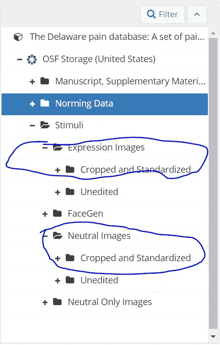
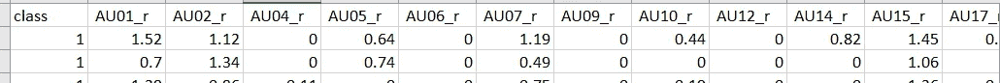
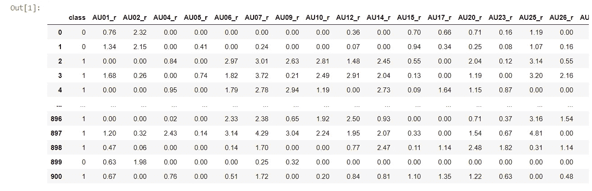
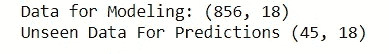
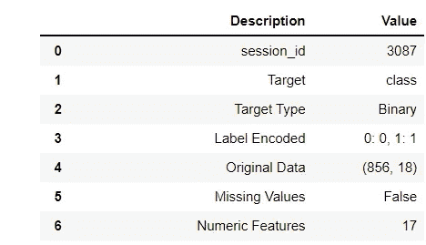
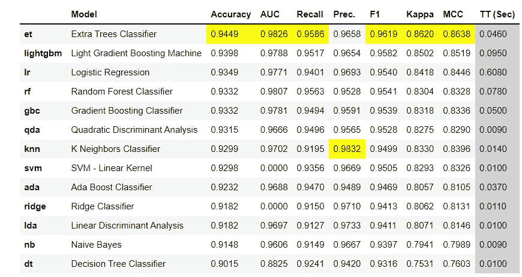
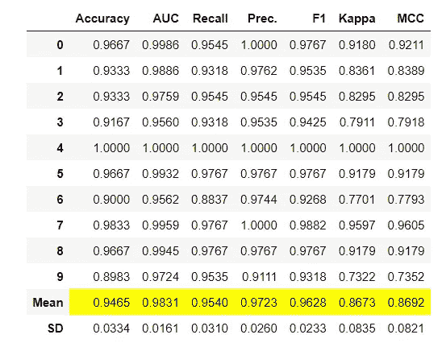
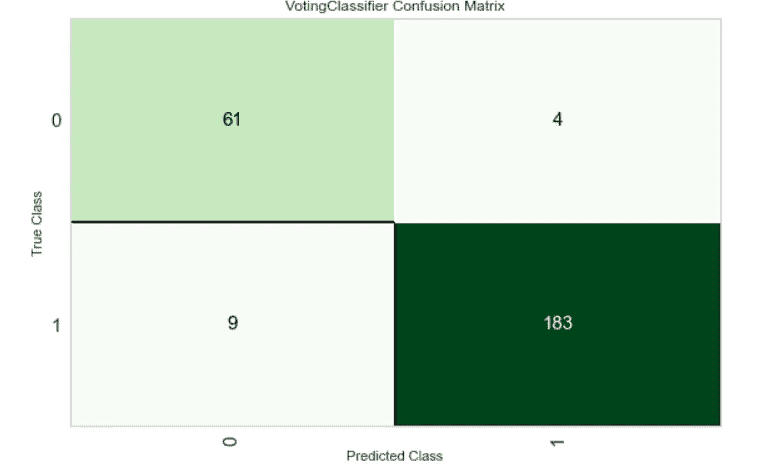
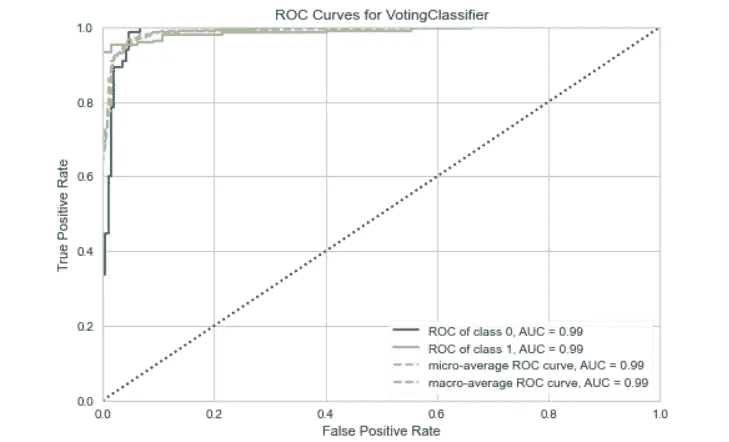
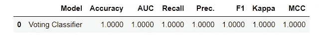

# 教电脑看到你的痛苦

> 原文：<https://towardsdatascience.com/can-you-teach-a-computer-to-see-your-pain-18c0f60eb0e4?source=collection_archive---------30----------------------->

## 使用 Pycaret，OpenFace，Pandas 和其他 python 魔术


图片由 [Mahdis Mousavi](https://unsplash.com/@dissii) 在 [Unsplash](https://unsplash.com/) 拍摄

## 背景

疼痛是一种独特的体验，由因人而异的感觉、认知、社会和情感因素混合而成。这些因素结合在一起，很难有把握地评估一个人的经历。目前，最常见和最受推崇的评估疼痛的方法是通过口头报告(例如，等级量表 1-10)。然而，这种方法可能会有偏差，并不总是可用的(非语言患者)。因此，额外的疼痛评估方法是必要的。

一种推断疼痛的技术是通过面部表情分析。历史上，研究人员通过观察面部肌肉运动来预测情绪和行为。这一过程使得理解疼痛表情中的面部运动组合成为可能。使用手动技术，面部表情分析非常耗时且工作量大，但机器学习的出现使得以更快的速度和更高的精度评估疼痛成为可能。现在，研究人员可以使用机器学习工具来创建分类器，这些分类器可以预测疼痛的存在(即分类)和强度(即回归)。下面的教程将描述如何制作用于疼痛评估的二元分类机器学习分类器。

## 准备数据

对于这个例子，我们使用特拉华州疼痛数据库，这是一个姿势图像库，描绘了疼痛的个人和中性面孔的个人。迄今为止，这个数据库是研究人员可获得的最大的不同疼痛图片样本。

要了解更多关于特拉华州疼痛数据库的信息，请阅读下面的文章:

[](https://pubmed.ncbi.nlm.nih.gov/33134750/) [## 特拉华州疼痛数据库:一组疼痛表达和相应的标准化数据- PubMed

### 简介:痛苦的面部表情通过传达痛苦和恳求来服务于一个基本的社会功能

pubmed.ncbi.nlm.nih.gov](https://pubmed.ncbi.nlm.nih.gov/33134750/) 

为本教程准备的数据是使用工具 OpenFace 提取的，该工具使用机器学习模型来评估面部肌肉运动的强度。

[](https://ieeexplore.ieee.org/document/7477553) [## OpenFace:一个开源的面部行为分析工具包

### 在过去的几年里，人们对自动面部行为分析和理解越来越感兴趣…

ieeexplore.ieee.org](https://ieeexplore.ieee.org/document/7477553) 

作者使用 OpenFace 面部表情分析的示例

面部的肌肉运动也被称为“动作单位”。从 OpenFace 中提取的每个动作单元都是一个 0-5 范围内的连续变量，代表表达的强度。动作单位强度与特拉华州疼痛数据库中的疼痛或中性标签一致。xlsx 文件。这些数据用于训练模型。

OpenFace 分析的图片首先是从特拉华州疼痛数据库库中下载的。



如前所述，每张照片都预先做了标记(疼痛或中性)。在命令提示符下用 OpenFace 的 FaceLandmarkImg 函数分析图像目录。

```
!FaceLandmarkImg.exe -fdir <directory_of_pain_neutral>
```



包含类别(疼痛与中性)和行动单元的 Excel 文件

这里的每一行数据代表一个参与者，其类别代表疼痛或中性，AU_xx 列代表不同面部肌肉的动作单位(肌肉运动)强度。

## 设置模型数据

为了创建这个模型，我们将使用许多不同的 python 库。以下是最重要的:

 [## PyCaret - pycaret 2.2.0 文档

### PyCaret 的设计和简单性受到了公民数据科学家这一新兴角色的启发，这一术语最早是由…

pycaret.readthedocs.io](https://pycaret.readthedocs.io/en/latest/index.html) [](https://pandas.pydata.org/) [## 熊猫

### pandas 是一个快速、强大、灵活且易于使用的开源数据分析和操作工具，构建于…

pandas.pydata.org](https://pandas.pydata.org/) 

在上传数据文件之前，每个图像都用来自特拉华州疼痛数据库的相应行为(中性或疼痛)进行了注释。因此，我们将使用 pycaret 训练一个二进制模型。我们的模型将从面部图像中确定中性表情和疼痛表情之间的差异。



具有面部运动特征的训练数据集

## 加载数据

Pandas 读取我们的数据和数据集。

```
import pandas as pd
dataset = pd.read_excel("combined_pain_csv.xlsx")
dataset = dataset.sample(frac=1).reset_index(drop=True)
dataset
```

## 拆分数据

接下来，我们将我们的数据分成两组:训练和不可见。我们首先用训练集(自然地)训练我们的模型，然后在我们看不见的预测数据集上部署训练好的模型来评估性能。

```
data = dataset.sample(frac=0.95, random_state=786)
data_unseen = dataset.drop(data.index)data.reset_index(inplace=True, drop=True)
data_unseen.reset_index(inplace=True, drop=True)print('Data for Modeling: ' + str(data.shape))
print('Unseen Data For Predictions ' + str(data_unseen.shape))
```



拆分数据后的输出

## 导入 Pycaret

Pycaret 有几个不同的模块，封装了特定的机器学习算法和函数，这些算法和函数在不同的模块中一致使用。有 6 个模块可供导入。其中包括:

*   回归
*   分类
*   异常检测
*   使聚集
*   自然语言处理
*   关联规则挖掘

因为我们的模型旨在基于两个类来辨别预测，所以我们导入 pycaret.classification 来创建分类模型。

```
from pycaret.classification import *
```

## 创造实验

Pycaret 需要我们在创建模型之前设置数据。我们必须指定我们的数据框架和目标。

```
exp_clf102 = setup(data = data, target = 'class')
```



设置输出

在本实验中，疼痛被标记为 1，无疼痛被标记为 0。因此，我们的目标类别是疼痛/中性标签，我们的 17 个特征是不同面部肌肉运动的强度。


从 Cohn 和 Kanade 的数据库中提取的一些行动单位的例子

## 比较模型

Pycaret 最好的特性之一是 compare_models 函数。这个函数允许我们用一行代码比较 24 个不同模型的指标。我们使用 n_select 来根据精确度选择前三个模型。通过建立我们的前 3 个模型，我们可以创建一个投票分类器，通过一次比较多个模型并使用概率最高的标签来评估标签。

```
# Compare metrics of 24 different machine learning models 
top3 = compare_models(n_select = 3)
```



Pycaret 模型比较

如表中所示，Extra Tress 分类器是我们数据中性能最好的模型，其次是轻梯度推进机和逻辑回归。

*每个指标的最高分以黄色突出显示。*

## 创建模型

接下来，我们基于对上述最佳模型的分析创建一个模型。Pycaret 的 blend_models 允许我们从表中的前三个模型创建投票分类器。因此，我们的模型是 et+ lightgbm + lr，并且我们的投票系统采用至少两个一致的模型的预测。



混合分类器度量

我们的混合分类器表现得比单独的额外分类器更好。

## 评估模型性能

Pycaret 让我们很容易用 evaluate_model 来评估我们的模型的性能。

我们可以用混淆矩阵来查看标签的分类。



混淆矩阵输出

我们还可以查看 AUC 图。



AUC 图

## 调整并最终确定模型

让我们通过调整和最终确定对模型进行最后的润色。

```
tune = tune_model(blend)
final = finalize_model(tune)
predict_model(final)
```



在我们调整和完成之后，我们的模型达到了 100%的准确性！

## 结论

原来如此！我们教会了一台计算机根据一组摆出的疼痛和中性姿势的图像来预测疼痛的表情。我们的模型根据面部分析的肌肉运动强度预测疼痛/中性标签。具有机器学习的自动化系统是疼痛护理和研究的未来。有了这些工具，我们可以快速准确地监测疼痛。

这一领域的未来工作可能包括建立一个回归模型来评估疼痛的强度，而不是简单的二元分类器，这将进一步提高疼痛测量的灵敏度。走出去，让它发生！

作者的相关文章—

[](https://medium.com/geekculture/future-directions-of-machine-learning-for-pain-in-individuals-who-are-nonverbal-85e593794344) [## 非言语个体疼痛机器学习的未来方向

### 我们如何为有需要的人发声

medium.com](https://medium.com/geekculture/future-directions-of-machine-learning-for-pain-in-individuals-who-are-nonverbal-85e593794344) [](https://medium.com/discourse/the-virtual-transformation-of-chronic-pain-care-d582fe782df2) [## 慢性疼痛护理的虚拟转型

### 疫情如何影响疼痛和虚拟护理

medium.com](https://medium.com/discourse/the-virtual-transformation-of-chronic-pain-care-d582fe782df2) 

感谢您的阅读！！