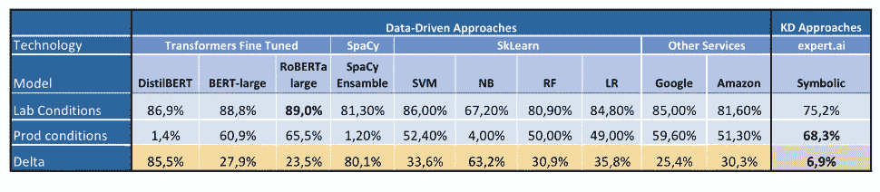

# 当数据发生变化时，你能相信你的模型吗？

> 原文：<https://towardsdatascience.com/can-you-trust-your-model-when-data-shifts-981ed681f1fd?source=collection_archive---------14----------------------->

## 在实际应用中，机器学习并不像我们预期的那样普遍:让我们来探索一下为什么。

爱丽丝·山村在 [Unsplash](https://unsplash.com?utm_source=medium&utm_medium=referral) 上的照片

机器学习是热门话题。模特们已经表明，凭借当今的技术，她们能够取得令人瞠目结舌的结果。不幸的是，实验室和真实世界是[两个不同的游戏场](/why-90-percent-of-all-machine-learning-models-never-make-it-into-production-ce7e250d5a4a):如果算法看到的数据与它们接受训练的数据相似，那么它们就会工作得很好，但情况并非总是如此。数据可能会因多种因素而发生变化:

*   标记数据的缺乏——注释数据是昂贵的，所以模型在可用的基础上训练，希望它完全代表用例；
*   时间——例如，语言中出现新的术语，以前的事实不再有效，等等。；
*   地理——例如，英国英语对美国英语，母语对非母语者，等等。；
*   格式——例如，短文档与大文档，一个领域的术语与另一个领域的术语，等等。

泛化是我们在无所不在的人工智能时代面临的真正挑战。为了了解如何面对这一挑战，我们在泛化任务中测试了几种算法，以了解它们的反应，并在本文中收集了我们的发现。

# 1.背景

我们想模拟真实情况下会发生什么，所以我们搜索了一个与公司工作相似的数据集。[消费者投诉数据库](https://www.consumerfinance.gov/data-research/consumer-complaints/)似乎是一个完美的选择:它包含了数以千计的匿名投诉——用户投诉金融服务的短文本——按[九个类别和五十个子类](https://gist.github.com/coprinus-comatus/aeb328b600a78745e7d4e6344e46beaa)组织，即受投诉影响的服务。例如，对于“学生债务”类，数据集包含关于子类“联邦学生贷款服务”和“私人学生贷款”的示例。我们处理了一组[80k 份投诉](https://github.com/coprinus-comatus/Complaints_generalization_projects/tree/main/Datasets/Lab_experiment)——从 2020 年 7 月到 2021 年 1 月提交的投诉。

值得注意的是，这个数据库并不是没有错误的。由于用户只能为每个投诉选择一个类别，因此人为错误总是会出现。有些投诉被错误分类，有些被任意分类(可能是关于类别 *x* 但也可能是类别 *y* ),有些似乎是根据文本中没有的信息进行分类的。请记住，机器学习模型将反映所提供的分类，即使它毫无意义。

以下面的投诉为例:

> 无法连接到 XXXX XXXX？另外，它两个月前还能用。

这被归类为“货币转移、虚拟货币或货币服务”，但我们不知道为什么。我们可以假设在匿名化过程中丢失了一些重要的信息——但我们不能确定。
或者拿这个抱怨:

> 他们非法将我标记为过期，并且没有纠正它。

后者被归类为“信用卡或预付卡”，但它也可能被归类为“债务催收”——也许更恰当。

# 2.实验

我们对运行两个实验感兴趣:一个代表通常在实验室阶段做的事情，另一个代表一旦一个模型投入生产会发生什么。对于实验室阶段，我们希望看到我们评估的每个算法的潜力，以了解它在完美条件下的表现。对于生产阶段，我们希望挑战数据转移的算法，并检查性能是否受到影响。我们将模型分为两类:数据驱动的方法——依赖于机器学习技术，只使用原始文本作为特征——和知识驱动的方法——依赖于为每个类创建人工启发。

对于本文中介绍的实验，我们决定使用 [F1 分数](https://en.wikipedia.org/wiki/F-score)来比较模型。这种方法提供了解决方案质量的指标，因为它同时考虑了[精度和](https://en.wikipedia.org/wiki/Precision_and_recall)召回。这些是我们收集的发现:

表 1 —实验结果。作者图片

我们可以注意到，机器学习算法在处理数据转移时会经历更大的损失，而知识驱动的方法是最大限度地减少这种损失的方法。

## 2.1.实验室条件

实验室条件实验通过使用整个数据集并将其分成训练集和测试集来执行。从这个实验中得出的结果并不令人惊讶:更大的机器学习模型表现最好，其中变形金刚领先。其他数据驱动的模型仍然表现良好，这要归功于大量的训练示例。在这个阶段测试了另一个模型:expert.ai AutoML 结合了符号和子符号特征，可以被认为是一个[混合算法](https://jpt.spe.org/hybrid-machine-learning-explained-nontechnical-terms)。这个模型产生了有希望的结果，表现略低于罗伯塔-大。

我们还测试了一种知识驱动的方法: [expert.ai 符号模型](https://github.com/coprinus-comatus/consumer_complaints_classification)。这由一组人工管理的规则组成，创建于文本分析引擎之上。这个模型是在几天的工作中开发出来的。如果付出更多的努力，它本可以达到更好的性能，但是为了实验公平起见，每种方法都必须花费相同的时间。

## 2.2.生产条件

为了表示生产环境中会发生什么，我们在泛化任务上测试了我们的模型，插入了从训练集到测试集的数据转移。这些算法首先在选择的最少代表的子类上进行训练，然后在剩余的子类上进行测试——每个类至少有 50 个训练文本。例如，我们在“联邦学生贷款债务”上训练模型，但是在“债务收集”的其他子类上测试模型:

为了让事情变得更困难，我们还插入了一个少量训练约束:我们提供 1.4k 投诉进行训练，然后我们在 8k 投诉上进行测试。[这里的](https://github.com/coprinus-comatus/Complaints_generalization_projects/tree/main/Datasets/Production_experiment)是使用的数据集。强调算法可以让我们了解它们在现实世界中的可信度。

这导致了结果的逆转:变压器在这种情况下表现不佳，DistilBERT 的表现尤其差。表现最好的模型是 expert.ai Symbolic。如前所述，这个模型是由一组人类策划的规则组成的。让人类参与进来对归纳有很大帮助，因为人类已经拥有了关于世界的信息，而机器学习只能从提供的例子中学习。还有，expert.ai 技术本身有助于泛化。在开发规则时，可以查看 expert.ai 知识图，这是一个现成概念的大型集合，有组织且易于导航。

# 3.结论

看看泛化任务，我们可以注意到，一旦数据驱动的模型经历数据转移，它们会变得多么不可预测。在实验室中，数据驱动的方法非常有效——这并不奇怪。但是，当我们期望这种模型在类似于现实生活的情况下推广时，我们可以看到需要一个更有基础的理解。另一方面，知识驱动的方法更容易概括，因为人类知道当看到案例 *X1、*案例*、*【X3】*、…、 *Xn* 时也是可以预期的。*

*在实验室中，我们也有机会测试混合动力 expert . ai AutoML——一种性能类似于变形金刚但更轻的模型。鉴于这些有希望的初步结果，我们应该继续探索数据驱动和知识驱动方法的组合。*

*非常感谢劳尔·奥尔特加和何塞·曼努埃尔·戈麦斯·佩雷斯，他们完成了这里收集的大部分实验。*