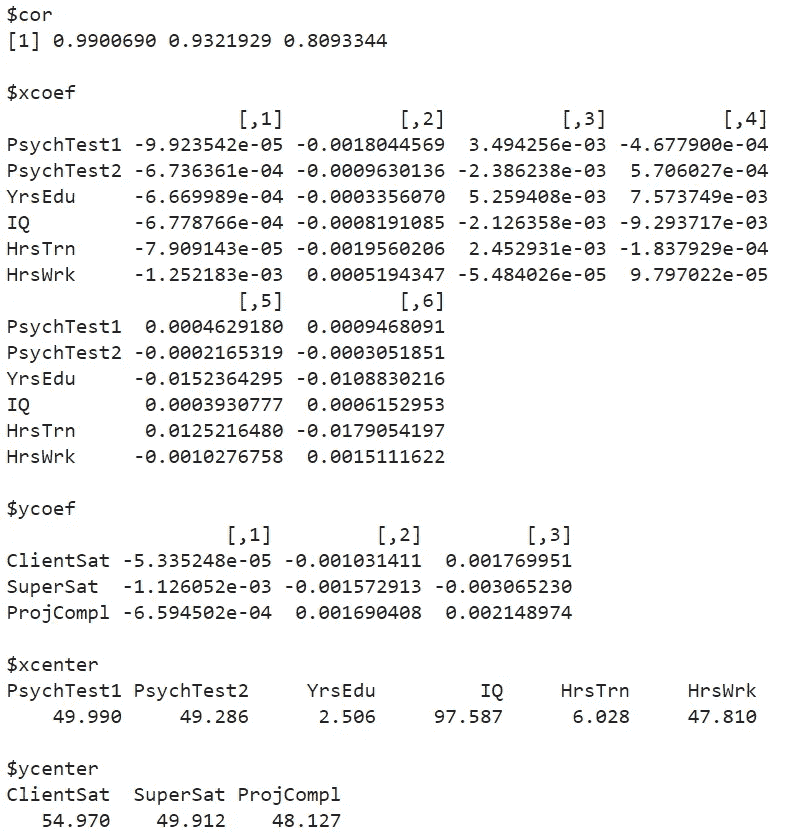
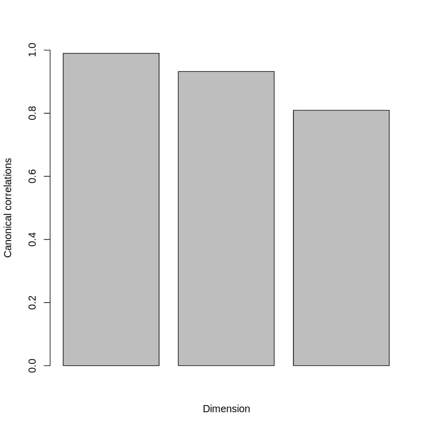
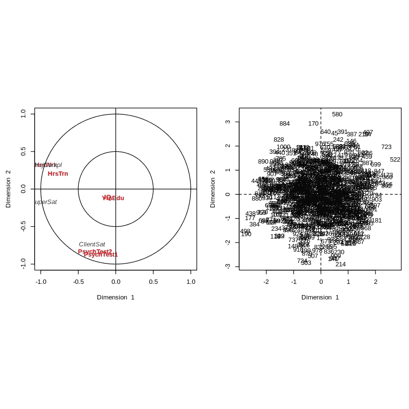
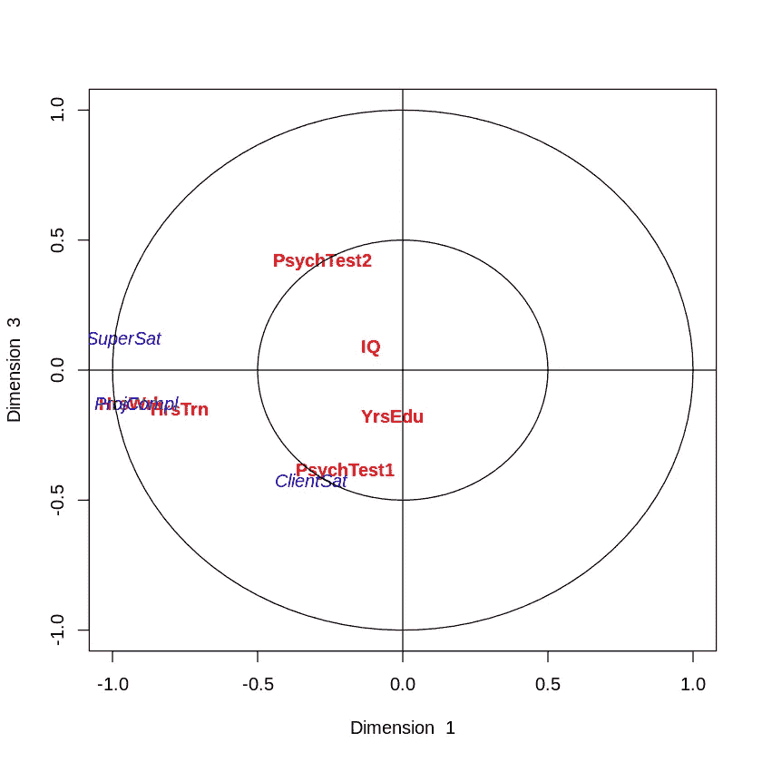
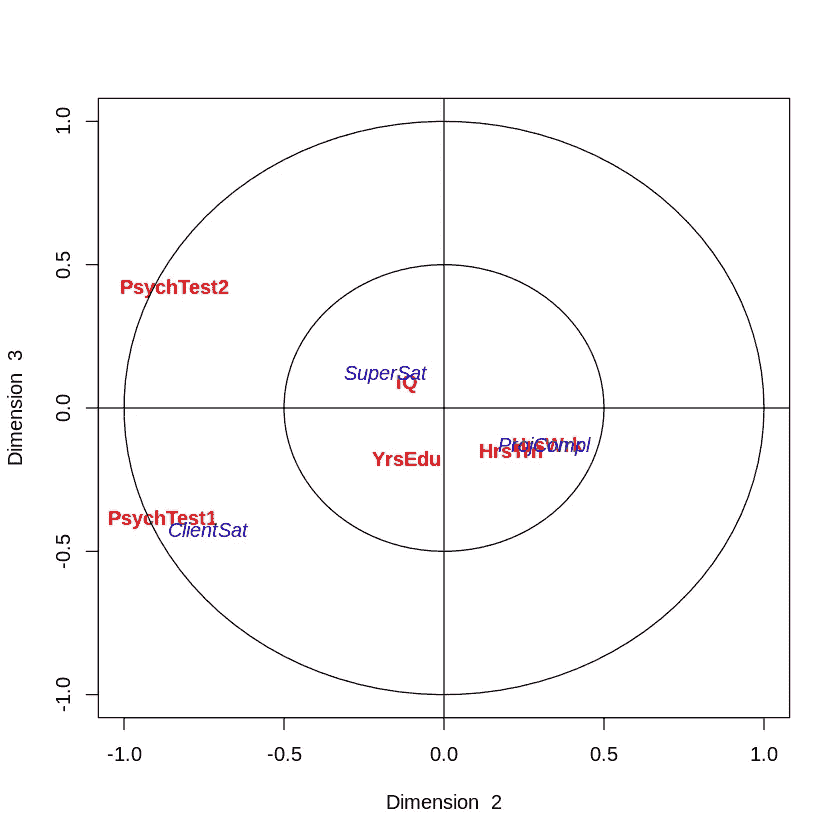
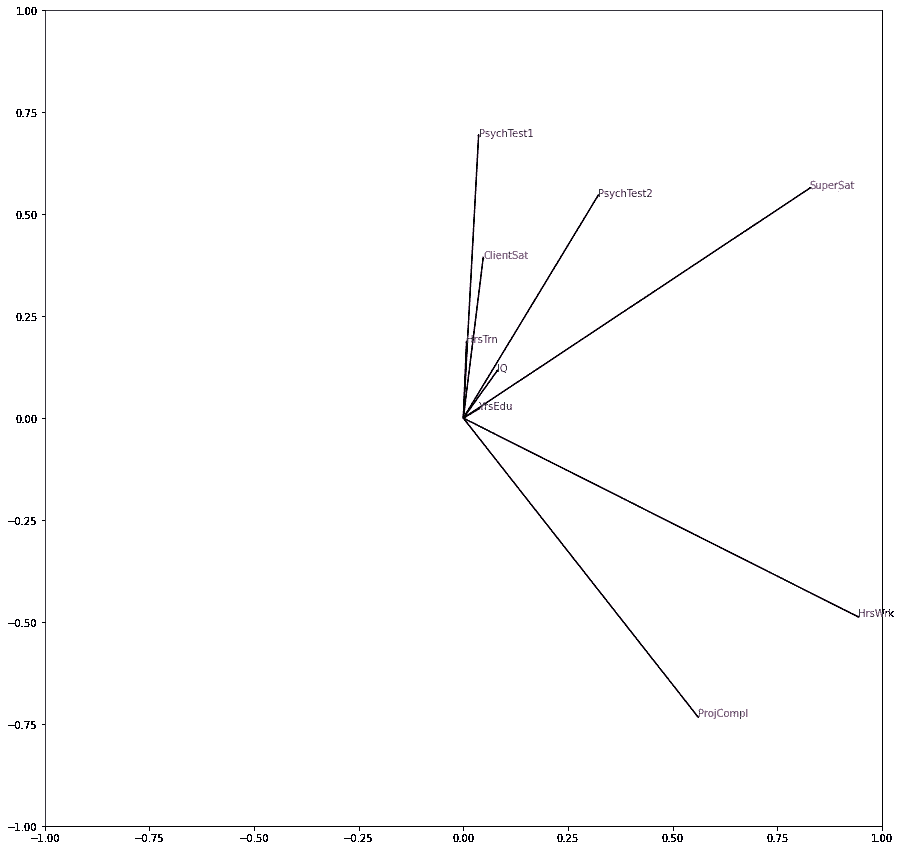

# 典范相关分析

> 原文：<https://towardsdatascience.com/canonical-correlation-analysis-b1a38847219d?source=collection_archive---------2----------------------->

## 对典型相关分析的全面概述，以及用 R 和 Python 编写的示例的完整演练

典型相关分析——照片由 [Alex Presa](https://unsplash.com/@alexpresa?utm_source=unsplash&utm_medium=referral&utm_content=creditCopyText) 在 [Unsplash](https://unsplash.com/s/photos/color?utm_source=unsplash&utm_medium=referral&utm_content=creditCopyText) 上拍摄

# 典范相关分析

在本文中，您将了解到关于典型相关分析的所有知识。典型相关分析是一种多元统计技术，允许您**分析两个数据集**之间的相关性。

典型相关分析可用于以两种方式对两个数据集之间的相关性进行建模:

*   关注依赖关系，并以类似回归的方式对两个数据集建模:数据集 y 作为数据集 x 的函数。
*   侧重于探索两个数据集之间的关系，而不将任何数据集作为因变量或自变量。在这种情况下，您可以将其与 [PCA 或因子分析](/what-is-the-difference-between-pca-and-factor-analysis-5362ef6fa6f9)等方法进行比较。

进行典型相关分析时，需要理解两个核心概念:

*   标准变量
*   典型相关

# 标准变量

典型相关分析的第一个中心概念是典型变量的概念。典型相关分析的目标是模拟两个数据集之间的关系。

当然，数据集很难一次建模，因为它们由许多变量组成。分析一个数据集中所有变量之间的相关性已经是一个挑战，所以现在任务更加复杂，因为我们必须区分变量之间的**相关性和两个数据集**之间的**相关性。**

为了简化这项任务，模型将识别**规范变量。**规范变量是数据集之一的变量的**线性组合**。由于典型相关分析关注两个数据集之间的相关性，您将定义**对典型变量**:一个典型变量来自左侧数据集，另一个典型变量来自右侧数据集。

如果您的两个数据集中有**不同数量的变量，那么您可以拥有与最小数据集中的变量一样多的规范变量对。**

规范变量将由模型定义。它们被选为**具有最大可能相关性**的(原始)变量的两个线性组合(每个数据集中一个)。我们将在后面看到如何使用 R 或 Python 来找到它们。

# 典型相关

一旦定义了规范变量，就可以通过查看规范变量之间的相关性来继续分析。由于这种相关性是在典型变量之间测量的，我们就简单地称之为典型相关。

我们将很快开始解释一个例子。请记住，我们必须分析两组重要的指标，以了解我们两个数据集之间的相关性:

*   **解读典型相关**:数据集 1 中的每个典型变量与其在数据集 2 中的对应变量的相关程度如何？
*   **解读规范变量**:每个规范变量代表哪些原始变量？

# 典型相关分析与其他方法

现在你已经理解了典型相关分析的目标，让我们讨论一下该方法与密切相关的方法之间的联系和区别。

## 典型相关分析与主成分分析

第一个有用的比较是在典型相关分析和[主成分分析](/what-is-the-difference-between-pca-and-factor-analysis-5362ef6fa6f9) (PCA)之间。PCA 是一种在数据集内寻找线性组合(称为主成分)的方法，其目标是最大化由这些主成分解释的变化量。

PCA 侧重于在一个数据集的**中寻找引起最大**方差**的线性组合，而典型相关分析侧重于在两个数据集中寻找引起最大**相关性的线性组合。****

## 典型相关分析与多元多元回归

第二个有趣的比较是典型相关分析和多元多元回归之间的比较。多元多元回归是多元回归的一个变种，其中有多个因变量，而在标准多元回归中，只有一个因变量。

多元多元回归的目标与典型相关分析的目标非常相似:在两者中，您都试图找到允许您对两个数据集(一个相关数据集和一个独立数据集)之间的相关性进行建模的线性组合。

2016 年，利大学的加里·卢茨和坦尼娅·埃克特已经成功证明了这两种方法的一部分在数学上的等价性。以下是他们文章中的一段引文:

> 多元多元回归和典型相关分析之间的相似性在文献中没有得到一致的认可。本文表明，虽然这两种分析的目标似乎不同，但分析本身在数学上是等价的。在综合显著性检验、变量加权方案和降维分析方面，将判别分析纳入事后调查的多元多元回归分析将产生与典型相关分析相同的结果。

这个发现并不一定意味着其中一个方法是多余的，但它仍然是有趣的。

# 典型相关分析示例

现在让我们介绍一个典型相关分析的例子。我们将看到一组关于工作表现的模拟数据。在数据集中，有 9 个变量。

相关数据集包含三个变量，每个变量都是工作绩效的备选衡量指标:

*   客户满意度:你的主要客户给你的满意度评分，在 1 到 100 分之间
*   **超级评估员**:你的上司对你工作表现的评估，介于 1 到 100 分之间
*   **ProjCompl** :你的项目成功交付的百分比

独立数据包含六个变量，其中两个变量是社会技能的测量值:

*   **psycht test 1**:0 分(差)到 100 分(好)
*   **心理测试 2** :得分在 0(差)到 100(好)之间

它在智力技能上也有两个变量:

*   YrsEdu :接受高等教育的年数
*   **智商**:智商测试得分

它有两个关于动机的变量:

*   **HrsTrain** :培训花费的小时数
*   **HrsWrk** :一周工作的平均小时数

此分析的目标是应用典型相关分析，并查看这三个独立的概念是否也被模型识别为典型变量，或者是否有更有趣的典型变量需要定义。我们还将检查哪些原始变量会影响工作绩效。

如果你感兴趣，你可以将结果与这篇关于[结构方程建模](/structural-equation-modeling-dca298798f4d)的文章进行比较，这篇文章探索了相同的假设。

# R 中的典型相关分析

现在对于 R 中的典型相关分析，让我们从导入数据开始。我已经把它们上传到了 AWS 上的一个 S3 桶中，这样你就可以下载并导入它们，只需一行代码:

R-导入数据中的典型相关分析

下一步是分离 X 变量和 Y 变量。然后我们可以使用 r 中内置的`cancor`函数来拟合模型。

R-拟合模型中的典型相关分析

模型的输出将是所有系数和参数的列表。我们将在下一步中使用其中一些，其他的将在我们使用的函数中隐式使用。至少拥有所有这些参数是件好事，以防我们需要它们。

R 模型输出中的典型相关分析

## 典型相关分析有几个维度？

现在让我们看一个图，它允许你决定你应该包括多少个维度。维度归结为一对(一个 x 和一个 y)规范变量。因为我们在 Y 轴上只有 3 个变量，我们不可能有超过 3 对变量，所以是三维的。

下图显示了每个维度对之间的相关性:

R 中的典型相关分析——维数的确定

R —柱状图中确定维数的典型相关分析

前两对规范变量有很强的相关性。第三个虽然还是比较高，但是有点低。对于本分析的其余部分，我们将使用前两个维度。

## R 中的典型相关图

我们现在将进入典型相关分析的本质。分析的目标是了解这两个数据集是如何相互关联的。我们想了解工作表现的现象。

我们将使用一个名为 CCA 的软件包，它具有绘制典型相关分析结果的强大功能。我们还需要使用 cc 函数重新调整模型，以便能够进行绘图。这可以通过以下方式完成:

R-绘制变量图中的典型相关分析

R-绘制变量图中的典型相关分析

对于我们的分析来说，右边的情节不是很有趣。它显示了我们分析中的个人，但我们只是随机选择了一些人，所以这并不是很有用。

然而，左边的图表给出了我们想要通过分析获得的确切信息。该图显示了每个原始变量的方向，在轴上显示了两个维度。我们可以使用图上的**接近度来理解两个数据集的变量之间的关系！**

## **项目完成后的总结**

**维度 1** 显示在 x 轴上，这意味着在维度 1 上得分高的变量将位于图表的右侧，而在维度 1 上得分低的变量将位于左侧。维度 1 是最重要的维度(从定义上来说)，那么我们来看看能从中看出什么。

我们清楚地看到最左边的一组四个变量:HrsWrk，HrsTrnn，SuperSat，ProjCompl。特别是 **HrsWrk 和 ProjCompl** 完全在一个地方。我们可以得出结论，**项目的完成与工作和培训花费的时间密切相关**:这是一门非常有趣的学问！

## 主管满意的结论

SuperSat 也非常接近这组变量。第一个有趣的发现是**超级卫星也与工作和训练的时间有很大关系**。然而，典型相关分析的优势在于，我们还可以看到工作绩效变量之间的相互关系。显然，我们现在可以得出结论,**主管满意度也与项目完成密切相关！**

## 关于客户满意度的结论

非常有趣的是，客户满意度位于图表的其他地方。它在下方，表明它被维度 2 覆盖。我们可以得出结论*为了满足客户，我们需要不同于完成项目和取悦你的主管所需的行为。*

为了让你的客户满意，社交更加重要！这可以从社交技能的两个心理测验分数与客户满意度密切相关的事实中得出结论。这也是非常有用的见解！

## 关于智商和教育年限的结论

基于智商和智力技能处于中间的事实，我们可以得出结论，它们不在第一和第二个维度中。逻辑上的原因是他们在第三维度。

为了检查这一点，我们将需要创建与之前相同的图形，但是使用维度 3。这产生了两个图:一个在维度 1 和 3 之间，另一个在维度 2 和 3 之间。您可以这样做:

R——绘制第三维的典型相关分析

R——绘制第三维的典型相关分析

R——绘制第三维的典型相关分析

R——绘制第三维的典型相关分析

有趣的是，我们没有看到智商和受教育年限出现在维度 3 的极端上！我们已经检查了所有三个维度，所以这意味着智商和受教育年限被简单地估计为对工作表现没有太大影响！我们分析的第三个结论也很有趣。

# Python 中的典型相关分析

对于那些喜欢 Python 的人，让我们也做一个 Python 实现。当然，结论是相同的，所以我不会重复完整的实现。

在 Python 中，您可以使用以下代码直接从 AWS 上的我的 S3 桶中读取 CSV:

Python 中的典型相关分析—导入数据

下一步是在 X 和 Y 变量之间分割数据。然后，您可以从`scikit-learn.cross_decomposition`实例化 CCA 模型。最后，使用拟合方法来拟合模型:

Python 中的典型相关分析—拟合模型

现在您已经在`my_cca`对象中有了模型，您可以用特定的方法访问许多系数。几个例子:

*   使用`my_cca.x_weights_`和`my_cca.y_weights_`获得重量
*   使用`my_cca.x_loadings_` 和`my_cca.y_loadings_`获得载荷

现在，分析中有趣的部分是投射到维度上的变量图。这个图在 Python 中没有预构建的实现，所以我们需要使用旋转系数来构建它。您可以使用以下代码来实现这一点:

Python 中的典型相关分析—绘制结果

Python 中的典型相关分析—绘制结果

这个图看起来和 r 中显示的有点不一样，原因是**旋转不一样。**实际上，模型并不关心图的实际旋转，只关心变量之间的相关性。你可以旋转整个东西，得到和 R 输出几乎一样的图形。

## R 和 Python 输出的比较

如果我们看看这个解释，我们会得到非常相似的结论:

*   ClientSat 仍然与 PsychTest1 和 PsychTest2 密切相关
*   智商和受教育年限仍然无关紧要
*   工作小时数仍然与项目完成密切相关

然而，我们也看到了一些差异:

*   花在训练上的时间在 Python 中并不重要，而在 R 中却很重要
*   主管的满意度与项目完成的相关性似乎比在 R

这不一定是问题。当使用不同的代码实现时，经常会出现略微不同的结果。有两个分析其实也没那么糟糕。它允许我们确认分析之间的结论，并且可以增加两者之间共享的结论的有效性。

# 结论

总之:

*   本文向您展示了如何使用典型相关分析来分析两个数据集之间的相关性。
*   在关于工作绩效的例子中，您已经看到能够使用典型相关分析来获得有趣的结论。
*   您已经看到了如何在实践中使用 R 和 Python 实现来应用典型相关分析。

我希望这篇文章对你有用。不要犹豫，继续关注更多的数学、统计和数据内容！