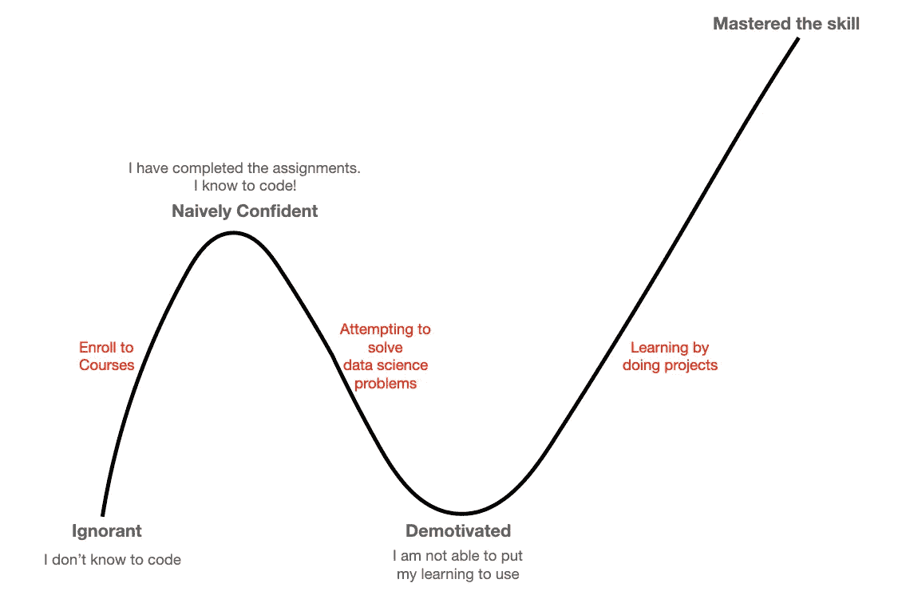

# 不会编码？这里是学习数据科学编码的最好方法

> 原文：<https://towardsdatascience.com/cant-code-here-is-the-best-way-to-learn-to-code-for-data-science-bfb0581ded37?source=collection_archive---------2----------------------->

## 学习编码成为数据科学家的路线图

来自 [Pexels](https://www.pexels.com/photo/young-troubled-woman-using-laptop-at-home-3755755/?utm_content=attributionCopyText&utm_medium=referral&utm_source=pexels) 的 Andrea Piacquadio 的照片

我经常被许多人询问编码对于数据科学是否必要。他们中的许多人说，他们试图学习编码，但他们认为这不是他们的茶。他们中的一些人现在认为他们永远也学不会编码了。当我开始学习数据科学时，我也有同样的想法。这是一个思维定势的问题，它让我们认为我们不能做某些事情。一旦你把它转变成一种成长的心态，你就会意识到毅力的潜力。我们能学的和能做的没有限制。许多试图学习编码的人都经历了类似下面的旅程。

作者图片

如果有人说不学编码也能成为数据科学家。不要相信他们！肯定还没有。学习编码对于成为一名数据科学家是绝对必要的。任何人都可以学习编码，唯一重要的因素是，你需要以正确的方式学习。在本文中，我将展示克服最初障碍的路线图，并能够学习为数据科学编码。

# 设定目标

许多人犯的最大错误是在没有目标的情况下试图学习一门编程语言。知道你需要达到的目标很重要。在开始学习之前，你需要明白你想用编程做什么。你需要像这样的问题的答案，你想如何和在哪里使用它？你想产生什么结果？你想解决什么问题？

如果我以 Python 为例。它可以用于构建网站、软件应用、数据分析、机器学习、构建数据管道、可视化等等。如果你不知道你想用它做什么，你就不可能掌握 Python 编程。

作为一名有抱负的数据科学家，你学习编码的目标是，

*   从不同来源读取和写入数据
*   处理不同的数据类型
*   执行数据分析
*   构建和评估模型

在开始学习数据科学时，不要担心如何编写高效的代码。专注于把事情做好。当您开始使用它时，您将了解标准和有效的脚本。

# 选择一种编程语言

一旦你明确了你的目标。下一个任务是确定正确的编程语言。学习数据科学最流行的两种编程语言是 R 和 Python。

## ***R 编程***

*   专为统计分析和数据分析而打造
*   它有许多用于数据探索和统计测试的库
*   创建一些令人惊叹的可视化效果很容易
*   它并不是为在生产中部署而精心制作的
*   对于没有编码背景的人来说，学习起来非常容易，但是当你开始在数据科学项目中端到端地使用它时，就变得很难了

## ***Python 编程***

*   更像是一种通用编程语言
*   它有一个易于阅读和理解的语法
*   它很容易在生产环境中部署
*   对于没有编程经验的人来说，开始有点困难，但是在实现更复杂的数据科学功能时就变得容易了

我从 R 开始，现在完全转移到 Python。如果你问我，我会说继续使用 Python。你有没有 It 背景并不重要。Python 现在有许多库来执行统计分析。它可能没有 R 那么好，但仍然可以做得很好。Python 和 R 之间的差距正在缩小。唯一的事情是你可以用 Python 做更多的事情。从长远的角度来看，python 将是正确的选择。尤其是许多深度学习库首次在 Python 中发布。

# 负责任

责任感在学习新事物中起着关键作用。有一些简单的方法来培养责任感。将你的计划公之于众，与你的朋友分享。如果分享给你的专业人脉就更好了。它会让你成为实现目标的主人。我们都不愿意被视为失败者，所以我们开始拥有它。

对失败的恐惧常常使人们停止学习新事物。对你的人际网络做出承诺也会给你克服恐惧的动力。为了确保事情顺利进行，不要过度承诺，而是要拿出一个可行的计划。

# 开始的课程

选择正确的课程非常重要。一个错误的选择可能会降低你的动力水平。如果你没有编码经验，那么从基于浏览器的平台开始会更好。优点是你不需要安装任何工具。你可以尝试在业余时间学习，你的进步将被保存。这里是一个使用浏览器学习 Python 编程的平台。

<https://www.codecademy.com/learn/learn-python-3>  

熟悉 python 之后，下一步是尝试在您的机器上使用 Python。下面是一个初学者友好的关于使用 python 进行数据科学的课程。超过 90%的学习者认为这门课程很有用。大约 15%的人在完成这门课程后，发现自己的职业生涯受益匪浅。

<https://www.coursera.org/learn/python-for-applied-data-science-ai#about>  

上述课程将有助于获取数据科学所需的 Python 知识。你会对课程中涉及的主题充满信心。但是当你试图解决一个数据科学问题时，你会发现它很难。正是在这一点上，信心水平通常会下降，并经常让许多人认为编码不适合他们。我将展示一些策略来克服这一点，并获得前进的真正信心。

# 从代码模板中学习

为了更好地理解如何在数据科学问题中使用 python。我们将首先从模板化的代码开始，这些代码由有清晰文档的专家解决。

下面是一些令人惊奇的、记录良好的数据探索脚本。浏览这些脚本并逐行重新执行它们将有助于您更好地理解。

下面一个重点关注 Python 不同的编程方面，比如不同的库、不同的数据类型、控制流和函数。它还涵盖了数据清理和探索性分析中常用的功能。

<https://www.kaggle.com/kanncaa1/data-sciencetutorial-for-beginners>  

下面的脚本侧重于对房价数据集执行数据分析。这将让我们更好地了解如何使用 python 进行数据探索。它还将有助于理解不同分析背后的基本原理以及如何实现它们。

<https://www.kaggle.com/pmarcelino/comprehensive-data-exploration-with-python>  

从别人的代码开始有助于更好地理解概念。不要选择一个没有被正确记录或者看起来很复杂的脚本。这里的想法是熟悉并学会用简单的方式做事。没有必要担心以最好的方式做事。只是还没有。

# 从事项目工作

接下来，走出你的舒适区。选择一个你感兴趣的问题，并努力解决它。命令可以参考其他脚本。您不需要自己编写每一行代码。这里的真正目标是学习解决数据科学问题，并让自己能够轻松地编写脚本。

你需要研究不同种类的数据科学问题和不同的数据类型，以便更好地进行编程。下面是各种 kaggle 学习挑战，你可以从这里开始。

**分类问题**

<https://www.kaggle.com/c/titanic>  

**回归问题**

<https://www.kaggle.com/c/house-prices-advanced-regression-techniques>  

**计算机视觉**

<https://www.kaggle.com/c/digit-recognizer>  

**自然语言处理**

<https://www.kaggle.com/c/nlp-getting-started>  

完成学习挑战后，你就可以慢慢进入 kaggle 竞赛。另一个提高学习的方法是和有经验的人一起合作，一起解决问题。

如果你想获得一些真正的数据科学经验。寻找离你更近的数据科学社区，看看他们是否有适合你的位置。例如， [DataKind](https://www.datakind.org) 是一个非营利社区，致力于许多数据科学项目，以创造社会影响。这将是获得一些实际工作经验的好地方。

# 专注于你的优势

当你在培养你的编程技能时，不要忘记关注你的强项。如果你非常擅长解决问题，那就专注于它。通过学习新技术，努力成为更好的问题解决者。即使你最终没有获得良好的编程技能，你的其他优势也会帮助你取得更大的成绩。它可以帮助你在数据科学领域找到一份工作。

数据科学领域的招聘人员并不总是寻找编程技能非常好的人。事实上，在大多数公司，拥有足够的编程知识就可以了。你的其他能力，如批判性思维、沟通、学习新事物的能力和合作能力也同样重要。因此，如果你发现自己擅长这些事情中的任何一件，那么就在你学习编码的时候建立这些技能。

# 要耐心

成功学习编码的一个最重要的因素是耐心。一个人不可能在一夜之间甚至几天内成为专家。这确实需要时间，你需要耐心并继续努力。

如果您有兴趣了解从非编码人员成为数据科学家的完整历程。检查下面

# 结束报价

> “永远不要让别人告诉你，你成不了大器。连我都不知道。如果你有梦想，就要捍卫它。人们自己做不到一些事情，他们想告诉你你也做不到。你想要什么，就去得到它。句号。”
> ――追求海蓓娜斯

# 保持联系

*   如果你喜欢这篇文章，也对类似的文章感兴趣，[关注我 Medium](https://rsharankumar.medium.com/) 。[订阅 Medium](https://rsharankumar.medium.com/membership) 获取数千篇与职业、金钱等相关的文章。
*   我在我的 YouTube 频道上教授和谈论各种数据科学主题。[在这里订阅我的频道](https://www.youtube.com/c/DataSciencewithSharan)。
*   在此注册[我的电子邮件列表，获取更多数据科学技巧，并与我的工作保持联系](https://chipper-leader-6081.ck.page/50934fd077)