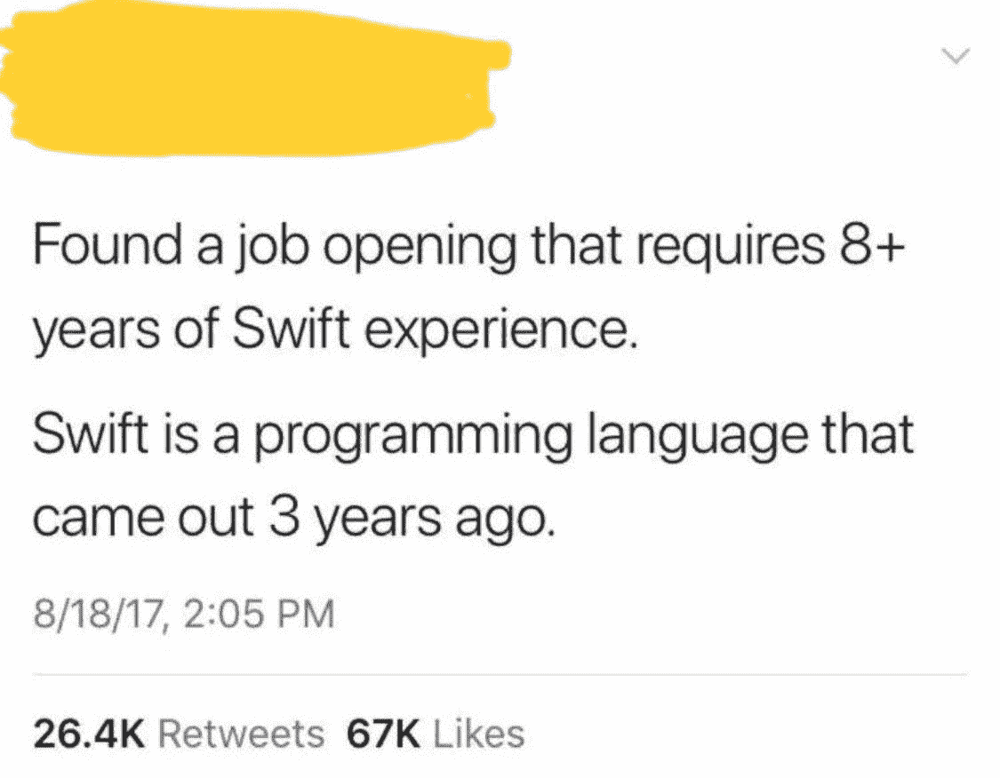

# 阻碍你获得编程工作的 8 个关键错误

> 原文：<https://towardsdatascience.com/cant-get-a-programming-job-mistakes-86474c1557b9?source=collection_archive---------47----------------------->

## 六号。你假装比实际上更有才华


图片来源:Andrea Piacquadio via Pexels

如果你正在读这篇文章，你一定很清楚编程工作带来的巨大好处——程序员的高薪、T2 不断扩大的就业市场、T4 令人兴奋的机会。

你也知道雇主越来越渴望有经验的、合格的、有才华的程序员。DAXX 博客写道，2020 年，虽然有 140 万份工作没有完成，但只有 40 万名计算机科学毕业生。当然，更多的业余爱好程序员或训练营程序员可能会填补其中的一些职位，但总的来说，对这些工作的需求远远超过了程序员的供应。

当你认为自己是那些熟练的程序员之一，但你仍然找不到一份编程工作时，这就更令人沮丧了。

如今，这么多旨在帮助你学习编码或编程的在线材料都强调让你尽快找到工作。但是，尽管这些捷径可以帮助你开始获得编程工作的旅程，但它们也是阻止你职业发展的一部分。

如果你认为你有必要的技能，但你仍然找不到一份编程工作，你可能会陷入这八个错误中的一个。好消息是它们都是可以修复的。说到底，得到一份编码工作的唯一先决条件是渴望得到一份编码工作。如果你有了这一点，其他一切都在你的掌握之中。

目录:

```
[**1\. You haven’t mastered the fundamentals of computer science.**](#7078)
  ∘ [Why this means you can’t get a programming job](#af58)
  ∘ [How to solve this problem](#d803)
[**2\. You’re not presenting yourself in a way that demonstrates you’re a good culture fit**](#7906)
  ∘ [Why this means you can’t get a programming job](#16ae)
  ∘ [How to solve this problem](#9ed2)
[**3\. You’re ignoring good interview skills**](#c278)
  ∘ [Why this means you can’t get a programming job](#4236)
  ∘ [How to solve this problem](#ba79)
[**4\. You don’t have experience**](#0a64)
  ∘ [Why this means you can’t get a programming job](#bc94)
  ∘ [How to solve this problem](#5058)
[**5\. You’re trying to master everything**](#2a37)
  ∘ [Why this means you can’t get a programming job](#2ae0)
  ∘ [How to solve this problem](#cb67)
[**6\. You’re pretending to be more talented than you are**](#e6a4)
  ∘ [Why this means you can’t get a programming job](#8e86)
  ∘ [How to solve this problem](#885d)
[**7\. You haven’t demonstrated you want to learn**](#3f55)
  ∘ [Why this means you can’t get a job](#626c)
  ∘ [How to solve this problem](#3f1f)
[**8\. You’re ignoring automated filters**](#085a)
  ∘ [Why this means you can’t get a programming job](#db4a)
  ∘ [How to solve this problem](#921d)
[**Final thoughts on why you can’t get a programming job**](#91c4)
```

# 1.你还没有掌握计算机科学的基础。

许多在训练营学习编码的人，不是专注于[在线学习计算机科学](https://qvault.io/2020/11/18/comprehensive-guide-to-learn-computer-science-online/)，而是跳过步骤，不花时间正确地完成它。

这些训练营旨在让你在一定的时间范围内获得一套非常具体的技能。他们的目的不是教你计算机科学的基础——算法、计算机体系结构和硬件、数据结构、数据库和计算理论等等。

我并不是说这些课程是在欺骗你。他们的目的是教授大多数入门级职位所需的最低限度的编码技能。碰巧的是，目的与给你找一份编程工作的目标不一致，这更复杂。

随着越来越多的教育资源出现在互联网上，获得一份没有传统学位的编码工作的可能性越来越大。这意味着更多的计算机科学初学者正在参加为期八周的 Python 新兵训练营，这对初学者来说很容易学习，当他们不能立即找到编程工作时，他们会感到沮丧。

## 为什么这意味着你找不到编程工作

让我们继续我们的思维实验，假设你如实地说你能在简历上写 Python 代码。这可能会让你有机会进入一家令人兴奋的初创公司——你的梦想——进行面试。在面试中，他们会问你一个关于算法的基本问题，你会完全被难倒。

虽然这些工作申请可能不会直截了当地说“需要理解数据结构的基础”，但这是因为它是隐含的。学习计算机科学的传统途径是在学习任何语言之前先教你基础知识，这有助于你更有效地解释和应用你以后将学到的技能。

雇佣你的人不仅仅是在寻找一个 Python 专家。他们想要一个能完全胜任这项工作的人。他们可以立刻判断出你是否具备完成工作所需的基本知识，或者你是否记住了 Python 代码。这是一个常见的失误，可能意味着你找不到编程工作。

## 如何解决这个问题

如果你已经在你的训练营或课程上花了时间和金钱，你就不需要回到学校来充分利用你的投资。相反，汇编一份基本清单，并研究它们。这将有助于你在任何语言或课程中利用现有的知识，而不会被基础知识绊倒。

网上有很多资源，有付费的也有免费的，可以帮助你学习积木。无论你是从学位、课程还是训练营获得基础知识，你都不能指望只学一门课程就能找到工作。

# 2.你没有以一种表明你是一个很好的文化适应者的方式来展示你自己

就我个人而言，我大学毕业后选择数据科学工作的部分原因是因为我像其他许多人一样讨厌销售。虽然每个人都讨厌销售，但当你申请工作时，你必须知道如何在申请过程的每个阶段推销自己。如果你找不到编程工作，可能是因为你忽略了申请过程的这一部分。

人们通常认为，想雇佣你从事编码工作的公司只关心你的技术水平，但事实并非如此。除了你能编写代码的语言、你理解的计算机科学基础知识、你擅长的面试问题，他们还会关注一个重要的方面:文化契合度。

尽管就业市场非常开放，但雇主想要的是不仅擅长编码，而且能为团队和公司整体做出贡献的人。

## 为什么这意味着你找不到编程工作

程序员有一种刻板印象，他们是那种痴迷的人，把自己锁在寒冷黑暗的地下室里，直到他们的编码项目完成。全栈网络开发人员 Charlotte Bone 在她的博客文章中写道“程序员最喜欢的就是整天坐在黑暗的房间里编码”，这是一种有害的刻板印象。

这可能是一个障碍，因为虽然你想成为一名程序员，但你可能觉得自己不符合这种刻板印象，但仍然觉得你必须为雇主假装这样。或者，如果你确实符合这个概念，你可能会展示自己的这一部分，但忘记雇主不是在寻找编码机器——他们是在寻找员工。如果你找不到一份编程工作，考虑一下你如何展现自己的个性，以及它如何与你的目标公司相契合。

## 如何解决这个问题

事实是，大多数人，包括程序员和编码员，都不是编码机器——我们是真实的人，除了写代码之外，还有其他的兴趣和爱好。重要的是让这一点在你的简历中表现出来，在面试中，以某种方式表明你不仅在技术上有能力，而且在文化上也非常适合。如果你找不到编程工作，可能是因为你的简历只看编程技能。

你表现出热情、投入和好奇心了吗？你参加过哪些课外活动？你如何包装你的技能来证明你是他们从技术和文化角度都需要的？

花点时间研究一下你未来的潜在雇主，以及现在的雇员表现出哪些非技术素质。这将为你提供最大的机会，从技能和文化契合度两个角度展示你自己。

# 3.你忽略了良好的面试技巧

同样，如果你找不到一份编码工作，那可能是你忽略了普通而重要的面试技巧。

即使你的简历很完美，即使你在面试中回答了所有的问题，记住你将被作为一个人而不是一台机器来评价仍然是至关重要的。保持眼神交流，表达自信，以及与面试官建立联系等软技能都很重要。

## 为什么这意味着你找不到编程工作

一些找不到编程工作的人已经厌倦了，因为在理论上，他们拥有完成工作所需的所有技能。但是面试也是对你如何与其他人合作以及如何沟通的一种测试，这一点经常被忽视。

人类不擅长一眼就看出你是否是那种能与他人很好合作的人，但是我们想出了一些给我们一个提示的简写方法。速记是常见的面试礼仪。

npm 的首席技术官 Laurie Hoss 在 Quartz 上写道:“工程师的工作是与团队合作实现更大的目标，如果你不愿意或不能花时间与同事交流，你就只完成了一半的工作。”如果你在面试中没有展示出良好的人际交往能力，你未来的雇主可能会认为你属于那种只能做一半工作的程序员。

## 如何解决这个问题

如果你已经到了面试阶段，仍然找不到一份编程工作，这可能是一个信号，表明这是一个影响你工作前景的问题。要解决这个问题，在每次面试中都有一个简单的清单，不管是虚拟的还是面对面的，都要达成一致:

*   进行眼神交流
*   问面试官一些与工作无关的事情——他们的家庭、下午的计划、宠物。
*   流露出自信。记住你申请这份工作是因为你认为你是最合适的人选！
*   在面试结束时，顺便提及你开始时对他们说的话。

这向面试官展示了你不仅是一个优秀的程序员，而且是一个好的面试官，因此也是一个好的沟通者。

# 4.你没有经验

如果因为这个原因找不到编程工作，也不要太自责。这是一个因雇主发布的工作列表而加剧的问题。似乎每个雇主都需要对一种一年前才出现的语言有至少五年经验的程序员。这导致程序员申请的工作可能会被认为在他们可应用的经验方面有点牵强。



推文截图

因为标准高，稍微夸张一点都可以原谅。但是当你申请需要经验的工作时，问题就出现了，你不能证明你的经验来自哪里。这是一个即使是熟练的程序员也找不到编程工作的普遍原因。

问题是多年的经验并不意味着什么。我可能是世界上最懒的程序员，据称有五年编写 Perl 的经验，因为我姐姐拥有这家公司，她没有解雇我。我将拥有与只有一个月工作经验的人完全相同的技能，但她对待工作比我认真得多。

就像良好的面试技巧一样，询问工作经验只是“你知道如何做我们需要你做的 75%的事情吗？”

## 为什么这意味着你找不到编程工作

想象一下，有人在一堆简历中寻找拥有五年 Python 经验的程序员。他们看到你，像其他人一样，列出了你有必要的五年。

从外表上看，你似乎已经回答了他们的问题。但是他们问的是你是否有解决他们的 Python 问题所需的技能和经验。在这一点上，你是否有一年或五年的 Python 经验并不重要——你需要证明你有相当于这些年的经验。这不仅有助于你回答雇主的实际问题，也有助于你在其他应聘者中脱颖而出。

## 如何解决这个问题

不，你不需要五年的经验。但是如果你找不到编程的工作，你需要证明你在乎你未来的工作，尤其是如果你之前没有工作经验的话。你做过哪些好玩的项目？你最喜欢它的哪一点？你解决了哪些问题？

你是否有一个博客、GitHub repo 或其他投资组合来展示你对编程的承诺？Ferpection 的首席 JavaScript 软件工程师 nathanal Cherrier 在他的博客文章中列举了一些优势，解释了为什么开发人员应该创建博客:“当你在互联网上写作时，你会比普通开发人员更引人注目。你希望谁会阅读你的帖子？未来的同事？你想去的那家很棒的公司的招聘人员？负责选择你想发言的会议发言人的委员会？所有这些人都会对你的专业技能和编辑技能感兴趣。”

如果你因为缺乏经验而找不到编程工作，分享你的激情是向雇主证明你能做他们需要你做的事情的好方法。

# 5.你试图掌握一切

同样，就像多年经验中不切实际的要求一样，许多公司在这个问题上推波助澜，列出了每一种潜在的语言和技术技能，也许有一天会在他们的工作清单上有用。如果你找不到编程工作，可能是因为你试图掌握你在工作列表上看到的一切。

问题是有无数的编程语言和技能，一个编程新手可能认为他们必须学习。

相反，在学习支撑每一份核心计算机科学工作的基础知识的同时，你需要推销自己的一个可销售的方面，而不是试图做所有的事情。

## 为什么这意味着你找不到编程工作

除非你是一个经验丰富的程序员，否则你不可能掌握乔布斯要求的所有东西。(如果你是一名资深程序员，你可能已经有一份体面的工作了！)

如果你刚开始找工作，担心找不到编程工作，你可能会认为你必须掌握他们要求的一切。你不是努力掌握一两项关键技能，而是分散精力，对面试中可能出现的任何问题都有一个大致的了解。但是，你不会精通八种语言，相反，你最终只会对每一种语言都知之甚少。

## 如何解决这个问题

我喜欢特里萨·迪特里希在她的博客文章中描述她的解决方案的方式，她的博客文章标题是“我从雇佣数百名工程师中学到的可以帮助你获得下一个职位。”在这篇文章中，她写道，许多工作清单都有夸大的要求，似乎涵盖了天底下的一切。

如果你找不到一份编程工作，她的解决方案是制作一份你感兴趣的工作的电子表格，以及每份工作需要的核心技能。很有可能你会很快发现一些共性。这将给出你的答案，说明最有可能帮助你得到这份工作的技能，即使他们列出了 20 个其他的“要求”

你找不到编程工作的部分原因可能是，当你被要求做所有的事情时，你只能证明掌握了很少的几件事情。通过减少噪音和传递这些公司正在寻找的信号，你可以得到你梦想中的编程工作。

你最喜欢什么语言？你最了解哪一个？这些答案将有助于开始为你指出正确的方向——无论是哪种工作符合你现有的技能，还是如何在你的简历和面试中推销这些技能。

# 6.你假装比实际上更有才华

当然，找不到编程工作的人可能会不顾一切地夸大事实，试图涵盖每一点。尽管工作列表有时可能不切实际，但这是意料之中的事情。但这实际上可能会阻止你找到一份编程工作。

好消息是，虽然雇主确实想要一个有能力的员工，但这并不意味着他们需要你做他们在工作要求中列出的所有事情。

## 为什么这意味着你找不到编程工作

当你修改简历和求职信时，你试图通过夸大事实来满足那些不切实际的要求，看起来好像你是他们要求的所有事情的大师。面试官可以从你的简历中看出这一点，即使你得到了面试机会，他们也一定会发现的。

最明确地说，你不可能骗过有经验的程序员和面试官。虽然工作清单看起来高不可攀，但这并不意味着你应该假装拥有更多你不具备的经验、知识或技能。最好的情况是，你被一份压力很大的工作录用了，但你不能胜任。最糟糕的情况是你找不到编程工作，浪费时间去申请一份你不适合的工作。

## 如何解决这个问题

牢记你未来雇主的目标。就像多年的经验一样，他们不需要你勾选每一个选项。他们只想雇佣最有能力完成工作的人。

无论是在求职还是面试中，坚持你所知道的，你就能发挥你的优势。诚实面对你的技能和局限。只要你能证明你能做他们需要你做的事情，你就有机会。

假设一个雇主遇到了两个候选人:一个说他们可以做一些他们不能做的事情，另一个说这超出了他们目前的技能范围，但展示了他们在过去一年中如何提高了技能。后者对雇主更有吸引力。如果你找不到一份编程工作，考虑一下如何削减你所谓的技能，让它尽可能真实。

# 7.你没有表现出你想学习

有趣的是，LinkedIn Workplace Learning 的 2020 年报告显示，最受欢迎的技能根本不是技术技能，而是软技能。他们推测，原因是因为技能老化得很快。一项重要的技能今年是多余的明年。软技能，就像计算机科学的基础知识一样，是其他所有可能吸引雇主的技能的基础。

这意味着学习能力比你能展示的其他技能更重要。大多数雇主希望雇佣一个他们只需要最低限度培训的候选人，因为你可以打赌新的技术能力年复一年都是必要的。要成为一个理想的候选人，一旦你展示了你的核心技能和主要才能，证明你仍然对学习感兴趣。编程不是一个一成不变的职业。新的技术、语言和技能不断涌现。你需要充满活力才能保持领先。

## 为什么这意味着你找不到工作

让我们假设你是一个完美的候选人，拥有他们要求的每一年的经验，每一种语言，并且能够证明对计算机科学的基础有坚实的掌握。如果你仍然找不到一份编程工作，即使一切都对你有利，那可能是因为你没有表现出你想学习。

如果你的简历不能证明你仍然对学习新技能感兴趣，如果你在面试阶段没有表现出获取知识的热情，即使今天你是完美的候选人，明天你也会被淘汰。

想从事编码或编程工作的人可能会专注于艰苦的技术技能，因为这些技能更容易证明。但是如果表现出学习的愿望只是事后的想法，这可能是你找不到编程工作的一个原因。

## 如何解决这个问题

幸运的是，大多数程序员喜欢学习。你必须这么做，尤其是如果你没有获得传统的计算机科学学位。这就是更非传统的背景可以派上用场的地方——通过参加课程或获得证书，这是展示你对学习的奉献精神的一个很好的方式。

了解最新的编程趋势也是一个好主意。你不必表现出对它们的完全掌握——事实上，那是浪费你的时间——但是通过表现出对编程趋势的兴趣，你可以表现出你喜欢学习和紧跟计算机科学领域的潮流。

最后，不要局限于只表现出对学习计算机科学的热情。你还喜欢学什么？乐器、口语、水彩技巧等等都可以展示你对学习的热爱。

# 8.你忽略了自动过滤器

如果这个错误列表中没有一个适合你，而你仍然找不到一份编程工作，那可能是因为技术在与你作对。尽管大多数申请编程或编码工作的人都是技术性很强的，但人们很容易忽视招聘过程是自动化的这一事实。以[亚马逊为例](https://www.reuters.com/article/us-amazon-com-jobs-automation-insight/amazon-scraps-secret-ai-recruiting-tool-that-showed-bias-against-women-idUSKCN1MK08G)，他们在 2018 年陷入困境，当时发现他们的招聘人工智能错误地显示出对女性的偏见。由于自动化的缺陷，许多合格的个人甚至没有人看他们的简历。

撇开有问题的人工智能不谈，考虑这样一个事实:很多时候，你的申请甚至没有被人力资源或招聘人员看到，因为他们已经应用了过滤器，以尽量减少合理数量的候选人的工作量。通过使用关键词来缩小名单，他们尽最大努力在被人看之前筛选出最不适用的简历。

## 为什么这意味着你找不到编程工作

很多有天赋的程序员不擅长针对关键词优化简历。这本身就是一种技能。虽然这可能会让 HR 的工作变得更容易，但这确实意味着你找不到编程工作的原因不是因为你的任何不足，而是因为你没有在简历上按正确的顺序放置正确的单词。

不幸的是，如果你正在努力寻找一份编程工作，你不能忽视这些自动过滤器，并认为你的天赋会大放异彩。不管你喜不喜欢，你可能不得不玩一会这个游戏来获得你理想的编程工作。

## 如何解决这个问题

如果你怀疑这是你找不到编程工作的原因，有两种方法可以确保你不会被机器忽视。

首先，也是最显而易见的，优化你简历的关键词。再看一遍求职申请，用公司的话勾掉你在简历上写的每一项。Balance Career 关于简历关键词的博客文章还建议确保你的简历反映了公司的品牌，这是他们与众不同的地方，所以试着查看他们的 LinkedIn 页面，以及当前员工的 LinkedIn。

第二种方法不太直观:记住招聘者也是人。你可以把你的简历扔进一堆，希望有人会看你的简历，或者你可以多走一步，找到一个职位相似的现任员工、招聘经理，或者你的老板，给他们发一条简短的 LinkedIn 信息。你可以表达对这个职位的热情，问一些关于当前职责的问题，甚至只是让他们知道你刚刚申请了这个职位，并期待着回音。

这是让他们注意到你的一种方式，如果你的简历出现了，确保你的名字已经很熟悉了。永远不要忘记人情味是很重要的。

# 关于你为什么找不到编程工作的最后想法

有可能在两个潜在阶段被拒绝:获得面试机会和面试后获得工作机会。如果你找不到编程工作，为了最大化你的机会，看看你在哪里挣扎，并在那里应用相关的技巧。

总的来说，这个建议可以归结为:记住人类技能仍然是重要的。不要撒谎。坚持自己的优势。首先介绍一些基础知识。

如果你能做到这一点，你就解决了找不到编程工作的主要原因。

继续努力，记住:雇主对优秀程序员的渴望就像你对一份好工作的渴望一样。你所要做的就是向他们展示你是他们梦寐以求的候选人。

*原载于 2021 年 1 月 18 日*[*https://qvault . io*](https://qvault.io/2021/01/18/reasons-you-cant-get-a-programming-job/)*。*