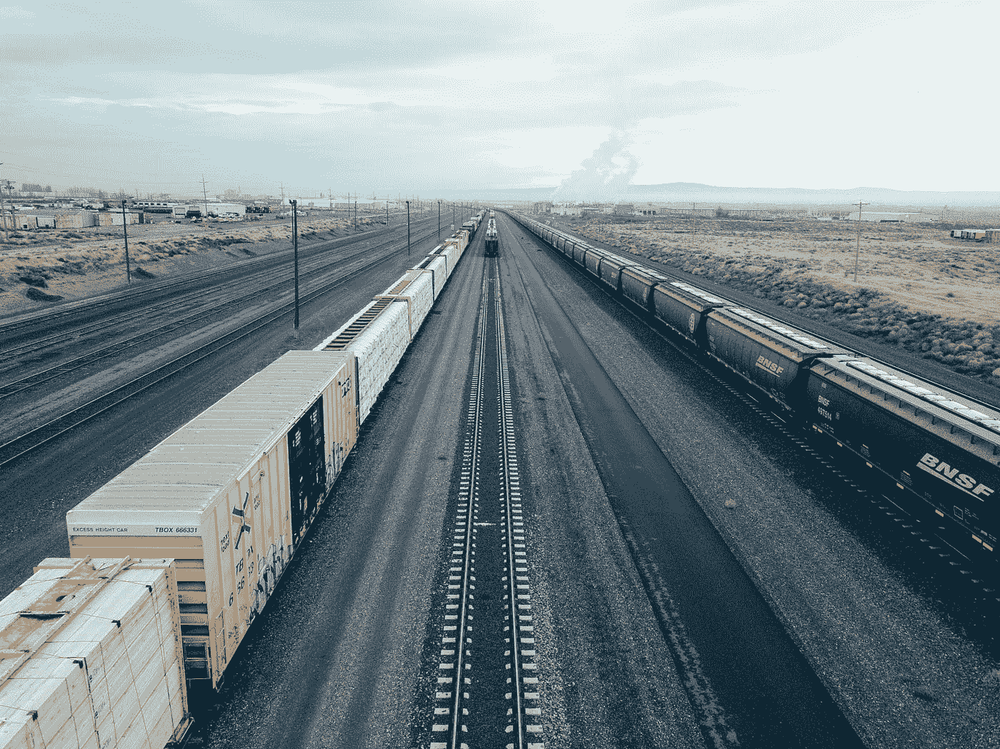

# 货物列车的能力优化(一)

> 原文：<https://towardsdatascience.com/capacity-optimization-in-freight-trains-part-1-4918f35a6433?source=collection_archive---------14----------------------->

## Python 中的货物列车能力优化指南

图片由 [Gabriel Sanchez](https://unsplash.com/@gabrielsanchez?utm_source=medium&utm_medium=referral) 在 [Unsplash](https://unsplash.com?utm_source=medium&utm_medium=referral) 上拍摄

铁路货运和任何其他形式的大众运输一样复杂。它与航空货运密切相关，因为它们都需要优化空间以提高效率，并最大限度地减少运行时间。当货运列车与客运列车使用相同的轨道时，运行服务的最小化甚至更加重要，尤其是在城市环境中。因此，需要在不同地点之间运行最佳数量的列车服务，因为这将:

1.  **省钱-** 使用最佳数量的集装箱运行一项服务比使用相同或稍多数量的集装箱运行多项服务更经济。服务路线上的人力可以重新分配到其他需要的地区。
2.  **预留时间段分配** —允许将预留时间段分配给其他服务，如客运列车，在高峰运行时间更是如此。

理想情况下，只有最大限度地利用可用货运服务的货车空间，才能最大限度地减少列车服务。

# 定义:

为了更好地理解手头的问题，与铁路货运相关的几个术语定义如下:

1.  机车——这是火车的引擎，在铁轨上牵引货车。列车的长度(车皮数量)和它们的累计重量将决定要使用的机车类型，因为它们的牵引力不同。
2.  货车—这是一种被牵引的拖车，设计用于沿铁路轨道移动，在大多数情况下用于运输集装箱。它们在大小和性质上有所不同，例如，平顶集装箱可以很容易地装卸。
3.  集装箱——这些是用来装载物品的单位。理想情况下，货物只是装在里面，然后在不同地点之间移动。有不同的尺寸，20 英尺和 40 英尺的集装箱是最常见的。更全面的尺寸列表可以在[这里](https://www.scf.com.au/news-articles/shipping-container-sizes-dimensions/)找到。

# 问题陈述:

是否有可能优化现有货车上的集装箱容量，火车服务中的所有不同尺寸？

# 容量优化:

通常，一列火车拉几辆不同尺寸的货车，其中一些装有不同尺寸的集装箱。因此，需要最大化适合集装箱的容量和可用货车容量。这将导致与装载、卸载和其他一般操作成本相关的成本降低。此外，根据既定时间表进行的旅行次数最终将会减少。

我将举例说明如何根据铁路货运中使用多个背包的可用集装箱和可用货车容量来实现这一优化过程。

# 背包问题:

背包问题可以用一个购物领域的例子来说明。假设你去当地的超市，你被随机选中，从货架上挑选尽可能多的商品，放进你的购物袋。这个购物袋的容量是最大的。作为该过程一部分的条件如下:

1.  你只能挑选一整件物品。因此，不能以任何方式拆分项目。
2.  一旦你的购物袋满了，你就不会再拣东西了。

这里的理想/最佳选择是考虑被拣选物品的大小和价值。比如，比起杯子，挑选更多的首饰会是更好的选择。遵循这一最佳过程可能会产生一个装有许多更有价值物品的购物袋(背包)。这个优化过程可以应用于不同的业务问题，如本文 [**和**](https://www.smithsonianmag.com/science-nature/why-knapsack-problem-all-around-us-180974333/) 中所述。

# 多背包四轮拖车:

背包问题可以在优化火车运力中复制。理想情况下，每节车厢都是一个*箱*，在列车服务中大小不同。当最大数量的集装箱装在可用的货车上时，将实现最优化。因此，每辆货车将是一个背包，它必须适合与货车容量成比例的最大数量的集装箱。

**数据:**

该实验中的数据涉及以下参数:

A)重量/尺寸/槽数——具有容器重量的向量(一维列表，即数据行)。这里，每个集装箱的箱位数将被假定为重量。例如，一个 40 英尺的集装箱在一辆货车上占了四个位置。

b)值—这是一个包含单个容器值的向量。这些值重视每个容器。因此，这个向量的长度应该与权重/大小的长度相同。例如，我们可以假设目的地最需要的集装箱价值更高。或者，可以认为 40 英尺集装箱比 20 英尺集装箱更重要。在这种情况下，它们会有更高的价值。

c)容量——包含货车容量的向量。在这种情况下，四轮拖车是多个背包。因此，每个货车的容量(槽数)必须在向量中表示。

下面的代码展示了上述数据点是如何生成和表示的。数据中的值是相同的。这意味着所有的容器都同样重要。

要解决混合整数规划(MIP)问题，必须完成以下步骤:

1.  导入线性求解器包装器，
2.  声明 MIP 求解器，
3.  定义变量，
4.  定义约束条件，
5.  定义目标，
6.  调用 MIP 求解器
7.  显示解决方案

1.  **导入并声明线性求解器:**

下面的代码使用 Google 的 [**或-Tools**](https://developers.google.com/optimization) **为这个问题定义了 MIP 求解器。**使用 [**求解约束整数程序(SCIP)**](https://www.scipopt.org/) 后端。OR-Tools 是一款用于*组合优化*的开源软件，旨在从一个非常大的可能解决方案集合中找到一个问题的最佳解决方案。命令 **$ *python -m pip 安装—升级—用户或工具*** 将为 python 安装或工具。这可以在激活的环境中运行。然后，您将能够运行下面的代码来导入和声明线性求解器。

**2。变量定义:**

下面的代码为这个问题创建了变量。

*i* 是集装箱 *j* 是旅行车(个人背包)。因此，如果集装箱 *i* 放在货车 *j* 上，x[(i，j)]的值为 1。如果不是，那么该值将为 0。

**3。定义约束:**

对于这个问题，*约束*如下:-

1.  每个集装箱最多只能放在一辆货车上。为了定义这一点，所有货车上的 *x[i][j]* 之和 *j* 必须小于或等于 1。
2.  货车总容量不能超过货车限制。这意味着集装箱的重量(箱位数)不能超过货车的箱位数。例如，一辆 60 英尺的货车有 6 个插槽。因此，它可以装载一个 40 英尺(4 个箱位)和 20 英尺(2 个箱位)，或三个 20 英尺，或一个 20 英尺，或一个 40 英尺的集装箱。集装箱箱位总数不能超过货车。

定义约束的代码如下

**4。定义目标:**

这个优化问题的目标函数是最大化装载集装箱的总价值。这基于每个容器的槽数/重量和值，如以下代码中所定义:

此外，只有当集装箱放在货车上时，集装箱的价值才适用。否则，它不会有助于最大化安装在每个货车上的集装箱的总价值的目标。

**5。调用 MIP 求解器并显示解**

对于每辆货车，将输出集装箱编号及其总重量和价值。总的来说，每个集装箱的总价值和重量也会显示出来。输出在下面的代码中生成:

包含上述代码片段的完整程序如下:

13 辆四轮拖车上集装箱的优化布局如下:

# 结论:

上述代码的输出是通过分解要放在货车上的集装箱的价值和重量来最大化货车上可用空间的指南。在本例中，所有容器的值都相同，无论其大小如何。这可能不是商业设置中的确切情况。例如，每个集装箱的重要性值可以基于集装箱到达目的地的紧急程度等。在本文的第 2 部分中，我将结合一家铁路公司的列车计划中的真实数据，来看看这个优化过程在多大程度上有助于在不同地点之间将尽可能多的集装箱装载到货车上。敬请关注。