# Caret vs. tidymodels 创建可重用的机器学习工作流

> 原文：<https://towardsdatascience.com/caret-vs-tidymodels-create-complete-reusable-machine-learning-workflows-5c50a7befd2d?source=collection_archive---------13----------------------->

## [实践教程](https://towardsdatascience.com/tagged/hands-on-tutorials)

## 两个软件包之间的人力资源分析之战


照片由[乔纳森·托马斯](https://unsplash.com/@jotomas?utm_source=unsplash&utm_medium=referral&utm_content=creditCopyText)在 [Unsplash](https://unsplash.com/s/photos/boxing-thailand?utm_source=unsplash&utm_medium=referral&utm_content=creditCopyText) 上拍摄

如果你在 R 中使用机器学习模型，你可能会使用 caret 或 tidymodels。有趣的是，这两个软件包都是由同一个作者开发的:Max Kuhn。但是它们在可行性和性能方面如何相互比较呢？

你可能想知道你应该为 R 中的预测建模学习哪个包。有一件事是正确的:Caret 是 R 的传统机器学习包，而 tidymodels 对 R 社区的部分成员来说是相当陌生的。因此，它对我来说是新的:一个智能媒体用户向我推荐 tidymodels，以便自动化我在上一篇教程中展示的特性预处理部分。尽管我有点怀疑，但我还是尝试了一下，看看它是否比 caret 更好。最近，我挑战自己，用 caret 在一个小的模拟数据集上预测员工流失——这也是用 tidymodels 尝试的一个完美案例。这也是一个非常现实的例子，因为行业中的一些大公司已经应用预测分析来减少流失并增加他们宝贵人才的保留率。使用数据挖掘技术，可以使用历史和标记的员工数据来检测与人员流动相关的特征(上次加薪、商务旅行、人与工作的匹配、离家的距离等)。).因此，该算法使用过去的数据进行训练，以预测未来。这也可能是一个严重的问题，因为它很容易导致歧视性偏见。因此，当一个预测模型被应用时，在它已经过时并犯下严重错误之前，必须不断地对它进行评估。尽管如此，如果我们深思熟虑地使用它们，我相信数据分析的使用可以成为一个强大的工具，以改善工作场所。

# 为什么是 tidymodels？

由于用户使用 R 中可用的各种机器学习算法的方式略有不同，Max Kuhn 旨在开发一个统一的机器学习平台，该平台允许一致的和可复制的代码。在 R 社区中，当 Max Kuhn 也在 2020 年开发 tidymodels 时，优秀的老 caret 已经扮演了最先进的包的角色一段时间——可以说是 caret 的 tidyverse 版本。类似于 dplyr-syntax(包括%>%，mutate()等。)，tidymodels 基于这样一种思想，即在工作流中构建您的代码，在工作流中每个步骤都被明确定义。这是直观的，并允许你按顺序跟随你的程序实际做什么。许多功能都是从 tidymodels 中已经包含的几个核心包中借用的，因此可以认为它是一个元包:

*   *rsample* :用于样本分割(如训练/测试或交叉验证)
*   *配方*:用于预处理
*   *防风草*:用于指定型号
*   *尺度*:评估模型
*   *刻度盘*:用于超参数调谐
*   *工作流程*:用于创建 ML 管道
*   *扫帚*:整理模型输出

因为 tidymodels 使用了这些包，如果您已经熟悉它们，那么学习起来会更容易，但这并不是真正必需的。

> 请注意:如果你只对编码部分感兴趣，你可以在我的 GitHub 库[这里](https://github.com/hannahtabea/HR-analytics)找到完整的脚本。

# 著名的 IBM HR 分析数据集入门

我们将在案例研究中使用的数据集是由 IBM Watson Analytics 创建的模拟数据集，可以在 [Kaggle](https://www.kaggle.com/pavansubhasht/ibm-hr-analytics-attrition-dataset) 上找到。它包含 1470 个雇员条目和 38 个共同特征(月收入、工作满意度、性别等)。)—其中之一是我们的目标变量(员工)流失(是/否)。在定义了一个 R-project 之后，我们可以使用简洁的 [here-package](https://github.com/r-lib/here) 来以一种简单的方式设置我们的路径，这种方式更能抵抗本地机器上的变化。让我们看看我们的原始数据。

*免责声明:所有图文均由作者制作，除非特别注明。*


没有遗漏任何观察值，skim 函数给出的总结显示了一些描述性统计数据，包括平均值、标准偏差、百分位数以及每个变量的直方图(26 个数字；9 个字符)。在现实世界中，我们可能永远不会有如此干净完整的数据集，但我们仍然有另一个相当现实的问题:似乎有 237 名员工(16%)离开了公司，而大多数人(几乎 84%)留了下来，因此阶层并不均衡。类别不平衡需要特殊处理，因为使用常规性能指标(准确性、AUC ROC 等)来优化和评估模型的性能是不方便的。).其原因如下:由于准确性是所有案例中正确分类的案例的比例，所以即使算法简单地将所有案例分类为多数类(例如，否)，即使它们中的一些实际上属于少数类(例如，是)，算法给我们高分也不是什么大事。但是在我们的案例中，我们非常关心积极的案例，因为没有正确识别员工将会离开(例如，敏感度或真实积极率)比意外预测员工将会离开(如果此人实际上留下了)(假积极率或 1-特异性)更有害。因此，我们将使用 F1 分数作为训练优化的准确性指标，因为它对正确分类积极案例(例如，员工流失)赋予了更大的重要性，并提高了模型在严重不平衡数据集中的性能。

作为第一步，我们可以计算任何附加特征。被认为不公平的报酬会影响一个人离职寻找更好报酬的意愿(哈登、博阿凯和瑞安，2018；萨卡尔，2018；布莱恩特&艾伦，2013)。这就是为什么我们想要创建另一个变量来表示每个员工月收入的支付竞争力，其背后的推理是，员工可能会将自己的收入与相同职位级别的同事进行比较。一个认为自己的薪酬公平的人，与一个在类似职位上薪酬低得多的人相比，不太可能离开公司。为此，我们将使用 data.table 语法首先按职位级别计算薪酬中值，并为每个观察值存储适当的值。然后，我们将每个员工的月收入除以收入中值，得到他或她的薪酬比率:这是一个直接代表该人相对于工作级别预期的薪酬的衡量标准。因此，1 分意味着该员工完全符合该职位的平均薪酬。1.2 分意味着员工的工资比平均工资高 20%，0.8 分意味着员工的工资比每个工作级别的正常工资低 20%。下一步，我们去除所有不太可能有任何预测能力的变量。例如，employee-ID 不能解释员工流动率的任何有意义的变化，因此现在应该在其他变量中删除它。Tidymodels 为我们提供了机会[来为变量](https://recipes.tidymodels.org/articles/Roles.html)分配角色，例如这样一个 ID 列来保留标识符，同时仍然将其从以后的实际建模中排除。但是我们希望在这里手动执行，以便对 caret 使用相同的训练数据(在 caret 中我们不能分配角色)。我们希望排除的其他变量示例是那些明显多余的变量，因此可能会导致多重共线性问题(例如，小时工资和月收入)。然后，我们通过同时将所有字符串变量(例如，Department)正确转换为因子来保存缩减的数据集。

# 分成训练和测试数据

训练数据必须用于拟合我们的模型和调整我们的超参数，同时我们保存一些测试数据用于我们的最终模型评估。为什么？我们可能会遇到这样的问题，使我们的模型过分适合特定于样本的数据，这样我们以后就不能将它应用于新的雇员数据。这个问题通常被称为过度拟合——这种现象可以解释为什么我们有时无法再复制以前发现的效果。对于机器学习模型，我们经常将数据分成训练集和验证/测试集来克服这个问题。训练集用于训练模型。验证集用于估计模型性能，以相应地调整超参数。最后，保存测试集，以挑战模型从未见过的数据的预测准确性。对于 tidymodels，可以使用`initial_split()`进行第一次粗略分割，它提供了一个与主数据集相关的分割索引列表。我们将 70%的数据用于训练，剩下的 30%用于测试。分层与目标变量一起使用。这意味着我们让每个模型都有机会在相同比例的课程上接受培训和测试(例如，16%是，84 %否)。类似地，caret 的 createDataPartionining()函数自动使用 outcome 变量来平衡拆分中的类分布。通过设置`list = FALSE`，我们确保函数返回一个矩阵而不是一个列表。因此，我们可以使用熟悉的 data.table 语法在主数据集上使用随机组合的索引。为了使模型对新数据更具普适性，我们可以使用统计工具箱中的另一个魔术:各种拆分的交叉验证。随后，我们将经过训练的候选模型应用于一组额外的观察值，并反复调整参数以减少预测误差。这些额外的观察值是来自训练数据的几个随机样本，每次都会遗漏一些数据。这使得数据的多重折叠来验证超参数。我们重复这个过程 3 次，并对性能进行平均，以获得我们的模型性能的初步估计——一种被称为三重交叉验证的重采样技术。Tidymodel 的`vfold_cv()`为我们做了这项工作——我们定义了应该创建的折叠次数以及应该用于重采样的重复次数。当我们使用 caret 时，我们可以使用`createFolds()`函数来达到同样的目的，但是为了我们的比较，我们做得更好:tidymodels 包括一个名为`rsample2caret()`的函数，它将我们已经在 tidymodels 中制作的折叠转换为熟悉的 caret 格式。得益于`rsample2caret()`和`caret2rsample()`命令，您可以轻松地在您喜欢的任何包中使用相同的重新采样。通过这种方式，我们在每个框架中计算的性能指标偏差更小，更具直接可比性。

# 控制预处理步骤

现在，我们使用菜谱为 tidymodels 建模准备数据:想法很简单——我们创建一个包含所有预处理步骤的对象，这些步骤用作烘焙精心准备的数据集的配料。这样，我们的数据就可以被模型接受了。我们需要注意预处理步骤的顺序，因为它们是按照输入的顺序执行的(例如，在创建虚拟变量后归一化数值预测值没有多大意义，因为 0 和 1 也被视为数值)。你可以把一个菜谱想象成一个蓝图，在实际执行之前，勾画出我们的模型公式、变量编码和预处理步骤*的逻辑。这个配方随后被包含在工作流中——一种可以被认为是一种分析管道的结构，它将您自己预先指定的特征工程步骤与模型规范捆绑在一起。在我们的研究中，我们希望创建虚拟变量，移除方差接近于零的变量以及已经与类似变量高度相关的变量，以处理多重共线性。此外，我们应用随机过采样来处理从 [themis](https://themis.tidymodels.org/) 封装借用的类不平衡。由于在我们的数据集中，负面案例比正面案例多得多，我们可以假设我们的模型不会有很好的机会来学习如何识别少数类。ROSE 算法可以通过生成模拟我们真实积极结果的具有积极结果(例如，离开公司)的人工附加观察来处理这一问题。所以，这些职业更加平衡了。如果你感兴趣的是职业不平衡会在多大程度上改变你的性能指标，看看我的 [GitHub repo](https://github.com/hannahtabea/HR-analytics) 并运行`bal_log_example.R`和`imbal_log_example.R.`*

Caret 在训练时负责所有的特征工程步骤，甚至自动处理虚拟编码，所以我们不需要在后面的 train()调用的预处理参数中指定这一点。caret 的预处理选项的一个缺点是没有选择转换特定变量(例如，某些数字变量)的选项。为了使用与 tidymodels 示例中相同的上采样技术，我们需要对由 [ROSE 包](https://cran.r-project.org/web/packages/ROSE/ROSE.pdf)导入的训练数据使用单独的函数。这里我们需要小心—不管出于什么原因，函数交换了目标变量的因子级别，这可能会影响以后的性能指标。为了避免这种情况，我们再次手动分配因子级别，使第一个级别为正类。

# 指定模型并设置超参数调整

为了在 tidymodels 中创建适当的模型，我们首先使用一个包含公式以及预处理步骤逻辑的配方。这个配方随后被包含在工作流中——一种可以被认为是一种分析管道的结构，它将您自己预先指定的特征工程步骤与模型规范捆绑在一起。parsnip 包帮助我们告诉程序使用哪个特定的模型。您还可以通过调用`set_engine()`告诉模型使用哪个底层算法来将“引擎”连接到模型规范(Bayesians 可能很乐意听到您甚至可以[使用 stan](https://www.startupengineer.io/_repos/dat_sci_2/07_ml_sup_i/) )。通过将超参数设置为`tune()`，我们已经确保它们被标记为稍后进行调优。如果我们已经知道使用哪个设置，因为它在过去工作得很好，我们也可以将它直接传递给模型规范(例如，如果我们想要有 200 棵树)。如果我们使用 caret，这一步是不必要的，因为我们只是将模型类型传递给 train 函数的方法参数。然后用 caret 的[默认调整范围](https://stackoverflow.com/questions/29913901/r-how-does-caret-choose-default-tuning-range)调整超参数，通常会产生非常好的结果。假设您对 caret 为 glmnet 使用的调优范围感兴趣，您可以使用`getModelInfo(“glmnet")[[1]]$grid`。使用 tidymodels，我们接下来需要使用 parsnip 中的 parameters 函数准备一个 param 对象。然后，我们将它们传递给我们选择的网格函数——这里我应用了一个不规则网格来寻找接近最佳的参数组合。相比之下，网格搜索将遍历所有可能的参数组合并评估它们的相关模型性能，当网格中没有表示最优解时，它会很快变得计算成本高且效率低。使用不规则网格，尤其是所谓的“[空间填充设计](https://dials.tidymodels.org/reference/grid_max_entropy.html)”，我们更有可能更快地找到一个好的组合，同时仍然覆盖整个参数空间。

# 组合多个模型

显然，将多个模型集成到一个对象中的想法对于 tidymodels 来说并不新鲜！在设置了预处理方法和模型规范之后，我们创建了一个工作流，该工作流将我们之前定义的用于准备和建模数据的所有步骤捆绑在一起，并在一个调用中完成这些步骤。但是我们甚至更进一步。我们创建了一个包含多个工作流的更加丰富的对象。这些工作流(例如，配方、配方、模型)以某种方式交叉，以后可以在单个请求中对它们进行调整。在我们的例子中，我们尝试了几个模型，xgboost 和 glmnet，但是这可以很容易地扩展。这个工作流集现在是我们一次训练多个模型的主结构。通过使用 option_add，我们将我们的[不同的定制网格传递到我们的 workflowset](https://github.com/tidymodels/workflowsets/issues/37) 的 option 列中，以修改默认的调优范围。我们可以使用来自 parsnip 的 Github 代码来找出哪些调优参数是可用的，并与来自 caret 的我们习惯使用的[参数](https://github.com/tidymodels/parsnip/blob/110257f3c1566043239e6c08e6d16d81cb4b5116/R/boost_tree_data.R#L73)相对应。

# 比较模型性能

在我们开始调优 tidy 模型之前，我们保存了一组性能指标，这些指标应该用于评估模型的优劣。现在我们使用 [workflow_map](https://www.tmwr.org/workflow-sets.html#tuning-and-evaluating-the-models) 来实际[调优](https://analyticsindiamag.com/why-is-random-search-better-than-grid-search-for-machine-learning/#:~:text=The%20drawback%20of%20random%20search,combinations%2C%20luck%20plays%20its%20part)不同的模型。

为了在 caret 中指定我们的超参数调整，我们将包括所有预处理步骤在内的所有内容包装在一个 trainControl-Object 中。

不幸的是，不可能使用 F1 作为我们的优化指标:因此，我需要编写一个定制函数[来使它工作。](https://stackoverflow.com/questions/47820750/training-model-in-caret-using-f1-metric)

与 tidymodels 不同，没有预先指定的方法来一次适应和调整不同的模型。因此，我们可以编写自己的函数来完成这项工作:我们首先创建一个名为 train_model 的自定义函数，作为 caret 的 train 的包装器，但带有一个方法占位符。然后我们使用`lapply()`将我们的自定义函数应用到一系列方法上。这些包含了我们想要相互比较的模型类型。这种方法的好处是，我们可以随时轻松地调整或扩展列表。

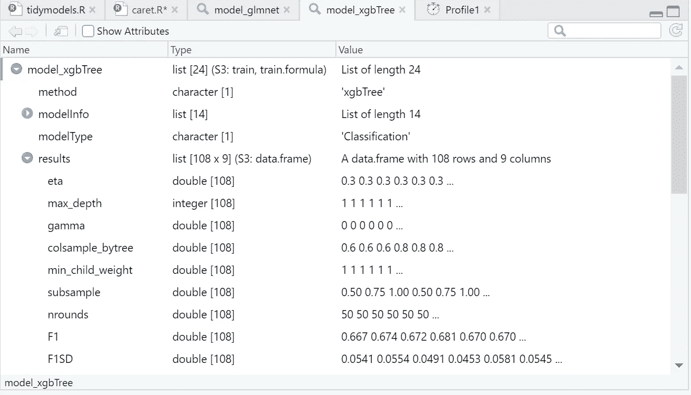

正如我们在上面的模型对象中看到的，XGBoost 有 108 个参数组合的调优结果，glmnet 有 9 个。这是 caret 自动选择的默认值，也是我之前为 tidymodels 指定相同调优大小的原因，以便在两者之间进行公平的比较。tidymodels 的调优结果与上面显示的 caret 的嵌套调优输出具有相似的结构，只是它们为我们提供了更多的性能指标。只需调用以下内容:

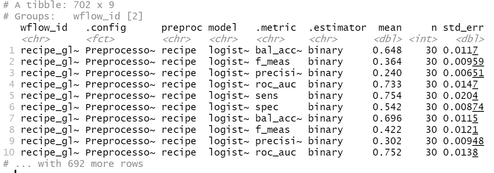

# 跟踪时间(可选)

在试验这两个框架时，我意识到与 caret 相比，tidymodels 中的调优过程要花费更多的时间。两个软件包都处理了大量的候选模型 XGBoost 的 108 个组合* 10 次折叠* 3 次重复= 3240 次迭代，glmnet 的 9 个组合* 10 次折叠* 3 次重复= 270 次迭代。不管怎样，这应该是非常占用 CPU 资源的，但是软件包是如何处理这个任务的呢？为了找到答案，我将每个训练命令打包到一个`system.time()`中，以测试时间差异。事实证明，caret 只需要 tidymodels 分配给调优的一小部分时间，**确切地说，大约 2%** 。虽然我们的 tidymodel 的`workflow_map()`命令花了 6 个多小时来运行，但 caret 在不到 8 分钟内完成了同样的任务。至少对于我的小实验来说，tidymodels 比 caret 慢 48 倍！如此巨大的差异。请注意，虽然这可能部分是由于我的旧机器，可能会略有不同，每次你跟踪时间。因此，我强烈建议您尝试具有这两个功能的[微基准](https://www.rdocumentation.org/packages/microbenchmark/versions/1.4-7/topics/microbenchmark)包:如果您有时间不止一次地评估这些功能，这应该会给您一个比`system.time()`更准确可靠的结果。然而，tidymodels 总体上似乎比 caret 慢得多的问题并不新鲜:Max Kuhn 认为食谱会减慢训练过程，因为所有预处理步骤都在每个重采样中重新应用。另一个可能的解释是 tidymodels 和 caret 在并行计算上的差异。


[尼克·王](https://unsplash.com/@nickwang14?utm_source=unsplash&utm_medium=referral&utm_content=creditCopyText)在 [Unsplash](https://unsplash.com/s/photos/thai-boxing?utm_source=unsplash&utm_medium=referral&utm_content=creditCopyText) 上的照片

# 决定你的获胜模型

为了找出哪种方法对我们的问题最有效，我们需要测量所有方法的性能。在我们的 tidymodels 示例中，我们保存了 model_race 中训练数据的所有调优结果。我们可以使用 group by 工作流来按模型类型收集指标。生成的 tibble 为我们提供了几个性能指标，这些指标是为模型计算的，每个模型都尝试我们网格中的特定超参数配置。在我们的例子中，它为每个工作流的每个性能指标提供了 10 次折叠 x 3 次重复= 30 个结果。现在我们可以运行 tidymodel 的 autoplot 来显示候选模型中的工作流性能排名。

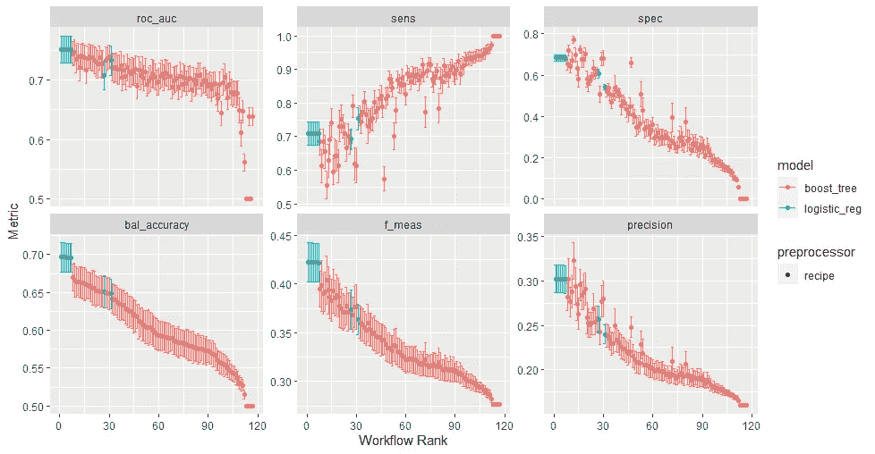

那么，我们的制胜模式是什么？该图显示，在所有指标中，逻辑回归(蓝色)在所有候选模型上都优于 XGBoost。为了用 caret 比较模型性能，我们使用了 resamples-函数。它为我们提供了所有 3 个折叠的 F1 值的范围，为我们提供了模型在不同样本上的表现的估计。通过使用`bwplot(resamples)`可视化该输出，我们可以看到性能如何跨褶皱分布，然后选择具有最高平均性能或最低性能差异的模型。与 tidymodels 不同，我们无法看到每个参数组合跨训练折叠的性能，但我们可以获得最佳超参数集的性能范围。即使该图表明 XGBoost 产生了稍好的性能，我们稍后将使用 glmnet 进行预测，以便与 tidymodels 的逻辑回归进行有效的比较。

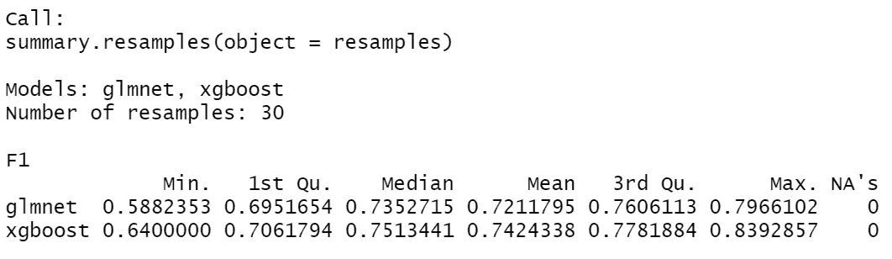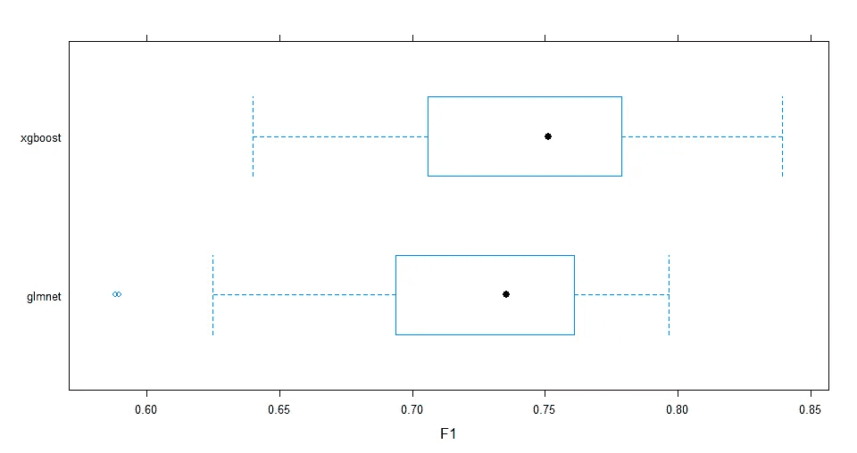

令人惊讶的是，与 tidymodels 相比，caret 通常提供更高的 F1 分数，尽管 MLmetrics 的 [F1_Score 函数](https://www.rdocumentation.org/packages/MLmetrics/versions/1.1.1/topics/F1_Score)以及码尺的 [f_meas()函数](https://yardstick.tidymodels.org/reference/f_meas.html)都计算了召回率和精确度之间的调和平均值，而没有对任何一个指标施加任何额外的权重(平衡的 F1 分数)。因此，性能上的差异不太可能是由于计算上的差异。从最好的方面来说，这种差异来自更有针对性的优化过程，因为 caret 训练我们的模型以保持尽可能高的 F1 分数。

尽管如此，我们还没有完成:对于 tidymodels，我们需要提交一个模型，然后适当地完成它。在这种情况下，我们从模型比较中提取所有 glmnet 候选模型。通过对 tidymodels 逻辑回归工作流的调优结果运行 select_best()，我们获得了 F1 得分最高的候选模型的性能指标。为了进一步提交这个模型，我们最终确定了获胜的工作流:我们从我们的模型竞赛中提取出`log_reg`工作流，该工作流具有一组在数值上工作得最好的超参数。这就是我们最终确定的工作流程:

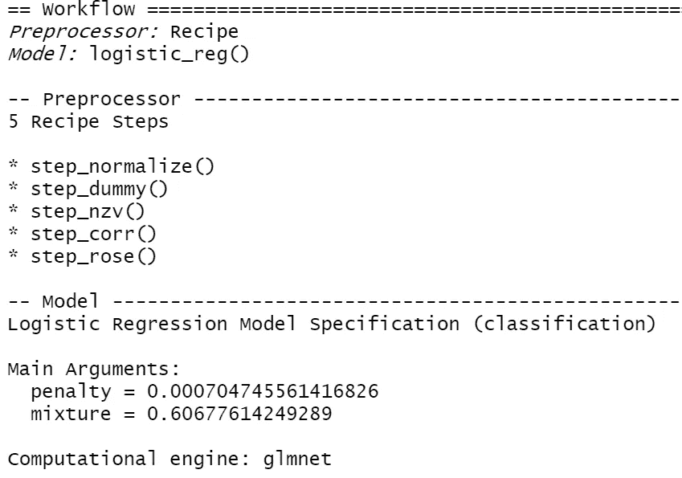

然而，如果我们查看 caret 的最终调优结果，我们会得到相同超参数的其他值，这可能是由于优化标准的差异:可能是因为 tidymodel 的 glmnet 模型没有明确训练为最大化 F1 值？

```
print(model_glmnet)
```

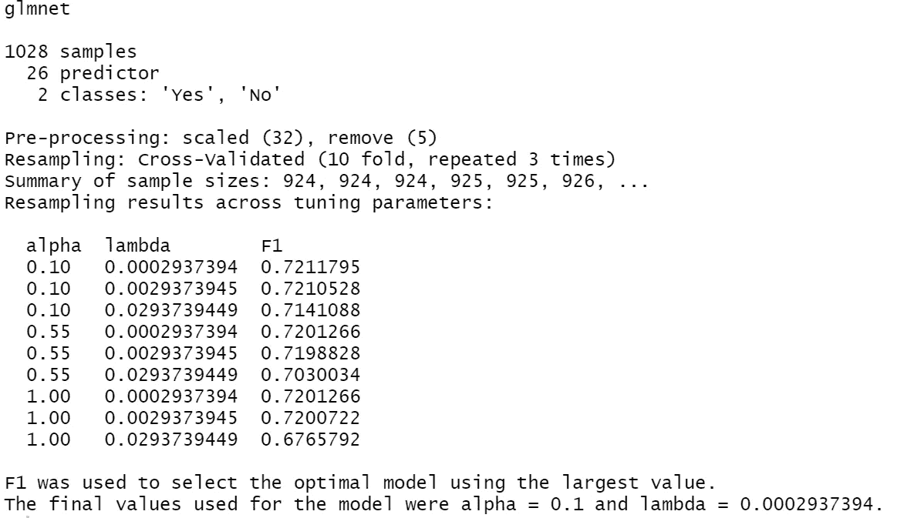

对于我们的 tidymodels 方法，我们使用我们最终确定的工作流程，并使其适合重新采样，以计算跨褶皱的性能指标。为此，我们可以使用`fit_resamples()`来评估不同数据层的模型性能。与使最终的工作流适合我们的整个训练集相比，重采样使我们更接近地估计模型在新样本上的表现。对于其性能的最终结论，我们还必须等待对测试数据的评估。下一步，我们使用`last_fit()`来生成最终的重采样结果，并根据测试数据进行评估。我们可以看看每个模型在训练数据上的表现，以证实这一观察结果。

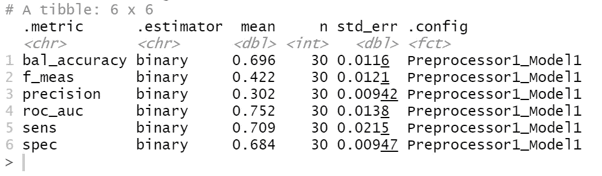

这个 last_fit 对象不仅包括最终的工作流以及我们的最终性能指标，还包含我们预测的一个很好的部分:预测的类、类概率和实际结果。它们嵌套在 last_fit 对象中，因此当我们将它们转换为 data.frame 时，我们可以可视化最终的预测。例如，我们可以绘制预测概率的密度分布图，用实际流失结果来着色(受茱莉亚·西尔奇的[帖子的启发)。](https://juliasilge.com/blog/xgboost-tune-volleyball/)

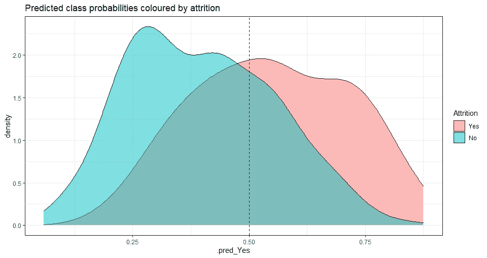

因为分布有相当多的重叠，所以在很多情况下，模型预测的两种结果(是/否)几乎是一样的。这也意味着在职员工和离职员工不容易区分，但我们的绩效指标显示，在大多数情况下，该算法对正确结果的分配概率略高。对于正面类，分类器必须已经检测到大多数真实离开者，但是也错误地将其中的大约 30 %留给了负面类(反之亦然)。如果我们从插入符号开始绘制预测，会发生什么？

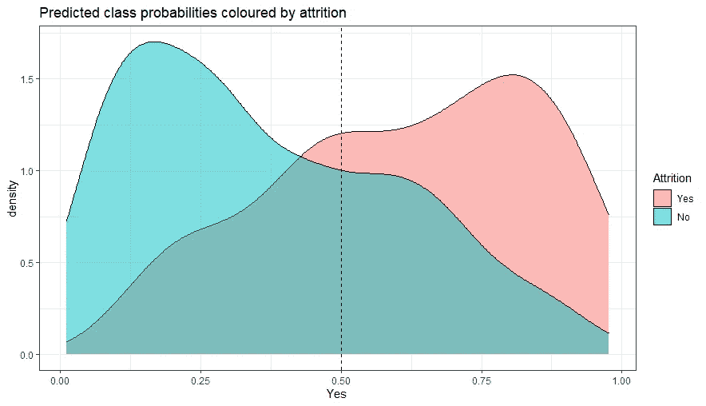

哇，看起来更多的真否定得到的流失概率接近于零，而分类器倾向于给实际离职的员工分配高流失概率。但它也错误地将大约三分之一的真阳性和真阴性进行了分类…这种表现如何转化为整个训练集？在训练数据上拟合模型之后，我们可以使用`predict()`进行预测。

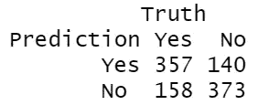

如假设的那样，在每一类中，大约 30%的数据被错误地分类，这也反映在相似的灵敏度(TPR)对特异性(TNR)的水平上。要为我们的脱字符分类器获得类似的信息，我们可以简单地调用`predict.train()`并使用我们的模型和训练数据作为输入，然后我们将预测包装在一个`ConfustionMatrix()`命令中。现在，我们对训练数据性能有了一个非常好的概述。

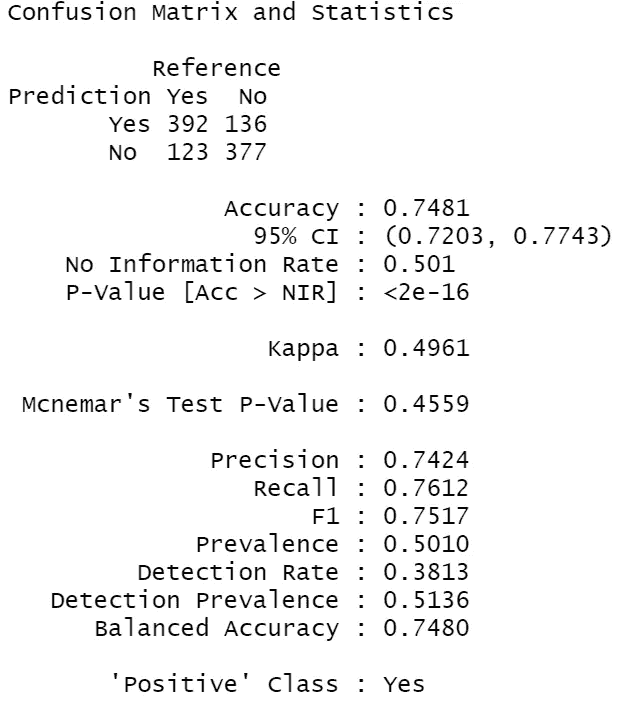

输出强调了我们的假设，caret 在区分积极类和消极类方面做得更好。此外，与 tidymodels 的输出相比，我们得到的假阴性要少得多，这表明召回率应该相对提高(76 %对 71 %)。

# 最后的倒计时:新样品的性能

我们已经足够聪明地保存了一些数据用于测试目的——现在是模型实际展示其预测技能的时候了！其原因是，在训练分类器的相同数据上评估性能会产生过度拟合的高风险:模型高度依赖于它最初训练的数据，因此在相同数据上计算的性能指标决不是独立的。为了挑战模型处理新观察的能力，我们需要用他们从未见过的数据来测试它。为了获得 tidymodels 测试数据的性能指标，为了方便起见，我们可以调用已经携带测试数据指标的 last_fit 对象。

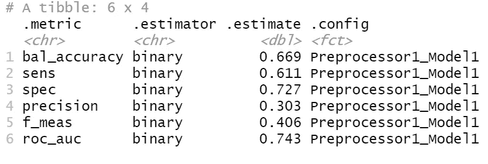

事实证明，对训练数据的估计确实高估了模型的性能，因为除了特异性之外，测试数据的所有指标都降低了一点(例如，0.61 对 0.71 的灵敏度)。这可以通过我们对测试数据的原始混淆矩阵得到进一步证实:

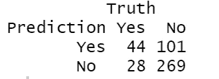

在 caret 中，我们可以简单地将模型和测试数据的目标列一起传递给`ConfusionMatrix()`，并获得一些性能指标。

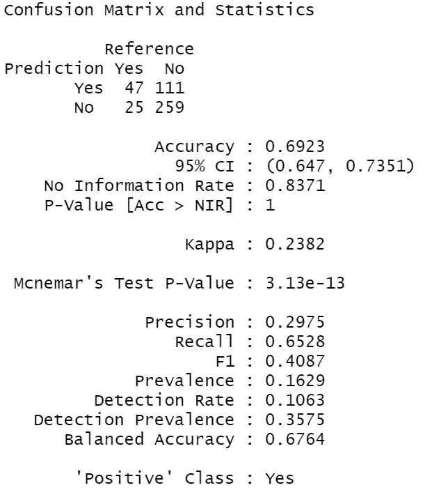

输出表明，同样的方法与 tidymodels 相比，性能又稍好一些，尽管差别可以忽略不计。总而言之，它再次显示了为测试保存一些数据以避免对模型的性能过于乐观是多么有意义。

# ROC 曲线，最后解释道

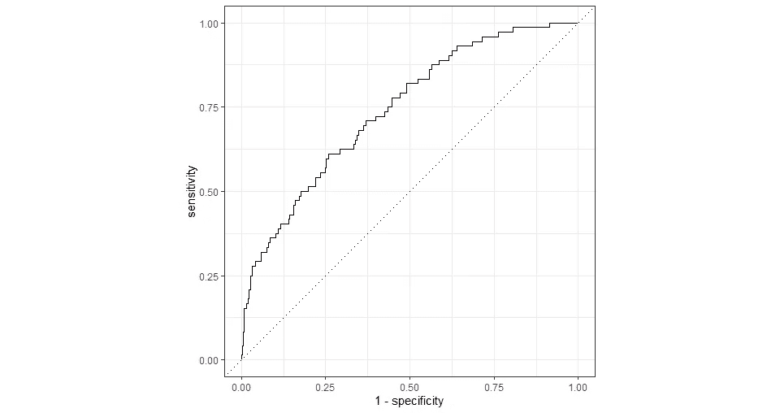

我们可以这样解释:直线越接近 90 度角，特异性越强，灵敏度越高。您可以将敏感度视为 1-FPR，因此这是模型将所有真阳性病例正确识别为阳性的概率(或真阳性率)。相反，特异性为 1 — FNR，因此它是模型将所有真阴性病例正确识别为阴性的概率(或真阴性率)。因为灵敏度是相对于 1-特异性绘制的，所以当高灵敏度伴随高特异性时，曲线下的面积增加。你可以把 ROC 曲线看作一种思维实验:当我们的敏感度为 0.75 时，1 的最佳可能值——特异性或假阳性率将为 0.00。在这种情况下，真阳性的检测将伴随着所有仍被识别为真阳性的阴性病例。想象一下，我们会有一个非常粗略的模型，将所有情况简单地分类为阳性:我们会有一个完美的灵敏度(TPR)，但一个可怜的特异性或 FPR，因为真正的阴性(例如，忠诚的员工)也会得到一个阳性标签。如果你也关心消极的情况，并想把它们和积极的情况区分开来，这就不好了。因此，敏感性越高，特异性低的风险就越高，反之亦然，由图上的虚线对角线表示。对于 tidymodels，0.75 的灵敏度伴随着 0.6 的特异性，这是一个不错的折衷。因此，随着我们的模型变得足够智能，能够检测出离职者(自然减员=是)，同时还能识别出在职员工(自然减员=否)，曲线下的面积会增加。

为了在我们的 caret 框架内制作一个类似的 ROC 曲线，我们可以使用[m level](https://www.r-bloggers.com/2019/11/how-to-easily-make-a-roc-curve-in-r/)为我们提供一系列与 ROC 相关的输出。总的来说，与我们的 tidymodels 输出相比，glmnet 的曲线下面积似乎稍大一些，并且两个框架之间的性能没有很大的差距。

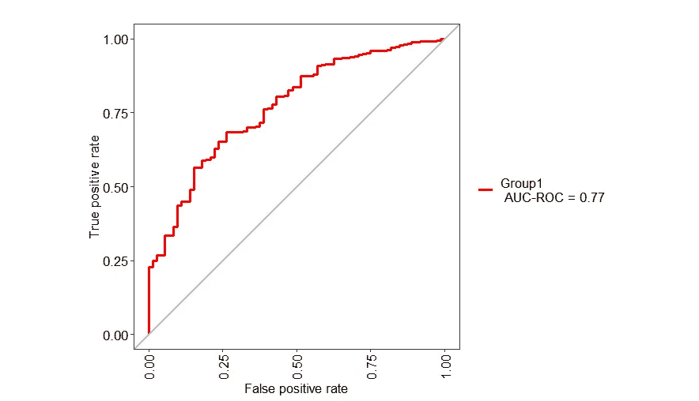

# 现在哪个包赢了这场战斗？

Tidymodels 具有很高的灵活性，因为它基于各种现代包，并具有完全可定制的工作流结构。这意味着在创建自己的机器学习项目时，你有很大的自由度。但是由于包含了如此多的步骤和对象，对于初学者来说肯定会有些困惑。在我自己的项目中，我觉得我对程序的功能有了更好的理解，因为我已经解决了很多错误信息，并在这个过程中学到了很多理论。但这也可能是因为 tidymodels 仍在开发中，因此还不稳定。如果你想快速简洁地解决你的预测问题，而不是建立一个大项目，我会向你推荐 caret。它不仅在运行时间方面更快，而且还有更多来自有经验用户的资源和解决的问题。Caret 适合许多模型，只需要很少的编码工作，同时由于并行处理而尽可能快。与 tidymodels 不同，自动为您选择跨重采样的最佳候选模型，这可能很简洁。有一点是肯定的:Max Kuhn 在设计这些包方面做得非常好，你很幸运有两个强大的开源包可供选择。


乔纳森·托马斯在 [Unsplash](https://unsplash.com/s/photos/boxing?utm_source=unsplash&utm_medium=referral&utm_content=creditCopyText) 上的照片

## **致谢**

我要特别感谢罗伯特·洛恩，一位来自挪威的顾问，他是我在这个项目中的智力陪练。我真的很喜欢我们的合作交流，我希望我们的学习之旅不会就此停止！

## 参考

[1] G. Harden，K. G. Boakye & S. Ryan，[技术专业人员的离职意向:一个社会交换理论的视角](https://www.tandfonline.com/doi/pdf/10.1080/08874417.2016.1236356?casa_token=W_ePRsglt_0AAAAA:Lck6e2Lk8CdIIi_HztsLzMIV0LQvTnlrwipTiv2yiOKuSmjT3SYiQojvuWEf8hKJiwLj8wde9EiF) (2018)，*计算机信息系统杂志*， *58* (4)，291–300。

[2] J .萨卡尔，[薪酬与离职挂钩:回顾与未来方向](https://www.researchgate.net/profile/Jeeta-Sarkar/publication/348690823_Linking_Compensation_and_Turnover_Retrospection_and_Future_Directions_Linking_Compensation_and_Turnover_Retrospection_and_Future_Directions/links/600b23c592851c13fe2d75f5/Linking-Compensation-and-Turnover-Retrospection-and-Future-Directions-Linking-Compensation-and-Turnover-Retrospection-and-Future-Directions.pdf) (2018)，*《IUP 组织行为学杂志》*， *17* (1)。

[3] P.C. Bryant & D. G. Allen，[薪酬、福利与员工流动:留住顶尖人才的人力资源战略](https://journals.sagepub.com/doi/full/10.1177/0886368713494342?casa_token=InXgPJ_OiJ4AAAAA:F5OHa6iN1k_EcxY3Po0NH9wCjzPNLJYr5VzscGQvSdJh1Hxfy7MN8uomtuoulZ4Ail-Wx6pqGZh0) (2013)，*薪酬&福利回顾*， *45* (3)，171–175。