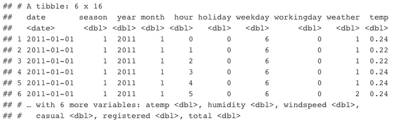
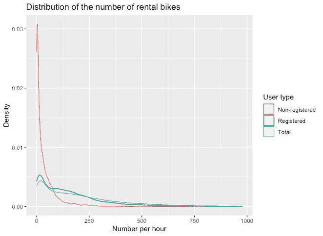
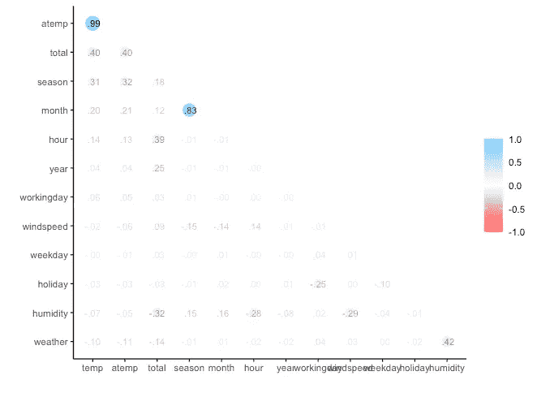
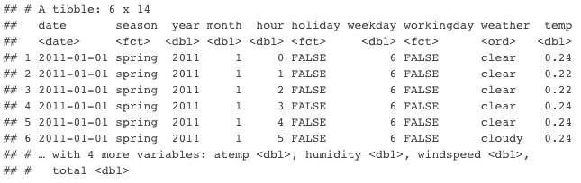

# Caret vs Tidymodels:如何将两个包都用于机器学习？

> 原文：<https://towardsdatascience.com/caret-vs-tidymodels-how-to-use-both-packages-together-ee3f85b381c?source=collection_archive---------15----------------------->

## [实践教程](https://towardsdatascience.com/tagged/hands-on-tutorials)

## 使用 R 中的两个流行包一起构建模型以预测自行车共享需求的示例


克里斯·巴尔巴利斯在 [Unsplash](https://unsplash.com?utm_source=medium&utm_medium=referral) 上拍摄的照片

Max Kuhn 构建了这两个包(有许多其他有才华的人的贡献)。`[caret](http://cran.r-project.org/web/packages/caret/index.html)`软件包(简称 **C** 分类 **A** 和 **RE** 回归 **T** raining)简化了创建预测模型的过程，已经成为 R 用户的首选。它已经存在很长时间了，并且有无数的资源、答案和所有可能问题的解决方案。另一方面，`[tidymodels](http://tidymodels.org)`是更新的，是建立在`tidyverse`原则之上的。RStudio 雇佣了 Max，打算设计一个整洁版的 caret。

我一直在使用`caret`进行预测建模。虽然我知道`tidymodels`，但我上周才开始探索。正如生活中的一切一样，采用新的生态系统需要时间和耐心。所以这篇文章绝不是详尽的分析。GitHub 上提供了[完整代码](https://github.com/yuenhsu/Machine-Learning-Projects)，并发布了[Markdown](https://yuenhsu.github.io/Machine-Learning-Projects/)的 HTML 版本。

# 概观

`caret`是一个单一的包，具有机器学习的各种功能。例如，`createDataPartition`用于拆分数据，`trainControl`用于设置交叉验证。

`tidymodels`是用于建模的包的集合。当我执行`library(tidymodels)`命令时，会加载以下包:

*   `rsample`:用于数据分割和重采样
*   `parsnip`:用于试用一系列型号
*   `recipes`:用于预处理
*   把所有的东西放在一起
*   `yardstick`:用于评估模型
*   `broom`:用于将通用统计 R 对象中的信息转换为用户友好、可预测的格式
*   `dials`:用于创建和管理调谐参数

一些来自`tidyverse`的常用库，比如`dplyr`，也是加载的。如图所示，`tidymodels`将机器学习工作流分解为多个阶段，并为每个阶段提供专门的包。这对于用户是有益的，因为增加了灵活性和可能性。然而，对于一个初学者来说，这可能是令人生畏的(至少对我来说是这样)。

# 输入数据

数据来自 UCI 知识库的[自行车共享数据集](https://archive.ics.uci.edu/ml/datasets/Bike+Sharing+Dataset)。目标是根据环境和季节设置预测自行车租赁数量`total`。

```
**library**(tidymodels) 
**library**(caret)
**library**(lubridate) 
**library**(tidyverse) 
**library**(moments) 
**library**(corrr) 
**library**(randomForest)
bike <- read_csv("Bike-Sharing-Dataset/hour.csv")
bike %>% dim()
*## [1] 17379    17*
```

有 17，379 个案例和 17 个特征。我删除了`instant`，更改了`year`的格式，并重命名了一些变量。

```
bike %>%
  mutate(instant = NULL, yr = yr + 2011) %>%
  rename(
    date = dteday,
    year = yr,
    month = mnth,
    hour = hr,
    weather = weathersit,
    humidity = hum,
    total = cnt
  ) ->
bike
head(bike)
```



数据框标题预览

# 浏览数据

## 目标变量

```
bike %>%
  pivot_longer(
    cols = c(casual, registered, total),
    names_to = "usertype",
    values_to = "count"
  ) %>%
  ggplot(aes(count, colour = usertype)) +
  geom_density() +
  labs(
    title = "Distribution of the number of rental bikes",
    x = "Number per hour", y = "Density"
  ) +
  scale_colour_discrete(
    name = "User type",
    breaks = c("casual", "registered", "total"),
    labels = c("Non-registered", "Registered", "Total")
  )
```



目标变量分布

租赁数量的分布是正偏态的。正态分布是可取的，因为大多数机器学习技术要求因变量是正态的。我稍后解决了偏斜问题。

## 相互关系

我使用了`corrr`包中的`correlated()`函数，它是`tidymodels`的一部分，但不会自动加载`library(tidymodels)`命令。我经常对整洁的生态系统中有多少包感到惊讶。通常，我优先考虑整洁的包而不是独立的包，因为管道的集成和美学上的一致性，`corrr`也不例外。

```
bike %>%
  select(where(is.numeric)) %>%
  correlate() %>%
  rearrange(absolute = FALSE) %>%
  shave() ->
  bike_cor
rplot(bike_cor, print_cor = TRUE)
```



相关图

# 准备数据

由于我还没有分割数据，这一步是*而不是*数据缩放或定心，这应该适合训练集并转换测试集。在这里，我将重点放在适用于所有数据且没有参数的过程上，例如因式分解或简单的数学计算。举个例子，如果我求一个数的平方根，我可以求它的平方来知道原来的数。然而，为了标准化，我需要知道变量的最小值和最大值，这两个值对于训练和测试可能是不同的。

## 目标变量

我关注于`total`计数，所以`casual`和`registered`变量被移动。如前所述，目标变量是正偏的，需要转换。我尝试了几种常见的技术来处理正偏斜的数据，并应用了偏斜度最低的技术——立方根。

```
bike_all <- bike %>%
  select(-casual, -registered)

*# Original*
skewness(bike_all$total)
*## [1] 1.277301*

*# Log*
skewness(log10(bike_all$total))
*## [1] -0.936101*

*# Log + constant*
skewness(log1p(bike_all$total))
*## [1] -0.8181098*

*# Square root*
skewness(sqrt(bike_all$total))
*## [1] 0.2864499*

*# Cubic root*
skewness(bike_all$total^(1 / 3))
*## [1] -0.0831688*

*# Transform with cubic root*
bike_all$total <- bike_all$total^(1 / 3)
```

## 预言者

根据 UCI 提供的属性信息，分类变量被转换为因子。

```
bike_all$season <- factor(
  bike_all$season,
  levels = c(1, 2, 3, 4),
  labels = c("spring", "summer", "autumn", "winter")
)
bike_all$holiday <- factor(
  bike_all$holiday,
  levels = c(0, 1), labels = c(FALSE, TRUE)
)
bike_all$workingday <- factor(
  bike_all$workingday,
  levels = c(0, 1), labels = c(FALSE, TRUE)
)
bike_all$weather <- factor(
  bike_all$weather,
  levels = c(1, 2, 3, 4),
  labels = c("clear", "cloudy", "rainy", "heavy rain"),
  ordered = TRUE
)
head(bike_all)
```



数据框标题预览

# 分割数据(培训/测试、交叉验证)

这两个包都提供了常见数据拆分策略的函数，比如 k-fold、分组 k-fold、留一和引导。但是`tidyverse`似乎更全面，因为它包括蒙特卡罗交叉验证(我不知道这是什么，但听起来很酷)和**嵌套交叉验证**。我特别强调了这种方法，因为一篇研究论文发现，“嵌套 CV 和训练/测试分割方法不管样本大小都可以产生稳健和无偏的性能估计。”(瓦巴拉等人，2019 年)

## 潮汐模型

tidymodels `rsample`库处理数据拆分。如图所示，进行训练和测试分割，并进行 10 重交叉验证。

```
set.seed(25)
split <- initial_split(bike_all, prop = 0.8)
train_data <- training(split)
train_data %>% dim()
*## [1] 13904    14*

test_data <- testing(split)
test_data %>% dim()
*## [1] 3475   14*

train_cv <- vfold_cv(train_data, v = 10)
```

## 脱字号

有两个选项可用:

*   使用`caret`的原生函数，比如`createDataPartition`。

```
set.seed(25)
train_index <- createDataPartition(
  bike_all$total, p = 0.8, times = 1, list = FALSE
)
train_data <- mics[ train_index, ]
test_data  <- mics[-train_index, ]

fold_index <- createFolds(
  train_data$total,
  k = 10, returnTrain = TRUE, list = TRUE
)
train_cv <- trainControl(method="cv", index = fold_index)
```

*   使用 tidymodels 的`rsample2caret`函数，该函数返回一个列表，该列表模拟了一个`trainControl`对象的`index`和`indexOut`元素。

```
train_cv_caret <- rsample2caret(train_cv)
ctrl_caret <- trainControl(
  method = "cv",
  index = train_cv_caret$index,
  indexOut = train_cv_caret$indexOut
)
```

两个包非常相似。有趣的是`trainControl`只指定了交叉验证策略而没有指定数据。尽管如此，由于来自`tidymodels`的`rsample2caret()`和`caret2rsample()`命令，在您喜欢的任何包中设置重采样都很容易。这里我使用`rsample2caret()`为`caret`生成 10 倍的索引，以确保两者的交叉验证是相同的。

# 预处理数据

在`caret`中，一个函数`preProcess`涵盖了数字特征的所有预处理，包括插补、定心、缩放和幂变换。对于分类特征，我可以使用`dummyVars`来创建虚拟变量，或者让`train`来处理模型训练期间的因素。我发现令人沮丧的一件事是我不能为不同的变量指定预处理。例如，我想使用 Box-Cox 变换来规范化一个极度偏斜的变量。但是，`preProcess`对所有预测值执行转换。如果你熟悉 Python 中的`sklearn`，我是说我想要`ColumnTransformer`。

## 潮汐模型

`recipes`实现了愿望，允许我定义一个配方或蓝图，可用于顺序定义数据的编码和预处理(即“特征工程”)。而且，`recipes`似乎提供了更多的预处理方法。然而，与`caret`不同的是，`recipes`不会自动处理分类变量，我需要手动创建虚拟变量。尽管如此，定制预处理的能力胜过了必须生成虚拟变量的小小不便。

```
prep_recipe <-
  recipe(total ~ ., data = train_data) %>%
  step_rm(year, month, weekday) %>%
  step_date(date) %>%
  step_corr(all_numeric(), threshold = 0.8) %>%
  step_dummy(all_nominal())
```

## 脱字号

同样，我可以使用 caret 的`preProcess()`函数。但我总是觉得很沮丧，因为所有的数值变量都要处理，没有太大的灵活性。

```
prep <- preProcess(cutoff = 0.8) 
```

同样，tidymodels' `recipe`可以用于插入符号。这里，我用`prep()`和`bake()`来转换数据，因为 caret 没有工作流功能。

```
train_data_caret <-
  prep(prep_recipe) %>% bake(new_data = NULL)

test_data_caret <-
  prep(prep_recipe) %>% bake(new_data = test_data)
```

# 火车模型

我稍后将使用两个自定义函数:

```
*# Generate prediction tables*
predict_table <- **function**(model, data, tidy_flag) {
  **if** (tidy_flag == TRUE) {
    result <- model %>%
      predict(data) %>%
      rename(pred = .pred) %>%
      mutate(
        actual = data$total,
        pred_real = pred^3,
        actual_real = actual^3
      )
  } **else** {
    result <- model %>%
      predict(data) %>%
      as_tibble_col(column_name = "pred") %>%
      mutate(
        actual = data$total,
        pred_real = pred^3,
        actual_real = actual^3
      )
  }
  result
}

*# Extract RMSE for models*
pull_rmse <- **function**(result_table) {
  rmse_result <- rmse(result_table, pred, actual) %>%
    pull(.estimate)
  rmse_result_real <- rmse(result_table, pred_real, actual_real) %>%
    pull(.estimate)
  result <- c(rmse = rmse_result, real_rmse = rmse_result_real)
}
```

## 基线

基线是`total`的平均值。

```
base_train_pred <-
  tibble(
    actual = train_data$total, 
    actual_real = train_data$total^3
) %>%
  mutate(pred = mean(actual), pred_real = mean(actual_real))base_test_pred <-
  tibble(
    actual = test_data$total, 
    actual_real = test_data$total^3
) %>%
  mutate(pred = mean(actual), pred_real = mean(actual_real))base_train_rmse <- pull_rmse(base_train_pred)
print(base_train_rmse) 
##       rmse  real_rmse 
##   2.032927 181.063306base_test_rmse <- pull_rmse(base_test_pred)
print(base_test_rmse) 
##      rmse real_rmse 
##   2.02608 182.61370
```

## 具有潮汐模型的决策树

`parsnip`用于建模，`workflow`用于油井工作流程，`tune`用于参数调整，`yardstick`用于性能指标。我也很好奇时间，所以我也记录了时间。

```
*# Cost complexity for decision tree parameter*
tree_cp <- seq(0.01, 0.1, 0.01)

set.seed(25)
tree_tidy_time1 <- Sys.time()

*# Specify model*
tree_engine <- 
  decision_tree(mode = "regression", cost_complexity = tune()) %>%
  set_engine("rpart")

*# Set workflow (Preprocess & model)*
tree_workflow <-
  workflow() %>%
  add_recipe(prep_recipe) %>% 
  add_model(tree_engine)

*# Tune parameters with cross-validation*
tree_tune <- tune_grid(
  tree_workflow,
  resamples = train_cv,
  grid = data.frame(cost_complexity = tree_cp),
  metrics = metric_set(rmse)
)

*# Fit again with the best parameter*
tree_best <-
  finalize_workflow(tree_workflow, select_best(tree_tune)) %>%
  fit(train_data)

tree_tidy_time2 <- Sys.time()
print(tree_tidy_time2 - tree_tidy_time1)
## Time difference of 1.376683 mins
```

交叉验证十个参数大约需要 1 分 20 秒。一旦完成，我就可以预测目标变量，并用 RMSE 检验模型性能。这里我使用自定义函数`predict_table`和`pull_rmse`来完成任务。

```
tree_tidy_train_pred <- predict_table(tree_best, train_data, TRUE)
tree_tidy_train_rmse <- pull_rmse(tree_tidy_train_pred)
print(tree_tidy_train_rmse) 
##       rmse  real_rmse 
##   1.078724 116.106006tree_tidy_test_pred <- predict_table(tree_best, test_data, TRUE)
tree_tidy_test_rmse <- pull_rmse(tree_tidy_test_pred)
print(tree_tidy_test_rmse) 
##       rmse  real_rmse 
##   1.074347 118.205989
```

## 带插入符号的决策树

```
set.seed(25)
tree_caret_time1 <- Sys.time()
tree_caret <- train(
  total~.,
  data = train_data_caret,
  method = "rpart",
  trControl = ctrl_caret,
  metric = "RMSE",
  tuneGrid = data.frame(cp = tree_cp)
)
tree_caret_time2 <- Sys.time()
print(tree_caret_time2 - tree_caret_time1) 
## Time difference of 4.469931 secs
```

哇哦！只需要 4.5 秒。而且，代码要短得多。`train`功能包括模型`method = "rpart"`，交叉验证`trControl = ctrl_caret`，参数整定`tuneGrid = data.frame(cp = tree_cp)`。

```
tree_caret_train_pred <- predict_table(tree_caret, train_data_caret, FALSE)
tree_caret_train_rmse <- pull_rmse(tree_caret_train_pred)
print(tree_caret_train_rmse) 
##       rmse  real_rmse 
##   1.078724 116.106006tree_caret_test_pred <- predict_table(tree_caret, test_data_caret, FALSE)
tree_caret_test_rmse <- pull_rmse(tree_caret_test_pred)
print(tree_caret_test_rmse) 
##       rmse  real_rmse 
##   1.074347 118.205989
```

## 比较模型

```
rbind(
  base_train_rmse, base_test_rmse,
  tree_tidy_train_rmse, tree_tidy_test_rmse,
  tree_caret_train_rmse, tree_caret_test_rmse
)##                           rmse real_rmse
## base_train_rmse       2.032927  181.0633
## base_test_rmse        2.026080  182.6137
## tree_tidy_train_rmse  1.078724  116.1060
## tree_tidy_test_rmse   1.074347  118.2060
## tree_caret_train_rmse 1.078724  116.1060
## tree_caret_test_rmse  1.074347  118.2060
```

如您所见，不管库是什么，决策树模型的结果都是相同的，因为我以相同的方式分割了数据并设置了交叉验证。此外，tidymodels 和 caret 都使用`rpart`作为底层引擎。因此，tidymodels 运行决策树需要 1 分多钟，而 caret 只需要 4-5 秒，这似乎很奇怪。

# 结论

我已经使用 tidymodels 几个星期了，我真的很喜欢集成到 tidyverse 中。但是我发现这么多的步骤和对象让我很困惑。例如，我一直试图从工作流对象中获取 RMSE。我可能需要多一点时间来熟悉新的生态系统。

GitHub 上提供了[完整代码](https://github.com/yuenhsu/Bike-Sharing)，并发布了[Markdown](https://yuenhsu.github.io/Bike-Sharing/)的 HTML 版本。一如既往，我希望这个帖子是有帮助的。祝你有美好的一天！

## 参考

Vabalas，a .，Gowen，e .，Poliakoff，e .，和 Casson，A. J. (2019)。有限样本下的机器学习算法验证。 *PloS one* ， *14* (11)，e0224365。