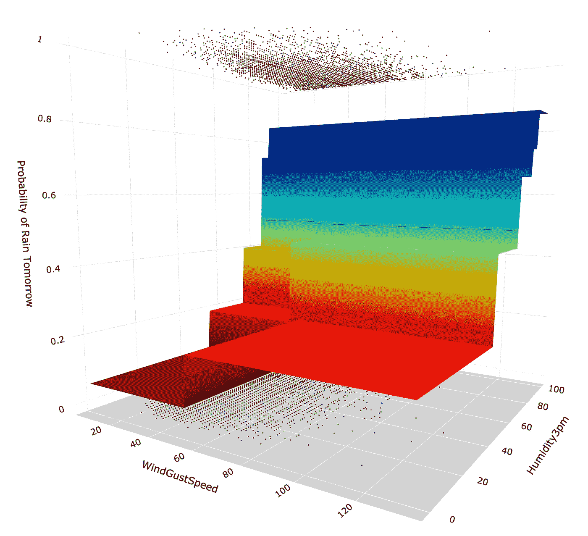

# CART:清晰而强大的模型的分类和回归树

> 原文：<https://towardsdatascience.com/cart-classification-and-regression-trees-for-clean-but-powerful-models-cc89e60b7a85?source=collection_archive---------0----------------------->

## [入门](https://towardsdatascience.com/tagged/getting-started)，机器学习

## CART 算法是如何工作的，如何在 Python 中成功使用？


购物车模型预测图面。在本文结尾的 Python 部分，可以看到图表是如何制作的。图片由[作者](https://solclover.medium.com/)提供。

# **简介**

如果你想成为一名成功的数据科学家，了解不同的机器学习算法是如何工作的是至关重要的。

这个故事是解释每个算法的细微差别的系列的一部分，并提供了一系列 Python 示例来帮助您构建自己的 ML 模型。更不用说一些很酷的 3D 可视化！

# **故事涵盖以下主题:**

*   CART 所属的算法类别
*   关于 CART 算法如何工作的解释
*   关于如何构建购物车决策树模型的 Python 示例

# 【CART 属于哪一类算法？

顾名思义，CART(分类和回归树)既可以用于分类问题，也可以用于回归问题。区别在于目标变量:

*   利用**分类**，我们试图预测一个类别标签。换句话说，分类用于输出(目标变量)取一组有限值的问题，例如，明天是否会下雨。
*   同时，**回归**用于预测数字标签。这意味着您的输出可以采用无限多的值，例如，房价。

这两种情况都属于机器学习算法的监督分支。

> 旁注，由于神经网络独特的机器学习方法，我已经将它们归为一类。然而，它们可以用于解决广泛的问题，包括但不限于分类和回归。下图是**交互式**，请务必点击👇在不同的类别上对**进行放大并展示更多的**。

机器学习算法分类。由[作者](https://solclover.com/)创建的互动图表。

***如果你也热爱数据科学和机器学习*** *，请* [*订阅*](https://bit.ly/3uZqsQA) *每当我发布新故事时，你都会收到一封电子邮件。*

虽然在这个故事中，我把重点放在 CART 分类上，但是回归案例非常相似，只是使用了不同的方法来计算树中的最佳分裂。

# **分类和回归树是如何工作的？**

## **示例**

让我们从一个简单的例子开始。假设你有一堆贴有标签的橙子和曼德拉草，你想找出一套简单的规则，将来可以用它来区分这两种水果。


Philippe Gauthier 在 [Unsplash](https://unsplash.com?utm_source=medium&utm_medium=referral) 上拍摄的照片

通常，橙子(直径 6-10 厘米)比橘子(直径 4-8 厘米)大，因此您的算法找到的第一条规则可能基于大小:

*   直径≤ 7cm。

接下来，你可能会注意到橘子的颜色比橙子略深。因此，您使用色标(1 =暗到 10 =亮)来进一步分割您的树:

*   子树左侧的颜色≤5
*   子树右侧的颜色≤6

你的最终结果是一个由 3 个简单规则组成的树，帮助你在大多数情况下正确区分橙子和橘子:


识别橙子和橘子的决策树。图片由[作者](https://solclover.medium.com/)提供。

## 【CART 如何找到最佳分割？

CART 中可以使用几种方法来确定最佳拆分。以下是分类树中最常见的两种:

## 基尼杂质


```
where p_i is the fraction of items in the class i. 
```

以上面的树为例，最左边的叶节点的 Gini 杂质是:

```
1 - (0.027^2 + 0.973^2) = 0.053
```

为了找到最佳分割，我们需要计算两个子节点的基尼系数的加权和。我们对所有可能的分割都这样做，然后将具有最低基尼系数杂质的分割作为最佳分割。


计算基尼系数。图片由[作者](https://solclover.medium.com/)提供。

> **重要提示:**如果两个子节点的最佳加权 Gini 杂质**不低于父节点的 Gini 杂质**，则不应再进一步拆分父节点。

## 熵

熵值法与基尼系数法基本相同，只是使用了一个略有不同的公式:


要确定最佳分割，您必须遵循上述所有相同的步骤。具有最低熵的分裂是最好的分裂。类似地，如果两个子节点的熵不低于一个父节点的熵，就不应该再进一步拆分了。

[](https://solclover.com/membership)[](https://www.linkedin.com/in/saulius-dobilas/)

# **如何用 Python 建立 CART 决策树模型？**

我们将构建几个分类决策树，并使用树形图和 3D 表面图来可视化模型结果。首先，让我们做一些基本的设置。

## **设置**

我们将使用以下数据和库:

*   来自卡格尔的澳大利亚天气数据
*   [Scikit-learn 库](https://scikit-learn.org/stable/index.html)，用于将数据拆分为[训练测试](https://scikit-learn.org/stable/modules/generated/sklearn.model_selection.train_test_split.html?highlight=train_test_split#sklearn.model_selection.train_test_split)样本，构建[大车分类模型](https://scikit-learn.org/stable/modules/generated/sklearn.tree.DecisionTreeClassifier.html#sklearn-tree-decisiontreeclassifier)，以及[模型评估](https://scikit-learn.org/stable/modules/generated/sklearn.metrics.classification_report.html?highlight=classification_report#sklearn.metrics.classification_report)
*   [Plotly](https://plotly.com/python/) 用于数据可视化
*   用于数据操作的[熊猫](https://pandas.pydata.org/docs/)和 [Numpy](https://numpy.org/)
*   [Graphviz 库](https://graphviz.readthedocs.io/en/stable/manual.html)绘制决策树图形

让我们导入所有的库:

然后我们从 Kaggle 获取澳大利亚的天气数据，你可以按照这个链接下载:[https://www . ka ggle . com/jsphyg/weather-dataset-rattle-package](https://www.kaggle.com/jsphyg/weather-dataset-rattle-package)。

一旦你在你的机器上保存了数据，用下面的代码接收它。请注意，我们还做了一些简单的数据操作，并派生了一些新的变量供以后在我们的模型中使用。


一小段 [Kaggle 的澳大利亚天气数据](https://www.kaggle.com/jsphyg/weather-dataset-rattle-package)做了一些修改。图片来自[作者](https://solclover.medium.com/)。

为了减少重复代码的数量，我们将创建几个可以在整个分析中重用的函数。

第一个函数执行以下操作:

*   将数据分为训练样本和测试样本
*   符合模型
*   预测测试集上的标签
*   生成模型性能评估指标
*   创建决策树图

第二个函数将用于绘制带有测试数据和模型预测表面的 3D 散点图:

## 使用基尼杂质的 CART 分类模型

我们的第一个模型将使用所有可用的数值变量作为模型特征。同时，**raintomorowflag**将成为所有模型的目标变量。

注意，在写 sklearn 的 [**树的时候。DecisionTreeClassifier()**](https://scikit-learn.org/stable/modules/generated/sklearn.tree.DecisionTreeClassifier.html#sklearn-tree-decisiontreeclassifier)**只能以数值变量为特征。但是，您也可以使用分类值，只要您使用编码算法对它们进行编码，例如 [**sklearn 的顺序编码器**](https://scikit-learn.org/stable/modules/generated/sklearn.preprocessing.OrdinalEncoder.html) 或任何其他合适的方法将分类值转换为数值。**

**让我们使用我们的 ***拟合*** 函数来构建模型，树深度限制为 3，最小叶子大小为 1000 个观察值。限制树的深度和叶子的大小有助于我们避免过度拟合。在后面的例子中，我们将会看到一旦我们移除了一些约束，树的复杂度会增加多少。**

**下面是 ***拟合*** 函数生成的输出:**

****

**模型 1 —购物车模型性能指标。图片由[作者](https://solclover.medium.com/)提供。**

**我们可以看到，该模型在预测干旱天数方面表现相对较好。然而，在预测雨天时，性能较差，测试数据的精度为 0.76，召回率为 0.34。**

*   **精度意味着在模型预测的 76%的情况下明天会下雨。**
*   **同时，**召回**意味着对于测试数据中的所有雨天，模型只识别了其中的 34%。**

**这两个类别标签的性能差异主要是由数据的不平衡造成的，干旱天比雨天多得多。**

**接下来，我们来看看由我们的 ***拟合*** 函数生成的**树形图**:**

****

**模型 1 —购物车模型决策树。图片由[作者](https://solclover.medium.com/)提供。**

**从上面可以看出，虽然该算法使用了几种不同的特征，但两个最重要的特征是“湿度 3pm”和“风速”，因为这是唯一两个影响分类标签预测为 0 或 1 的特征。**

**因此，我们可以通过减少特征的数量来创建一个具有相似性能的模型，如下例所示。**

## **使用基尼杂质和 2 个特征的 CART 分类模型**

**让我们再次使用我们的 ***拟合*** 函数:**

**模型性能指标:**

****

**模型 2 —购物车模型性能指标。图片由[作者](https://solclover.medium.com/)提供。**

**正如所料，该模型的性能与第一个模型相同。但是，让我们来看看决策树是如何变化的:**

****

**模型 2—购物车模型决策树。图片由[作者](https://solclover.medium.com/)提供。**

**因此，虽然树在不同的地方是不同的，关键的分裂仍然是相同的。**

**最好的事情是，我们可以创建一个 3D 图表来可视化预测平面，因为我们只使用了两个输入要素。这就是第二个功能， ***Plot_3D，*** 派上了用场:**

****

**模型 2-CART 模型预测表面。图片由[作者](https://solclover.medium.com/)提供。**

**注意，顶部的黑点是 class=1(明天下雨)的实例，底部的黑点是 class=0(明天不下雨)的实例。同时，表面是基于模型预测的明天下雨的概率。最后，图中间的细线是概率=0.5，表示决策边界。**

**不足为奇的是，预测平面看起来像一组楼梯。这是因为预测概率遵循用于分割树节点的特定值的阶跃变化。例如，最低降雨概率(底部阶梯-暗红色)以“湿度 3pm = 51.241”和“风速= 53.0”为界**

## **树深度无限制的 CART 分类模型**

**现在让我们看看当我们不限制树的深度时会发生什么。我们再次使用我们的 ***拟合*** 函数:**

**以下是最终的模型性能:**

****

**模型 3—购物车模型性能指标(具有最大深度)。图片由[作者](https://solclover.medium.com/)提供。**

**决策树(注意，为了更好地适应页面，该树已被旋转):**

****

**模型 3 —购物车模型决策树(具有最大深度)。图片由[作者](https://solclover.medium.com/)提供。**

**最后，3D 图形:**

****

**模型 3-CART 模型预测表面(具有最大深度)。图片由[作者](https://solclover.medium.com/)提供。**

**如您所见，由于对树深度没有限制，该算法创建了一个更加复杂的树，这可以在树图和 3D 预测表面上的“步骤”数量中看到。同时，模型的性能只是略微好一点(精确度=0.83)。**

**无论何时构建决策树模型，都应该仔细考虑复杂性和性能之间的权衡。在这个具体的例子中，性能的微小提高不值得额外的复杂性。**

## **其他要探索的东西**

**有许多方法可以进一步微调您的购物车模型。举几个例子:**

*   **你可以将“基尼”改为“熵”,使用基于熵的算法建立一个模型。**
*   **您可以使用“随机”拆分器，而不是“最佳”拆分器“最佳”总是选择重要性最高的特征来产生下一个分割。同时，“随机”将选择一个随机的特征(尽管被特征重要性分布加权)。**
*   **如上所述，您可以更改树的最大允许深度。**
*   **您可以调整“class_weight”(在我们的 ***拟合*** 函数中命名为 ***clweight*** )，方法是传递一个带有每个类权重的字典，或者简单地为算法输入“balanced”以使用权重来平衡类样本。**
*   **最后，你也可以尝试调整最小叶片尺寸。**

# ****结论****

**CART 是一个强大的算法，与其他 ML 方法相比，它也相对容易解释。它不需要太多的计算能力，因此允许您非常快速地建立模型。**

**虽然您需要小心不要过度拟合您的数据，但对于简单的问题，这是一个很好的算法。如果你想提高你的模型的性能和健壮性，你也可以探索集合方法，比如一个 [**随机森林**](/random-forest-models-why-are-they-better-than-single-decision-trees-70494c29ccd1) **。****

**和往常一样，如果你喜欢学习决策树，或者有任何问题或建议，请给我写信。**

**干杯👏
**索尔·多比拉斯****

*****如果你已经花光了这个月的学习预算，下次请记得我。*** *我的个性化链接加入媒介是:***

**<https://solclover.com/membership> ** 

**您可能感兴趣的其他分类算法:**

**</random-forest-models-why-are-they-better-than-single-decision-trees-70494c29ccd1>  </gradient-boosted-trees-for-classification-one-of-the-best-machine-learning-algorithms-35245dab03f2>  </xgboost-extreme-gradient-boosting-how-to-improve-on-regular-gradient-boosting-5c6acf66c70a> **