# 案例研究 Olist Brazillian 数据集上的客户满意度预测

> 原文：<https://towardsdatascience.com/case-study-1-customer-satisfaction-prediction-on-olist-brazillian-dataset-4289bdd20076?source=collection_archive---------8----------------------->

## *解决分类问题*


[皮卡伍德](https://unsplash.com/@pickawood?utm_source=medium&utm_medium=referral)在 [Unsplash](https://unsplash.com?utm_source=medium&utm_medium=referral) 上的照片

企业总是试图让客户群参与进来，并对他们提供的服务感到满意。为了在行业中保持相关性，他们需要将最新的技术进步融入到他们的服务中。十多年前，互联网还是一个全新的事物，各行各业都试图利用这项技术的能力，轻松地充当各种企业及其客户之间的沟通媒介。在这十年里，各行各业开始提供迎合每个客户个人需求的服务。对于这样的服务，他们需要利用人工智能的力量。在这个案例研究中，我们将探索这项技术的一个方面。本案例研究分为以下几个部分

*   **商业问题**
*   **商业问题的 ML 公式化**
*   **基础数据分析**
*   **业务约束**
*   **绩效指标**
*   **数据描述**
*   **探索性数据分析**
*   **特色工程**
*   **机器学习**
*   **未来工作**
*   **链接**
*   **参考文献**

# **业务问题**

Olist store 是一家电子商务企业，总部位于巴西圣保罗。这家公司是各种小企业和希望购买他们产品的顾客之间的唯一联系点。最近，他们在 Kaggle 上上传了一个 [**数据集，其中包含了 2016 年至 2018 年间在多个市场所做的 10 万份订单的信息。我们在电子商务网站上购买的东西会受到我们在该网站上读到的关于该产品的评论的影响。这家公司当然可以利用这些评论来删除那些一直收到负面评论的产品。它也可以为那些受顾客欢迎的商品做广告。此案例研究的源代码可在**](https://www.kaggle.com/olistbr/brazilian-ecommerce) **[**此处**](https://github.com/Ashcom-git/case-study-1) 获得。**

# **ML 公式化的商业问题**

我们看到的是一个五星评级系统，它总结了顾客对他或她刚刚购买的产品的总体满意度。我们可以把这方面转化为一个二元分类问题，把 4 星和 5 星的评分作为正类，其余的作为负类。

# 基础数据分析

我们得到了多个表和一个描述这些表如何连接的模式。在合并所有的表之后，我们分析整个数据集。它包含多个分类和数字列。在将给定的 5 星评级转换为二进制后，我们看到正面类占据了数据集的 76%，剩余部分由负面类填充。这意味着数据集严重失衡。根据销售记录，家具装饰、美容产品和运动器材是最受欢迎的类别。据了解，顾客平均花费约 125 巴西雷亚尔从该网站购买产品。在分析客户的州分布时，我们可以看到大多数订单是由位于圣保罗的客户下的。大多数商品的运费是合理的。这可能是许多人对产品总体满意的原因。大多数交易都是用信用卡进行的。

# **业务约束**

负面评论较少，但也很重要。我们应该确保较少数量的负面评论被归类为正面评论。这意味着我们需要尽量减少误报的数量。完成这项任务不需要任何延迟限制。

# **绩效指标**

混淆矩阵用于洞察模型产生的错误类型。减少假阳性的数量需要精确度，减少假阴性的数量需要召回。这就是我们将使用宏观 F1 分数作为衡量标准的原因。

# 数据描述

当您查看解释数据库连接的示意图时，您会发现有八个表。这些表格的说明如下

1) **olist_orders_dataset** :这个表连接到另外 4 个表。它用于连接与订单相关的所有详细信息。
2)**olist _ order _ items _ dataset**:它包含已购买商品的详细信息，如发货日期、价格等。
3)**olist _ order _ reviews _ dataset**:它包含与客户对他所购买的特定产品发表的任何评论相关的详细信息。
4)**olist _ products _ dataset**:包含与产品相关的 ID、类别名称、尺寸等。
5)**olist _ order _ payments _ dataset**:此表中包含的信息与特定订单的付款细节相关。
6)**olist _ customers _ dataset**:详细描述该公司的客户群信息。
7)**olist _ geolocation _ dataset**:包含卖家和客户双方的地理信息。
8)**olist _ sellers _ dataset**:这个表包含了所有在这个公司注册的卖家的相关信息。

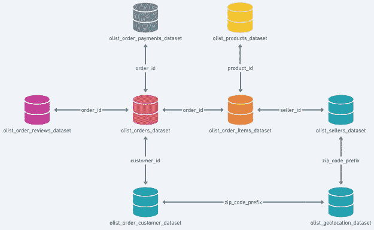

数据库模式

所有这些表都使用主键和外键连接。我们将连接所有单独的 CSV 文件来创建一个大表。所有这些关键字都以后缀“id”或“prefix”结尾。

# 探索性数据分析

由于该数据集基于巴西的一家电子商务公司，因此流通区域很可能是巴西及其邻国。这就是为什么我们将采用南美大陆的绘图，并使用地理定位数据集中提到的地理数据来直观地描述订单的地理位置。

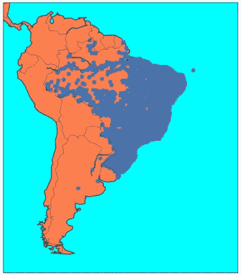

南美洲地理地图

正如您在地图上看到的，大多数客户位于巴西。为了进一步分析，我们将不使用地理定位数据集。这就是为什么它不会被添加到主数据帧中。

```
order_items_products = pd.merge(order_items_dataset,products_dataset,on='product_id')
order_items_products_sellers = pd.merge(order_items_products,sellers_dataset,on='seller_id')
two_order_items_products_sellers = pd.merge(order_items_products_sellers,orders_dataset,on='order_id')
two_order_items_products_sellers_customer = pd.merge(two_order_items_products_sellers,customers_dataset,on='customer_id')
two_order_items_products_sellers_customer_reviews = pd.merge(two_order_items_products_sellers_customer,order_reviews_dataset,on='order_id')
final_dataframe = pd.merge(two_order_items_products_sellers_customer_reviews,order_payments_dataset,on='order_id')
```

有些观察结果可能会重复。这些都是多余的，这就是为什么我们需要删除它们。我们将从数据集中删除那些具有相同订单 ID、客户 ID、购买时间戳和评论的观察。这是因为客户不能在同一时间对同一产品多次发布相同的评论。注意，充当主键和外键的所有 ID 值都是惟一的。我们找不到这种行的模式，因此，我们将删除它们。

不可能估算日期时间数据。这就是为什么我们应该删除任何日期时间列中包含空值的那些行。在解析 datetime 列时，我们提取日期信息并使用它创建两个额外的列。“采购交付差异”列给出了采购和交付之间的天数。“预计实际交货差异”栏给出了交货所需的延迟或缩短的天数。

```
intermediate_time = final_dataframe['order_delivered_customer_date'].apply(lambda x: datetime.strptime(x, "%Y-%m-%d %H:%M:%S").date()) - final_dataframe['order_purchase_timestamp'].apply(lambda x: datetime.strptime(x, "%Y-%m-%d %H:%M:%S").date())
final_dataframe['purchase-delivery difference'] = intermediate_time.apply(lambda x:x.days)intermediate_time = final_dataframe['order_estimated_delivery_date'].apply(lambda x: datetime.strptime(x, "%Y-%m-%d %H:%M:%S").date()) - final_dataframe['order_delivered_customer_date'].apply(lambda x: datetime.strptime(x, "%Y-%m-%d %H:%M:%S").date())
final_dataframe['estimated-actual delivery difference'] = intermediate_time.apply(lambda x:x.days)
```

现在让我们尝试估算其他类型的列。对于分类栏，我们将使用该栏的模式，对于数字栏，我们将使用该栏的中位数进行插补。对于评论的评论和标题，我们使用术语“in deponível ”,这是英语术语“unavailable”的葡萄牙语翻译。

```
final_dataframe['product_category_name'].fillna(value=final_dataframe['product_category_name'].mode()[0], inplace=True)
final_dataframe['product_name_lenght'].fillna(value=final_dataframe['product_name_lenght'].mode()[0], inplace=True)
final_dataframe['product_description_lenght'].fillna(value=final_dataframe['product_description_lenght'].median(), inplace=True)
final_dataframe['product_photos_qty'].fillna(value=final_dataframe['product_photos_qty'].mode()[0], inplace=True)
final_dataframe['product_weight_g'].fillna(value=final_dataframe['product_weight_g'].mode()[0], inplace=True)
final_dataframe['product_length_cm'].fillna(value=final_dataframe['product_length_cm'].mode()[0], inplace=True)
final_dataframe['product_height_cm'].fillna(value=final_dataframe['product_height_cm'].mode()[0], inplace=True)
final_dataframe['product_width_cm'].fillna(value=final_dataframe['product_width_cm'].mode()[0], inplace=True)
final_dataframe['review_comment_message'].fillna(value='indisponível', inplace=True)
```

我们的目标是将这个案例研究转化为一个二元分类任务。为此，我们需要创建一个包含标签的新列。评分大于 3 的值被标记为正值，而评分小于或等于 3 的值被标记为负值。

```
final_dataframe['review_score'] = final_dataframe['review_score'].apply(lambda x: 1 if x > 3 else 0)
```

在绘制显示标签的饼图时，我们看到正类占据了整个数据集的 77.60%；而消极阶层仅占 22.40%。这表明整个数据集是不平衡的。

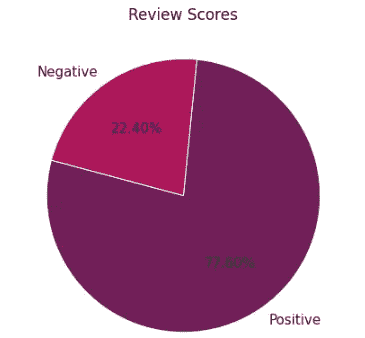

有些列只包含数字数据。这意味着找到这些列的基本统计信息是我们可以尝试的一件事。请注意,“价格”和“产品长度描述”列的平均值和中值之间存在显著差异。

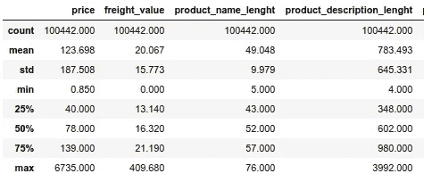

前 4 列的基本统计数据

让我们创建一个名为“价格类别”的新列。该列用于根据价格将商品分类为昂贵、便宜和实惠。我们使用第一、第二和第三四分位数作为创建这些类别的条件。

```
final_dataframe['price_category'] = final_dataframe['price'].apply(lambda x:'expensive' if x>=139 else ('affordable' if x>=40 and x<139 else 'cheap'))
```

我们现在根据购买频率找到了前 12 个最受欢迎的产品类别。“床浴桌”类别明显比大多数其他类别更受欢迎。这是唯一一个销量超过 10000 件的品类。排在第 12 位的类别“园艺工具”仅售出约 3600 件。

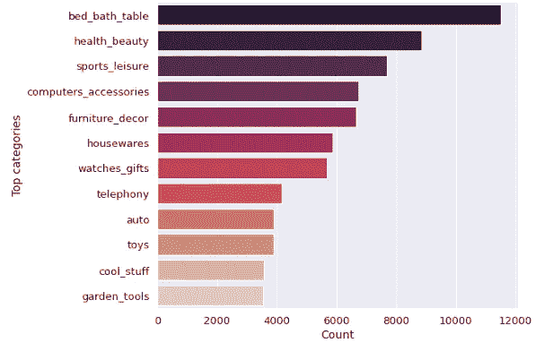

圣保罗，也简称为“SP ”,是这家公司客户基础最大的州。这可能是因为该公司的总部设在圣保罗，更多的客户了解这个网站，由于他们在这个地区的营销策略。2016 年至 2018 年间，圣保罗售出了超过 4 万辆汽车。

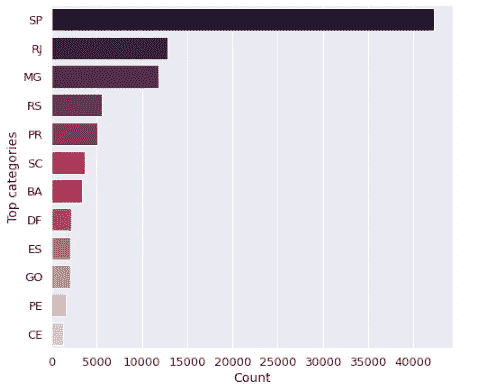

当我们检查每个产品类别的定价时，我们可以看到属于“计算机”类别的产品的平均成本最高。平均费用在 1150 雷亚尔左右。第二高的品类，均价接近最高品类的一半。

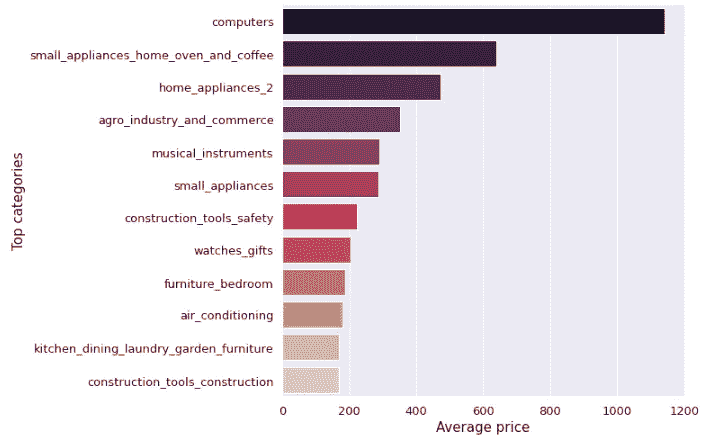

对于这个图，我们考虑了一个项目的总平均成本。这意味着它是运费和项目原始成本的总和。我们可以看到情节的顺序没有改变。只是每个品类的平均成本都增加了。

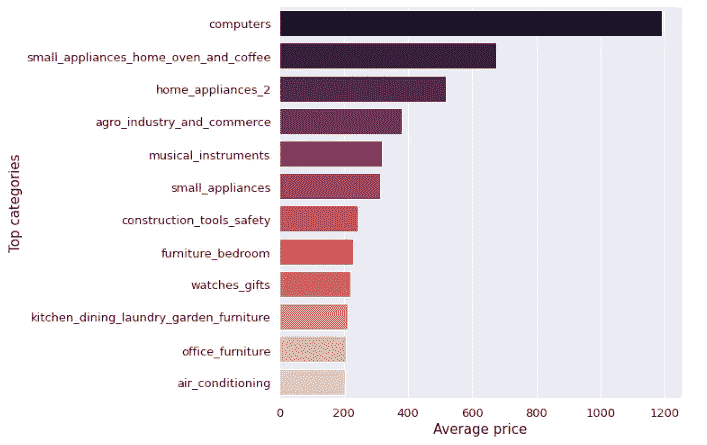

我们现在正在寻找产生最高收入的城市。名为“皮安科”的城市位于顶部。

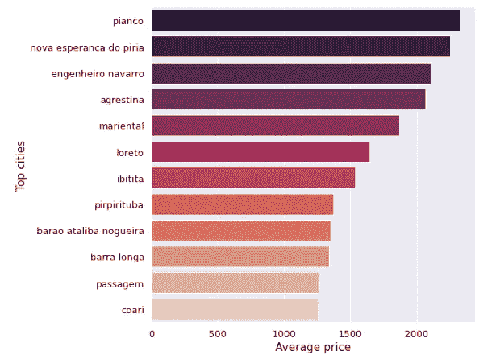

这里只有两种状态可见。迄今为止，只有 6 份订单被取消。分析那些已经取消的产品没有意义。因此，我们将删除它们。

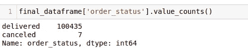

```
final_dataframe = final_dataframe[final_dataframe['order_status'] != 'canceled']
```

下面给出的散点图在 x 轴上显示价格，在 y 轴上显示交货和购买之间的总时间差。可以看出，随着交付时间的增加，对产品不满意的几率明显增加。一件物品的价格上涨，如果按时送达，并不会引起太多的不满。

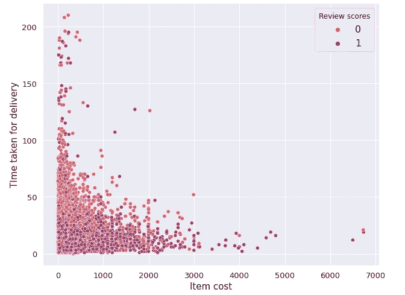

我们现在正在创建一个名为“每价格采购交付差异”的新列，它是给定价格的产品采购和交付之间的时间差。

```
final_dataframe['purchase_delivery_diff_per_price'] = final_dataframe['purchase-delivery difference']/final_dataframe['price']
```

运费成本和物品成本之间的散点图非常具有描述性。但可以说，即使运费成本很高，当物品成本较低时，顾客也会感到满意。

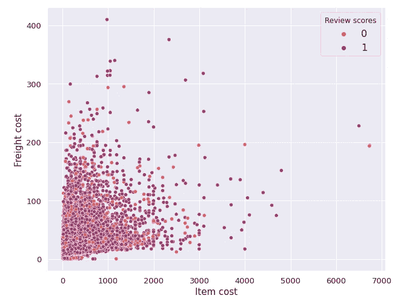

信用卡是最受顾客欢迎的支付方式。它们比其他替代品更受欢迎。第二种是 Boletos，是一种只有在巴西才能找到的凭证。从这个图中，我们可以看到，给一个产品的差评很可能不是因为付款相关的问题。

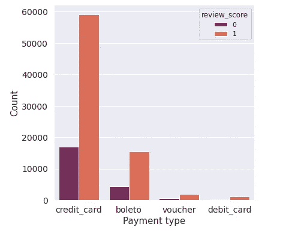

现在是时候删除机器学习任务不需要的所有列了。应该删除所有日期时间列。

```
final_dataframe.drop(['shipping_limit_date','order_purchase_timestamp','order_approved_at','order_delivered_carrier_date','order_delivered_customer_date','order_estimated_delivery_date','customer_id'], axis=1, inplace=True)
```

我们现在将创建一个名为“标签”的新变量，它包含了已编辑的类极性。应将该列从原始数据框中移除。

```
labels = final_dataframe['review_score']
final_dataframe.drop('review_score', axis=1, inplace=True)
```

“审查可用性”列指示特定项目的审查是否可用。包含这个列比在‘评论评论消息’中包含一堆零要好，因为它避免了稀疏性。稀疏性的问题是它会严重降低任何模型的性能。

```
final_dataframe['review_availability'] = final_dataframe['review_comment_message'].apply(lambda x: 1 if x != 'indisponível' else 0)
```

对于机器学习，我们需要定义一个用于训练数据的训练集和一个用于预测的测试集。这两个集合以相等的比例包含两个类。由于数据集是不平衡的，这些标签的分布有可能严重影响任何机器学习模型的性能。因此，我们需要确保测试集和训练集包含相同比例的正标签和负标签。为了结果的可重复性，我们需要添加一个种子值。

```
X_train, X_test, y_train, y_test = train_test_split(final_dataframe, labels, stratify=labels, test_size=0.2, random_state=0)
```

# 特征工程

一些列包含多个类别。我们通常想到的编码技术不是一键编码就是顺序编码。当我们使用独热编码技术时，稀疏性的问题出现了，因为有太多的类别。除非类别中存在序数，否则不能使用序数编码。解决这种情况的一种方法是使用响应编码。在这种技术中，我们将所有类别出现的概率与每个标签相加。这意味着每个类别将有两个概率值——一个用于肯定类别，另一个用于否定类别。总体而言，为每个分类列创建了两个不同的列。

```
def train_response(frame):
  f1 = frame[frame.iloc[:,1] == 0]
  f2 = frame[frame.iloc[:,1] == 1]
  global dict_frame, dict_f1, dict_f2
  dict_frame = dict(frame.iloc[:,0].value_counts())
  dict_f1 = dict(f1.iloc[:,0].value_counts())
  dict_f2 = dict(f2.iloc[:,0].value_counts())
  state_0, state_1 = [],[],
  for i in range(len(frame)):
    if frame.iloc[:,1][i] == 0:
      state_0.append(dict_f1.get(frame.iloc[:,0][i],0) / dict_frame[frame.iloc[:,0][i]])
      state_1.append(float(1-state_0[-1]))
    else:
      state_1.append(dict_f2.get(frame.iloc[:,0][i],0) / dict_frame[frame.iloc[:,0][i]])
      state_0.append(float(1-state_1[-1])) 
  df3 = pd.DataFrame({'State_0':state_0, 'State_1':state_1})
  return df3.to_numpy()def test_response(test):
  t_state_0, t_state_1 = [],[]
  for i in range(len(test)):
    if dict_frame.get(test[i]):
     t_state_0.append(dict_f1.get(test[i],0) / dict_frame.get(test[i]))
     t_state_1.append(dict_f2.get(test[i],0) / dict_frame.get(test[i]))
    else:
      t_state_0.append(0.5)
      t_state_1.append(0.5)
  df4 = pd.DataFrame({'State_0':t_state_0, 'State_1':t_state_1})
  return df4.to_numpy()def test_response(test):
  t_state_0, t_state_1 = [],[]
  for i in range(len(test)):
    if dict_frame.get(test[i]):
    t_state_0.append(dict_f1.get(test[i],0)/dict_frame.get(test[i]))
      t_state_1.append(dict_f2.get(test[i],0)/dict_frame.get(test[i]))
    else:
      t_state_0.append(0.5)
      t_state_1.append(0.5)
  df4 = pd.DataFrame({'State_0':t_state_0, 'State_1':t_state_1})
  return df4.to_numpy()
```

我们将使用序数或一个热编码对包含较少类别的分类特征进行编码，如果有太多类别，则使用响应编码对它们进行编码。不需要对数字特征进行编码。请注意，我们没有考虑数据框中的所有列。只有那些我们认为必要的才被编码。每个类别的编码模式如下所述

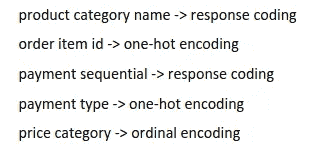

接下来，我们将研究文本数据。处理文本数据的最好方法之一是将它们转换成单词嵌入。单词嵌入优于 TF-IDF 向量和单词袋，因为它们携带单词的语义。在这个案例研究中，我们将使用 FastText 作为单词嵌入技术。有可能将这些单词转换成 TF-IDF 向量，然后使用潜在语义分析等技术降低维度。这种方法更快，但问题是我们使用这种技术得到的密集向量确实包含这些单词的语义表示。这种方法会降低我们模型的准确性。在对文本进行矢量化之前，我们需要清理它。首先，我们将删除停用词，并使用 regex 清理剩余的词。

```
sp = spacy.load('pt')
all_stopwords = sp.Defaults.stop_wordsdef process_texts(texts):processed_text = []
    dates = '^([0]?[1-9]|[1|2][0-9]|[3][0|1])[./-]([0]?[1-9]|[1][0-2])[./-]([0-9]{4}|[0-9]{2})$'

    for text in texts:
        text = re.sub(r'\r\n|\r|\n', ' ', text) 
        text = re.sub(r'^https?:\/\/.*[\r\n]*', ' ', text) 
        text = re.sub(dates, ' ', text) 
        text = re.sub('[ \t]+$', '', text)
        text = re.sub('\W', ' ', text)
        text = re.sub('[0-9]+', ' ', text)
        text = re.sub('\s+', ' ', text)
        text = ' '.join(e for e in text.split() if e.lower() not in all_stopwords) 
        processed_text.append(text.lower().strip())

    return processed_text
```

我们仍然没有将所有的数字特征纳入同一尺度。为此，我们将使用标准化。我们使用标准化而不是规范化，因为正如在基本统计数据的描述中所看到的，这个数据集中存在许多异常值。

```
strn = StandardScaler()
strn.fit(X_train[['price','freight_value','product_photos_qty','product_weight_g', 'product_length_cm',
       'product_height_cm', 'product_width_cm', 'payment_value','purchase-delivery difference','estimated-actual delivery difference','purchase_delivery_diff_per_price']])
X_train_strn = strn.transform(X_train[['price','freight_value','product_photos_qty','product_weight_g', 'product_length_cm',
       'product_height_cm', 'product_width_cm', 'payment_value','purchase-delivery difference','estimated-actual delivery difference','purchase_delivery_diff_per_price']])
X_test_strn = strn.transform(X_test[['price','freight_value','product_photos_qty','product_weight_g', 'product_length_cm',
       'product_height_cm', 'product_width_cm', 'payment_value','purchase-delivery difference','estimated-actual delivery difference','purchase_delivery_diff_per_price']])
```

现在是时候将所有必要的特征连接在一起，并检查最终数据帧的形状。可以看出，整体有 332 个特征。

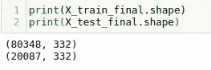

我们将尝试使用两种技术来减少这种维数。一种是通过使用奇异值分解找到硬阈值，另一种是通过使用自动编码器。奇异值分解是一种广泛使用的矩阵分解技术，可以应用于任何维度的矩阵。它将给定的矩阵转换成一组三个矩阵，分别命名为 U，σ和 V*。请注意，符号“*”用于表示转置运算符。任何维数为 MxN 的矩阵 A 的奇异值都是维数为 NxN 的方阵 A*A 的特征值的平方根。这里，σ是一个对角矩阵，它包含奇异值作为沿对角线的元素。对应于σ的对角元素的 U 矩阵的行和 V*矩阵的列被称为左和右奇异向量。记住，我们默认取矩阵 V 的转置。让我们用几何直觉来解释奇异值。正如我们已经知道的，维度矩阵 MxN 是从真实空间ℝᴺ到真实空间ℝᴹ的线性变换，在数学上表示为ℝᴺ→ ℝᴹ.SVD 是一种将这种直接变换分解为一组三个变换的方法，这三个变换是-第一旋转、缩放和第二旋转。现在考虑一个单位圆，它有两个黄色和洋红色的矢量。这里我们正在考虑从ℝ到ℝ的转变。因此，在本例中，M 和 N 都等于 2。变换后，这个圆变成一个旋转过的椭圆。如图所示，这一整体转变可分为 3 个步骤。第一次旋转(应用 V*)后，圆旋转一个角度。然后σ矩阵缩放该图的轴。每个轴的比例与奇异向量的大小成比例。注意，我们的两个向量的大小会改变。第二次旋转(应用 U)后，椭圆旋转了一个角度。

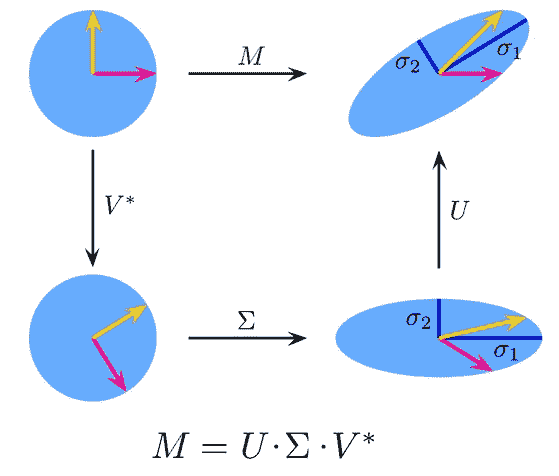

由 [Georg Johann](https://commons.wikimedia.org/wiki/User:Georg-Johann) 绘制的奇异值分解图，在 [CC-BY 2.0 许可下分发](http://creativecommons.org/licenses/by/2.0/)

降秩是一种技术，通过这种技术可以将高维噪声数据转换成低维更干净的数据。秩定义了一个阈值，我们可以考虑该阈值来截断使用 SVD 获得的 U 矩阵。研究人员过去常常采用启发式方法来寻找最佳排名。这种方法的问题是，他们不确定使用这种秩获得的截断矩阵是否包含足够的信息来重建干净的图像。另一种方法是使用试错法，这很耗时。在最近的一篇论文中，提到了一种称为最优奇异值硬阈值的技术，它为寻找截断的最优阈值奠定了理论基础。我们需要找到一个阈值τ*，它是最佳阈值。此公式中使用的“*”符号不表示转置。该公式取决于添加到图像中的噪声值是否已知，以及矩阵是否为正方形。假设该噪声的平均值为 0，标准偏差为 1。矩阵是正方形且噪声已知的可能性很小。但是如果这两个条件都满足，公式就是

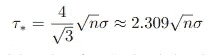

这里，“n”是方阵的维数，“σ”是噪声。在大多数情况下，我们不知道添加了多少噪声。公式是

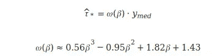

这里，β=n/m，yᵐᵉᵈ是所有奇异值的中间值。注意，我们这里使用的ω(β)值只是近似值。它们的实际值也可以计算出来，但是需要进一步的处理。由于我们在 SVD 中使用这种降秩技术只是为了降维，而不是为了图像去噪，因此找到ω(β)的精确值并不重要。

```
X_final_sparse = scipy.sparse.csr_matrix(np.vstack((X_train_final,X_test_final)))
U, sigma, VT = randomized_svd(X_final_sparse, n_components=min(X_final_sparse.shape[0],X_final_sparse.shape[1])-1,n_iter=5,random_state=45)
beta = min(X_final_sparse.shape) / max(X_final_sparse.shape)
omega_approx = 0.56*beta**3 - 0.95*beta**2 + 1.82*beta + 1.43
tau = np.median(sigma)*omega_approx
k = np.max(np.where(sigma>tau))+1
```


可以看出，新形成的矩阵具有 116 个特征，保留了大部分方差。在这之后，我们将截断的矩阵分成训练集和测试集。

使用神经网络可以降低维数。我们将使用自动编码器，一种有效编码数据的神经网络。注意，自动编码器属于无监督学习。在自动编码器架构中，输入和输出层的大小是相同的。隐藏层的大小总是小于外部层的大小。每个连续隐藏层的尺寸不断减小，直到到达瓶颈层；超过这个范围，尺寸会继续增加。请注意，架构是对称的。压缩数据的部分称为编码器，解压缩数据的部分称为解码器。编码器从输入端向瓶颈层延伸，解码器从那里延伸到末端。瓶颈层应该有我们需要的数据编码的维度。自动编码器旨在最小化重建误差。输入在瓶颈层被压缩，然后在输出层被解压缩。在输入和输出之间的误差最小化之后，训练收敛。

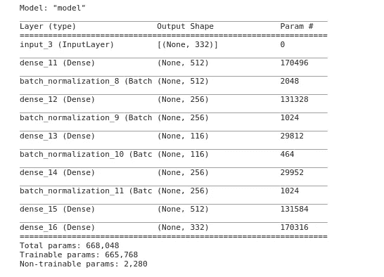

在我们的架构中，我们在瓶颈层使用 116 的维度。在网络的每一端只使用了两个隐藏层。训练收敛后，我们需要去掉解码器部分，使用编码器部分将训练集和测试集转换到所需的维度。

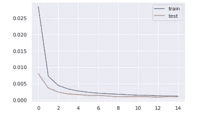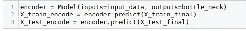

# 机器学习

现在，我们已经使用两种不同的降维技术创建了两个版本的数据，我们将尝试使用各种机器学习和深度学习算法对数据进行建模，然后尝试使用不同的指标来比较它们的性能。我们计划对它们分别应用五种不同的算法。这些算法是-K-最近邻(KNN)、逻辑回归、随机森林、xgboost 和多层感知器(MLP)。我们将把它们中的每一个应用于一种形式的数据，然后将它们全部应用于另一种形式的数据。

## 硬阈值奇异值分解

## **加权 K 近邻**

在 KNN 的情况下使用的超参数是最近邻(K)的计数，其值是范围从 1 到 9 的奇数。当 K 值为 3 时，性能据说是最佳的。验证宏 F1 的分数是 0.8587，不是很好。通过检查测试混淆矩阵，我们可以看到假阳性点的计数大于假阴性点的计数。这不是一个好的分类器。

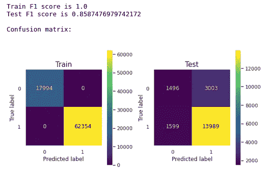

## 逻辑回归

逻辑回归中使用的超参数是逆正则化常数(C ),其值是 10 的幂，范围从 1e-7 到 1e-3。当 C 的值为 1e-5 时，该模型表现最佳。验证宏 F1 分数为 0.9003，这是好的。不幸的是，当我们绘制测试集的混淆矩阵时，我们可以看到假阳性点的数量大于真阴性点的数量。这不是一个好的分类器。

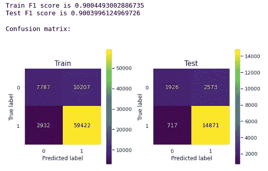

## 随机森林

随机森林中使用的超参数是基本估计量的计数，在这种情况下是决策树。在 50 和 210 之间选择六个值作为估计数，其中极限包含在集合中。任何两个连续值之间都有 30°的差异。验证宏 F1 得分为 0.9161，非常好。真阴性的计数大于假阳性的计数。这是一个好的分类器。

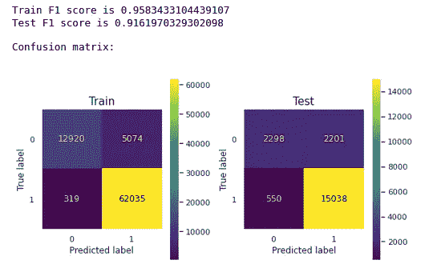

## XGBoost

xgboost 中使用的超参数是基本估计量的计数，在这种情况下也是决策树。在 50 和 210 之间选择六个值作为估计数，其中极限包含在如上所述的集合中。验证宏 F1 得分为 0.9191，非常好。真阴性的计数大于假阳性的计数。这是一个好的分类器。

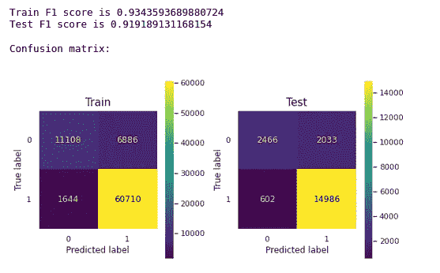

## 多层感知器

现在我们将使用多层感知器进行分类。这种情况下使用的优化器是 Adam，学习率是 1e-3。验证宏 F1 得分为 0.9074，很好。在这种情况下，真阴性的计数大于假阳性的计数。这是一个好的分类器。

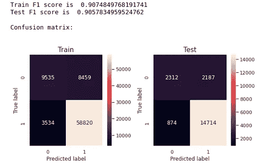

从目前我们看到的情况来看，random forest，Xgboost 和 mlp 可以正确地对点进行分类。Xgboost 是其中表现最好的。

# 自动编码器

## 加权 K 近邻

在 KNN 的情况下使用的超参数是最近邻(K)的计数，其值是范围从 1 到 9 的奇数。当 K 值为 3 时，性能据说是最佳的。验证宏 F1 的分数是 0.8564，不是很好。通过检查测试混淆矩阵，我们可以看到假阳性点的计数大于假阴性点的计数。这不是一个好的分类器。

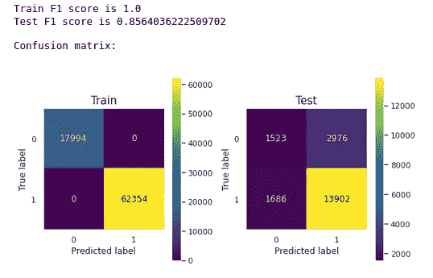

逻辑回归中使用的超参数是逆正则化常数(C ),其值是 10 的幂，范围从 1e-7 到 1e-3。当 C 的值为 1e-2 时，该模型表现最佳。验证宏 F1 分数为 0.8874，没问题。当我们绘制测试集的混淆矩阵时，我们可以看到假阳性点的计数大于真阴性点的计数。这是一个糟糕的分类器。

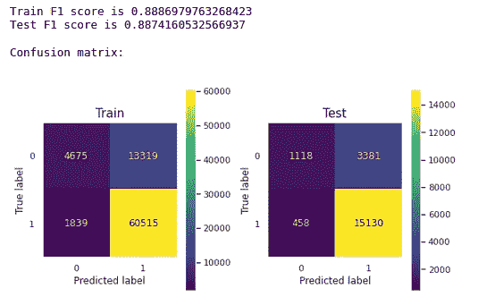

## 随机森林

随机森林中使用的超参数是基本估计量的计数，在这种情况下是决策树。在 50 和 210 之间选择六个值作为估计数，其中极限包含在集合中。任何两个连续值之间都有 30°的差异。验证宏 F1 得分为 0.8895，很好。不幸的是，真阴性的数量少于假阳性的数量。这是一个糟糕的分类器。

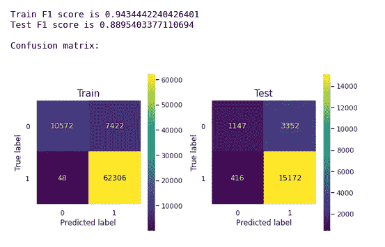

## XGBoost

xgboost 中使用的超参数是基本估计量的计数，在这种情况下也是决策树。在 50 和 210 之间选择六个值作为估计数，其中极限包含在如上所述的集合中。验证宏 F1 分数为 0.8867，没问题。不幸的是，真阴性的数量少于假阳性的数量。这是一个糟糕的分类器。

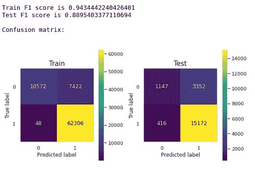

## 多层感知器

现在我们将使用多层感知器进行分类。这种情况下使用的优化器是 Adam，学习率是 1e-3。验证宏 F1 分数为 0.8924，没问题。在这种情况下，真阴性的计数小于假阳性的计数。这是一个糟糕的分类器。

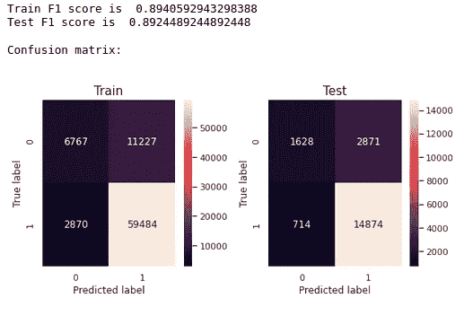

从我们这里可以看出，我们不能使用自动编码器压缩的数据集来设计一个好的分类器。

## 原始数据集

我们还没有尝试将标记化的评论直接作为模型的输入。为了实现这一点，我们需要对整个数据集进行操作，而不是对数据集的截断或压缩版本进行操作。为此，我们将尝试两种深度学习模型。

在最初的模型中，我们将只尝试使用长短期记忆(LSTM)。我们为这个模型创建了两个不同的输入。第一个输入是数字数据，另一个是文本数据。嵌入层将标记化的输入转换成固定长度的向量。我们正在使用 FastText 训练嵌入层。因此，使用该层将标记化和填充的文本转换成单词嵌入。这条道路上的下一层是 LSTM。当给定一个序列时，该层能够学习顺序依赖性。下一层直接输送到致密层。这两个输入稍后合并，在输出端有一个 sigmoid 激活函数。验证宏 F1 得分为 0.9211，非常好。真阴性的计数大于假阳性的计数。这是一个好的分类器。

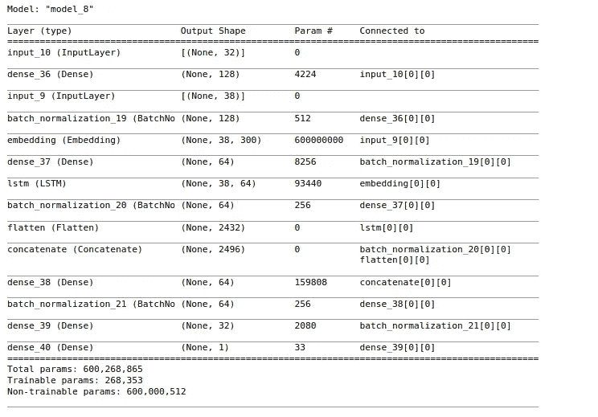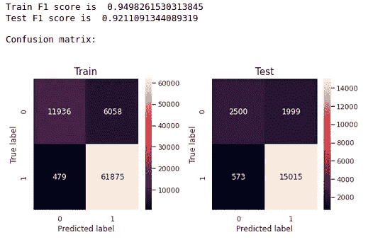

在下一个模型中，我们计划使用 1 维卷积神经网络和 LSTM。在这里，我们连续使用两对一维 CNN 和 LSTM 层，然后将其与数值数据相结合。这里，我们也使用 sigmoid 作为最后的激活函数。验证宏 F1 得分为 0.9010，很好。真阴性的计数大于假阳性的计数。这是一个好的分类器。

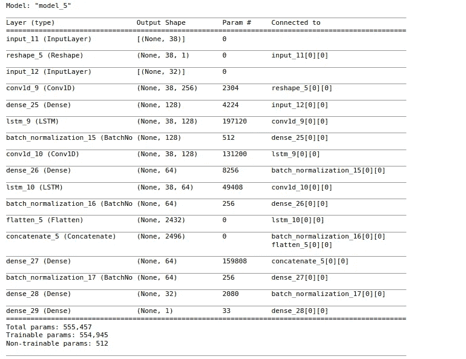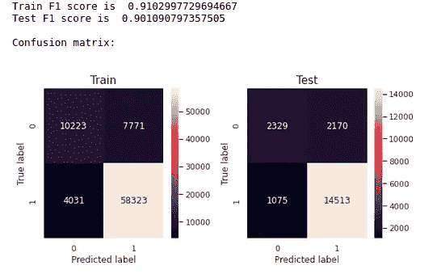

当我们检查总结表时，我们可以看到双输入 LSTM 和 xgboost 在使用硬阈值 SVD 截断的数据上对测试数据的性能最好。

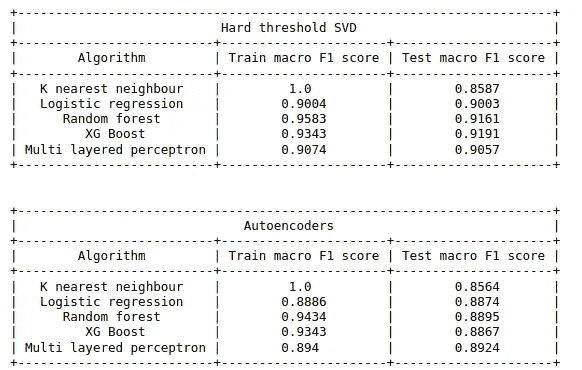

降维

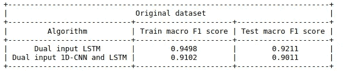

没有降维

# 未来的工作

我们可以将这个问题转化为一个多类分类问题，并检查评级预测。这是一种称为对数损失的度量，也可以用作替代方法。也有可能使用其他系综。

# 部署

下面给出了部署的屏幕截图。同样的一段录像可以在 [**这里**](https://youtu.be/p8Qj-ZVQphY) 观看。


预测截图

# 链接

> LinkedIn:【https://www.linkedin.com/in/ashwin-michael-10b617142/】
> Github 库:[https://github.com/Ashcom-git/case-study-1](https://github.com/Ashcom-git/case-study-1)
> Kaggle 数据集:[https://www.kaggle.com/olistbr/brazilian-ecommerce](https://www.kaggle.com/olistbr/brazilian-ecommerce)

# 参考

> 应用根。2021.*应用 AI 课程*。[在线]见:<https://www.appliedaicourse.com/.>[2021 年 5 月 6 日访问]。
> 泰勒，共和党，2021 年。*最优奇异值硬阈值*。[在线]Pyrunner.com。可在:<http://www.pyrunner.com/weblog/2016/08/01/optimal-svht/>【2021 年 5 月 9 日获取】。布朗利律师事务所，2021 年。*自动编码器特征提取分类*。[在线]机器学习掌握。可在:<https://machine learning mastery . com/auto encoder-for-class ification/>【2021 年 5 月 12 日访问】。
> t . Calin 和 j .薛，2021。*tensor flow*中的自定义 f1_score 指标。[在线]堆栈溢出。可在:<https://stackoverflow.com/a/64477588>【2021 年 5 月 7 日获取】。
> 堆栈溢出。2021.*如何用 matplotlib.pyplot 改变图例尺寸*。[在线]可在:<https://stackoverflow.com/a/7125157>[2021 年 5 月 3 日访问]。
> 阿齐兹，h .，库马尔，s .，科尔舒诺夫，v .和阿萨，p .，2021。*正则表达式匹配日期格式 DD-MM-YYYY 和 DD/MM/YYYY* 。[在线]堆栈溢出。可在:<https://stackoverflow.com/a/47218282>【2021 年 5 月 13 日获取】。
> 沃尔玛和铺路公司，2021 年。*匹配换行符— \n 还是\r\n？*。[在线]堆栈溢出。可在:<https://stackoverflow.com/a/52057778>【2021 年 5 月 14 日获取】。Python，h .和 Martin，l .，2021。*如何在 Python 中移除一个字符串内的任何 URL*。[在线]堆栈溢出。可在:<https://stackoverflow.com/a/11332580>【2021 年 5 月 14 日获取】。
> 莫滕森，第 2021 页。如何使用正则表达式删除尾部空格？。[在线]堆栈溢出。可在 https://stackoverflow.com/a/9532388<获得>【2021 年 5 月 16 日获得】。