# 案例研究 2:用于特征提取的无监督神经注意模型

> 原文：<https://towardsdatascience.com/case-study-2-an-unsupervised-neural-attention-model-for-aspect-extraction-1c2c97b1380a?source=collection_archive---------22----------------------->

## [行业笔记](https://towardsdatascience.com/tagged/notes-from-industry)


由[马库斯·温克勒](https://unsplash.com/@markuswinkler?utm_source=medium&utm_medium=referral)在 [Unsplash](https://unsplash.com?utm_source=medium&utm_medium=referral) 上拍摄

十多年来，企业一直利用互联网的可达性来为其内容做广告。如果没有这种广告媒介，这些公司就很难获得他们想要的客户群。但随着社交网站的快速增长，互联网已经发展成为一个论坛，消费者可以根据他人在网上发布的产品反馈来评估产品和服务。对任何特定产品的评论决定了它在市场上的声誉。关于网上购物行为的各种研究表明，潜在客户在信任任何特定产品之前，平均至少会阅读四到五条评论。这就是为什么顾客评论对企业的运作至关重要。在这个案例研究中，我们将探索基于方面的抽取的概念，这对于在线评论是至关重要的。我们将它分为以下几个部分—

*   **问题描述**
*   **车型概述**
*   **数据描述**
*   **数据预处理**
*   **模型架构**
*   **基线模型**
*   **结论**
*   **部署**
*   **未来工作**
*   **链接**
*   **参考文献**

# **问题描述**

情感分析是一种自然语言处理技术，用于确定给定文本是正面的、负面的还是中性的。当您希望从给定的文本块中推断出整体情感时，这种技术非常有用。这种技术的一个缺点是，如果人们希望了解客户对产品的哪个方面不满意，就必须手动筛选每个评论。这种形式的体力劳动非常耗时。在这种情况下，基于方面的情感分析是更好的选择。使用这种技术，我们可以通过将情感与评论的特定方面联系起来来分析评论。

在 2017 年由何，Wee Sun Lee，Hwee Tou Ng 和 Daniel Dahlmeier 发表的题为“[一种用于方面提取的无监督神经注意力模型](https://www.aclweb.org/anthology/P17-1036.pdf)”的研究论文中，研究人员设计了一种无监督的深度神经网络，可以根据它们的方面对一组句子进行分类。这个模型限制了它自己只能识别每个输入的一个方面，并且没有将任何情感与这个方面相关联。任何经过适当训练以执行情感分析的模型都可以在评论被分离后应用于评论。在本案例研究中，我们将从头开始设计 2017 年研究论文中提到的模型。我们将使用 Tensorflow 2.x .作为 Python 中用于模型构建和训练的后端框架。

# 模型概述

以前训练来执行这项任务的传统机器学习模型假设每个句子中出现的单词是独立的，上下文无关。这种假设导致这些模型的性能下降。单词嵌入是在 2013 年由托马斯·米科洛夫、伊利亚·苏茨基弗、程凯、格雷格·科拉多和杰弗里·迪恩发表的题为“[单词和短语的分布式表示及其组合性](https://papers.nips.cc/paper/2013/file/9aa42b31882ec039965f3c4923ce901b-Paper.pdf)”的论文中引入的。在这篇文章中，他们介绍了一个名为 Word2Vec 的模型。这个模型的目的是表明句子的上下文有多重要。使用这种模型，相似的单词被映射到相似方向的向量。同现单词在嵌入空间中彼此靠近。

在 2014 年由 Dzmitry Bahdanau、Kyunghyun Cho 和 Yoshua Bengio 撰写的题为“通过联合学习对齐和翻译”的神经机器翻译的研究论文中，注意力机制的概念被引入到语言翻译任务中。这项技术模仿了注意力的认知过程，允许任何生物选择并专注于相关的刺激。按照这种技术，文本的某些部分比整个文本具有更高的优先级。换句话说，注意力使模型能够在训练过程中强调重要的单词，而不强调无关的单词。这提高了模型发现更多一致方面的能力。研究人员给这个模型起的名字是基于注意力的方面提取(ABAE)。

# 数据描述

我们将使用城市搜索语料库作为训练和测试的数据集，可以从[这个](https://www.cs.cmu.edu/~mehrbod/RR/)网站免费下载。研究论文中使用了相同的数据集来测试模型。数据集中有 52，574 条评论，其中只有 3，400 条被标记。本文考虑了六个方面。这些方面是食物，工作人员，氛围，价格，轶事，和杂项。研究人员选择未标记的数据作为训练集，选择标记的数据作为测试集。这些设置可以在研究者的谷歌驱动[链接](https://drive.google.com/file/d/1qzbTiJ2IL5ATZYNMp2DRkHvbFYsnOVAQ/view)上找到。

# 数据预处理

加载测试集和训练集之后，我们需要对它们进行预处理。为了这个
的目的，我们定义了 preprocess()和 complete_preprocess()
函数。

使用这个函数，我们将评论中的所有单词转换成小写字母后进行分词。下一步是将这些令牌符号化。从本质上讲，通过将每个单词转换成其对应的词条，词条化有助于使您的数据矩阵更加稀疏。这样的词被称为是他们的规范形式或字典形式。此外，请注意，我们必须删除不会给评论增加任何价值的停用词。

为了训练 Word2Vec 模型，我们需要以列表的形式提供输入。这意味着每个评论被转换成一个列表，整个集合是一个包含多个子列表的列表。这可以在 split_list 函数的帮助下完成。

所有评论都以字符串表示形式提供。深度神经网络模型无法理解字符串，因此，我们需要以数字格式对它们进行编码。这意味着检查中出现的每个令牌都应该映射到一个大于或等于 1 的唯一数字。所有字符串，包括数字 8 和 9，当出现在评论中时都有唯一的映射。但是根据研究论文，在映射到相应的表示之前，所有的数字都应该表示为由<num>表示的单个标记。当将测试数据转换成相应的数字表示时，可以看到这个集合可能包含一些在训练集中不可用的单词。我们会在映射前用<unk>来表示这样的词。为了保持输入数据的一致性，我们需要将所有这些令牌列表转换成统一的长度。这可以在衬垫的帮助下完成。使用这种技术，通过在映射前预先计划或附加标记<pad>，所有的标记列表都被转换成相同的大小。在我们的例子中，我们将在每个列表前面加上<pad>标记。每个填充集的宽度等于该集中最长句子的长度。预留令牌的映射为:{' <pad>':0，' <unk>':1，' <num>':2}。从这个映射中，我们可以推断出集合中出现的所有单词都应该得到 3 或更大的值。下面给出了一个标记化和填充表示(最大长度为 4)的虚拟示例，说明输入在输入到模型之前应该是什么样子——</num></unk></pad></pad></pad></unk></num>

```
"I ate 2 donuts" -> ["I", "ate", "2", "donuts"] -> [3, 4, 2, 5]“I dislike donuts” -> ["<pad>", "I", "dislike", "donuts"] ->
[0, 3, 6, 5]"I drank" -> ["<pad>", "<pad>", "I", "drank"] -> [0, 0, 3, 7]
```

# 模型架构

在前面提到的引入 Word2Vec 概念的论文中，研究人员还添加了一个称为负采样的概念，帮助我们更快地训练单词嵌入。通俗地说，负面样本是从训练集中所有可用评论的集合中随机选取的评论。这意味着，当我们将一篇综述作为输入(称为正样本或目标样本)时，我们应该挑选一组 P 篇综述与目标样本一起作为负样本。这里，P 可以是一个小数字，例如 5 或 6，或者甚至可以是一个更大的数字，例如 21 或 22。请注意，我们并没有按照已经存在于训练集中的顺序将输入直接输入到模型中。这是为了应对训练数据的过度拟合。为了总结这个令人困惑的概念，让我仔细地将我的话重组如下——当 P 的值是 5 时，在一个时期的每一步中，我们用从训练集随机采样的 1 个评论作为正输入，用从这个相同的集替换随机采样的 5 个评论作为负样本来呈现模型。在这种情况下，假设批量大小为 1。如果批量大小被设置为值 32，则在一个时期的任何一个步骤中，我们将 32*1=32 个正样本与 32*5=160 个负样本一起输入到模型中。这是生成阳性和阴性样本的代码—

现在是详细了解 ABSA 的时候了。下面给出了该模型的架构。这里需要注意的重要一点是，该图仅描述了阳性样本的处理。

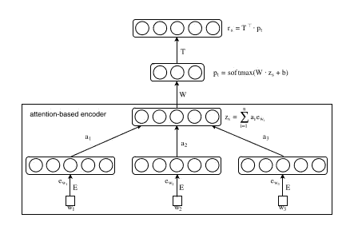

基于注意力的情感分析器架构(图片取自纸张)

使用从 Word2Vec 模型生成的所有单词嵌入，我们将它们组合成一个矩阵。这个矩阵将被视为嵌入矩阵。下一步是使用 k-means 聚类算法训练这个矩阵，并识别模型收敛后生成的聚类中心。形成的聚类中心的数目等于 k 的值，k 是我们在训练过程之前手动馈入模型的超参数。k 的值应该是我们希望使用 ABSA 模型识别的不同方面的数量。rₛ层的权重矩阵(在上图中表示为 t)使用所有这些聚类中心的归一化形式进行初始化。这个 T 矩阵也被称为方面矩阵。

正样本和负样本的最大区别在于，正样本被馈送到注意层，而后者没有。但是在进一步处理之前，所有的样本必须通过一个不可训练的嵌入层被转换成单词嵌入。该层使用在先前步骤之一中创建的嵌入矩阵来初始化。使用 Tensorflow 的子类化 API，我们设计了多个自定义层来处理样本。

第一个自定义层的名称是“平均”。它可以计算评论中所有单词嵌入的平均值，用术语 yₛ.表示

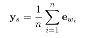

yₛ公式(图片取自纸张)

然后，正样本嵌入和 yₛ值被馈送到关注层。术语 dᵢ表示单词嵌入、矩阵 m 和 yₛ.的转置之间的中间乘法这里，M 是可训练的，并使用 Glorot 统一初始化器进行初始化。在这个初始化式中，样本是从特定范围内的均匀分布中抽取的。这个极限值的计算取决于这个矩阵的形状。通过在 dᵢ上应用 softmax，我们计算 aᵢ，这是注意力权重。

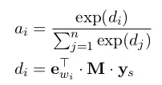

dᵢ和 aᵢ的公式(图片取自纸张)

下一个自定义图层名为 WeightedSum。使用这一层，我们计算每个单词的嵌入和为每个单词计算的注意力权重之间的点积。这个点积用术语 zₛ.来表示

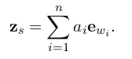

zₛ公式(图片取自纸张)

使用 Tensorflow 的自然密集层，我们将 zₛ乘以随机初始化的权重，然后将偏差项添加到其中。最重要的是，我们应用 softmax。这一层在文中被称为 pₜ。

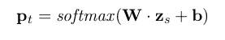

pₜ公式(图片取自纸张)

下一步是通过自定义平均层传递负样本。我们得到的输出是一个包含每个样本平均值的列表。这个列表用 zₙ.来表示最后一层是 rₛ，我们之前提到过。下面给出的是 rₛ和 pₜ.之间的关系

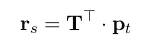

rₛ公式(图片取自纸张)

自动编码器是用于压缩数据的无监督神经网络架构。输入和输出的大小相同。中间有一个瓶颈层，用于将数据压缩到所需的大小。从输入层到瓶颈层的部分称为编码器，从瓶颈层到输出层的部分称为解码器。这个网络的目标是在输出端重构被瓶颈层压缩的输入。通过训练模型，我们试图最小化重建误差。

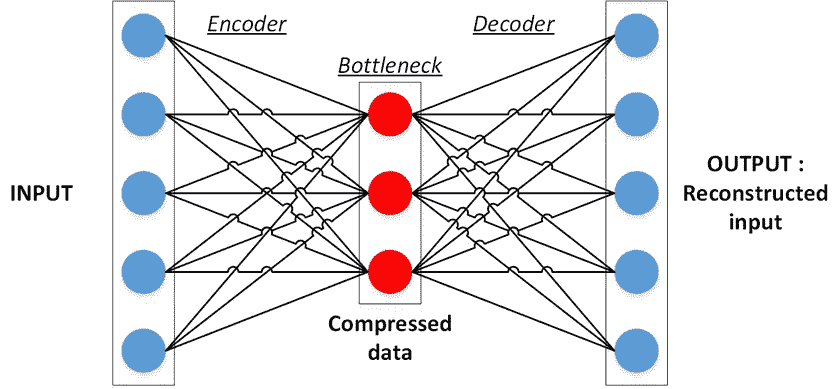

Autoencoder 模型(图片作者: [Seongju Hong](https://seongjuhong.com/author/pyramid19/)

整个 ABSA 模型是一个定制的自动编码器。从输入层到 pₜ层的部分是编码器，从 pₜ层到 rₛ层的部分是解码器。我们的目标是最小化 rₛ层的重建误差。

在 2016 年由 Mohit Iyyer，Anupam Guha，Snigdha Chaturvedi，Jordan Boyd-Graber 和 Hal Daumé III 撰写的题为“[世仇家庭和前朋友:动态虚构关系的无监督学习](https://aclanthology.org/N16-1180.pdf)”的论文中，研究人员提到了对比最大利润损失的概念。如果负样本嵌入与重构嵌入相似，这个损失函数会严重地惩罚模型。这意味着损失函数试图最大化 rₛ和 zₛ之间的乘积，而它试图最小化 rₛ和 nᵢ(when nᵢ之间的乘积是来自列表 zₙ).的元素我们使用一个名为 HingeLoss 的自定义层来执行这一步中必要的计算。损失函数的公式如下所示

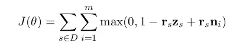

J(θ)的公式(图片取自纸张)

为了防止过度拟合，我们需要正则化模型。甚至为了这个目的，提到了定制的 L2 正则化。另外，请注意，我们应该使用方面矩阵的规范化形式进行正则化。使用自定义函数将正则化代码应用于密集 rₛ图层。

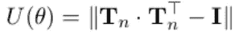

U(θ)的公式(图片取自纸张)

我们计划使用 RMSProp 作为训练这个模型的优化器。学习率为 1e-02，ε值为 1e-06。在训练该模型时，有必要设置 clipnorm 值。在我们的例子中，我们将其设置为 10。这意味着梯度的 L2 范数被限制在给定值。我们正在为 15 个时期训练模型，并且在每个时期考虑 182 个批次。批量大小设置为 1024，负采样率为 20。当在任何时期中计算的损失小于先前记录的最小损失时，我们显示从每个方面得到的前 50 个单词及其相应的相似性得分。以下是培训代码—

从印刷的文字，我们必须手动推断方面。相应地，我们还应该基于这些信息创建一个聚类图。现在是时候使用张量板绘制表示最小化的图形了。如你所见，模型收敛于损失值 4.7。

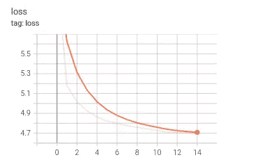

张量板图(图片由作者提供)

现在是对测试集执行预测的时候了。我们将需要创建一个新的自定义模型使用以前制作的 ABSA 模型的层。对于这个新制作的模型，我们将只使用为 ABSA 模型中的正样本设计的输入层作为该模型的输入。该模型的输出是 ABSA 的 pₜ层。

研究人员根据这些方面对测试进行了筛选。他们只允许那些属于食物、员工或环境方面的评论。该模型不能在一次审查中识别多个方面。因此，即使那些包含多个样本的评论也被删除了。在这一步之后，最后的任务是执行预测和生成分类报告。正如你所看到的，ABSA 模型的性能似乎是公平的！

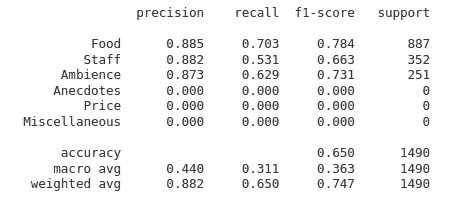

ABSA 分类报告(图片由作者提供)

# 基线模型

主题建模是一种无监督的方法，通过找到一些自然的项目组(在此上下文中称为主题)来对文档进行分类。这项技术已经使用了很长时间，因为它可以自动组织、理解、搜索和有效地汇总数据。最流行的主题建模算法是潜在狄利克雷分配(LDA)。这是基于基线模型方面的情感分析任务。我们将比较我们的 ABSA 模型的结果和使用 LDA 模型获得的结果。

一个文档可以是具有不同相似比例的多个主题的一部分。每个文档(在我们的例子中也称为评论)是一个单词列表。我们真正想弄清楚的是一个单词属于每个主题的概率。表格中的每一行代表一个不同的主题，每一列是数据集中出现的一个不同的单词。每个单元格包含单词(列)属于主题(行)的概率。

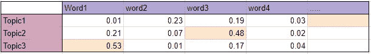

每个主题包含所有可用单词的概率分数(图片由 Ria Kulshrestha 提供)

对于我们的任务，这些主题只是方面。因此，导出的主题数量等于我们分析所需的方面数量。关于单词的一个重要假设是这些单词的顺序和语法结构并不重要。这意味着单词是独立的，这样的假设会导致性能下降。无论如何，我们将在我们的训练集上训练 LDA 模型，批量大小设置为 1024。下面给出了显示属于每个方面的前 50 个单词的代码。

在打印分类报告时，我们可以观察到 ABSA 模型在方面提取任务方面的性能更好。

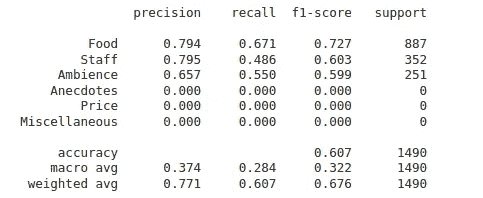

LDA 分类报告(图片由作者提供)

# 结论

如您所见，基于神经网络的模型非常适合基于方面的情感分析任务。这种表现应该归功于注意机制。

# **部署**

下面提到了部署的截图。同样的录像可以在[这里](https://youtu.be/NylhrESz3UU)观看。


预测截图(图片由作者提供)

# 未来的工作

我们的模型只能识别包含不超过一个方面的评论。此外，当我们希望评估与任何给定方面相关的情绪时，我们需要使用其他模型。这一领域未来的研究应该集中在这两个问题上。

# 链接

> Github 资源库:【https://github.com/Ashcom-git/case-study-2 
> 
> 领英:[https://www.linkedin.com/in/ashwin-michael-10b617142/](https://www.linkedin.com/in/ashwin-michael-10b617142/)

# 参考

> 应用根。[在线]地址:https://www.appliedaicourse.com/。
> 
> 何、李维孙、吴惠头和丹尼尔·达尔梅尔(2017)。用于特征提取的无监督神经注意模型。计算语言学协会第 55 届年会会议录(第 1 卷:长论文)。
> 
> ‌tomas·米科洛夫、伊利亚·苏茨基弗、陈开、格雷戈·科拉多和杰弗里·迪恩(2013 年)。词和短语的分布式表示及其组合性。神经信息处理系统进展 26 (NIPS 2013)。
> 
> Dzmitry Bahdanau、Kyunghyun Cho 和 Yoshua Bengio。(2015).通过联合学习对齐和翻译的神经机器翻译。第三届国际学习代表会议论文集。
> 
> Mohit Iyyer、Anupam Guha、Snigdha Chaturvedi、Jordan Boyd-Graber 和 Hal Daumé III。(2016).世仇家庭和前朋友:动态虚构关系的无监督学习。计算语言学协会北美分会 2016 年会议论文集:人类语言技术。
> 
> 陈燕琳(2019 年)。如何使用文本建立 ld a 主题模型？【在线】中等。可从以下网址获得:https://medium . com/@ yanlinc/how-to-build-a-LDA-topic-model-using-from-text-601 CDC bfd 3 a 6。
> 
> 苏珊·李(2018)。Python 中的主题建模和潜在狄利克雷分配。【在线】中等。可从以下网址获得:https://towards data science . com/topic-modeling-and-latent-Dirichlet-allocation-in-python-9bf 156893 c 24。
> 
> Ria Kulshrestha (2020 年)。潜在狄利克雷分配。【在线】中等。可从 https://towards data science . com/latent-Dirichlet-allocation-LDA-9d 1 CD 064 FFA 2 获取。
> 
> 桑内·德·罗弗(2020)。方面，更好的话题？在亚马逊化妆品评论中应用无监督特征抽取。【在线】中等。可从以下网址获得:https://medium . com/@ sanne . de . ro ever/aspects-the-better-topics-applying-unsupervised-aspect-extraction-on-Amazon-cosmetics-reviews-9d 523747 f8e 5。

‌

‌