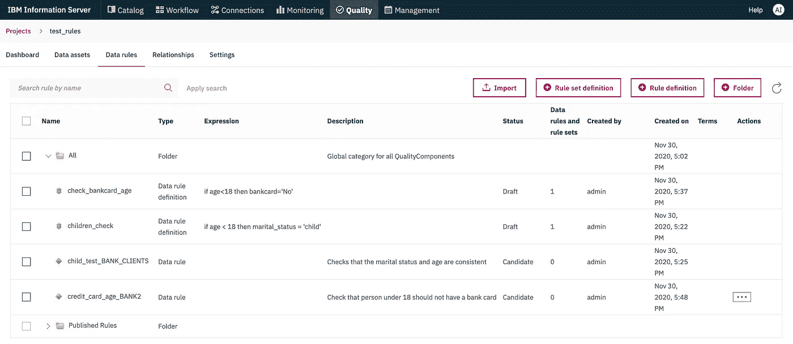
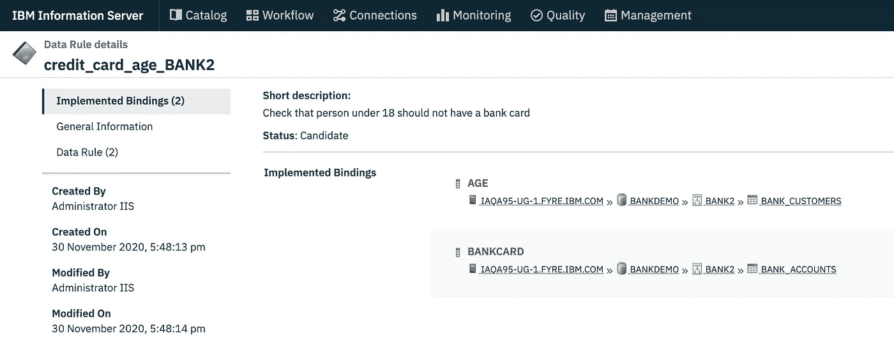
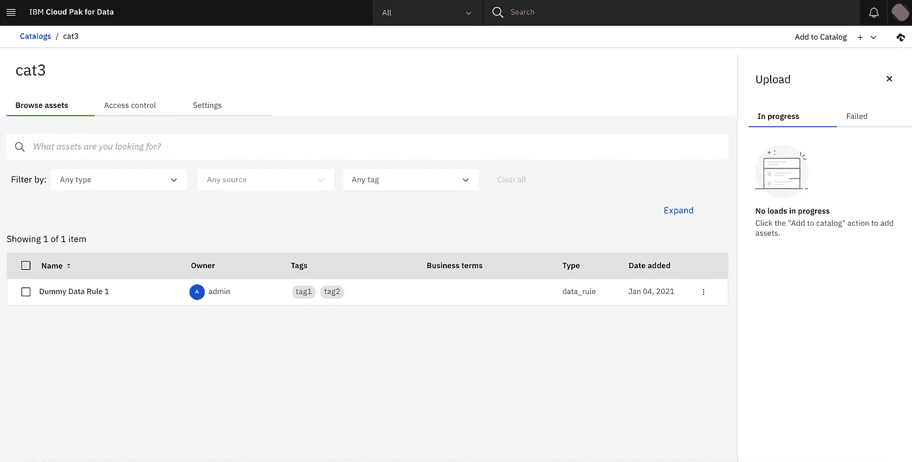
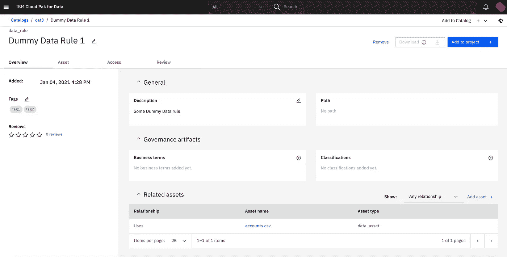
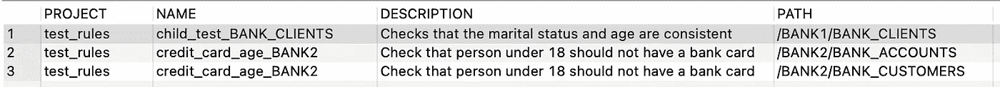
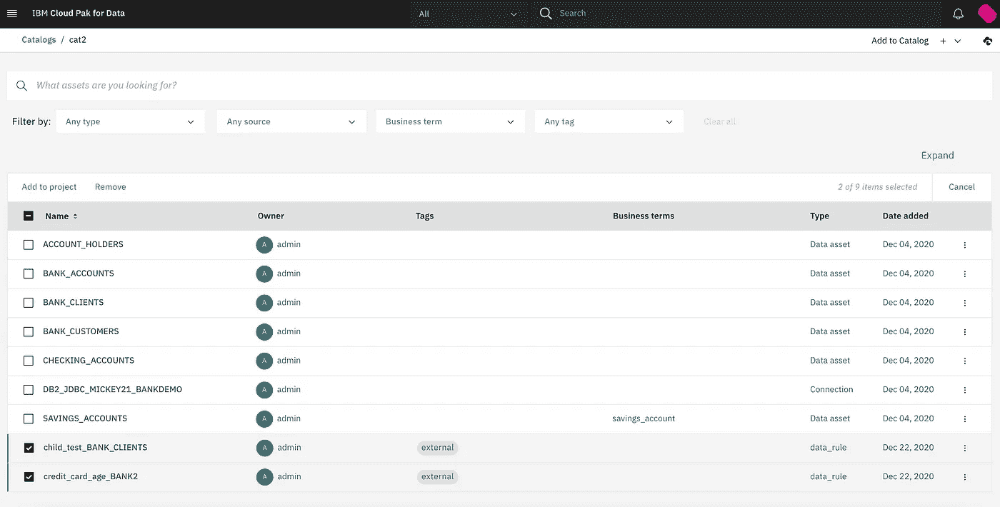
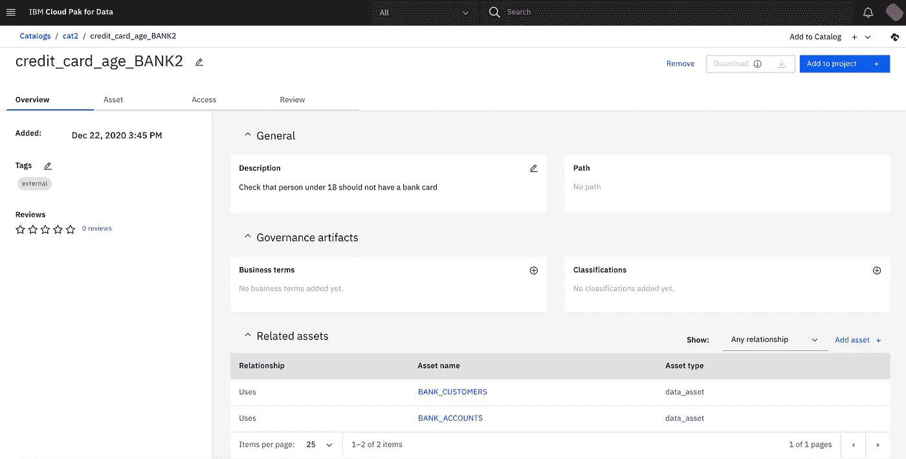
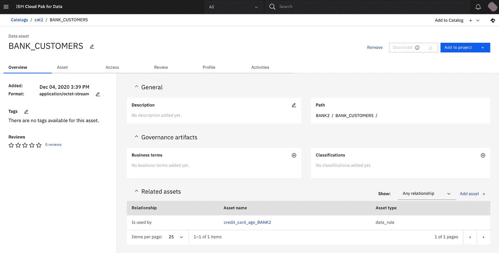
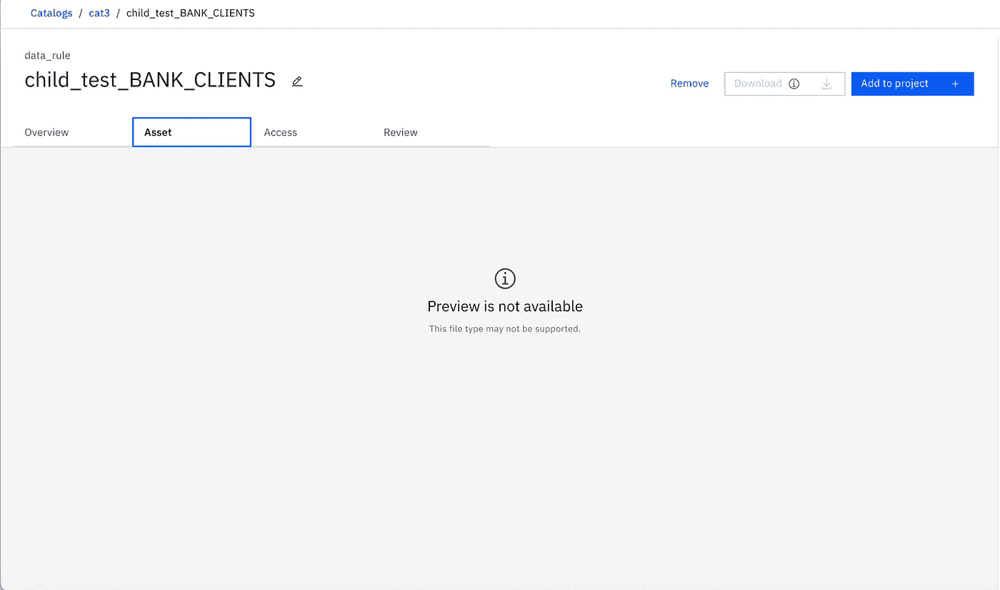

# 为 360 度数据谱系的外部资产编目

> 原文：<https://towardsdatascience.com/catalog-external-assets-for-a-360-data-lineage-448c8f6bf2b2?source=collection_archive---------33----------------------->

## 如何定制 IBM Watson 知识目录以支持任何种类的外部资产并改进您的数据治理。


由 DreamQuest 在 [pixabay](https://pixabay.com/users/dreamquest-7745549/) 上拍摄的照片

在之前的[文章](https://link.medium.com/aUHb1zTYqcb)中，我已经展示了如何通过使用 [IBM Cloudpak for Data](https://www.ibm.com/products/cloud-pak-for-data) 特别是 [Watson 知识目录](https://www.ibm.com/in-en/cloud/watson-knowledge-catalog)来自动分类大量数据集。

好的企业目录是数据治理的基石。在这里可以记录所有数据和治理资产的存在以及它们之间的关系。为了回答数据沿袭问题，确定任何给定资产的依赖图，或者进行影响分析，获取资产之间的关系是必不可少的。

例如，维护良好的目录应该有助于回答以下问题:

> 这个数据集的数据从哪里来？
> 
> 这个数据集中的数据用在哪里？
> 
> 如果该资产被修改或删除，将会影响到哪项资产？

只有当所有与感兴趣的资产直接或间接相关的资产都被正确编目时，业务目录才能回答这些问题。这些资产可能具有非常不同的性质，例如:

*   ETL 流——或一般的数据流——将数据从源移动和转换到目标。
*   直接或间接使用数据集数据的报告。
*   ML 模型是从数据集导出的数据构建的。
*   Jupyter 笔记本电脑根据从数据集获得的数据进行实验。
*   等等…

这个列表可能很长，在数据谱系中扮演重要角色的资产类型可能会因公司使用的技术而有很大不同。

使问题复杂化的是，现实生活中的场景很少只涉及来自单一供应商的同类解决方案。公司经常使用不同供应商的解决方案，这些解决方案运行在不同的系统上，但都在数据资产的生产、转换或消费方式中发挥作用。

没有一个软件供应商可以提供一个业务目录来支持您在现实生活中可能遇到的所有类型的资产。因此，能够定制目录以支持新的资产类型、加载它们并捕获它们与其他编目资产的关系是至关重要的，无论这些新资产的性质如何。

本文的目标是展示如何使用 IBM Watson 知识目录来完成这项工作。

# IBM 沃森知识目录

[IBM Watson 知识目录](https://www.ibm.com/in-en/cloud/watson-knowledge-catalog)是用于数据的 [IBM Cloudpak 的业务目录，支持开箱即用的不同资产类型，例如:](https://www.ibm.com/products/cloud-pak-for-data)

*   数据连接
*   数据资产(表、文件、模式、数据库等)
*   商业术语
*   数据类别
*   ML 模型
*   等等…

该列表并不详尽，并且会随着 Cloudpak for Data 的每个新版本而不断增加。

但是像任何软件一样，除非您的流程只涉及使用 Cloudpak 为数据创建的资产，否则您的数据和治理流很可能涉及外部资产，这些资产不受目录的现成支持，但是仍然应该被编目，以便获得完整的数据血统。这种外部资产可以是 ETL 流、来自其他供应商的报告或数据模型、物联网流中的物理设备，或者来自在 Cloudpak 外部管理的其他 IBM 产品的资产。

幸运的是，IBM Watson Knowledge Catalog 提供了一个 API 来注册新类型的资产，并通过 REST API 加载外部资产。在本文的剩余部分，我们将通过一个简单的例子来了解如何使用这个 API。

# 编目 IBM 信息分析器数据规则

Watson Knowledge Catalog 的定制可以用任何种类的资产来演示，但是出于本文的目的，我将通过一个例子来演示如何添加对 IBM Information Analyzer 数据规则的支持，这些数据规则运行在 Cloudpak 之外的经典信息服务器上。您应该能够将该过程移植到不同类型的资产。

## 信息分析器数据规则概述

[数据规则](https://www.ibm.com/support/knowledgecenter/en/SSZJPZ_11.7.0/com.ibm.swg.im.iis.ia.product.doc/topics/c_rules_daui.html)是在 [IBM Information Server](https://www.ibm.com/analytics/information-server) 中创建和执行的资产类型，它定义了一个非平凡的数据质量约束，该约束必须由应用该规则的数据集的所有行来验证。关于数据质量约束的更多细节，请参见我之前的文章[“如何量化数据质量”](/how-to-quantify-data-quality-743721bdba03)。



IBM Information Analyzer 项目中定义的数据规则

解释数据规则的细节超出了本文的范围，但是就本练习的目的而言，目前您唯一需要理解的是，数据规则是具有以下特征的资产:

*   它是在主机上的 IBM Information Server 安装中定义的资产，该主机可能与运行 IBM Cloudpak for Data 的主机不同。
*   像任何其他资产一样，数据规则有一个名称、描述和一个 ID，在定义它的系统中唯一地引用它。
*   数据规则是在数据质量项目(也称为工作空间)的上下文中定义的。
*   数据规则至少与一个数据集相关，但它也可以应用于多个数据集的连接结果。



使用两个数据集绑定数据规则的详细信息

Information Analyzer 数据规则还有其他属性，如绑定细节或输出定义等，但是为了保持示例的简单性，我们将只考虑前面列出的用于本练习的属性，因为它们足以捕获数据规则和其他资产之间的依赖关系。

一个 IBM Information Server 安装可能定义了数百个数据规则。它们中的每一个都可能与不同的数据资产相关。在本文的其余部分，我们将看到实现以下目标所需的不同步骤:

1.  定义一个新的资产类型来表示 IBM Watson 知识目录中的信息分析器数据规则
2.  提取外部 IBM 信息服务器的所有数据规则的相关元数据。
3.  将提取的数据规则的元数据加载到目录中，并在新加载的数据规则和已经编目的数据资产之间创建关系。

为了保持这个例子的简单，我们将假设要加载的数据规则所引用的所有数据资产都已经在 Watson Knowledge Catalog 中编目。这可以通过运行数据规则引用的数据源的自动发现来完成，正如我在以前的[文章](https://medium.com/swlh/unlock-your-data-with-ibm-watson-knowledge-catalog-6a6305d2525a)中所描述的。

## 在 Watson 知识目录中定义新的自定义资产类型:

为了简化我们将在本文中使用的命令，让我们首先在一个 UNIX shell 中定义一个环境变量***【WKC _ 主机】*** ，它包含我们想要对数据规则进行编目的 Cloudpak for Data 系统的主机名。

```
export WKC_HOST=*cpd_cluster_host*
```

(您需要将 cpd_cluster_host 替换为目标系统的 IP 地址的主机名)

接下来，让我们通过运行下面的命令获得一个认证令牌，如 CP4D 文档中所述。

```
curl -k -X POST https://*$WKC_HOST*/icp4d-api/v1/authorize -H 'cache-control: no-cache' -H 'content-type: application/json' -d '{"username":"***username***","password":"***password***"}'
```

(将 ***用户名*** 和 ***密码*** 替换为授权用户的凭证详情)

该命令响应是一个 JSON 文档，如下所示:

```
{"_messageCode_":"200","message":"Success","token":"...some_long_string..."}
```

让我们复制令牌属性的值，并将其放在另一个环境变量中，这样我们就不需要在每个命令中复制该令牌:

```
export TOKEN=...some_long_string...
```

现在我们有了一个认证令牌，我们准备使用 WKC REST API 来操作沃森知识目录的资产类型，如在[文档](https://cloud.ibm.com/apidocs/watson-data-api-cpd#asset-types)中所描述的。您可以使用 REST API 探索默认的资产类型，并检索它们定义的 JSON 表示，以便更好地理解它们是如何定义的。

在我们的例子中，我们将通过使用 REST API `POST {service_URL}/v2/asset_types?catalog_id={catalog_id}` 来创建一个名为 data_rule 的新的定制资产类型，如文档的本节[中所述。](https://cloud.ibm.com/apidocs/watson-data-api-cpd#create-asset-type-book)

自定义资产类型特定于目录。Watson Knowledge Catalog 可能包含多个目录，因此您需要找出您想要导入新资产的目录的 ID。您可以通过在 UI 中打开目录并在浏览器中查看 URL 来轻松确定目录的 id。目录 ID 是 URL 中路径元素 */catalogs/* 后面的一个长字符串，如下例所示:

```
[https://yourserver.yourcompany.com/data/catalogs/**b134fdf3-7d3f-40e0-835b-7ce54a62cc7e**?context=icp4data](https://wkc-cpd-wkc.apps.wkc-ia-test3-lb.fyre.ibm.com/data/catalogs/b184fda3-7d3f-40e0-835b-7ce54a62cc7e?context=icp4data)
```

这里，让我们再次复制该 ID，并将其放入环境变量中:

```
export CATALOG_ID=**<catalog_id pasted from the URL>**
```

创建新资产类型的 POST 命令需要一个 JSON 文档作为主体，该文档定义了要创建的新资产类型的元数据。文档至少应该包含新资产类型的名称和描述，以及对其字段的描述。在我们的例子中，我们将使用以下属性:

*   名称:*数据 _ 规则*
*   描述:*信息分析仪数据规则*
*   资产字段:
    - *主机*:包含规则的信息服务器系统的主机名。
    - *项目名称*:定义规则的信息分析器项目的名称。
    - *rid* :源信息服务器中数据规则的唯一标识。

请注意，我们不需要为与数据规则相关的数据资产定义属性，因为这些将通过使用资产关系来定义，WKC 允许我们在任何种类的资产之间定义资产关系。

基于这个为数据规则编目的初始最小字段列表，创建新资产类型的 REST API 的有效负载可以定义如下:

```
{
  "description": "Information Analyzer Data Rule",
  "name": "data_rule",
  "fields": [
     {
        "key": "host",
        "type": "string",
        "facet": true,
        "is_array": false,
        "search_path": "host",
        "is_searchable_across_types": true
     },
     {
        "key": "projectName",
        "type": "string",
        "facet": true,
        "is_array": false,
        "search_path": "projectName",
        "is_searchable_across_types": true
     },
     {
        "key": "rid",
        "type": "string",
        "facet": false,
        "is_array": false,
        "search_path": "rid",
        "is_searchable_across_types": true
     }
  ]
}
```

将新资产类型的定义保存在文件***data _ rule _ asset _ type . JSON***中，并运行以下命令在目标目录中创建新的资产类型。

```
curl -k -X POST --header 'Content-Type: application/json' --header 'Accept: application/json' --header "Authorization: Bearer $TOKEN" -d @data_rule_asset_type.json "https://$WKC_HOST:443/v2/asset_types?catalog_id=$CATALOG_ID"
```

如果命令成功，它应该返回一个成功代码(200 ),带有新创建的资产类型的 JSON 定义。

接下来让我们试着通过使用 API `POST {service_URL}/v2/assets?catalog_id={catalog_id}`创建一个新类型的样本资产，如[文档](https://cloud.ibm.com/apidocs/watson-data-api-cpd#create-asset-book)中所描述的。

与创建新的资产类型一样，我们需要准备一个 JSON 格式的有效负载，描述要在目标目录中创建的新资产。

创建一个文件***dummydatarule . JSON***，内容如下:

```
{
  "metadata": {
    "asset_type": "data_rule",
    "name": "Dummy Data Rule 1",
    "description": "Some Dummy Data rule",
    "tags": ["tag1", "tag2"],
    "origin_country": "us",
    "rov": {
      "mode": 0
    }
  },
  "entity": {
    "data_rule": {
        "host": "iaHost1",
        "projectName": "iaProject1",
        "rid": "rid1" 
    }
  }
}
```

此有效负载包含创建新资产所需的最少信息:

*   ***asset_type*** 定义要创建的资产的类型。在我们的例子中，我们使用新创建的定制资产类型 ***data_rule*** 。
*   ***名称*** 和 ***描述*** 是我们要新建的虚拟数据规则的名称和描述。
*   ***标签*** 是可选的，它包含一个与新创建的资产相关联的目录标签数组。标签可用于方便搜索或提供资产的附加信息。在本例中，我们关联了两个虚拟标签 ***tag1*** 和 ***tag2*** 。
*   ***origin _ country***和 ***rov*** 定义资产的位置和权限。出于本文的目的，我们将使用一些默认值。
*   字段 ***实体*** 必须包含一个与资产类型名称相同的字段——在我们的例子中是***data _ rule***——它本身包含我们在上一步创建新的定制资产类型时定义的字段值。在我们的例子中，基于前面对资产类型 data_rule 的定义，我们可以定义 3 个属性 ***host*** 、 ***projectName*** 和 ***rid*** 。

让我们通过运行以下 cURL 命令在目录中提交这个新数据规则的创建:

```
curl -k -X POST --header 'Content-Type: application/json' --header 'Accept: application/json' --header "Authorization: Bearer $TOKEN" -d @dummyDataRule.json "https://$WKC_HOST:443/v2/assets?catalog_id=$CATALOG_ID"
```

如果该命令成功，它应该返回一个包含其 id 的新创建资产的 JSON 描述，并且当打开目标目录时，您应该能够在 Watson Knowledge Catalog UI 中看到新创建的虚拟数据规则。



Watson 知识目录中加载了虚拟数据规则

## 创建与其他资产的关系

与任何其他资产一样，新创建的自定义资产可以与其他资产相关联。您可以通过使用 UI 来定义这些关系，但是在我们的示例中，我们希望通过编程来实现，因为我们希望自动导入大量的资产。

创建资产间关系的 API 记录在这个[链接](https://cloud.ibm.com/apidocs/watson-data-api#createrelationships)下。简而言之，API 是带有 JSON 主体的`PUT /v2/assets/{asset_id}/relationships/{relationship_name}?catalog_id={catalog_id}`, JSON 主体指定资产和目标资产的目录 id。

为了测试这个特性，让我们找出同一目录中一个数据集的 id，并在我们的虚拟数据规则和那个数据集之间定义一个类型为 ***"uses/used by"*** 的关系。找出数据集 id 的一个简单方法是在 UI 中打开数据集，并从浏览器中的 URL 复制它的 id。

我们必须传递给 PUT 命令以创建关系的 JSON 有效负载如下:

```
{
  "relationship_targets": [
    {
      "catalog_id": "19f11301-8392-4733-b747-751f5230e566",
      "asset_id": "81fa1a02-4773-4801-a53b-1d374fb83b07"
    }
  ]
}
```

将 ***catalog_id*** 和 ***asset_id*** 的值替换为您想要链接到数据规则的数据资产的 id，或者可以是任何其他资产类型，并将有效负载保存在文件***add relationship . JSON***中。然后使用下面的 cURL 命令创建关系——您需要用之前创建的虚拟规则的 id 替换占位符***<data rule _ id>***。

```
curl -k -X PUT --header 'Content-Type: application/json' --header 'Accept: application/json' --header "Authorization: Bearer $TOKEN" -d @addRelationship.json "https://$WKC_HOST:443/v2/assets/***<datarule_id>***/relationships/uses?catalog_id=$CATALOG_ID"
```

在命令运行之后，当在 UI 中打开数据规则时，您应该能够看到类型 ***使用*** 的新关系。打开数据集，会看到 使用的 ***类型的反向关系指向数据规则。***



数据规则和数据资产之间的新关系

## 自动化流程

既然我们已经成功地定义了新的资产类型，并测试了可以使用 REST APIs 将数据规则导入到目录中，那么让我们自动化这个过程，从外部 IBM Information Server 安装中提取所有数据规则并对其进行编目。

第一个问题是提取规则的元数据。信息服务器提供了多种机制来实现这一点。您可以使用 REST API，或者针对元数据数据库(XMETA)编写 SQL 查询。在本文中，我们将使用 SQL。

解释 IBM Information Server 的 SQL API 超出了本文的范围。有关更多详细信息，您可以参考[信息服务器文档](https://www.ibm.com/support/knowledgecenter/SSZJPZ_11.7.0/com.ibm.swg.im.iis.govdash.doc/topics/r_sql_views.html)。为了简化本文，我准备了一个现成的 SQL 查询，它允许检索给定信息分析器项目的所有数据规则的名称、描述以及相关数据集的路径:

```
SELECT DISTINCT PROJECT.NAME AS PROJECT, 
       RULE.NAME, 
       RULE.SHORTDESCRIPTION AS DESCRIPTION, 
       CONCAT('/',CONCAT(COL.SCHEMA,CONCAT('/',COL.TABLE))) AS PATH FROM IAVIEWS.IARULE RULE
INNER JOIN IAVIEWS.IAPROJECT PROJECT ON RULE.PROJECTRID=PROJECT.RID
INNER JOIN IAVIEWS.IARULEBINDING BINDING ON BINDING.RULERID=RULE.RID
INNER JOIN IAVIEWS.IAREGISTEREDCOLUMN COL ON BINDING.TARGETRID=COL.RID
WHERE PROJECT.NAME='***<ProjectName>***'
```

该查询将返回如下图所示的结果。如果一个规则绑定到多个表，结果将包含每个绑定表的一行。因此在下面的例子中，项目 ***【测试 _ 规则】*** 包含 2 个数据规则，一个被命名为 ***“子 _ 测试 _ 银行 _ 客户”*** ，并被绑定到路径为***/BANK 1/BANK _ 客户*** 的数据集。另一个名为 ***“信用卡 _ 年龄 _ 银行 2”***，绑定到两个数据集，路径分别为***/银行 2/银行 _ 账户*** 和***/银行 2/银行 _ 客户*** 。



检索信息分析器项目的数据规则的 SQL 查询的结果

在此基础上，我们需要编写一些脚本:

*   运行前面的 SQL 查询，从 IBM Information Server 安装中检索所选信息分析器项目的所有数据规则
*   对于每个提取的数据规则，执行 Watson Knowledge Catalog REST API，在目标目录中创建新的数据规则资产
*   在目录中搜索与数据规则引用的数据集具有相同路径的数据集，并在新创建的数据规则和目录中已解析的数据集之间创建关联。

为了使本文简单，我在 Jupyter noteboook 中用 Python 实现了所有这些步骤:

运行笔记本中的所有单元后(如笔记本中所述，您将需要根据系统的详细信息调整一些变量)，您将在 Watson Knowledge Catalog 中看到所有外部数据规则都表示为普通目录资产。



在 IBM Watson 知识目录中作为定制资产导入的数据规则

当打开数据规则时，您可以看到已经创建了与其相关数据集的关系—假设在执行笔记本时数据资产已经导入到目录中。



导入数据规则的资产详细信息，显示与数据资产的关系

同样的关系也可以从数据资产中看到，它包含了一个类型为 ***"的反向关系，由指向数据规则的*** 使用。



数据资产和数据规则之间的关系，从数据资产中显示

## 自定义资产预览

新创建的自定义资产与 Watson Knowledge Catalog 本机支持的任何其他资产类型一样显示，只是“资产预览”选项卡默认为空。



默认情况下，资源预览不适用于自定义资源类型

还可以在目录中嵌入自定义资产预览 UI，只要它是可以在 Web 浏览器中打开的 Web UI。

在我们的示例中，可以使用以下 URL 打开用于查看数据规则详细信息的 Information Analyzer Web UI:

```
[https://***<iis_hostname>***/ibm/iis/igcui/assets/***<datarule_rid>***](https://iaqa95-ug-2.fyre.ibm.com/ibm/iis/igcui/assets/b20de59c.ef0f3886.2pg7c6fpc.9vr2drb.jt2tg2.hh5573mmk20lu7fohkfth)
```

Watson Knowledge Catalog 提供了一种注册 URL 的方法，以便在需要显示用于预览特定资产类型的 UI 时调用。这是通过稍微更新我们之前创建的资产类型的 JSON 定义来完成的:

```
{
  "description": "Information Analyzer Data Rule",
  "fields": [
     {
        "key": "host",
        "type": "string",
        "facet": true,
        "is_array": false,
        "search_path": "host",
        "is_searchable_across_types": true
     },
     {
        "key": "projectName",
        "type": "string",
        "facet": true,
        "is_array": false,
        "search_path": "projectName",
        "is_searchable_across_types": true
     },
     {
        "key": "rid",
        "type": "string",
        "facet": false,
        "is_array": false,
        "search_path": "rid",
        "is_searchable_across_types": true
     }
  ]**,
  "external_asset_preview": {
    "base_client_url": "**[**https://<iis_hostname>/ibm/iis/igcui/assets**](https://iaqa95-ug-2.fyre.ibm.com/ibm/iis/igcui/assets)**",
    "url_parameters_from_asset_attributes": [],
    "url_path_from_asset_attributes": "rid"
  }**
}
```

用粗体标记的附加属性指定，每当需要预览这种类型的资产时，WKC 应该调用通过附加 ***base_client_url*** 和在属性***URL _ path _ from _ asset _ attributes***中指定的资产属性的值构建的 URL。

为了测试此更改，请将***<IIS _ hostname>***替换为您从中导入数据规则的信息服务器主机名，并将修改后的 JSON 文档保存在名为***data _ rule _ with _ preview _ asset _ type . JSON***的文件中。然后使用以下命令更新资产类型的定义:

```
curl -k -X PUT --header 'Content-Type: application/json' --header 'Accept: application/json' --header "Authorization: Bearer $TOKEN" -d @data_rule_with_preview_asset_type.json "https://$WKC_HOST:443/v2/asset_types?catalog_id=$CATALOG_ID"
```

该命令将更新 data_rule 资产类型的现有定义。更新后，如果您重新加载目录的资产预览屏幕，您应该会看到一条消息(至少在 Firefox 上是这样),表明出于安全原因，该页面不能嵌入，但您可以在不同的浏览器选项卡中加载它。这是 Information Server UI 的一项安全功能，可防止原始 UI 嵌入到另一个 UI 中，但这仍然提供了一种在不同选项卡中打开此 UI 的便捷方式。通过部署不同的 web 应用程序，可以嵌入没有这种安全限制的 UI 面板。

# 摘要

在本文中，我们已经看到了为了获取完整的谱系，目录支持定制的资产类型是多么重要。我们还看到了如何通过使用 Watson Knowledge Catalog 的 REST API 来轻松实现这一点。作为一个具体的例子，我们已经定制了一个目录来支持外部信息分析器数据规则作为一个新的资产类型，并运行一个脚本来将所有外部数据规则导入到我们的目录中。然后，我们已经看到，如何以编程方式创建资产之间的关系。最后，我们探索了如何使用专门的资产查看器定制 UI 本身。

同样的过程可以应用于支持任何种类的资产类型，对于这些资产类型，可以提取元数据信息，以便将它们导入到目录中。我们只研究了几个 REST APIs。其他 API 命令也允许我们定义资产之间的特殊类型的关系，以更好地捕捉语义。