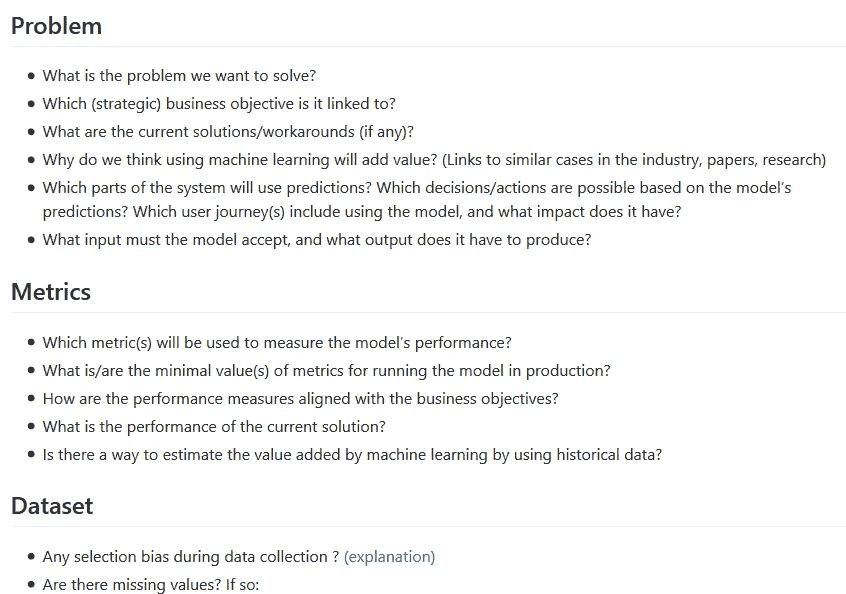
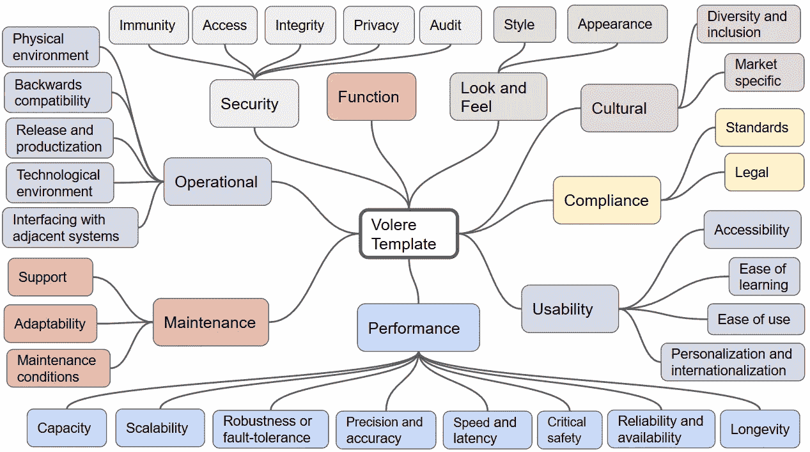

# 人工智能产品要求目录

> 原文：<https://towardsdatascience.com/catalog-of-requirements-for-ai-products-bae95ae50e85?source=collection_archive---------33----------------------->

## 如何在你的 ML 项目中什么都不忘记

最近我听了一个有趣的故事。一家大型石油公司向数据科学家提出了一个问题:他们要观察卡车司机在运输汽油时是否遵守了安全指示(特别是，他们是否在车厢内吸烟)。过了一段时间，数据科学家提出了一个解决方案——一个看起来完美的硬件模块:它记录视频，使用神经网络进行评估，并以非常低的错误率触发警报。唯一的问题是，该模块太大，无法安装在卡车驾驶室的任何地方。

照片由 [PIXNIO](https://pixnio.com/transportation-vehicles/trucks/vehicle-truck-engine-road-trailer-transportation-transport-cargo) 拍摄

总的来说，如果不整合到更大的技术背景中，工业中几乎没有任何机器学习模型会增加价值。由于所有的决策和工作都遵循系统的需求，获得正确的需求是绝对关键的。每一个被遗忘的需求都增加了您以后不得不重新构建部分解决方案的可能性，或者在最坏的情况下，从头开始重新构建。这意味着浪费精力，不能按时交付，失去客户的信任。

需求工程是在软件开发过程中建立起来的一门学科。对于软件项目，也有一些模板和清单，它们有助于不忽略任何涉众或需求。正如我们所知，机器学习解决方案有一些其他项目中没有的特殊性:

*   与数据集相关的一切
*   实验再现性
*   伦理问题
*   上下文漂移
*   等等。

因此，拥有一个人工智能解决方案的需求目录是很好的。我在网上找到的所有东西都只包含一些你需要问的问题。因此，我创建了一个新的目录，旨在尽可能完整(见下文摘录)。

[链接到完整模板](https://github.com/ttzt/catalog_of_requirements_for_ai_products)

重要提示:如果与包含常规软件系统要求的另一个目录/模板一起使用，此目录涵盖了所有内容。这样的目录已经存在很长时间了，所以没有理由重复这项工作。我推荐 Volere 模板([老免费版](http://homepages.laas.fr/kader/Robertson.pdf)，[新付费版](https://www.volere.org/templates/volere-requirements-specification-template/))，不过你也可以用另一个选项。这里提供的目录应该通过将机器学习特定部分添加到通用软件需求中来缩小差距。

Volere 模板结构

如何使用这个目录(和 Volere 模板)通常取决于用户。在我看来，务实的方法是在启动 DS 项目时仔细检查问题(对于某些需求，在项目过程中进行澄清可能更有意义。)努力找到每个问题的答案。像“在我们的上下文中无关紧要”这样的回答是明确允许的。对于其余项目，搜索相关的利益相关者，询问他们，并记录他们告诉你的内容。

你可以在这里找到目录[，它是免费的。](https://github.com/ttzt/catalog_of_requirements_for_ai_products)

欢迎对该目录进行改进和更改的请求——请提交请求或打开 GitHub 问题。