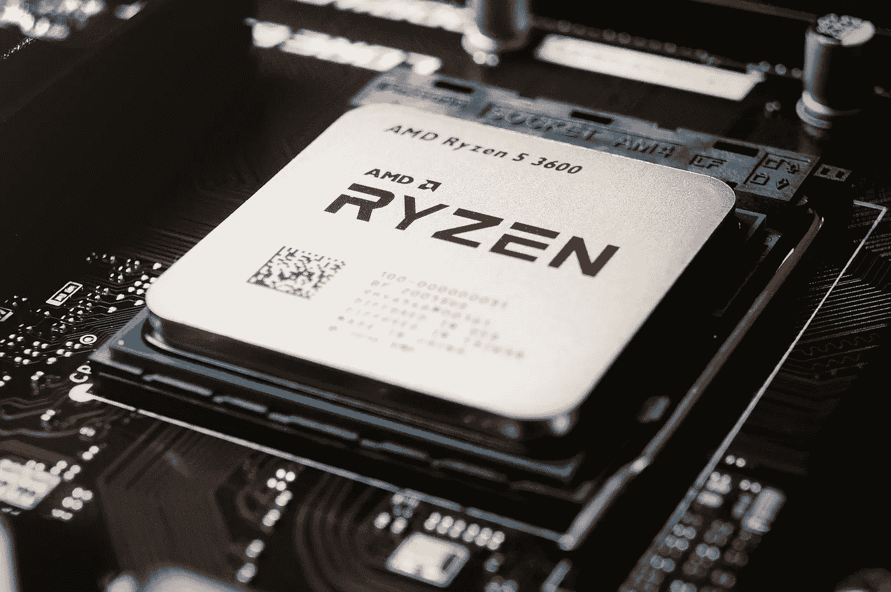

# CatBoost CPU 训练加速技巧

> 原文：<https://towardsdatascience.com/catboost-cpu-training-speedup-tricks-57cb10974ce3?source=collection_archive---------9----------------------->

## 使用 CatBoost 获得更快的训练速度，即使您没有单独的 GPU



图片来自[pix abay](https://pixabay.com/?utm_source=link-attribution&utm_medium=referral&utm_campaign=image&utm_content=4952189)cebbi

我与这些公司都没有关系。这是一项独立审查。

本文面向那些没有配备独立(独立)NVIDIA GPU(显卡)的 PC 或笔记本电脑，并且希望运行大幅加速的 CatBoost 模型的用户。

如果你已经有一台带独立 NVIDIA GPU 的 PC 或笔记本电脑，跳过这篇内容，跳到下面这篇我写的文章。

</10x-times-fast-catboost-training-speed-with-an-nvidia-gpu-5ffefd9b57a6>  

CatBoost 模型可以使用 CPU 或 GPU 进行训练。很明显，对于大型数据集，通过 GPU 训练可以获得更好的加速(例如 10 倍)。

但是，在 CatBoost CPU 训练中可以使用一些技巧来实现显著的加速。其中大多数可以通过改变参数值来实现，而其他的则需要对数据进行一些操作。

让我们来探索它们。

# 减少迭代次数

在 CatBoost 模型中，boosting 轮次或迭代次数由参数`iterations`定义。默认值为 1000。我们可以减小这个值来加快训练速度。

```
cb = CatBoostClassifier(iterations=100)
cb = CatBoostRegressor(iterations=100)
```

我用一个 10M 行的数据集测试了 100 次和 1000 次迭代:

*   **100 次迭代:**训练时间 95.5 秒，准确率 0.72 分
*   **1000 次迭代:** 878 秒训练时间，0.74 精度分数

> 在将迭代次数减少 10 倍后，您可能会期望精确度分数略有下降，但是在模型训练中您可以获得 9 倍的加速。

**注:**CatBoost 模型中的学习率与迭代次数成反比。如果你减少迭代次数，你也需要增加学习率，反之亦然。但是，该算法会根据迭代次数自动调整学习率。学习率还取决于数据集的大小。在 CatBoost 模型中设置`learning_rate=None`(默认)即可。

# 使用所有 CPU 核心

不是每个人都有独立的 GPU。但是，您可能有一个内核数量更多的好 CPU。参数`thread_count`定义了在 Catboost 模型训练中 CPU 应该使用多少内核。默认情况下，所有内核都由 CPU 使用。这用-1 表示。

```
cb = CatBoostClassifier(thread_count=-1)
cb = CatBoostRegressor(thread_count=-1)
```

我已经用一个 10M 行的数据集对 3 个内核和 6 个内核(在我的例子中是所有的*T2*内核)进行了测试:**

*   **3 核:**训练时间 119 秒，准确率 0.72 分
*   **6 核:** 95.5 秒训练时间，0.72 准确率分数

> 准确性分数不受训练过程中使用的 CPU 核心数量的影响。在这种情况下，如果使用所有(默认)CPU 内核，您可以减少大约 25%的训练时间。

# 减少树的深度

您可以定义每个提升回合中添加到集合的每个新树的深度。该值可由 CatBoost 模型中的参数`depth`控制。默认值为 6。我们可以减小这个值来加快训练速度。

```
cb = CatBoostClassifier(depth=3)
cb = CatBoostRegressor(depth=3)
```

我用一个 10M 行的数据集对树深度 3 和 6 进行了测试。

*   **深度-3:** 训练时间 95.5 秒，准确率 0.72 分
*   **深度-6:** 训练时间 127 秒，准确率 0.74 分

> 在降低树深度后，您可能会期望精确度分数略有下降，但是在模型训练中您可以获得大约 33%的加速。

# 将对象数据类型转换为分类数据类型

您可以在 CatBoost 中直接使用分类特征。下面是[如何](/how-do-you-use-categorical-features-directly-with-catboost-947b211c2923)。默认情况下，Pandas 将分类值存储在不能直接用于 CatBoost 的对象数据类型中。您有两个选择来克服这个问题:

*   您可以通过使用 **Pool()** 类将整个数据集转换为 CatBoost 的特殊 ***Pool*** 数据类型。
*   您可以将 ***对象*** 数据类型转换为 ***类别*** 数据类型。

```
for col in data.select_dtypes(include=['object']):
  data[col] = data[col].astype('category')
```

使用第二个选项可以在 CatBoost 模型训练中实现显著的加速。

# 使用 Numpy 数组代替 Pandas 数据框

Numpy 数组和 Pandas 数据帧都可以用作 CatBoost 算法的输入。但是，对大型数据集使用 Numpy 数组将显著加快 CatBoost 训练过程。

# 摘要

CatBoost GPU training 只有在您的 PC 配有 NVIDIA GPU 的情况下才能使用。此外，请注意，如果数据集不够大，CPU 和 GPU 的训练时间不会有太大差异。

因此，在我们只需要使用 CPU 进行 CatBoost 训练的场景中，我们今天讨论的技巧对于获得加速非常有用。

在大多数情况下，我们可以通过改变参数值来控制训练速度。有时候，我们不需要改变价值观。默认值将提供最佳的训练速度！

## 阅读下一条(推荐):

使用 NVIDIA GPU 将训练 CatBoost 模型的速度提高 10 倍！

</10x-times-fast-catboost-training-speed-with-an-nvidia-gpu-5ffefd9b57a6>  

## 阅读下一条(可选):

为数据科学和机器学习任务选择合适的笔记本电脑！

</20-necessary-requirements-of-a-perfect-laptop-for-data-science-and-machine-learning-tasks-7d0c59c3cb63> [## 数据科学和机器学习任务对完美笔记本电脑的 20 项必要要求

towardsdatascience.com](/20-necessary-requirements-of-a-perfect-laptop-for-data-science-and-machine-learning-tasks-7d0c59c3cb63) 

今天的帖子到此结束。

如果您有任何反馈，请告诉我。

同时，你可以 [**注册成为会员**](https://rukshanpramoditha.medium.com/membership) 来获得我写的每一个故事，我会收到你的一部分会员费。

非常感谢你一直以来的支持！下一个故事再见。祝大家学习愉快！

特别感谢 Pixabay 上的 **cebbi** ，为我提供了这篇文章的封面图片。

[鲁克山普拉莫迪塔](https://medium.com/u/f90a3bb1d400?source=post_page-----57cb10974ce3--------------------------------)
**2021–11–21**