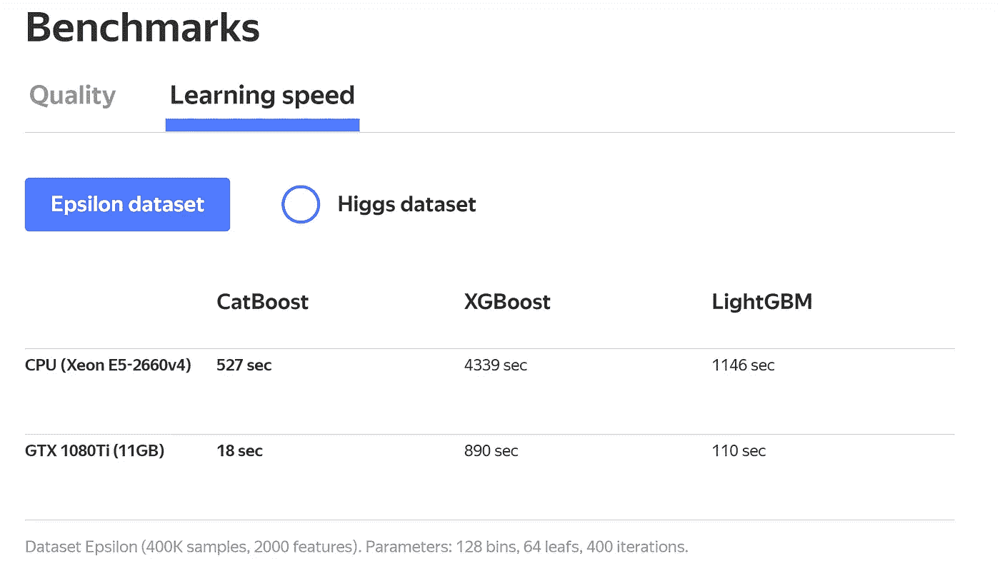
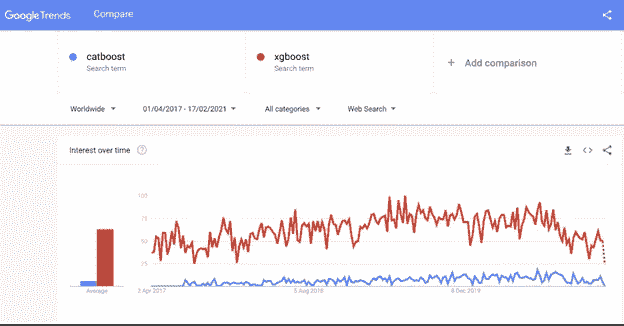
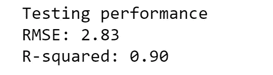
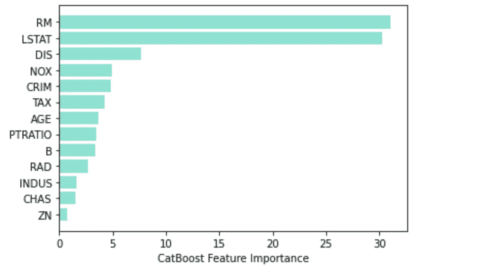
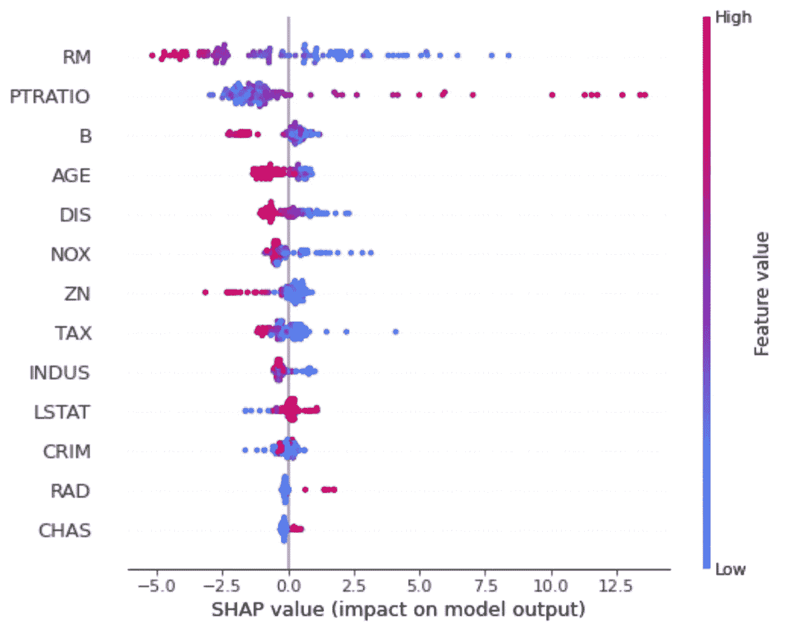

# 6 分钟后 CatBoost 回归

> 原文：<https://towardsdatascience.com/catboost-regression-in-6-minutes-3487f3e5b329?source=collection_archive---------1----------------------->

## Python 中 CatBoost 回归分析的简单实用介绍


马库斯·斯皮斯克在 [Unsplash](https://unsplash.com?utm_source=medium&utm_medium=referral) 上的照片

> 本文旨在提供一个实践教程，在 Sci-Kit Learn library 的波士顿住房数据集上使用 CatBoost 回归器。

# 目录

1.  CatBoost 简介
2.  应用
3.  最终注释

# 介绍

CatBoost 是一种相对较新的开源机器学习算法，由一家名为 Yandex 的公司在 2017 年开发。Yandex 是谷歌的俄罗斯同行，从事搜索和信息服务。

CatBoost 的核心优势之一是能够将各种不同的数据类型(如图像、音频或文本特征)集成到一个框架中。但 CatBoost 也提供了一种处理分类数据的特殊方式，需要最少的分类特征转换，这与大多数其他机器学习算法相反，它们不能处理非数值。从功能工程的角度来看，从非数字状态到数字值的转换可能是一项非常重要和繁琐的任务，CatBoost 使这一步变得过时。

CatBoost 建立在决策树和梯度推进的理论之上。boosting 的主要思想是顺序组合许多弱模型(表现略好于随机机会的模型)，从而通过贪婪搜索创建一个强有力的竞争预测模型。因为梯度提升顺序地拟合决策树，所以拟合的树将从先前树的错误中学习，从而减少错误。将一个新函数添加到现有函数的过程一直持续到选定的损失函数不再被最小化。

在决策树的生长过程中，CatBoost 并不遵循相似的梯度推进模型。相反，CatBoost 会生成不经意树，这意味着树是通过施加以下规则来生成的:同一级别的所有节点使用相同的条件测试相同的预测器，因此可以使用按位运算来计算叶的索引。不经意树过程允许简单的拟合方案和 CPU 上的效率，而树结构作为正则化来操作，以找到最佳解决方案并避免过度拟合。

> 比较计算效率:



学习速度，Yandex [2]

> 根据 Google trends，与更流行的 XGBoost 算法相比，CatBoost 在搜索流行度方面仍然相对不为人知。



谷歌趋势(2021 年)[3]

CatBoost 仍然相当未知，但该算法通过其处理异构、稀疏和分类数据的方法提供了巨大的灵活性，同时仍然支持快速训练时间和已经优化的超参数。

# 应用

本教程的目标是为 Python 中的 CatBoost 回归提供实际操作体验。在这个简单的练习中，我们将使用波士顿住房数据集来预测波士顿的房价。但是对这些数据应用的逻辑也适用于更复杂的数据集。

所以让我们开始吧。

首先，我们需要导入所需的库和数据集:

```
import catboost as cb
import numpy as np
import pandas as pd
import seaborn as sns
import shap
import load_boston
from matplotlib import pyplot as pltfrom sklearn.datasets 
from sklearn.model_selection import train_test_split
from sklearn.metrics import mean_squared_error
from sklearn.metrics import r2_score
from sklearn.inspection import permutation_importanceboston=load_boston()boston = pd.DataFrame(boston.data, columns=boston.feature_names)
```

## 数据探索

检查数据集中的任何 Na 值始终被认为是一种好的做法，因为它会混淆甚至损害算法的性能。

```
boston.isnull().sum()
```

但是，该数据集不包含任何 Na。

在进行数据科学项目时，数据探索和特征工程阶段是一些最关键(也是最耗时)的阶段。但是在这种情况下，主要重点是介绍 CatBoost 算法。因此，如果你想深入描述性分析，请访问 [EDA &波士顿房价预测](/linear-regression-on-boston-housing-dataset-f409b7e4a155)【4】。

## 培养

接下来，我们需要将数据分成 80%的训练集和 20%的测试集。

目标变量是“MEDV”——以 1000 美元为单位的自有住房的中值

```
X, y = load_boston(return_X_y=True)X_train, X_test, y_train, y_test = train_test_split(X, y, test_size = 0.2, random_state=5)
```

为了训练和优化我们的模型，我们需要利用 CatBoost 库集成工具将特征和目标变量组合成训练和测试数据集。该池允许您精确定位目标变量、预测值和分类特征列表，而池构造器将组合这些输入并将其传递给模型。

```
train_dataset = cb.Pool(X_train, y_train) 
test_dataset = cb.Pool(X_test, y_test)
```

接下来，我们将介绍我们的模型。

```
model = cb.CatBoostRegressor(loss_function=’RMSE’)
```

我们将使用 RMSE 测量作为我们的损失函数，因为它是一个回归任务。

在算法适合特定任务的情况下，参数调整可能会有所帮助。CatBoost 库为固有的网格搜索技术提供了一个灵活的接口，如果您已经知道 Sci-Kit 网格搜索功能，您也会熟悉这个过程。

在本教程中，将只包括最常见的参数。这些参数包括迭代次数、学习速率、L2 叶正则化和树深度。如果你想发现更多的超参数调整的可能性，查看 CatBoost 文档[这里](https://catboost.ai/docs/concepts/parameter-tuning.html)。

```
grid = {'iterations': [100, 150, 200],
        'learning_rate': [0.03, 0.1],
        'depth': [2, 4, 6, 8],
        'l2_leaf_reg': [0.2, 0.5, 1, 3]}model.grid_search(grid, train_dataset)
```

## 性能赋值

我们现在已经完成了模型的训练，我们最终可以对测试数据进行评估了。

让我们看看模型的表现。

```
pred = model.predict(X_test)
rmse = (np.sqrt(mean_squared_error(y_test, pred)))
r2 = r2_score(y_test, pred)print(“Testing performance”)
print(‘RMSE: {:.2f}’.format(rmse))
print(‘R2: {:.2f}’.format(r2))
```



测试性能

如上所述，我们在测试集上实现了 90%的 R 平方，考虑到最小特征工程，这是非常好的。

在推理方面，CatBoost 还提供了提取可变重要性图的可能性。因此，可变重要性图可以揭示人眼可能看不到的潜在数据结构。

在本例中，我们按升序对数组进行排序，并绘制一个特征的水平条形图，其中最不重要的*特征位于底部，最重要的*特征位于顶部。**

```
**sorted_feature_importance = model.feature_importances_.argsort()
plt.barh(boston.feature_names[sorted_feature_importance], 
        model.feature_importances_[sorted_feature_importance], 
        color='turquoise')
plt.xlabel("CatBoost Feature Importance")**
```

****

**可变重要性图**

**根据图示，上面列出的这些特征为预测波士顿房价提供了有价值的信息。最有影响的变量是每所住宅的平均房间数(RM)和较低地位人口的百分比(LSTAT)。**

**沙普利附加解释(SHAP)图也是一种解释我们的机器学习模型的输出的方便工具，通过为给定预测的每个特征分配重要性值。SHAP 值允许解释驱动我们的目标变量预测的特征。**

```
**explainer = shap.TreeExplainer(model)
shap_values = explainer.shap_values(X_test)shap.summary_plot(shap_values, X_test, feature_names = boston.feature_names[sorted_feature_importance])**
```

****

**SHAP 图**

**在 SHAP 图中，要素根据其平均绝对 SHAP 进行分级，颜色代表特征值(红色高，蓝色低)。SHAP 值越高，预测者的属性越大。换句话说，SHAP 值代表预测者对模型输出变化的责任，即预测波士顿房价。这揭示了，例如，较大的 RM 与上升的房价相关，而较高的 LSTAT 与下降的房价相关，这也是直觉上有意义的。**

**如果你想了解更多关于 SHAP 情节和 CatBoost，你可以在这里找到文档。**

# **最终注释**

**因此，在本教程中，我们使用 Python 成功构建了一个 CatBoost 回归器，它能够预测波士顿房价 90%的可变性，平均误差为 2，830 美元。此外，我们还研究了可变重要性图以及与波士顿房价预测相关的特征。如果您想了解更多，我建议您也尝试其他数据集，并深入研究定制和评估您的模型的许多方法。**

**感谢阅读！**

## **来源**

**[1] Yandex，公司简介，(2020)，[https://yandex.com/company/](https://yandex.com/company/)**

**[2] Catboost，Catboost 概述(2017)，[https://catboost.ai/](https://catboost.ai/)**

**[3]谷歌趋势(2021)，[https://trends.google.com/trends/explore?date = 2017-04-01% 202021-02-18&q = CatBoost，XGBoost](https://trends.google.com/trends/explore?date=2017-04-01%202021-02-18&q=CatBoost,XGBoost)**

**[4] A. Bajaj，EDA & Boston House Cost Prediction(2019)，[https://medium . com/@ akashbajaj 0149/EDA-Boston-House-Cost-Prediction-5 fc 1 BD 662673](https://medium.com/@akashbajaj0149/eda-boston-house-cost-prediction-5fc1bd662673)**