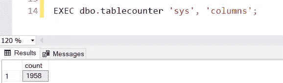
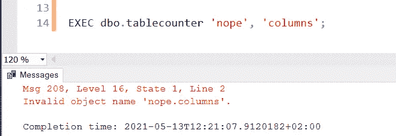
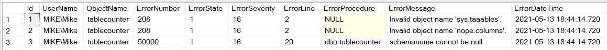

# 记录 SQL Server 中的错误，否则这些错误会被忽略(+示例)

> 原文：<https://towardsdatascience.com/catch-sql-server-errors-that-would-otherwise-go-unnoticed-examples-85f35d557fff?source=collection_archive---------25----------------------->

## 检测、分析和记录我的查询中的错误


检测错误..(图片由[像素](https://www.pexels.com/photo/radio-telescope-under-bright-starry-sky-6325003/)上的[伊戈尔](https://www.pexels.com/@igor-14869791)拍摄)

当查询执行失败时，我可以看到哪里出错并调整我的查询。通常像存储过程这样的数据库对象会被 API 或其他存储过程调用。当出现问题时，没有人会注意到，通常几个小时、几天或几周后，当客户打电话给你说一些数据丢失时，你会注意到。

理想情况下，您希望尽快知道数据库出错的原因、时间和位置，以便可以修复查询。本文向您展示了一种监视数据库进程和检测何时出错的简单方法。

# 准备

SQL Server Management Studio 在捕捉大量语法错误方面做得很好。尽管有时错误是不可预料的。考虑依赖用户输入或使用动态 SQL 创建查询的情况。我将使用一个简单的查询来说明意外的用户输入；一个完全不必要的存储过程，允许用户指定一个表。然后，SP 将检索该表记录计数。

对于不熟悉动态 SQL 的人:在这个 SP 中，我们可以确定查询的内容。我们声明一个名为@query 的字符串，它包含我们想要执行的查询。用户可以将他们的模式名和表名传递给存储过程。然后，SP 将创建查询并执行它。

让我们测试一下我们的 SP 是否真的工作:



计算 sys.columns 表中的记录数

太好了，成功了！但是当我们传递一个不存在的模式或表时会发生什么呢？



试图计算一个不存在的模式中的记录数

问题是我们的剧本失败了，被删掉了。当我坐在笔记本电脑前执行这个脚本时，我看到并理解了错误，因此我可以做些什么。但是想象一下，如果这个 SP 被一个或多个 API 调用。这里没有用户参与，所以错误不会被注意到。在我们的脚本中检测这些类型的错误是非常重要的，所以让我们来看看我们将如何准确地做到这一点。

# 检测和记录错误

使用 Try-Catch 块很容易检测错误；大多数程序员都很熟悉它们。SQL Server 中一个不太为人所知的特性是，如果代码失败，您还可以获得各种信息。在下面的 SP 中，我们以`ERROR_MESSAGE()`为例获取更多信息。

再次使用一些错误的参数`EXEC dbo.tablecounter 'sys', 'columns';`执行这个 SP 会产生下面的输出。请注意，我们还获得了发生错误的 SP 的名称(obj_name)。


# 记录您的错误

我们有工具来创建一个非常好的函数来记录我们所有的错误。让我们从创建一个存储所有错误信息的表开始。

现在，我们修改前面的存储过程，以便在出现错误时记录错误。它还会打印出一条消息，以便我们进行测试:

现在我们有了一个表，我们可以监视该表来查看在我们实现了错误日志记录功能的数据库中发生的所有错误。让我们用下面的查询试几次。第一个查询将会成功；其余的都会失败。

```
EXEC dbo.tablecounter 'sys', 'columns';
EXEC dbo.tablecounter 'sys', 'taaables';
EXEC dbo.tablecounter 'nope', 'columns';
EXEC dbo.tablecounter null, 'columns';Select * 
FROM dbo.ErrorLog;
```

执行这些过程将在我们的 ErrorLog 表中产生以下记录。



我们的误差记录表

如您所见，您可以通过 ErrorDateTime 和 my the eminent(userName)来过滤该表。您还可以使用 ObjectName 回溯代码(我们的错误发生在“tablecounter”存储过程中)。还要注意，在我们的新脚本中，我们有可能引发错误。如果没有设置模式名或表名，我们选择让脚本失败。然后，我们可以指定自己的 ErrorMessage(参见 ErrorLog 表中的记录#3)。

一旦我们实现了这个表，可能性是无限的:

1.  我们可以创建一个监视器，它每分钟刷新一次，并查询这个表中最后一分钟的记录
2.  向跟踪其状态的错误日志中添加新表(0 =新，1 =已解决等)
3.  我们可以使用触发器来扩展更多的功能，例如将消息推入消息队列。您可以在消息队列上连接多个服务(一旦记录了错误，就会收到一封电子邮件！)

# 结论

在代码中需要的地方应用 Try-Catch 块，但是不要忘记记录错误。这些提供了有价值的信息，有助于找出那些不被注意的 bug。狩猎愉快！

—迈克

页（page 的缩写）学生:比如我正在做的事情？[跟着我](https://mikehuls.medium.com)！