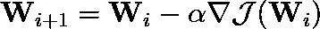
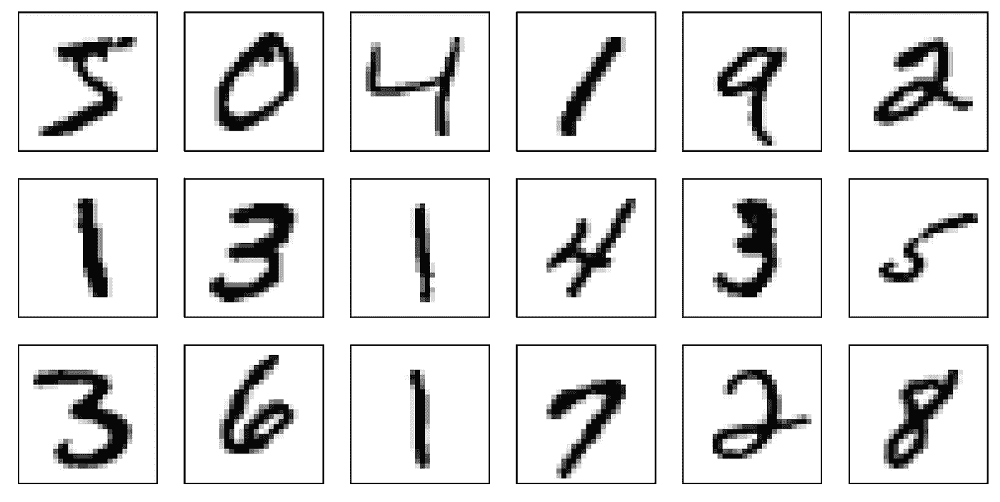

# 分类交叉熵和 SoftMax 回归

> 原文：<https://towardsdatascience.com/categorical-cross-entropy-and-softmax-regression-780e8a2c5e8c?source=collection_archive---------28----------------------->

## [实践教程](https://towardsdatascience.com/tagged/hands-on-tutorials)

## 想知道如何为多类问题实现一个简单的基线模型吗？这里有一个例子(包括代码)

学习由[尼克·杨森](http://www.nyphotographic.com/)CC BY-SA 3.0阿尔法股票图片

虽然它的根源是统计学，但逻辑回归是解决机器学习中二元分类问题的一种相当标准的方法，也是迄今为止现实生活应用中此类分类任务最常用的算法。然而，通过设计，它只能处理*二元分类问题*，即待分类的物体属于两类中的一类的问题(例如，故障与否、通过或失败、生病或健康等)。但是如果你有两个以上的课呢？SoftMax 回归来了！

SoftMax 回归是二元逻辑回归的一个相对简单的扩展(如果需要的话，参见本文[后的](/binary-cross-entropy-and-logistic-regression-bf7098e75559)快速回顾),用于多类问题。而后者依赖于所谓的**二元交叉熵**的最小化

前者依赖于其推广的最小化:分类交叉熵

其中 *1{y = k}* 是一个指标函数(即:如果例子属于类 *k* 则 *1{y =k} = 1* ，否则为 *0* )。但是这个数学术语是什么？我如何从两个班级变成任意数量的班级？更重要的是，如何训练我的模型比简单的梯度下降更有效？我们将在下面解决这些问题，并提供一个简单的 Python 实现(我们将实际实现它，而不是依赖 scikit-像许多其他帖子一样学习……)。但首先让我们简单介绍一下 SoftMax 函数！

# SoftMax 函数的(简要)介绍

SoftMax 函数是普遍存在的逻辑函数的推广。它被定义为

其中指数函数被逐元素地应用于输入向量***【z】***的每个条目。归一化确保输出向量***【σ(z)***的分量之和等于 1。至于经典的逻辑函数，它的所有输出都在 0 和 1 之间，这使得它成为模拟多类问题中概率分布的自然候选。它继承了逻辑函数的大部分属性，对我们来说最重要的属性是

其中，如果 *i = k* ，克罗内克符号 *δ* 等于 1，否则等于 0。

# SoftMax 回归的分类交叉熵的性质

给定一个示例 ***x*** ，softmax 函数可用于模拟其属于类别 *y = k* 的概率，如下所示

其中 ***W*** 是我们模型的参数。因此，我们的目标是找到参数 ***W*** ，使得模拟的概率函数尽可能接近真实的概率函数。至于二进制逻辑回归，这将涉及到利用取幂技巧使似然函数最大化(或者等效地使负对数似然性最小化)。因为从我们的概率分布的定义到分类交叉熵紧密跟随我们对二元逻辑回归所做的，因此如果你需要快速刷新，我推荐你到相应的帖子。

</binary-cross-entropy-and-logistic-regression-bf7098e75559>  

## 凸函数

我们的目标是找到最小化分类交叉熵的权重矩阵 W。然而，在最一般的情况下，一个函数可能有多个极小值，寻找全局极小值被认为是一个困难的问题。尽管如此，可以证明最小化 SoftMax 回归的分类交叉熵是一个凸问题，因此，任何最小值都是全局的！

让我们推导目标函数的梯度。为了便于我们的推导和后续实现，考虑分类交叉熵的矢量化版本

其中， **X** 的每一行都是我们的训练示例之一， **Y** 是独热编码标签向量，并且日志是按元素方式应用的。最后，⊙表示哈达玛乘积，即两个矩阵的逐元素乘法。使用矩阵计算的一些元素，我们的损失函数相对于 ***W*** 的梯度由下式给出

再一次继续这种推导会得出我们问题的结论。同样，它非常接近本文[后](/binary-cross-entropy-and-logistic-regression-bf7098e75559)中提出的逻辑回归推导。从那里，很容易看出它的最小特征值大于或等于零。因此，它是对称正半定的，我们的优化问题是凸的！

## 过度参数化

在继续讨论如何找到最优解和代码本身之前，让我们强调一下 SoftMax 回归的一个特殊属性:它是**过度参数化**！模型的一些参数是多余的。从 *P(y=i|x)* 的定义出发，可以看出，从每个权重向量 ***w*** 中减去任意一个向量 ***v*** 并不会改变模型的输出(留给读者一个练习，我首先是个老师！).权重矩阵 ***W*** 因此包含一个解决问题不需要的额外权重向量。如果不考虑这种冗余，我们的最小化问题将允许无限数量的同样可能的最优解。不失一般性，我们因此可以假设例如与最后一个类相关联的权重向量 **w** 等于零。这样做使我们能够摆脱这个过度参数化的问题。

# 怎么最小化？

与线性回归不同，SoftMax 回归不存在封闭形式的解决方案。然而，分类交叉熵在当前情况下是凸函数，任何来自凸优化的技术仍然保证找到全局最优。在这篇文章的其余部分，我们将使用梯度下降的稍微改进版本，即*具有(自适应)最佳学习速率*的梯度下降，来说明 SoftMax 回归的实现。

## 最优学习率梯度下降

在机器学习中，梯度下降的变化是模型训练的主力。在该框架中，权重矩阵 ***W*** 按照简单规则迭代更新

直到达到收敛。这里α被称为*学习速率*或步长。使用恒定的学习速率是很常见的，但是如何选择呢？简单的数学表明分类交叉熵函数的 [Lipschitz 常数](https://en.wikipedia.org/wiki/Lipschitz_continuity)(使用 Frobenius 范数)为

其中 *k* 是所研究问题中不同类的数量，因此“最优”学习速率大约为

较大的学习速率会导致计算发散。一个小得多的值会产生收敛，但代价是大量的迭代。或者，可以在每次迭代中使用[(不精确)线搜索](https://en.wikipedia.org/wiki/Wolfe_conditions)，以获得自适应/最佳学习速率。下面是相应算法的一个简单 Python/SciPy 实现，使用 [Brent 的方法](https://en.wikipedia.org/wiki/Brent%27s_method)来寻找准最优学习率。假设您已经熟悉 Python，代码应该是不言自明的。

虽然它确保了目标函数在每一步都会减少，但这种实现方式决不是优化的。通过稍微重构代码可以获得一些性能上的提升，尽管会牺牲可读性(我认为在这样一篇介绍性的文章中可读性更重要)。此外，可以使用更有效的优化技术，例如动量梯度下降、牛顿-拉夫森方法、随机梯度下降、ADAM 等。然而，这种梯度下降的变体对于编码来说足够简单并且相当有效。因此，我建议坚持把它作为一个起点，一旦你适应了，就继续使用更高级的优化程序。

# 超越普通的 SoftMax 回归

像它的二元对应物(即逻辑回归)一样，SoftMax 回归是一个相当灵活的分类任务框架。因此，多年来已经提出了许多变体来克服它的一些限制。

## 处理非线性可分离的类

通过构造，SoftMax 回归是一个*线性分类器*。就像线性回归可以扩展到建模非线性关系一样，logistic 和 SoftMax 回归也可以扩展到对非线性可分的点进行分类。然而，这样做可能需要专业知识、对数据属性的良好理解以及特征工程(与其说是精确的科学，不如说是一门手艺)。

## 不平衡的阶级分布

使用交叉熵时隐含的事实是，我们的训练数据集中每个类的流行程度大致相同。然而，现实生活中有许多情况并非如此。在二元分类中用于不平衡分类的相同技巧可以适用于多类问题，特别是对成本敏感的训练(更多细节见[本帖](/binary-cross-entropy-and-logistic-regression-bf7098e75559))。

## 正规化

在机器学习中，处理以大量特征为特征的数据是相当常见的。然而，并非所有这些特征都可以为预测目的提供信息。以 MNIST 数据集上的数字分类为例，这些特征是影像的 784 个不同像素。

来自 MNIST 数据集的手写数字的随机子集(图片由作者提供)。

然而，这些图像是标准化的，最外面的像素为所考虑的任务提供很少或没有信息。在这种情况下，有可能*正则化*优化问题，使得与无信息特征相关联的系数被设置为零。这个问题最简单的这种促进稀疏性的正则化版本如下

其中*CCE(****w****)*是分类交叉熵的简写符号， ***W*** 的ℓ₁-norm 是其条目的绝对值之和。参数λ控制交叉熵函数的最小化和权重矩阵的期望稀疏度之间的权衡。解决这个新的优化问题只需要对提供的代码做一些小的修改。

# 结论

在过去的十年中，深度神经网络获得了很大的吸引力，似乎可以在任何地方和任何事情上使用。虽然在某些领域(例如计算机视觉)这可能是真的，但许多更经典的领域仍然依赖于更简单但成熟的技术(例如在制造业)。从数学和计算的角度来看，由于其简单性和灵活性，SoftMax 回归是迄今为止现实生活应用中最常用的多类分类技术。在机器学习中，尽管深度网络具有优势，但它仍然是一个优秀的基线模型，用于评估通过转向更复杂的神经网络模型实际上获得了什么(即，它真的值得吗？).

我希望您现在对什么是 SoftMax 回归、它是如何工作的以及它是如何实现的有了更好的理解。像往常一样，有很多我们没有涉及的内容(例如，模型的统计解释，如何超越简单的准确性度量等),但互联网(以及针对特定问题的数据科学)充满了优秀的资源！去看看吧！此外，不要犹豫，自己推导这里给出的所有数学结果，并使用提供的代码！请告诉我这些内容是否对您有用，或者您是否发现了任何错别字:]

> *想阅读更多此类内容吗？*查看我其他关于[低秩结构和数据驱动建模](https://loiseau-jc.medium.com/list/lowrank-structure-and-datadriven-modeling-8f39635a90ea) *的文章或者干脆我的* [*机器学习基础知识*](https://loiseau-jc.medium.com/list/machine-learning-basics-0baf10d8f8b5) ！

</binary-cross-entropy-and-logistic-regression-bf7098e75559> 