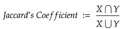

# 分类数据、Jaccard 系数和多重处理

> 原文：<https://towardsdatascience.com/categorical-data-jaccards-coefficient-and-multiprocessing-b4a7bd5d90f6?source=collection_archive---------18----------------------->


威廉·克劳斯在 [Unsplash](https://unsplash.com?utm_source=medium&utm_medium=referral) 上的照片

佛罗里达州的机场比海得拉巴的机场更靠近底特律机场，我们知道这一点是因为我们使用纬度和经度来测量距离(海得拉巴是印度的一个大城市)。但是，我们如何说一个购物篮的内容更接近另一个呢？或者一个森林和另一个森林在生活的动物方面更相似？我们可以将这些视为集合之间的比较，并使用 Jaccard 系数(我们将互换使用系数和相似性得分)来度量它们之间的相似性(或不相似性)。对于大型数据集，这可能是一项很大的任务，因此我们可以使用并行处理在较短的时间内完成它。[见*上的完整笔记本*kaggle](https://www.kaggle.com/caseyw/jaccard-s-metric-introduction)。

## 搭建舞台的快速示例



因此，当比较两个集合(可以是一个数组、一个序列，甚至是一个二进制值的向量)时，分子是集合之间共享的元素数，分母是两个集合中的元素数。在我们的例子中，分母是任一集合的大小，所以我们也可以说这个相似性得分是共享元素的数量除以可以共享的元素的数量。

让我们看一个简单的例子:

```
from sklearn.metrics import jaccard_score
from scipy.spatial.distance import jaccardx = [[1,1,1],[1,0,1],[0,0,0]]print(x)
[[1, 1, 1], [1, 0, 1], [0, 0, 0]]jaccard(x[0],x[1])
0.33jaccard_score(x[0],x[1])
0.66
```

数组 x 有三行。第一行是我们希望比较的观察值。请注意 Jaccard 函数是如何返回前两行之间不共享的元素数量的。jaccard_score 函数返回相反的结果:它是前两行之间共享的元素数量。一个表示不同，一个表示相似。我个人更喜欢 scikit-learn 中提供的相似性评分，但重要的是你要意识到其中的区别。

(还要注意，有些人认为元素 0 根本不应该包含在计算中。在某些情况下，这是有意义的。)

既然我们已经在一个简单的案例中看到了这个指标，那么让我们将它应用到一个更大的数据集。

## 用 Jaccard 和并行处理测量距离

```
import numpy as np
import pandas as pdx0 = np.random.choice([0, 1], size=(100000,100), p=[4./5, 1./5])
x1 = np.random.choice([0, 1], size=(100000,100), p=[1./3, 2./3])
x2 = np.random.choice([0, 1], size=(100000,100), p=[1./2, 1./2])colnames = ['x_'+str(i) for i in range(0,100)]X = pd.DataFrame(data = np.stack([x0,x1,x2]).reshape(300000,100))
X.columns = colnamestarget = np.ones(100).astype(int)
```

我们的目标是所有特征都设置为 1 的一个观察。想象一下，一个购物篮购买了网上商店的所有商品，你想看看哪些观察结果最接近它。这主要是为了示例的目的，但是您可以看到这如何扩展到其他用例。

使用二进制值数据(1 和 0)创建了一个巨大的 300k 观察值阵列，以代表指标特征或虚拟变量。第一个三分之一是 1 的概率是 1/5，第二个三分之一是 2/3，最后一个三分之一是 1/2。让我们看看有多少观察结果与我们的目标重叠，重叠了多少！但是首先，让我们利用多重处理包并创建一个分部函数来并行比较几个观察值和目标值(这是一个巨大的时间和内存节省)。

```
from functools import partial
import multiprocessing as mppartial_jaccard = partial(jaccard_score, target)with mp.Pool() as pool:
    results = pool.map(partial_jaccard, [row for row in X.values])
```

上面的代码花了差不多一分钟的时间(大约 50 秒)。这是经过多重处理和对 100 个特征进行 30 万次观察后得出的结果。您可能会遇到包含更多要素和更多观测值的数据集。试图在一个循环中完成上述任务导致我的电脑完全崩溃(蓝屏/皱眉头)，但如果你够勇敢，那么你应该尝试一个数据子集，看看需要多长时间。

下面是结果。您将看到，对于前三分之一的数据(有 1/5 概率为 1 的数据)，您可以看到有一个 Jaccard 相似性得分为 0.2 (20%)的峰值。其他峰值也是如此。这证实了比较是与我们的多重处理和部分功能一起工作的。


## 结论

当您有二进制数据(如指标特征或虚拟变量的情况)并且您想要在您的观察值之间创建某种类型的距离度量时，请考虑这个 Jaccard 的系数/相似性得分。这相当直观，但是需要一点额外的工作来对大量数据进行测量。考虑将此指标用于仪表板或报告，如果您考虑将其用于聚类任务，请记住，进行成对比较对于您的计算机来说是一项巨大的任务，您应该考虑制作聚类中心并与之进行比较。

**参考文献**

[](https://en.wikipedia.org/wiki/Jaccard_index) [## Jaccard 索引

### Jaccard 指数，也称为 Jaccard 相似系数，是一种用于衡量相似性和相似性的统计量

en.wikipedia.org](https://en.wikipedia.org/wiki/Jaccard_index) [](https://scikit-learn.org/stable/modules/generated/sklearn.metrics.jaccard_score.html) [## sk learn . metrics . JAC card _ score-sci kit-learn 0 . 24 . 1 文档

### Jaccard 相似系数得分。Jaccard 指数[1]，或 Jaccard 相似系数，定义为…

scikit-learn.org](https://scikit-learn.org/stable/modules/generated/sklearn.metrics.jaccard_score.html)  [## 多重处理-基于进程的并行性- Python 3.9.1 文档

### 是一个支持使用类似于模块的 API 生成进程的包。该套餐提供本地和…

docs.python.org](https://docs.python.org/3/library/multiprocessing.html) [](https://github.com/caseywhorton/medium-blog-code) [## GitHub-Casey Horton/medium-blog-code

### 在 GitHub 上创建一个帐户，为 Casey Horton/medium-blog-code 开发做贡献。

github.com](https://github.com/caseywhorton/medium-blog-code)