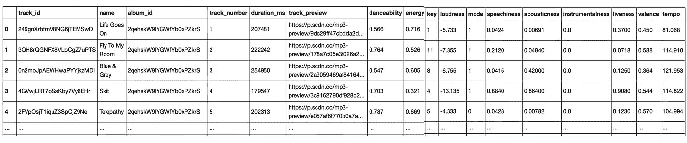
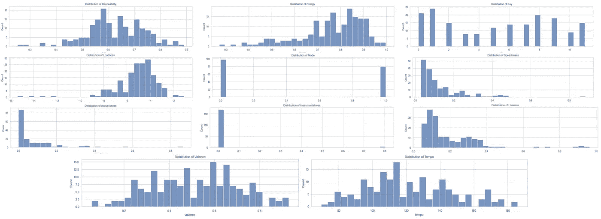
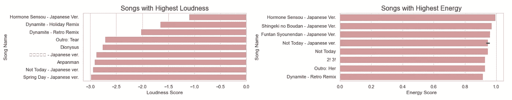
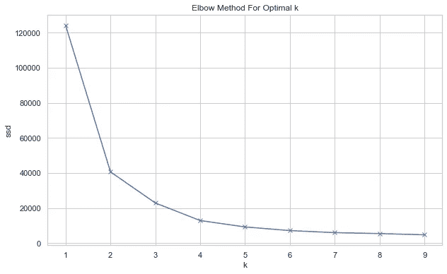
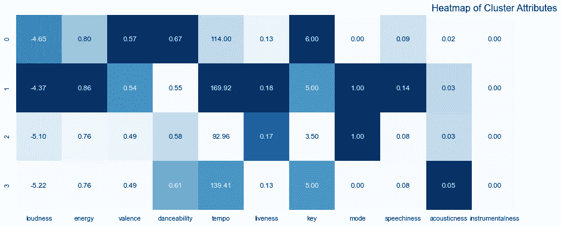
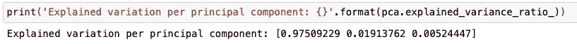
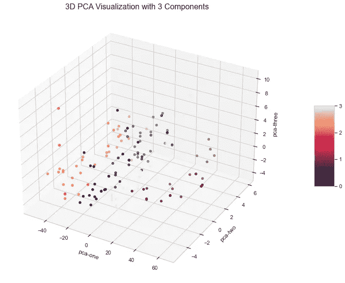
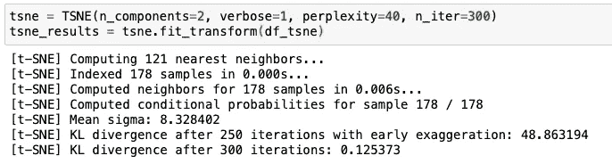
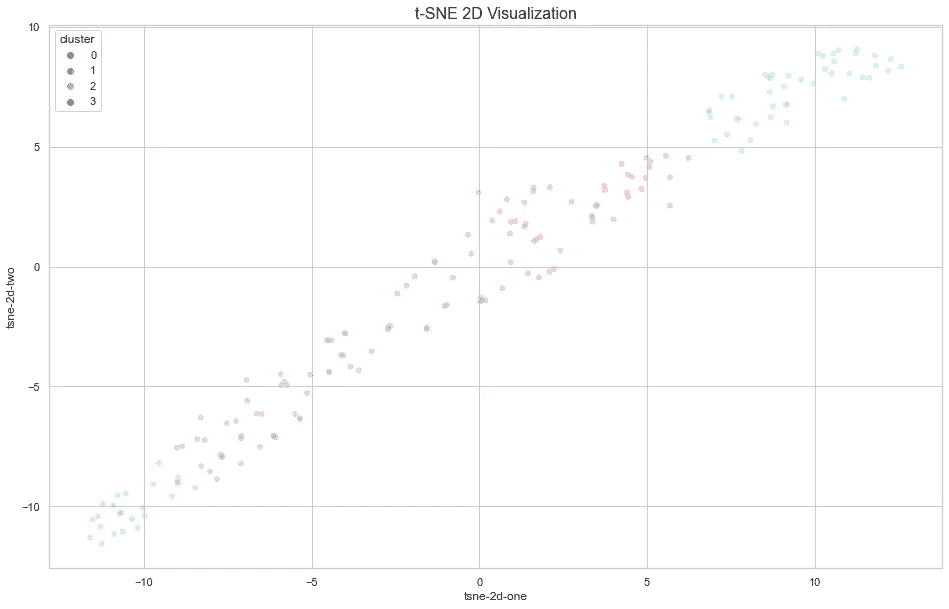
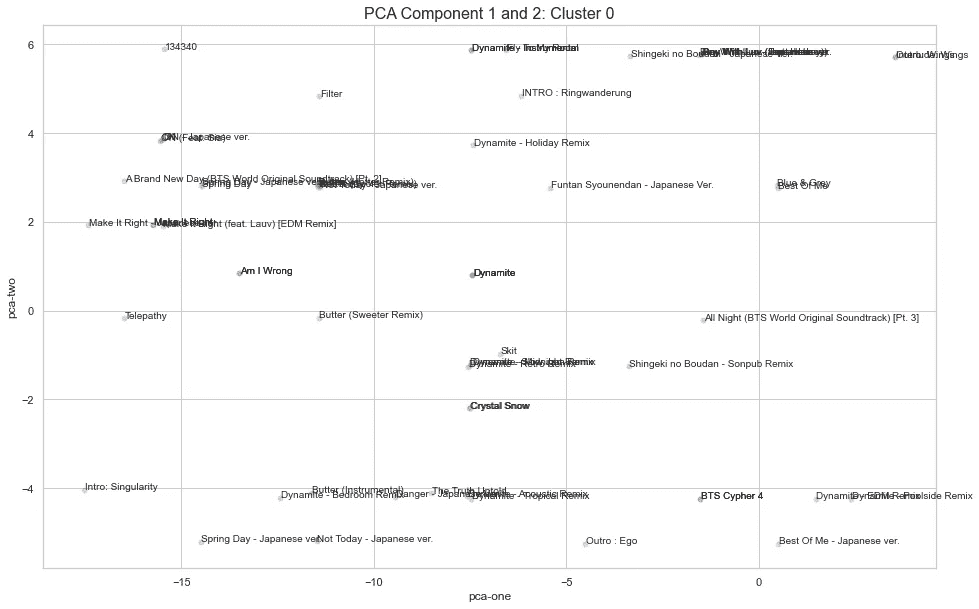

# BTS 歌曲特征分类:一个多维聚类案例

> 原文：<https://towardsdatascience.com/categorizing-bts-songs-features-a-multi-dimensional-clustering-case-ba2a0c07174d?source=collection_archive---------31----------------------->


由 [C D-X](https://unsplash.com/@cdx2?utm_source=medium&utm_medium=referral) 在 [Unsplash](https://unsplash.com?utm_source=medium&utm_medium=referral) 上拍摄的照片

## 使用 Spotify 音频功能对 BTS 歌曲进行聚类，使用 Python 中的 PCA 和 t-SNE 对聚类进行可视化

生活在 2021 年的年轻人对 BTS 一无所知几乎是不可能的。至少，你会听说过他们的名字，甚至他们的热门歌曲。我开始注意到他们的歌曲后，“男孩与爱”击中，并一直在享受其他热门歌曲，如“炸药”，以及最近的“黄油”。

这里我分析一下 BTS 歌曲的音频特征。我正在使用 Spotify 和**的**音频功能，根据这些属性**对歌曲进行聚类，希望找到其他与我喜欢的歌曲具有类似功能的 BTS 歌曲，如《炸药》和《黄油》。**

> 注意:完整的源代码和收集的数据可以在 [this Github](https://github.com/oliviatan29/bts-song-analysis) 中找到

# 数据收集

为了收集数据，我使用了 [Spotify 开发者 API](https://developer.spotify.com/) 。您可以注册您自己和您的应用程序，并从您的代码中获取用于 API 调用的 API 令牌。然后可以使用 Python 中的`spotipy`包从 API 中检索数据。

我之前在这里分享了更多关于从 Spotify API [获取数据的细节，或者你可以在这里](/what-covid-related-topics-are-being-discussed-in-spotify-podcasts-bbc7eb9a3f1)查看具体的 Python 笔记本[。下面是我利用 Spotify API 调用并最终收集 BTS 歌曲列表及其功能的数据帧的方法。](https://github.com/oliviatan29/bts-song-analysis/blob/main/BTS%20Spotify%20-%20Data%20Collection.ipynb)


使用 Spotify API 获取艺术家每首歌曲的音频特征(图片由作者提供)

下面是收集的数据帧的快照。关于数据收集过程的完整代码，可以去[本笔记本](https://github.com/oliviatan29/bts-song-analysis/blob/main/BTS%20Spotify%20-%20Data%20Collection.ipynb)。



音频特征的样本数据帧(图片由作者提供)

# 了解功能

Spotify API 为每首曲目提供了 11 种音频功能，从**描述性指标**(速度、音调、模式)，到**置信度指标**(声音、语速、乐器感、响度)，以及**感知性指标**(活力、能量、可舞性、效价)。

与任何其他探索性数据分析一样，我们从检查数据集中每个要素的汇总统计数据开始。从直方图分布中，我们可以看到 BTS 歌曲的**更高的可跳舞性、能量和响度**的趋势。这是意料之中的，因为舞蹈编排是韩国流行乐队不可或缺的一部分，因此他们倾向于发布适合“点”舞的关键乐观歌曲。



每个功能的价值分布(图片由作者提供)

检查该数据集中要素之间的相互作用时，我们会查看皮尔逊相关系数。响度、能量、效价和可跳性之间存在正相关。另一方面，响度与声学之间存在负相关关系；能量转化为声音。响度**高的歌曲**往往具有**高的能量、效价和可舞性**但**低的声音**。


音频特征中变量之间的相关性(图片由作者提供)

采样响度和能量最高的歌曲，部分歌曲在响度和能量排行榜上重叠: [**荷尔蒙 Sensou —日语 Ver。**](https://open.spotify.com/track/0zFiJHcn41PbBeU4pYJdNF) 和[不是今天—日文版](https://open.spotify.com/track/6aJj9OlLiZVagW8fd8ZtK3)。我在这篇文章中添加了这些歌曲的 Spotify 链接，是的，这是一首非常有活力的嘻哈歌曲:)



最高音量和能量的 BTS 歌曲(图片由作者提供)

# 使聚集

引用[geeksforgeeks.org](https://www.geeksforgeeks.org/clustering-in-machine-learning/)的话，聚类的任务是将总体或数据点分成几个组，使得同一组中的数据点与同一组中的其他数据点更相似，而与其他组中的数据点不相似。我们可以利用这一点将 BTS 歌曲分成几个组，即充满活力的嘻哈歌曲、柔和的原声歌曲等。

最广泛使用的聚类算法之一是 **k-means** ，它涉及到将样本分配给聚类，以最小化每个聚类内的方差。在 k-means 中，您将有 **k 个质心点**，数据点将根据**到这些质心点**的距离进行分组，到距离最小的点。

k-means 聚类的第一步是找到 k 的最佳数量，这可以使用**肘方法**来完成。在这里，我们计算 k 的每个潜在数量的**失真**(欧几里德距离)或**惯性**(距离的平方和)。然后我们将它们可视化，并选择失真/惯性**开始线性下降的点**。从这个数据来看，似乎**最优 k 是 4** 。点击阅读更多关于肘法[的内容。](https://www.geeksforgeeks.org/elbow-method-for-optimal-value-of-k-in-kmeans/)

```
from sklearn.cluster import KMeans# Calculate sum of squared distances
ssd = []
K = range(1,10)
for k in K:
    km = KMeans(n_clusters=k)
    km = km.fit(df_cluster)
    ssd.append(km.inertia_)# Plot sum of squared distances / elbow method
plt.figure(figsize=(10,6))
plt.plot(K, ssd, 'bx-')
plt.xlabel('k')
plt.ylabel('ssd')
plt.title('Elbow Method For Optimal k')
plt.show()
```



肘法(图片由作者提供)

使用来自 [sci-kit-learn](https://scikit-learn.org/stable/modules/generated/sklearn.cluster.KMeans.html) 库中的 KMeans 函数，我们可以获得数据集中每首 BTS 歌曲的聚类。下面是聚类结果。

```
kmeans = KMeans(n_clusters=4)
model = kmeans.fit(df_cluster)pred = model.labels_
df_cluster['cluster'] = pred
```

*   **第 0 类:欢快的歌曲**，可跳性和效价高，响度很大
*   **集群 1:强有力的歌曲**，由高能量、响度、节奏、活力来指示
*   **第二类:典型的流行歌曲**，活跃度和声音都很高
*   **第三类:冷歌**，具有很高的听觉性、舞蹈性和节奏



每个分类中 50%属性的热图(图片由作者提供)

我们通常通过绘制数据集和要素来验证聚类结果，并将聚类设置为绘图中的色调。然而，因为我们要处理 11 个特性，所以几乎不可能在同一个图中绘制。为了解决这个问题，我们可以使用降维技术。

# 降维

当处理具有大量要素的大型数据集时，会出现复杂情况，因为处理会**计算量很大，需要处理多个测量值(即多重共线性问题)并且难以可视化数据。维度缩减技术有助于**减少数据集中的要素数量**，而不必丢失太多信息并保持(或提高)模型的性能。这里使用的一些流行技术是主成分分析(PCA)和 t-分布随机邻居嵌入(t-SNE)**

## 主成分分析

PCA 通过**从现有的一大组变量中提取一组新的变量**(称为*主成分*)来帮助我们降维。这些主成分实际上是原始变量的**线性组合。你可以在这里阅读更多关于 PCA [的内容。](https://www.analyticsvidhya.com/blog/2016/03/pca-practical-guide-principal-component-analysis-python/)**

```
from sklearn.decomposition import PCApca = PCA(n_components=3)
pca_result = pca.fit_transform(df_pca.values)
df_pca['pca-one'] = pca_result[:,0]
df_pca['pca-two'] = pca_result[:,1] 
df_pca['pca-three'] = pca_result[:,2]df_pca['cluster'] = pred
df_pca
```

理想情况下，PCA 中主成分的数量**足够小，以便能够可视化**(即≤ 4 个成分)，但**足够大，以便解释数据集中的大多数差异**(即> 70%)。我用 3 个组件进行测试，结果发现它们能够解释数据集中 99.9%的差异。第一个成分能够解释 97.5%的差异，第二个成分增加了 1.9%，第三个成分增加了 0.5%。



主成分分析中的解释方差比

在这种情况下，我们使用主成分分析来可视化我们的 K 均值聚类是否相应地分离了 BTS 歌曲。这里我使用的是 3D 图，我们可以清楚地看到聚类 0、聚类 1、聚类 2 和聚类 3 之间的分离(以色调显示)；主要在 x 轴上。

```
ax = plt.figure(figsize=(16,10)).gca(projection='3d')
sctt = ax.scatter(
    xs = df_pca["pca-one"], 
    ys = df_pca["pca-two"], 
    zs = df_pca["pca-three"], 
    c = df_pca["cluster"]
)ax.set_xlabel('pca-one')
ax.set_ylabel('pca-two')
ax.set_zlabel('pca-three')plt.title("3D PCA Visualization with 3 Components", fontsize=16)cb = plt.colorbar(sctt, ax=ax, shrink=0.3, aspect=4, pad=0.1)
cb.set_ticks([0,1,2,3])plt.show()
```



BTS 歌曲音频特征的 3D PCA 可视化(图片由作者提供)

## t 分布随机邻居嵌入(t-SNE)

如果 PCA 算法使用线性函数来提取新的特征，t-SNE 算法提供了一种**非线性方式**来解决这个问题。它计算点在高维空间的相似概率并计算点在对应低维空间的相似概率，**最小化这种成对分布**。你可以在这里阅读更多关于 t-SNE 的信息。

```
from sklearn.manifold import TSNEtsne = TSNE(n_components=2, verbose=1, perplexity=40, n_iter=300)
tsne_results = tsne.fit_transform(df_tsne)df_tsne['cluster'] = pred
df_tsne
```

使用来自 sklearn 的 TSNE 类，我们可以开发具有可配置数量的组件、困惑和迭代的 t-SNE 模型。为了评估要使用的理想参数，我们可以检查 **KL 散度值**——目标是**尽可能接近 0** 。如果 KL 散度随着迭代的增加没有太大改善，我们可以停止迭代。



评估 t-SNE 中 KL 散度

绘制 t-SNE 结果将有助于我们理解早期聚类的分离以及模式是如何保持的。在这里，我们可以看到 t-SNE 2 组分变量上的聚类之间的明显差异，肯定了聚类结果。

```
df_tsne['tsne-2d-one'] = tsne_results[:,0]
df_tsne['tsne-2d-two'] = tsne_results[:,1]
plt.figure(figsize=(16,10))
sns.scatterplot(
    x="tsne-2d-one", y="tsne-2d-two",
    hue="cluster",
    palette=sns.color_palette("hls", 4),
    data=df_tsne,
    legend="full",
    alpha=0.3
)plt.title("t-SNE 2D Visualization", fontsize=16)
```



t-SNE 2D 可视化的 BTS 歌曲的音频特征(图片由作者提供)

# 解释结果

既然我们对之前在我们的聚类中完成的分离很有信心，我们可以继续关注聚类结果。看了一下结果，才知道我喜欢的几首 BTS 的歌(炸药，黄油，有 Luv 的男孩)都在同一个集群上，就是**集群 0** 。

回顾 PCA 图，在这里我们可以看到歌曲“炸药”和“黄油”彼此放置得非常接近，显示出较高的相似性。因此，考虑到潜在的相似性，也许接下来我可以听“我错了吗”或“水晶雪”？



聚类 0 的 PCA 组件 1 和 2 可视化(作者提供的图片)

另一方面，与 PCA 不同，t-SNE 图可视化中的轴距离可能不表示相似性。阅读这篇[文章](https://distill.pub/2016/misread-tsne/)了解更多详情。

# 结束语

聚类是最强大的分析技术之一，因为它允许我们发现数据中的模式和组。然而，当处理高维特征时，可能难以理解和解释结果。使用降维的可视化将对此有所帮助，因为它保留了数据点内部的关键信息。除了可视化之外，降维技术还可以用作数据建模中的预处理步骤，以减少模型训练时间。

此分析的完整代码可在[此处](https://github.com/oliviatan29/bts-song-analysis)访问。