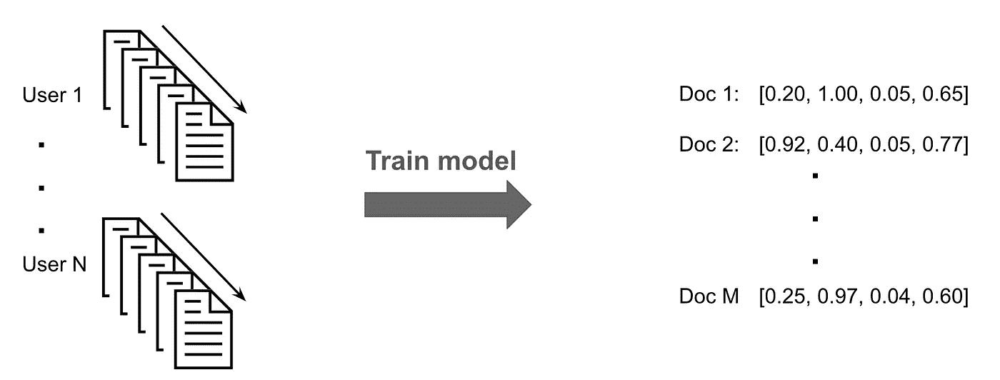
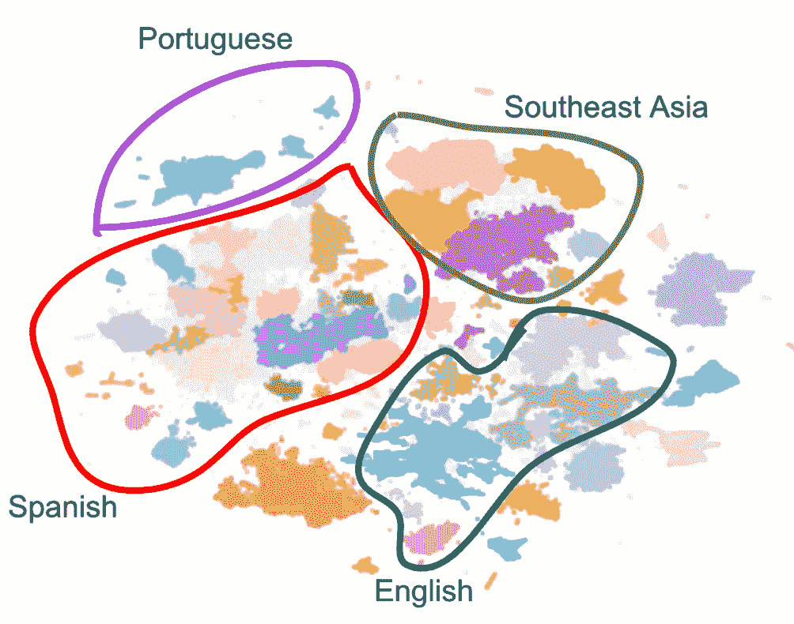
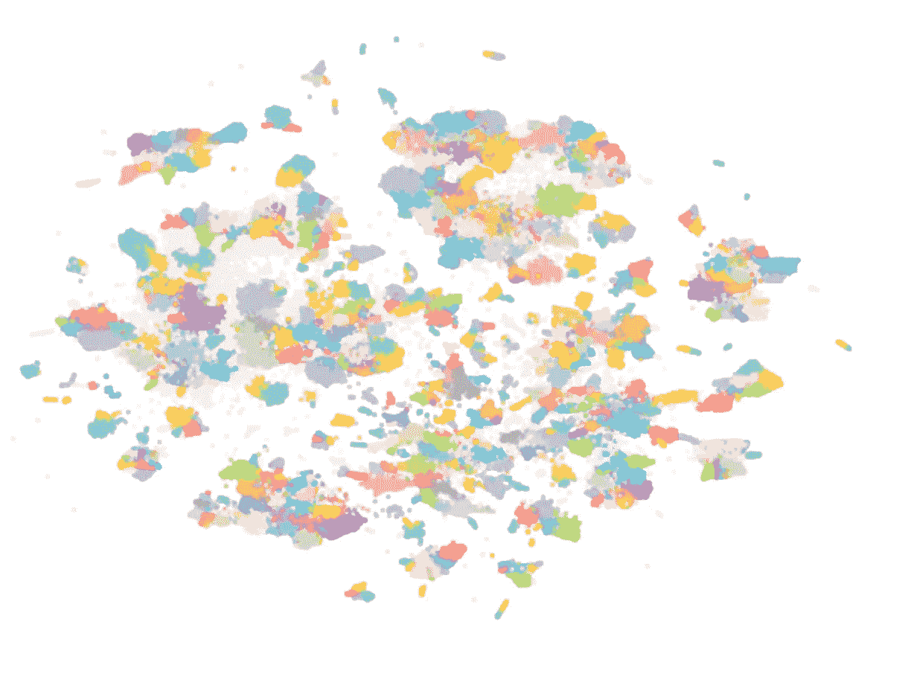
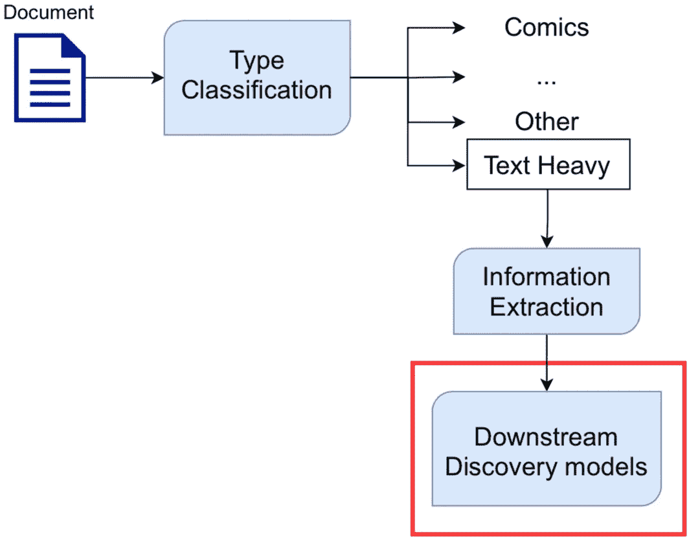
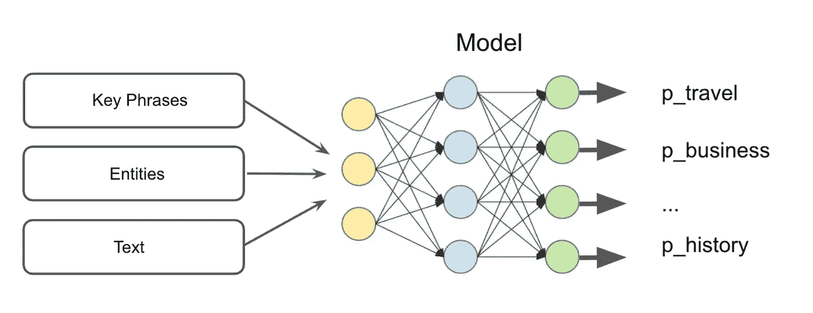
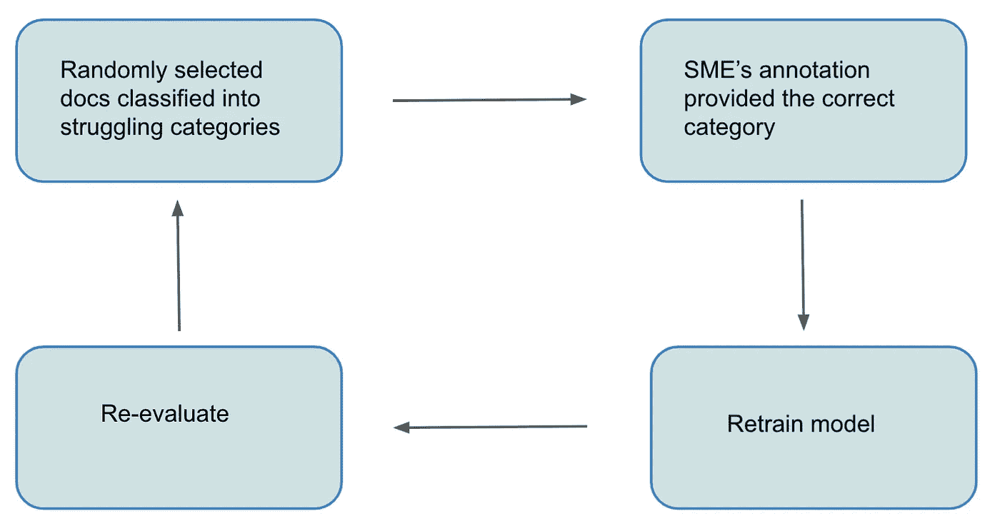
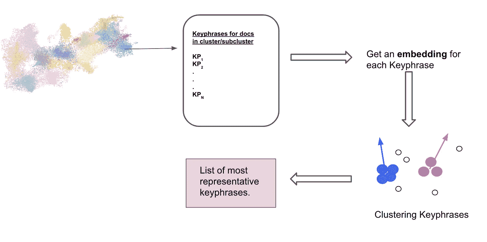
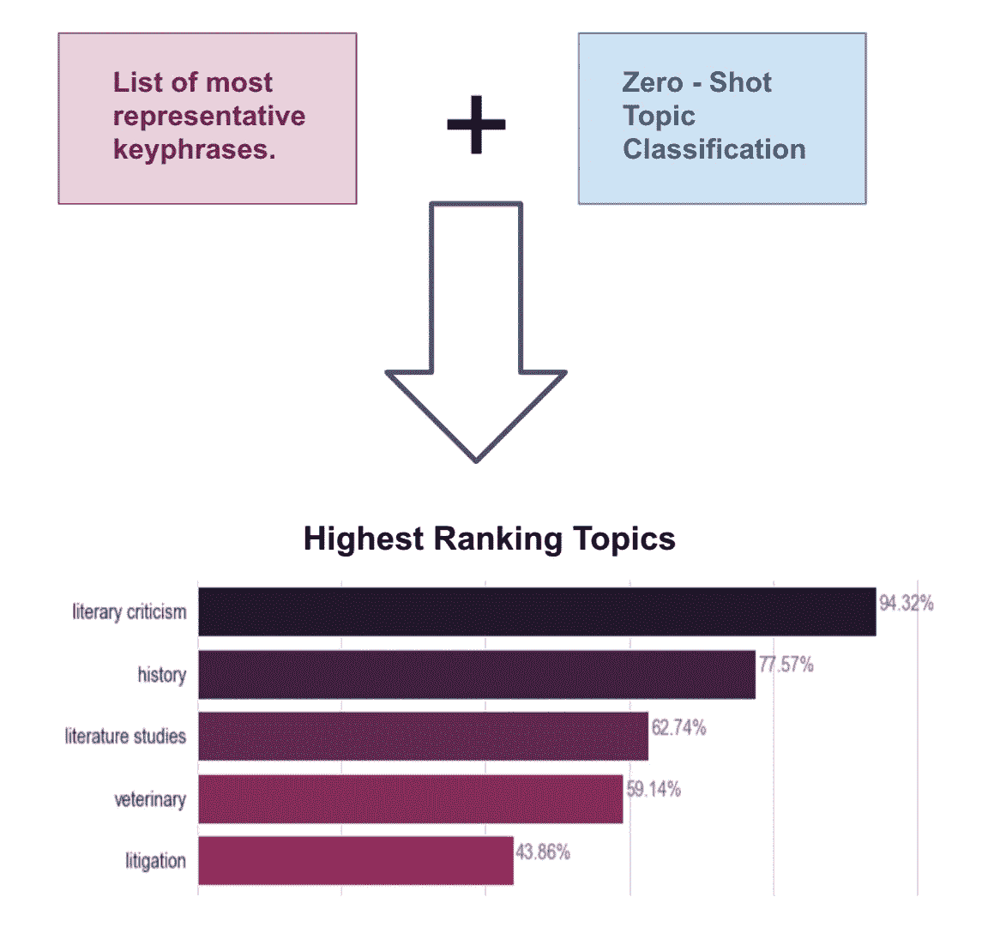

# 对用户上传的文档进行分类

> 原文：<https://towardsdatascience.com/categorizing-user-uploaded-documents-2d3159fb1104?source=collection_archive---------26----------------------->

## 从数据中获得的见解如何被用来帮助构建分类法，以及我们为用户上传的文档分配类别的方法。

Scribd 向我们的用户提供各种发布者和用户上传的内容，虽然发布者的内容富含元数据，但用户上传的内容通常不是。用户上传的文档具有不同的主题和内容类型，这使得将它们链接在一起具有挑战性。连接内容的一种方式是通过分类法，分类法是广泛应用于各种领域的一种重要的结构化信息。在这个系列中，我们已经分享了我们如何[识别文档类型](/identifying-document-types-at-scribd-116311993c8e)和[从文档中提取信息](/information-extraction-at-scribd-f62f3025b5c9)，这篇文章将讨论如何利用数据的洞察力来帮助建立分类法，以及我们为用户上传的文档分配类别的方法。

# 构建分类

统一分类法是一个具有两层的树状结构，它是通过结合我们的主题专家(SME)对图书行业主题词( [BISAC](https://bisg.org/page/BISACEdition) 类别)的知识和数据驱动的见解而设计的。我们使用用户阅读模式来寻找有助于丰富我们的统一分类法的主题。

# 数据驱动的洞察力

10 多年来，用户一直在与 Scribd 内容互动，随着时间的推移，建立了阅读模式。我们利用这些阅读模式来创建文档的密集向量表示，类似于文本中的 word2vec。

**图 1:** 我们方法的示意图:阅读序列用于为用户上传的文档创建矢量表示。所示的向量尺寸仅仅是说明性的(图片由作者提供)。

对于这项工作，我们只关注用户上传的文档和一种类型的交互(阅读时间最短)。选择嵌入维度(和其他超参数)来优化命中率@20 ( [Caselles-Dupré，et al 2018](https://arxiv.org/abs/1804.04212) )，增加嵌入的语义紧密度。

现在我们有了嵌入，我们想用它们来查找具有相似主题和题目的文档组。找到这些组将有助于我们确定应该添加到分类法中的类别。

与我们嵌入的原始高维空间相比，维数减少允许在减少的空间中更有效和准确地发现密集的文档聚类。我们使用 [t-SNE](https://scikit-learn.org/stable/modules/generated/sklearn.manifold.TSNE.html) 算法来降低嵌入的维数。t-SNE 有一个非线性的方法，可以捕捉点之间的较小关系，以及数据的全局结构。我们使用了 t-SNE(基于快速傅立叶变换加速插值的 t-SNE)——[FIt-SNE](https://github.com/KlugerLab/FIt-SNE)的实现，这种实现很灵活，不会为了速度而牺牲精度。

最后，我们通过使用 [HDBSCAN](https://arxiv.org/pdf/1709.04545.pdf) 对减少的嵌入进行聚类来对用户上传的文档进行分组。HDBSCAN 根据密度分布将数据点分成簇。它还具有检测噪声的功能，噪声是指距离最近的检测到的聚类太远而不属于它的点，并且缺乏形成自己的聚类的密度。

图 2 显示了用户上传的文档及其组的 2D 表示。我们注意到并在图中强调的第一件事是，主要群体通常用语言来表示。不足为奇的是，用户倾向于阅读大多数单一语言的内容。

**图 2:** 使用 t-SNE 和 HDBSCAN 的嵌入的初始 2D 表示。每个彩色组代表 HDBSCAN 发现的一个星团。散布的灰点被识别为噪声(图片由作者提供)。

我们开发了一种技术，将上面的组进一步分成语义更紧密的更小的集群。最终的集群可以在图 3 中看到。

**图 3:** 进一步分割每个聚类后嵌入的最终 2D 表示。每个彩色组代表 HDBSCAN 为特定集群找到的一个子集群。散布的灰点被识别为噪声(图片由作者提供)。

在我们得到图 3 所示的集群和子集群之后，对英语子集群进行了检查，以便识别它们的主要主题和主题。这项调查导致分类中加入了其他类别，如菲律宾法律、学习辅助和考试准备以及教学方法和材料，从而使分类更广泛地涵盖不同的内容类型，并且浏览这些内容更加简单。

# 将文档分类

**图 4:**Scribd 的多组分管道图。分类是图中突出显示的下游任务之一。

现在我们有了分类法，是时候将文档分类了。我们的方法利用了本系列第二部分中讨论的提取的关键短语和实体。图 5 说明了我们的模型是如何工作的:我们训练了一个监督模型，使用关键短语、实体和文本将被识别为大量文本的文档(参见[第一部分](/identifying-document-types-at-scribd-116311993c8e))分类。

**图 5:** 对文档进行分类的模型架构(图片由作者提供)。

# 来自数据的更多见解

在模型的第一次迭代中，我们有一个由我们的专家收集的训练数据集，以符合每个类别的定义。不足为奇的是，在对生产中的未知数据测试模型时，我们意识到对于某些类别，训练集并不能完全代表生产中适合它们的文档类型。因此，该模型无法用初始给定的训练集进行概括。例如，在初始训练集中，大多数关于美国以外国家的文档都是关于旅行的文档。这意味着该模型了解到，每当文档提到其他国家时，该文档很可能是关于旅行的。出于这个原因，例如，关于南美的商业文档将被放置在模型的 travel 下。

我们应用了一种有时被称为主动学习的技术，用缺失的例子来补充我们的训练集。按照这种技术(图 6)，模型被应用于随机的文档样本，结果由我们的 SME 进行分析。

**图 6:** 用于提高模型性能的主动学习过程(图片由作者提供)。

这个迭代过程有两个结果:通过用大量的训练例子重新训练模型来改进分类性能，以及在我们识别出很大一部分文档符合这个特定类别之后添加一个新的类别，

# 附加实验

在整个项目中，进行了几个实验来探索用户交互集群的全部潜力。这里我们将展示一个令人兴奋的例子。

**给集群命名**

如上所述，一般来说，图 3 所示的每个子集群都是语义紧密的，这意味着属于一个子集群的文档通常是关于一个(或几个)主题/主题的。

将主题与子集群相关联的一种方式需要主题专家手动检查每个子集群中的文档，并为每个子集群提出最重要的主题。然而，这种方法不仅耗时，而且不能随着模型的新迭代和可能增加的集群数量而扩展。尝试使这成为一个更加自动化和灵活的过程是非常重要的。

我们试验了一个非常有前途的两步方法，自动将主题分配给子集群。在这种方法中，我们利用从[第二部分](/information-extraction-at-scribd-f62f3025b5c9)中描述的文本中提取的信息和零射击主题分类(更多信息[在此](https://arxiv.org/abs/1909.00161)):

*   步骤 1-通过聚类子集群的文档提取信息来找到子集群的最有代表性的关键短语。

**图 7:** 步骤 1 的图解(图片由作者提供)。

*   步骤 2-使用步骤 1 的结果和零触发主题分类来为每个子聚类找到最高排名的主题。

**图 8:** 步骤 2 的图示。具有最高排名主题的条形图是这种方法对于包含关于几部文学作品的文章(由作者提供的图像)的子集群的结果。

从图 8 中可以看出，由文学作品的文章组成的集群具有最高排名的主题文学评论，显示了这种方法自动为用户交互集群命名的潜力。

# 结论

在对文档进行分类的过程中，有两点很重要:

*   **高质量的标记数据** —我们发现干净一致的标记数据比超参数调整对模型更重要。然而，在我们多样化的语料库中获取足够多的符合类别的文档是一个挑战。使用了几种技术来提高模型在不可见数据上的性能。其中，主动学习被证明是收集额外训练样本和保证训练集中所需粒度的重要方法。
*   **注释对齐** —高质量数据和模型性能都与注释过程相关联(参见此处的更多)。当多个注释者参与数据收集和评估时，每个类别定义的一致性对于模型的精确训练和评估至关重要。这在文本分类中甚至更加重要，因为将类别/主题与文本相关联可能是一项非常主观的任务，尤其是当我们处理单标签分类问题时。

这个项目是理解我们的用户上传文档的一个重要里程碑:对文档进行分类使用户能够从我们的统一分类法中按类别浏览文档。此外，我们现在有能力理解每个用户感兴趣并与之交互的类别。将用户兴趣与业务指标相结合有助于推动创新和出乎意料的产品决策，并丰富可发现性和推荐。

# 后续步骤

*   使用数据驱动的方法改进分类:

接下来，我们如何确保新上传的文档包含在我们的分类中？

使用数据驱动的方法来构建分类法回答了这些问题，并且与手动创建的分类法相比，保证了更大的灵活性、全面性和特异性。随着新内容上传到我们的平台并被用户阅读，新的用户互动集群将形成，并帮助我们识别最近的用户兴趣。例如，在疫情期间，用户开始上传与新冠肺炎有关的文件。例如，在 2021 年对文档进行聚类产生了与新冠肺炎相关的附加聚类，这在疫情之前是不存在的。这种方法将帮助我们建立一个不太严格的分类法，一个反映 Scribd 大量内容的分类法，并且从长远来看很容易扩展。

*   多语言:

既然我们对用户上传的英文内容有了更多的了解，而且我们有一个一致的管道来给这些文档贴标签，我们可以将这种方法扩展到其他语言

这项工作和这篇文章是我与应用研究团队的同事 Antonia Mouawad 合作完成的。如果你有兴趣了解更多关于应用研究正在解决的问题，或者围绕这些解决方案建立的系统，请查看我们的[空缺职位](https://tech.scribd.com/careers/#open-positions)。