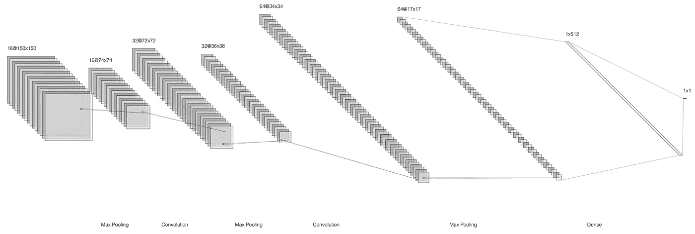
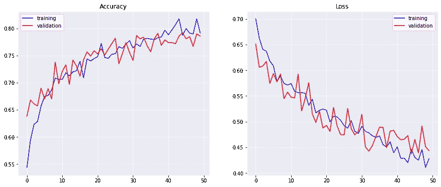

# 猫狗卷积分类器

> 原文：<https://towardsdatascience.com/cats-vs-dogs-convolutional-classifier-44ec04c8eb7a?source=collection_archive---------21----------------------->

## 使用 Python 代码、Tensorflow 和 Google Colab 从头开始创建和测试一个简单的模型

## 3 分钟机器学习

3 分钟机器学习是一系列与机器学习世界相关的教程和内容丰富的视频。你可以在 YouTube 上找到完整的视频。[库](https://github.com/GitMarco27/TMML)包含视频中显示的所有文件。这个系列是在实验阶段，完全免费开发，为了娱乐和文化！欢迎任何反馈。

其他剧集:

*   [用神经风格转移和张量流生成图像](/images-generation-with-neural-style-transfer-and-tensorflow-a823b0353b06)

## **为什么要读这篇文章？**

本文将会看到如何使用 **Google Colab** 来实现我们自己的**深度学习**模型的实用性和功能性。然后，我们将看到如何将一个预先存在的数据集导入到我们的工作空间中。我们将实现一个 **2D 卷积神经网络模型**，用于我们图像的**二进制分类**。一旦模型被建立和训练，我们将用新的图像测试我们的模型。

正确分类的图像——来自[像素库](https://pixabay.com/?utm_source=link-attribution&utm_medium=referral&utm_campaign=image&utm_content=323262)的 [K L](https://pixabay.com/users/teamk-222368/?utm_source=link-attribution&utm_medium=referral&utm_campaign=image&utm_content=323262) 图像

## Google Colab:为什么？

Colaboratory，简称“ **Colab** ”，是谷歌研究院的产品。Colab 允许任何人通过浏览器编写和执行任意的 **python 代码**，特别适合机器学习、数据分析和教育。从技术上来说，Colab 是一种托管的 Jupyter 笔记本服务，无需设置即可使用，同时提供对计算资源的免费访问，包括**GPU**。点击此[链接](https://research.google.com/colaboratory/faq.html)了解更多信息。

## 在 Google Colab 中选择运行时

当开发您自己的代码或使用共享代码时，请记住从运行时下的工具栏中选择所需的硬件加速器。对于这个案例研究，由于它是基于卷积网络的模型，所以最好使用平台上免费提供的 **GPU 的**的能力。总之，我们的**神经网络模型**有大量参数，必须使用**优化**算法来确定这些参数，以最小化期望的损失函数。这个过程包括**前向传播**和**后向传播**，对每个训练时期的每个**批**数据重复这个过程。因此，这个过程涉及到一个 ***大数*** 的简单数学运算。GPU，带有:

*   核心数量多
*   数千个并发硬件线程

允许我们更快地执行模型的训练和推理。

## 卷积分类器

图像分析可以通过各种深度学习和神经网络模型来执行，但是，C**on voluntive Networks**由于其有效性，几乎成为这种类型分析的强制工具。总而言之，一系列大小可变的**过滤器**的应用允许从图像本身提取信息和**特征**。第一层会提取出**最一般的特征**，越深的层越有**具体的特征**。同时，这种方法允许在模型的几个可训练参数下工作，这些参数远低于用专门基于**致密层**的神经网络分析图像所需的参数。更多信息，请参考[这篇文章](/intuitively-understanding-convolutions-for-deep-learning-1f6f42faee1)。

猫和狗的分类器结构-作者图片

## 代码

让我们从导入数据集开始:

让我们导入我们的**数据集**。它包含**狗**和**猫**的图像，这将允许我们训练我们的分类器。我们直接从 Google API 下载数据集，然后将其解压缩到所需的路径。我们通过定义路径来定义**目录**的结构。我们为**训练**和**验证**数据定义了两个独立的目录，每个目录又分为两个文件夹:狗和猫。这种结构可能看起来很复杂，但它变得特别复杂，因为它很容易与 Tensorflow 语法接口。所以让我们看看我们有多少数据。

让我们的神经网络模型，类似于前一个图像中描述的。在这种情况下，考虑到模型的简单性，我们使用 Keras 的**顺序 API。这允许我们通过简单地定义不同层的列表来创建神经网络，正如我们可以从名称本身猜测的那样。使用的层是在 Tensorflow/Keras 中实现的标准层的一部分。**

*   [Conv2D](https://www.tensorflow.org/api_docs/python/tf/keras/layers/Conv2D) : 2D 卷积层
*   [MaxPooling2D](https://www.tensorflow.org/api_docs/python/tf/keras/layers/MaxPool2D):2D 空间数据的最大池操作
*   [展平](https://www.tensorflow.org/api_docs/python/tf/keras/layers/Flatten):展平输入
*   [密集](https://www.tensorflow.org/api_docs/python/tf/keras/layers/Dense):规则密集连接 NN 层

*model.summary()* 显示我们模型的概要，显示每层的**名称**、**类型**、**输出形状**和**可训练参数**数量。

该型号必须**编制**，方可训练。对于本教程，我选择了 **Adam** 作为优化器，学习率固定。然而，通过优化结构和调整所有的*初级*和*次级* **超参数**，该模型可以得到很大的改进。我们将评估仅仅 ***准确度*** 作为评估模型性能的主要指标。然而，准确性可能会与其他指标相结合，例如 ***f-Beta 得分*** ，以便更可靠地评估模型的质量。

所使用的目录结构允许使用**图像数据生成器**和 **flow_from_directory** 方法。第一个允许对源图像应用缩放和**数据扩充**。为了进行这种分析，我们对**训练图像**应用了缩放、旋转、移动、剪切、缩放和翻转。您可能会注意到，没有对测试数据应用数据扩充。 **flow_from_directory** 方法自动加载指定路径中包含的子目录中的所有图像，并在文件夹名称后标记图像。我们只需指定图像的主路径、批量大小、分类模型和**目标大小**。

最后，我们可以训练模型，将训练数据存储在历史对象中。请注意，我们有 2000 个训练图像和 1000 个测试图像，批量大小为 20:对于 ***训练集*** ，每个时期有 100 个步骤，对于 ***验证集*** ，每个时期有 50 个步骤。让我们对网络进行少量纪元(50)的训练，看看结果。

培训历史-作者图片

在训练过程的最后，我们用我们的基本分类器在两个集合上实现了大约 80 % 的准确率 ***。这是一个好结果，但我们绝没有优化我们的模型，正如更长的训练似乎可能导致更高的表现。在接下来的一篇文章中，我们将看到如何使用各种超参数优化和迁移学习技术来尝试**改进我们的分类器。*****

您可以使用直接从本地存储空间上传的新图像来测试代码，并且**立即**获得一个**预测**。该模型虽然没有优化，但能够正确预测以下两幅图像的类别，这两幅图像是该模型在训练或验证阶段从未见过的。

测试图像—作者提供的图像

# 结论

我希望你喜欢这篇文章的内容。我提醒你，你可以在这里找到[源代码](https://github.com/GitMarco27/TMML/blob/main/Notebooks/003_Cat_vs_Dog.ipynb)，在 GitHub 和 [YouTube](https://www.youtube.com/channel/UCExkeDZ9WC0tg9aoFMsNF0w) 上可以找到完整的[资源库](https://github.com/GitMarco27/TMML)。
下次见，
马尔科