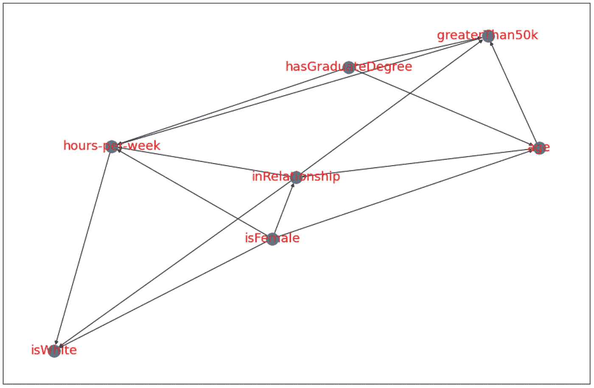

# 因果发现

> 原文：<https://towardsdatascience.com/causal-discovery-6858f9af6dcb?source=collection_archive---------0----------------------->

## 使用 Python 从数据中学习因果关系

这是关于因果关系的三篇系列文章的最后一篇。之前的帖子里介绍了</causality-an-introduction-f8a3f6ac4c4a>**因果关系的“新科学”【1】，讨论了 [**因果推断**](/causal-inference-962ae97cefda) 的话题。本文的重点是一个相关的想法，**因果发现**。我将从描述什么是因果发现开始，给出它如何工作的草图，并以一个使用 Python 的具体例子结束。**

****

**因果发现的总体目标:将数据转化为因果模型。图片作者。**

# **什么是因果发现？**

**在 [**上一篇**](/causal-inference-962ae97cefda) 中，我讨论了**因果推断**，旨在**回答涉及因果**的问题。虽然因果推理是一个强大的工具，但它*需要*一把钥匙来操作。也就是说，它需要一个因果模型。然而，通常在现实世界中，我们可能无法确定哪些变量是互为因果的。这就是因果发现能有所帮助的地方。**

****因果发现**旨在**从数据中推断出因果结构**。换句话说，给定一个数据集，*导出*一个描述它的因果模型。**

# **它是如何工作的？**

**没有标准的因果发现方法。事实上，有各种各样的技术可供使用，其中任何两种可能彼此没有什么相似之处。我在这里的目标是勾画不同算法的共同主题，并给出一些关键思想的味道。**

**正如我在本系列的 [**第一篇**](/causality-an-introduction-f8a3f6ac4c4a) 中提到的，因果发现是**逆问题**的一个例子。这就像根据冰块在厨房台面上留下的水坑来预测它的形状一样。**

**显然，这是一个难题，因为任何形状都可能产生同一个水坑。将这与因果关系联系起来，水坑就像是嵌入数据中的统计关联，而冰块就像是潜在的因果模型。**

## **因果发现的 4 个常见假设**

**解决逆问题的通常方法是对你试图揭示的东西做出假设。这缩小了可能的解决方案的范围，有希望使问题可以解决。**

**因果发现算法有四个共同的假设。在参考文献[【3】](https://arxiv.org/abs/1803.04929)中可以找到对这些假设的很好的讨论。**

1.  ****无环性** —因果结构可以用 DAG (G)来表示**
2.  ****马尔可夫性质** —当以它们的父节点为条件时，所有节点都独立于它们的非子节点**
3.  ****忠实度** —真实基础分布中的所有条件独立性 *p* 用 G 表示**
4.  ****充分性**—G 中的任何一对节点都没有共同的外因**

**尽管这些假设有助于缩小可能模型的数量，但它们并没有完全解决问题。这就是因果发现的一些技巧有用的地方。**

# **因果发现的 3 个技巧**

**如前所述，没有一种单一的因果发现方法能支配所有其他方法。尽管大多数方法都使用上述假设(甚至更多)，但不同算法的细节可能会有很大差异。**

**下图给出了基于以下技巧的算法分类。这绝不是一个详尽的概述。更确切地说，这是我从引用的参考资料[ [2](https://www.frontiersin.org/articles/10.3389/fgene.2019.00524/full) 、 [4](https://fentechsolutions.github.io/CausalDiscoveryToolbox/html/causality.html#module-cdt.causality.graph) 、 [5](https://www.sciencedirect.com/science/article/abs/pii/0165188988900553?via%3Dihub) ]中偶然发现的算法集合。**

****

**基于[ [2](https://www.frontiersin.org/articles/10.3389/fgene.2019.00524/full) 、 [4](https://fentechsolutions.github.io/CausalDiscoveryToolbox/html/causality.html#module-cdt.causality.graph) 、 [5](https://www.sciencedirect.com/science/article/abs/pii/0165188988900553?via%3Dihub) ]的因果发现方法的狭义分类。图片作者。**

## ****招数 1:条件独立性测试****

**这些最早的因果发现算法之一是以其作者 Peter Spirtes 和 Clark Glymour 命名的 **PC 算法**。这种算法(以及其他类似的算法)使用了这样一种思想:两个统计上独立的变量****没有因果联系**。PC 算法说明了第一个技巧。下图给出了算法的概要。关于 PC 算法的更多细节，我推荐参考文献[[2](https://www.frontiersin.org/articles/10.3389/fgene.2019.00524/full)&[[6](https://www.jstatsoft.org/article/view/v047i11)]中的讨论。****

********

****PC 算法概要 [2](https://www.frontiersin.org/articles/10.3389/fgene.2019.00524/full) 、 [6](https://www.jstatsoft.org/article/view/v047i11) 。图片作者。****

****第一步是使用数据集中的每个变量形成一个完全连通的无向图。接下来，如果相应的变量是独立的，则删除边。然后，连接的边经受条件独立性测试，例如上图中以中间节点为条件的底部和最右侧节点的独立性测试(步骤 2)。****

****如果对一个变量的条件化消除了依赖性，则该变量被添加到这两个变量的分离集中。根据图表的大小，条件独立性测试将继续进行(即更多变量的条件)，直到不再有候选测试。****

****接下来，碰撞器(即 X → Y ← Z)基于节点对的分离集被定向。最后，剩余的边基于 2 个约束被定向，1)没有新的 v-结构，以及 2)不能形成定向的环。****

## ******招数二:图形空间的贪婪搜索******

****这个技巧有三个主要元素:一个**图**，一个**图空间**，以及一个**贪婪搜索**。****

******图**是由边(线)连接的顶点(圆)组成的数学结构。因果模型通常使用一种特殊的图，称为有向无环图(DAG)。图和 Dag 在 [**第一帖**](/causality-an-introduction-f8a3f6ac4c4a) 中讨论过。简而言之，DAG 是一种顶点之间的边带有箭头并且不存在循环的图。****

****一个**图空间**是**图的集合**。这只是一种形式化的奇特方式，即对于给定数量的顶点和边，有许多可能的图。例如，一个有 2 个顶点和 1 条边的 DAG 可以采用以下形式:A → B 或 B → A。请注意，这是前面冰块逆问题的另一个例子。然而，不是多个冰块可能产生相同的水坑，而是多个 Dag 可以具有相同数量的节点。****

****最后，**贪婪搜索**是一种导航空间的方式，这样你总是**根据当地环境**向*看起来*最有利的方向移动。这就像在森林里迷路了，试图通过向开阔地带移动来走出去。这种方法的问题是，你不能保证找到穿过空间的最佳路径，如下图所示。****

********

****说明贪婪的搜索可能会出错。在这里，当试图走出森林时，对向开阔区域移动的贪婪搜索将导致次优路径。图片作者。****

****虽然贪婪搜索不能保证最优解，但对于大多数问题来说，可能 Dag 的空间如此之大，以至于很难找到真正的最优解。****

******贪婪等价搜索(GES)** 算法使用了这个技巧。GES 从一个空图开始，迭代地添加有向边，从而最大化模型适应度(即分数)的改进。一个示例分数是贝叶斯信息标准(BIC) [ [2](https://www.frontiersin.org/articles/10.3389/fgene.2019.00524/full) ]。****

## ******招数 3:利用不对称******

****正如 [**第一帖**](/causality-an-introduction-f8a3f6ac4c4a) 中所说，因果关系的一个根本属性是不对称。a 可能导致 B，但 B 可能不会导致 a。有大量算法利用这一思想在因果模型候选之间进行选择。我将把这些不对称归类为三种常见的味道: **时间、复杂性和功能性**。在描述这些不对称之前，重要的是要注意它们并不相互排斥。也就是说，算法可以混合搭配不同的口味。****

****时间不对称对我们来说是很自然的。它的理念是**原因发生在结果**之前。这是诸如**格兰杰因果关系**等观点的核心。尽管格兰杰因果关系不足以说明因果关系，但它利用了因果关系的概念。它在两个变量的情况下(例如 X 和 Y)通过在给定 Y 和 X 的过去信息的情况下量化预测 Y 的增益来做到这一点，这与单独 Y 的过去信息相反[ [5](https://www.sciencedirect.com/science/article/abs/pii/0165188988900553?via%3Dihub) ]。****

******复杂性不对称**遵循奥卡姆剃刀原理，即**模型越简单越好**。换句话说，如果你有几个候选模型可以选择，这个想法就是选择最简单的一个。量化简单性(或复杂性)的一种方法是 Kolmogorov 复杂性。****

******功能不对称**假设**更符合**关系**的模型是更好的候选模型**。例如，给定两个变量 X 和 Y，**非线性加性噪声模型(NANM)** 在 X 和 Y 之间执行非线性回归，例如 y = f(x) + n，其中 n =噪声/残差，在两个方向上。如果潜在原因(例如 x)与噪声项(例如 n)无关，则该模型(即因果关系)被接受。关于 NANM 的更多细节可以在参考文献[ [7](https://webdav.tuebingen.mpg.de/causality/NIPS2008-Hoyer.pdf) ]中找到。****

# ****示例:通过人口普查数据发现因果关系****

****我们现在从理论转向一个具体的例子。这个例子使用了[因果发现工具箱](https://fentechsolutions.github.io/CausalDiscoveryToolbox/html/index.html)，一个用于因果发现的 Python 库[ [4](https://fentechsolutions.github.io/CausalDiscoveryToolbox/html/index.html) ]。在这个例子中，我们从和以前一样的来源查看人口普查数据。****

****在[之前的例子](/causal-inference-962ae97cefda)中，我们假设收入有两个原因:年龄和教育。然而，*我们怎么能肯定这个假设站得住脚呢？*在本例中，我们探索了包含更多变量并利用数据驱动方法的替代因果模型:因果发现。示例代码和数据可以在 [GitHub repo](https://github.com/ShawhinT/YouTube-Blog/tree/main/causal_discovery) 中找到。****

****首先，我们加载必要的库和数据。如果您没有这些库，请查看回购中的 [requirements.txt](https://github.com/ShawhinT/YouTube-Blog/blob/main/causal_discovery/requirements.txt) 。数据也在回购中。****

```
**# import libraries
import pickle
import cdt
import networkx as nx
import matplotlib.pyplot as plt# load data
df = pickle.load( open( "df_causal_discovery.p", "rb") )**
```

****接下来，我们需要为我们的因果模型构建一个框架。这基本上是前面讨论的 PC 算法的第二步。换句话说，进行成对独立性检验，被认为是统计相关的变量得到一个双向边。****

```
**# Get skeleton graph
# initialize graph lasso
glasso = cdt.independence.graph.Glasso()# apply graph lasso to data
skeleton = glasso.predict(df)# visualize network
fig = plt.figure(figsize=(15,10))
nx.draw_networkx(skeleton, font_size=18, font_color='r')**
```

********

****骨架图。图片作者。****

****注意我们有 7 个不同的变量。之前我们只考虑年龄，学历(hasGraduateDegree)，收入(greaterThan50k)。仅从骨架中，我们可以看到存在于这三个变量之间的统计相关性。****

****现在是因果发现的时候了。在这里，我们尝试了 3 种不同的算法:PC，GES 和 LiNGAM。****

```
**# Use causal discovery to get causal models# PC algorithm
model_pc **=** cdt**.**causality**.**graph**.**PC()
graph_pc **=** model_pc**.**predict(df, skeleton)

*# visualize network*
fig**=**plt**.**figure(figsize**=**(15,10))
nx**.**draw_networkx(graph_pc, font_size**=**18, font_color**=**'r')**
```

********

****从 PC 算法输出因果图。图片作者。****

****PC 给出了一个稍微合理的结果。我们在上一个例子中使用的简单的 3 变量 DAG 是*几乎*嵌入在这个图中。年龄和 hasGraduateDegree 之间的箭头颠倒了，这是有问题的，因为这表明拥有研究生学位对一个人的年龄有因果关系！****

****它还暗示了额外的因果关系。也就是说，hasGraduateDegree，greaterThan50k，age 和 isFemale 都对每周工作时间有单向因果影响，这本身对 inRelationship 有因果影响。接下来，我们看看 GES。****

```
**# GES algorithmmodel_ges **=** cdt**.**causality**.**graph**.**GES()
graph_ges **=** model_ges**.**predict(df, skeleton)

*# visualize network*
fig**=**plt**.**figure(figsize**=**(15,10))
nx**.**draw_networkx(graph_ges, font_size**=**18, font_color**=**'r')**
```

********

****从 GES 算法输出因果图。图片作者。****

****该图似乎与 PC 结果基本一致。值得注意的区别是，以前源于 isWhite 的双向边现在是单向的。回想一下 GES 的工作方式是有道理的。****

****最后，我们将 LiNGAM 应用于数据，该数据使用我称之为线性模型之间的功能不对称来推断因果关系[ [9](https://www.jmlr.org/papers/volume7/shimizu06a/shimizu06a.pdf) ]。****

```
**# LiNGAM Algorithm
model_lingam **=** cdt**.**causality**.**graph**.**LiNGAM()
graph_lingam **=** model_lingam**.**predict(df)

*# visualize network*
fig**=**plt**.**figure(figsize**=**(15,10))
nx**.**draw_networkx(graph_lingam, font_size**=**18, font_color**=**'r')**
```

********

****从 LiNGAM 算法输出因果图。图片作者。****

****这个结果与前两个有很大的不同。许多边缘方向已经翻转，例如在大于 50k 的**和具有渐变度的**之间的方向。性能不佳可能是由于违反了算法对线性效应的假设。这里的大多数变量都是二元的，因此线性结构方程可能不合适。********

# **结论**

**关于因果关系的三部分系列到此结束。在这篇文章中，我试图从因果发现中勾勒出大的想法，同时仍然为实际应用提供足够的细节。尽管我无法在一篇简短的博客文章中对因果发现进行全面的回顾，但我已经尝试在下面的**资源**部分整理了一份好的参考资料列表。尽管还很年轻，但因果发现是一个充满希望的领域，可能有助于弥合机器和人类知识之间的差距。**

**</causal-inference-962ae97cefda> ** 

# **资源**

****更多关于因果关系** : [因果关系概述](https://shawhin.medium.com/understanding-causal-effects-37a054b2ec3b) | [因果关系:简介](/causality-an-introduction-f8a3f6ac4c4a) | [因果推断](/causal-inference-962ae97cefda) | [因果发现](/causal-discovery-6858f9af6dcb)**

****连接** : [我的网站](https://shawhint.github.io/) | [预定电话](https://calendly.com/shawhintalebi) | [邮件我](https://shawhint.github.io/connect.html)**

****社交**:[YouTube](https://www.youtube.com/channel/UCa9gErQ9AE5jT2DZLjXBIdA)|[LinkedIn](https://www.linkedin.com/in/shawhintalebi/)|[Twitter](https://twitter.com/ShawhinT)**

****支持** : [给我买杯咖啡](https://www.buymeacoffee.com/shawhint?source=about_page-------------------------------------) ☕️ | [成为会员](https://shawhin.medium.com/membership?source=about_page-------------------------------------) ⭐️**

**<https://shawhin.medium.com/membership> ** 

**《为什么之书:因果的新科学》朱迪亚·珀尔著**

**[2]基于图形模型的因果发现方法综述。https://doi.org/10.3389/fgene.2019.00524**

**[3]基于 ML 的因果发现:[arXiv:1803.04929](https://arxiv.org/abs/1803.04929)**【stat。ML]** (好的引物)**

**[4]因果发现工具箱文档:[https://fentechsolutions . github . io/CausalDiscoveryToolbox/html/index . html](https://fentechsolutions.github.io/CausalDiscoveryToolbox/html/index.html)**

**[5]格兰杰因果关系:[https://doi . org/10.1016/0165-1889(88)90055-3](https://doi.org/10.1016/0165-1889(88)90055-3)**

**[6]因果推断用 R 包 pcalg:[http://dx.doi.org/10.18637/jss.v047.i11](https://www.jstatsoft.org/article/view/v047i11)(好的引子)**

**[7]非线性加性噪声模型[论文](https://webdav.tuebingen.mpg.de/causality/NIPS2008-Hoyer.pdf)**

**[8] UCI 机器学习知识库:[数据来源](https://archive.ics.uci.edu/ml/datasets/census+income)**

**[9] LiNGAM [论文](https://www.cs.helsinki.fi/group/neuroinf/lingam/JMLR06.pdf)**

**[10]摘自纳西姆·尼古拉斯·塔勒布[反脆弱的例子(付费链接)](https://amzn.to/3vJAUtM)**