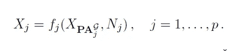
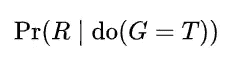
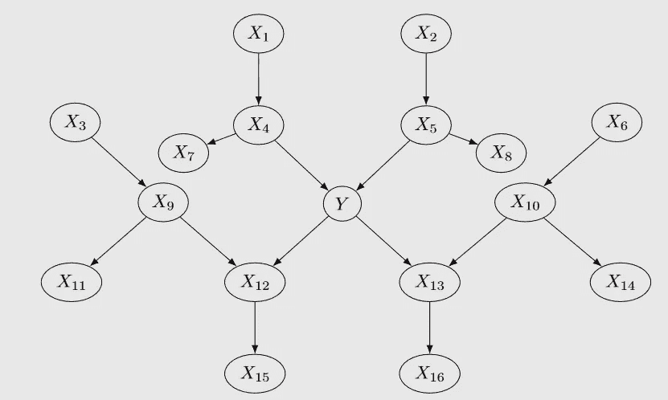
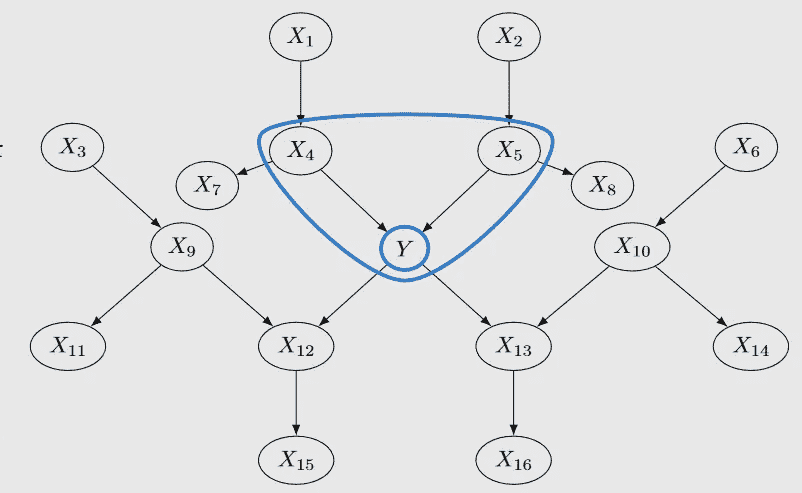

# 模型稳健性的因果框架

> 原文：<https://towardsdatascience.com/causal-framework-for-model-robustness-dc8713ba1f3b?source=collection_archive---------26----------------------->

## 使用因果建模进行特征选择和创建

[张玉香](https://unsplash.com/@noah0220?utm_source=medium&utm_medium=referral)在 [Unsplash](https://unsplash.com?utm_source=medium&utm_medium=referral) 上拍照

# 模型稳健性

我们都希望我们的机器学习模型对看不见的数据进行归纳，但经常发现，当新数据看起来不像旧数据，即具有不同的分布时，我们的模型性能会下降。例如，我们根据一个国家的数据训练的医疗诊断系统不能推广到另一个国家，因为该国家的常见疾病与训练集所在国家的疾病不同。机器学习研究人员和实践者开发了各种技术来克服这个问题，并将模型命名为*健壮*。

根据定义，*鲁棒*模型对预测变量或目标变量的分布变化不敏感。模型鲁棒性是一个活跃的研究领域，分析模型鲁棒性的方法之一是使用*因果推理。*

# 稳健性因果模型

一般来说，因果推断是指回答改变一个变量是否会影响结果的问题。例子可以是研究促销和折扣如何提高销售额，或者特定的医疗如何改善病人的结果[1]。

我们都知道一句格言:“相关性并不意味着因果关系”。研究相关性是统计学家和数据科学家工作的一个非常重要的部分，但在研究因果问题时还不够。本质上，因果模型看起来与贝叶斯网络非常相似，因为它使用条件概率来表达所有变量的联合分布，例如:

如果我们把所有的概率都放在直接原因上，那么这个模型就是因果的:

来源:[https://arxiv.org/abs/1507.05333](https://arxiv.org/abs/1507.05333)

对变量 Xi 的*干预*是指我们改变 Xi 的分布，例如，将变量设为常数。因果建模扩展了条件概率的语法，以包括干预。例如，下面的等式

资料来源:https://en.wikipedia.org/wiki/Bayesian_network

是指当我们将变量 G 设为 t 时，变量 R 的概率。这也被称为*因果机制*。

因果建模如何帮助我们建立稳健的模型？如果我们预测 Y= f(X₁，X₂，… Xn)，那么变量 X₁分布的变化可以建模为一个干预[2]。因此，稳健模型是对所有可能的干预都不变的模型。

因果模型有一个非常有用的性质，叫做*原因和机制之间的独立性，*它粗略地陈述了将原因 C 映射到结果 E 的机制不依赖于原因变量 C 的分布[3]。因此，如果我们的预测变量是原因，目标变量是结果，那么根据这一性质，模型 P(Y|X)是稳健的，因为当边际分布 P(X)改变时，它将同样工作良好。

然而，如果我们试图根据结果来预测原因，情况就不同了。考虑医疗诊断案例，当我们有一组症状，我们试图预测诊断。由于诊断是原因，症状是结果，我们可以使用独立性假设，并声称我们可以根据疾病 E(X|Y)稳健地预测症状。如果我们试图根据症状预测诊断，我们可以使用贝叶斯法则:

从这个方程我们可以看出，预测的诊断不仅取决于因果机制 P(X|Y)，还取决于疾病在给定区域的流行程度 P(Y)。例如，同样的症状可以在一个国家用于诊断疟疾，在另一个疟疾不流行的国家用于诊断呼吸系统疾病。我们试图从结果中预测原因的情况被称为*反因果预测*【4】。

# 不变集

在大多数情况下，X 和 Y 之间的关系不能简化为因果关系。例如，在医学诊断中，问题是颠倒的，因为我们需要根据结果预测原因。罗哈斯·卡鲁拉等人[3]提出了一个问题，是否有可能导出特征 X 的子集 Xi，其中分布 P(Y|Xi)独立于 P(Xi)。这个子集被称为*不变集*，因为给定 Xi 的 Y 的模型预测不依赖于对除目标变量之外的任何变量的任何干预。我们来看下面这个因果图:

来源:[https://www.bradyneal.com/causal-inference-course](https://www.bradyneal.com/causal-inference-course)

这里我们试图根据预测变量 X₁到 X₁₆.来预测 y 我们可以排除所有的间接原因，因为它们是多余的，任何不是 Y 的原因的变量都可以改变它的分布，使预测不准确。这给我们留下了直接原因作为这个问题的不变集。

来源:[https://www.bradyneal.com/causal-inference-course](https://www.bradyneal.com/causal-inference-course)

这意味着，如果 Xi 包含 Y 的所有直接原因，则模型是稳健的。

您可以看到，我们大幅删除了大部分特征，因此尽管模型保持稳健，但预测能力较低。对于完全反因果模型，像上面提到的医学诊断问题，不变集是空的。

# 反因果模型的稳健性

有一些方法可以在不消除所有预测变量的情况下提高反因果模型的稳健性。其中一个显而易见的方法是将 Y 的分布信息作为一个新变量显式地输入到模型中。在我们的例子中，我们可以将疾病在特定国家的流行率作为一个额外的预测变量。如果我们的训练数据包含几个国家，模型可以学习使用此信息来调整对新国家的预测。例如，如果我们使用逻辑回归，我们可以将更新后的模型表示为:

这种方法相当于目标编码，这是一种在数据科学竞赛中广泛使用的编码分类变量的流行方法。我们可以向模型提供更多关于目标变量边际分布的信息，而不是它的期望值。一种可能的技术是使用我在早期文章中提到的[贝叶斯目标编码](/target-encoding-and-bayesian-target-encoding-5c6a6c58ae8c)。

# 结论

因果推理成为每个数据科学家工具箱中的必要工具。虽然这仍然是一个活跃的研究领域，但是有一些技术和工具可以解决最常见问题的原因。然而，因果推理的作用并不局限于因果问题，而是通过鲁棒性的因果理论扩展到机器学习。在这篇文章中，我试图分享我对健壮的机器学习模型的因果考虑的想法，以及它如何连接到特征工程的常用技术。

# 参考

[1]朱迪亚珍珠。2009.因果关系:模型、推理和推论(第二版。由…编辑).美国剑桥大学出版社。

[2] R. Christiansen，N. Pfister，M. E. Jakobsen，N. Gnecco 和 J. Peters，“分布一般化的因果框架”，载于《IEEE 模式分析和机器智能汇刊》，doi:10.1109/tpami。46306.86686866676

[3]罗哈斯-卡鲁拉先生、舒尔科夫先生、特纳先生和彼得斯先生。机器学习中的因果迁移。机器学习研究杂志，19(36):1–34，2018

[4]b . schlkopf、D. Janzing、J. Peters、E. Sgouritsa、K. Zhang 和 J. M. Mooij。因果学习和反因果学习。《第 29 届机器学习国际会议论文集》(ICML)，第 1255–1262 页。Omnipress，2012 年。