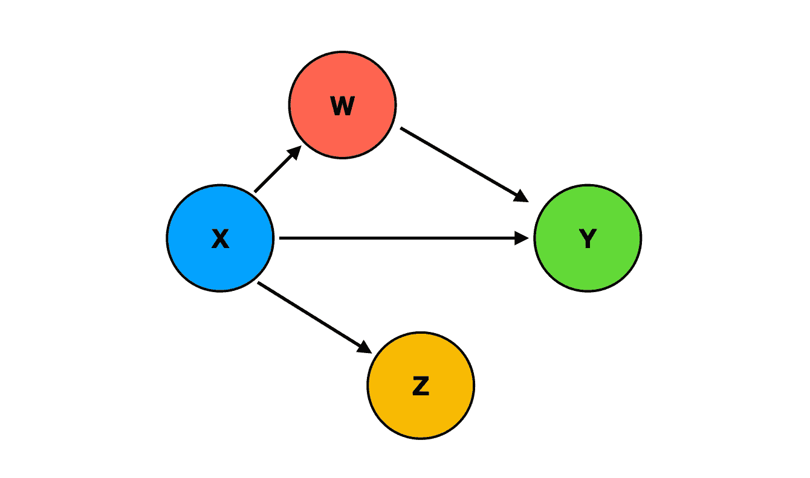
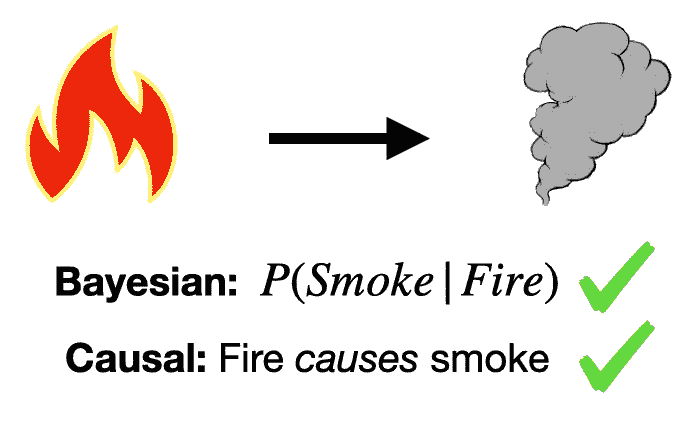
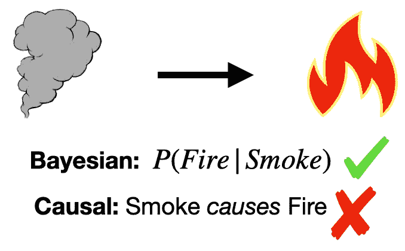
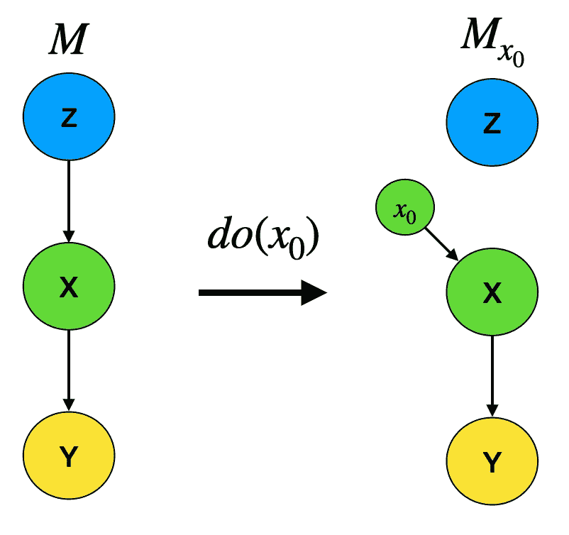
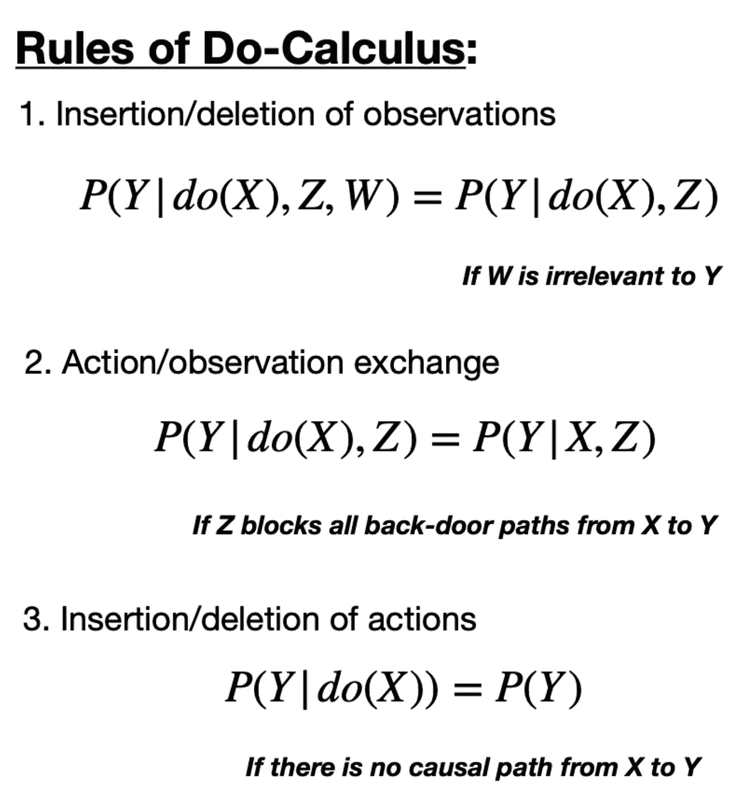
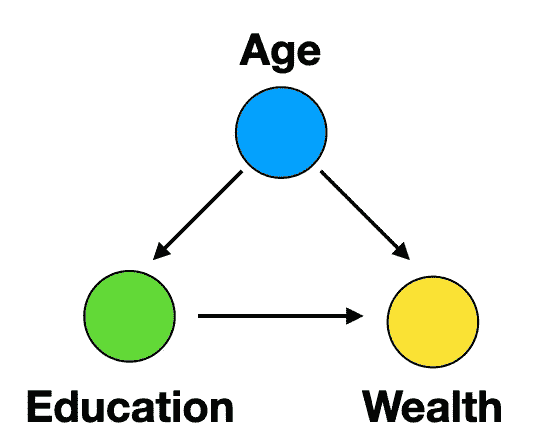
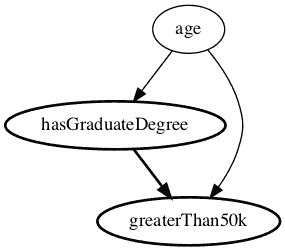
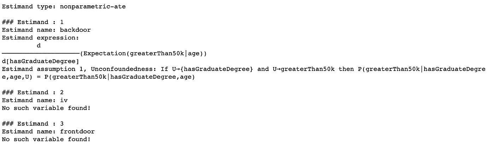
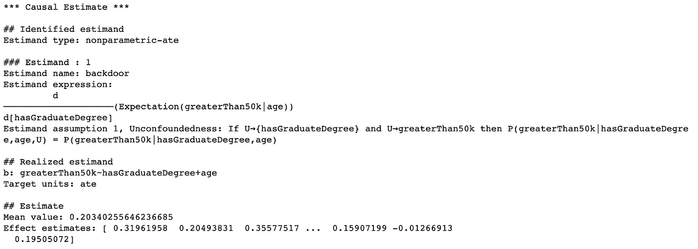
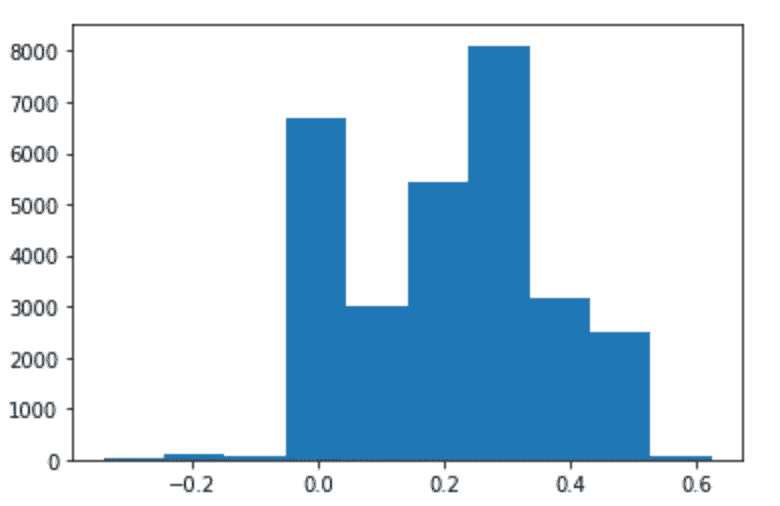

# 因果推理

> 原文：<https://towardsdatascience.com/causal-inference-962ae97cefda?source=collection_archive---------0----------------------->

## 用 Python 回答因果问题

这是关于因果关系的三篇系列文章的第二篇。在[的上一篇文章](/causality-an-introduction-f8a3f6ac4c4a)中，我介绍了这种“新的因果科学”【1】，并给出了因果推理和[因果发现](https://shawhin.medium.com/causal-discovery-6858f9af6dcb)的味道。在本帖中，我们将深入探讨因果推理的一些细节，并以 Python 中的一个具体例子结束。



因果网络的一个例子。图片作者。

# 从哪里开始？

在[的上一篇文章](/causality-an-introduction-f8a3f6ac4c4a)、**、*、*、**中，我讨论了因果关系如何通过**结构因果模型(SCMs)** 用数学方法表示。SCMs 由两部分组成:一个图形，它将因果联系可视化，以及方程，它表达了联系的细节。

概括一下，**图**是由顶点(节点)和边(链接)组成的**数学结构。在这里，我将交替使用图和网络这两个术语。SCMs 使用了一种特殊图，称为**有向无环图(DAG)** ，它的所有边都是有向的，不存在环。Dag 是因果推理的常见起点。**

## 贝叶斯网络与因果网络

当我第一次探索这个主题时，一个模糊之处是**贝叶斯网络**和**因果网络**之间的区别。所以我简单提一下区别。开明的读者可以随意跳过这一节。

从表面上看，贝叶斯和因果网络是完全相同的。然而，不同之处在于他们的解释。考虑下图中的例子。



可以解释为贝叶斯和因果网络的例子。火和烟的例子取自珀尔[1]。图片作者。

这里我们有一个有 2 个节点(火图标和烟图标)和 1 条边(从火指向烟的箭头)的网络。这个网络可以是贝叶斯网络，也可以是因果网络。

然而，关键的区别在于解释这个网络的时候。对于一个**贝叶斯**网络，我们将**节点视为变量**，将**箭头视为条件概率**，即给定火灾信息时烟雾出现的概率。当将此解释为一个**因果**网络时，我们仍然将**节点视为变量**，然而**箭头表示一个因果连接**。在这种情况下，两种解释都有效。然而，如果我们翻转边缘方向，因果网络解释将是无效的，因为烟雾不会引起火灾。



示例网络可以解释为贝叶斯网络，但不是因果网络。火和烟的例子取自珀尔[1]。图片作者。

# 什么是因果推理？

**因果推断** **旨在回答因果问题**而不仅仅是统计问题。因果推理的应用数不胜数。回答下面的任何问题都属于因果推理的范畴。

*   治疗对服用者有直接帮助吗？
*   是营销活动导致了这个月的销售增长还是假期？
*   增加工资会对生产率产生多大影响？

这些都是重要而实际的问题，使用更传统的方法(例如线性回归或标准机器学习)可能不容易回答。我希望通过我称之为*因果推理的 3 个天赋*来说明因果推理是如何帮助回答这些问题的。

# 因果推理的三种天赋

## 礼物 1:do-operator

在[的上一篇文章](/causality-an-introduction-f8a3f6ac4c4a)中，我从干预的角度定义了因果关系。忽略一些技术细节，据说如果对 X 的干预导致 Y 的变化，则 X 导致 Y，而对 Y 的干预不一定导致 X 的变化。干预在现实世界中很容易理解(就像当你朋友的糖果习惯失控时)，然而，*这如何符合因果关系的数学表示？*

输入 do 运算符。 **do-operator** 是物理干预的**数学表示。如果我们从模型 Z → X → Y 开始，我们可以通过删除所有传入 X 的箭头，并手动将 X 设置为某个值 x_0 来模拟 X 中的干预。**



do 运算符如何工作的图示。图片作者。

假设我们知道因果联系的细节，do 运算符的强大之处在于它允许我们模拟实验。例如，假设我们想问,*增加营销预算会促进销售吗？*如果我们有一个包括营销支出和销售的因果模型，我们可以模拟如果我们增加营销支出会发生什么*，并评估销售的变化(如果有的话)是否值得。换句话说，我们可以评估营销对销售的**因果效应**。稍后再谈因果关系。*

珀尔和他的同事们的一个主要贡献是 **do-calculus** 的规则。这是一个 ***完整的*规则集，概述了如何使用 do 运算符**。

值得注意的是，do-calculus 可以将**介入分布**(即有 do 算子的概率)转化为**观察分布**(即没有 do 算子的概率)。这可以从下图中的规则 2 和规则 3 看出。



微积分的规则。规则摘自珀尔[ [2](https://arxiv.org/abs/1210.4852) ]的讲座。图片作者。

注意符号。 **P(Y|X)** 就是我们都很熟悉的条件概率，也就是给定 X 的一个观测值 Y 的**概率。而， **P(Y|do(X))** 是在 X** 中给定一个*干预*Y 的**概率。**

do 运算符是因果推理工具箱中的一个关键工具。事实上，接下来的两个礼物依赖于 do-operator。

[](/causal-effects-via-the-do-operator-5415aefc834a) [## 通过 Do 运算符的因果关系

### 将观察转化为干预

towardsdatascience.com](/causal-effects-via-the-do-operator-5415aefc834a) 

## 礼物 2:消除混淆

混淆是统计学中的一个概念。虽然我没有直呼其名，但这是通过**辛普森悖论**出现在[上一篇](/causality-an-introduction-f8a3f6ac4c4a)中的。下图显示了一个简单的混杂示例。



一个简单的混淆例子。年龄是教育和财富的混淆物。图片作者。

在这个例子中，年龄是教育和财富的混淆因素。换句话说，如果试图评估教育对财富的影响，你需要根据年龄调整。**调整** **用于**(或调节开启)**年龄**仅仅意味着当查看年龄、教育和财富数据时，人们会比较年龄组内的**、**而不是**年龄组之间的数据点。**

如果不考虑年龄因素，就不清楚教育是财富的真正*原因*还是仅仅是财富的*关联*。换句话说，你不知道教育是否直接影响财富，或者只是与财富有一个共同的原因。

举个简单的例子，在查看 DAG 时，混淆非常简单。对于 3 个变量，混杂因素是指向 2 个其他变量的变量。*但是更复杂的问题呢？*

这就是 do 操作符提供清晰度的地方。Pearl 使用 do 运算符以明确的方式定义混杂。他说**混淆**是**导致 P(Y|X)不同于 P(Y|do(X))** [1]的任何东西。

## 礼物 3:估计因果效应

这最后的礼物是因果推论的主要吸引力。在生活中，我们不仅要问自己*为什么*，还要问*多少？*估计[因果关系](/causal-effects-f30f962ffff3)归结为回答第二个问题。

考虑读研。知道拥有研究生学位的人比没有研究生学位的人赚更多的钱是一回事，但一个自然的问题是，其中有多少是因为他们的学位？换句话说，*研究生学历对收入的待遇影响如何？*

我将利用回答这个问题的机会来完成一个使用 Python 进行因果推理的具体例子。

[](/causal-effects-f30f962ffff3) [## 因果关系——简介

### 什么是治疗效果，如何计算？

towardsdatascience.com](/causal-effects-f30f962ffff3) 

# 示例:估计研究生院对收入的处理效果

在这个例子中，我们将使用[微软 DoWhy](https://microsoft.github.io/dowhy/) 库进行因果推理[ [3](https://arxiv.org/abs/2011.04216) ]。这里的目标是估计拥有研究生学位对年收入超过 5 万美元的因果影响。数据从 UCI 机器学习库[ [4](https://archive.ics.uci.edu/ml/datasets/census+income) ]获得。示例代码和数据可在 [GitHub repo](https://github.com/ShawhinT/YouTube-Blog/tree/main/causal_inference) 中找到。

重要的是要强调所有因果推理的起点是一个因果模型。这里我们假设收入只有两个原因:年龄和教育，而年龄也是教育的一个原因。显然，这个简单的模型可能遗漏了其他重要因素。我们将在下一篇关于 [**因果发现**](https://shawhin.medium.com/causal-discovery-6858f9af6dcb) 的文章中研究替代模型。然而，现在我们将关注这个简化的案例。

首先，我们加载库和数据。如果您没有这些库，请查看回购中的 [requirements.txt](https://github.com/ShawhinT/YouTube-Blog/blob/main/causal_inference/requirements.txt) 。

```
**# Import libraries**
import pickle
import matplotlib.pyplot as plt

import econml
import dowhy
from dowhy import CausalModel**# Load Data**
df = pickle.load( open( "df_causal_inference.p", "rb" ) )
```

同样，第一步是定义我们的因果模型，即 DAG。DoWhy 使创建和查看模型变得容易。

```
**# Define causal model**
model=CausalModel(data = df,         
                  treatment= "hasGraduateDegree",         
                  outcome= "greaterThan50k",         
                  common_causes="age",         
                  )***# View model***
model.view_model() 
from IPython.display import Image, display display(Image(filename="causal_model.png"))
```



我们(假设的)因果模型。图片作者。

接下来，我们需要一个 estimand。这基本上是一个给我们想要的因果效应的配方。换句话说，它告诉我们如何计算教育对收入的影响。

```
**# Generate estimand**
identified_estimand= model.identify_effect(proceed_when_unidentifiable=**True**)
print(identified_estimand)
```



estimand 生成的输出。图片作者。

最后，我们基于估计量计算因果效应。在这里，我们使用来自 [EconML](https://econml.azurewebsites.net/) 库的[元学习器](https://econml.azurewebsites.net/spec/estimation/metalearners.html)【5】，它估计离散目标的条件平均治疗效果。

```
**# Compute causal effect using metalearner**
identified_estimand_experiment = model.identify_effect(proceed_when_unidentifiable=True)

from sklearn.ensemble import RandomForestRegressor
metalearner_estimate = model.estimate_effect(identified_estimand_experiment,                             method_name="backdoor.econml.metalearners.TLearner",
confidence_intervals=False,
method_params={
     "init_params":{'models': RandomForestRegressor()},
     "fit_params":{}
              })print(metalearner_estimate)
```



因果估计的输出。图片作者。

平均因果效应约为 0.20。这可以解释为，拥有研究生学位会让你年收入超过 5 万美元的概率增加 20%。注意这是平均效应，考虑值的全部分布以评估平均值是否具有代表性是很重要的。

```
**# Print histogram of causal effects**
plt.hist(metalearner_estimate.cate_estimates)
```



因果关系的分布。图片作者。

在上图中，我们看到了样本间因果关系的分布。显然，该分布是*而不是*高斯分布。这告诉我们平均值并不代表总体分布。基于因果效应的进一步分析可能有助于发现“谁”从研究生学位中受益最多的可操作信息。

不管怎样，仅仅根据潜在收入来决定读研，可能表明你并不真的想读研。🤷🏽‍♀️

[](/causal-effects-via-regression-28cb58a2fffc) [## 通过回归的因果效应

### Python 示例代码的 3 种流行技术

towardsdatascience.com](/causal-effects-via-regression-28cb58a2fffc) 

# 结论

因果推理是回答更传统的方法可能无法解决的自然问题的强大工具。在这里，我从因果推理中勾勒出一些大的想法，并通过代码完成了一个具体的例子。如前所述，所有因果推理的起点是一个因果模型。然而，通常我们手头没有一个好的因果模型。这就是 [**因果发现**](https://shawhin.medium.com/causal-discovery-6858f9af6dcb) 可以有所帮助的地方，这也是下一篇帖子的主题。

# 资源

**更多关于因果关系** : [因果关系概述](https://shawhin.medium.com/understanding-causal-effects-37a054b2ec3b) | [因果关系:简介](/causality-an-introduction-f8a3f6ac4c4a) | [因果推断](/causal-inference-962ae97cefda) | [因果发现](/causal-discovery-6858f9af6dcb)

**连接** : [我的网站](https://shawhint.github.io/) | [预定电话](https://calendly.com/shawhintalebi) | [邮件我](https://shawhint.github.io/connect.html)

**社交**:[YouTube](https://www.youtube.com/channel/UCa9gErQ9AE5jT2DZLjXBIdA)|[LinkedIn](https://www.linkedin.com/in/shawhintalebi/)|[Twitter](https://twitter.com/ShawhinT)

**支持** : [给我买杯咖啡](https://www.buymeacoffee.com/shawhint?source=about_page-------------------------------------) ☕️ | [成为会员](https://shawhin.medium.com/membership?source=about_page-------------------------------------) ⭐️

[](https://shawhin.medium.com/membership) [## 通过我的推荐链接加入媒体——肖文·塔莱比

### ⭐️成为会员使用我的推荐链接，并获得充分的媒体上的每一篇文章。您的会员费直接…

shawhin.medium.com](https://shawhin.medium.com/membership) 

朱迪亚·珀尔所著的《为什么:因果的新科学》

[2]珀尔，J. (2012 年)。重新审视微积分。[arXiv:1210.4852](https://arxiv.org/abs/1210.4852)**【cs。AI]**

[3]阿米特·夏尔马，埃姆雷·基西曼。DoWhy:一个用于因果推理的端到端库。2020.[https://arxiv.org/abs/2011.04216](https://arxiv.org/abs/2011.04216)

[4]杜瓦和格拉夫(2019 年)。UCI 机器学习知识库[http://archive . ics . UCI . edu/ml]。加州欧文:加州大学信息与计算机科学学院。https://archive.ics.uci.edu/ml/datasets/census+income

[5] Künzel，ren R .等人，“使用机器学习评估异质治疗效果的金属学者”*美国国家科学院院刊*，第 116 卷第 10 期，2019 年 3 月，第 4156–65 页。[*www.pnas.org*，](http://www.pnas.org,)[https://doi.org/10.1073/pnas.1804597116.](https://doi.org/10.1073/pnas.1804597116.)