# 野外因果推理:弹性定价

> 原文：<https://towardsdatascience.com/causal-inference-example-elasticity-de4a3e2e621b?source=collection_archive---------2----------------------->

## [行业笔记](https://towardsdatascience.com/tagged/notes-from-industry)

## 机器学习如何提高工业中的因果推理？我用零售定价的代码描述了一个真实的例子。

因果推理是机器学习中的一个热门话题，有许多关于因果推理理论的优秀入门书籍[1–4]。但机器学习驱动的因果推理在现实世界中的应用例子少得多。本文介绍了一个来自行业环境的例子，使用了一个(公开的)真实数据集。它的目标读者是对因果关系有基本理解的技术人员。

具体来说，我将着眼于价格弹性估计的“理想”情景[2，5]。这种情况与希望优化价格的零售商高度相关，例如，为了更好地管理库存或只是为了更具竞争力。

在第一部分，我将提出这个问题，并提供一个简单的背景。这也将说明更普遍的一点，即估计因果关系需要“仅仅”数据分析之上的领域专业知识。在第 2 节，我将解释从历史数据中学习是困难的，因为混杂。第 3 节将为这个问题勾勒一个机器学习驱动的解决方案，这在第 4 节的代码示例中有详细描述。[这里有一个完整的、可运行的笔记本](https://github.com/larsroemheld/causalinf_ex_elasticity)。最后，我将讨论这种因果有效估计的业务相关性。

# **1 为什么要关心弹性？**

“需求的价格弹性”是大多数经济学 101 课程的核心概念，它描述了对给定产品的需求对价格的敏感程度。如果一种产品“更有弹性”，价格上涨将导致更大的需求下降。作为一个因果概念，弹性允许我们量化如果我们*将价格*降低，比如说，5%,我们*可以*多卖出多少单位(与事实相反)。

作为价格和需求数量之间的影响的弹性描述了一个复杂的因果系统:价格当然不会直接影响需求，而是通过许多个人消费者购买或不购买的决定以及诸如在特价商品搜索网站上出现的次要影响来调节。在试图估计弹性时，零售商跳过所有这些复杂性，直接测量他们控制的东西(价格)对他们关心的东西(需求)的影响。

令人惊讶的是，弹性实际上是可以估计的。但是自从它在 1890 年被正式定义以来[6]，经济学家发现需求的价格弹性在许多情况下是现实的一个体面的近似值[5]。这种近似在相对变化的规范定义中特别方便:弹性衡量需求数量的百分比变化( *q* ，给定价格的百分比变化( *p* ):

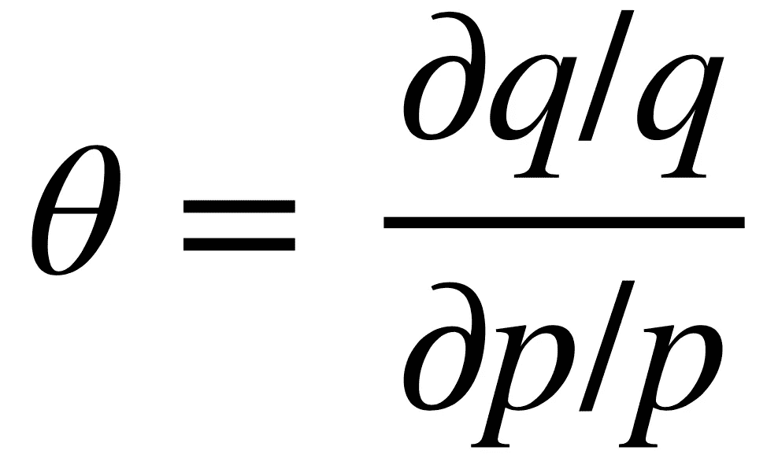

这里的直觉很简单:成本为 5 美元的产品价格变化 1 美元，将导致比成本为 100 美元的产品更剧烈的需求变化。总的来说，消费者关心的是“相对”变化。根据经验，这个定义很方便，因为它意味着待估计的参数 *θ* 随着 *p* 的变化而保持近似恒定。

有了对 *θ* 的有效估计，零售商现在可以对他们的价格进行反事实推理:“如果我将我的产品价格提高 5%，我可以预期多卖出 5θ%的单位”(θ通常为负值)。

为了建立一些直觉，假设他们目前以 5 美元的价格和 4 美元的成本销售了 100 个单位。那么他们目前的利润是 100 *(5–4)= 100 美元。假设他们估计弹性为θ=-3，即他们预计价格上涨 5%(从 5 美元到 5.25 美元)会导致需求减少 15%(从 100 美元到 85 美元)。那么新的利润会稍微增加，85 *(5.25–4)= 106 美元。然而，如果他们降价 5%，他们就会损失利润:115 *(4.75–4)= 86 美元。请注意，更高的价格并不总是导致更高的利润:例如，如果单位成本仅为 3 美元:5%的价格上涨将减少利润，从 100 *(5–3)= $ 200 到 85 *(5.25–3)= $ 191。

你可能会说服自己，不同的弹性值会改变最优价格:一般来说，需求弹性越大(例如，如果 *θ* =-5 而不是-3)，成本和价格之间的加价应该越低。

能够做出这种反事实的陈述，通过给出价格应该提高还是降低的指示，为零售商节省了许多“尝试新价格”的时间。当然，例如，当零售商想要管理他们的库存以销售所有库存直到季末时，对弹性的良好估计提供了额外的价值。简而言之，高度精确的弹性估计为零售商提供了个人购买决策的复杂因果系统的简明摘要，允许对其预期结果充满信心的商业决策。

对需求的基本经济理论的简短探究是因果推理中专家知识的一个例子:关于数据生成过程的知识告知了要回答的问题类型、要寻找的机制，以及通常假设的函数形式。很难从数据中了解所有这些结构，当然数据效率也很低。

# **2 欣赏挑战**

在介绍了为什么零售商想要估计弹性之后，这一部分将描述为什么这是一个有趣的问题。

当然，因果推断的首选方法是(随机)实验:零售商可能会花一些时间随机上下调整产品价格(或者更好的是，在用户之间随机定价)。但是这种试验是昂贵的，因为产品以次优价格出售，客户体验受到影响。更糟糕的是，零售数据的信噪比通常很低，因为大多数商店提供大量的产品，其中很大一部分在任何给定的时间框架内都没有卖出去。因此，在卖出足够多的产品来进行推断之前，实验需要进行很长时间。最后，零售商可能会担心，例如，短期实验可能无法跨季节推广。

因此，从观察数据中学习因果有效弹性的能力是关键；本例中的观察数据只是零售商在一段时间内的价格和销售量历史。但是由于混杂因素，从观察数据中估计因果关系是困难的。为了理解这意味着什么，考虑(1)产品质量和(2)季节作为许多潜在混淆因素的两个重要例子:

1.  比如说，MacBooks 比 Chromebooks 更贵。假设零售商销售的 MacBooks 比 Chromebooks 多(其他什么都没有)，观察数据表明高价格与高销量相关。但是,(反事实地)期望把 Chromebook 的价格提高到苹果的水平就能卖出更多 chrome book 是愚蠢的。
2.  对许多产品的需求是季节性的，例如由于假期(圣诞节)和天气变化(夏季)。通常情况下，旺季价格较高(但仍有大量产品售出)，淡季价格较低(此时售出的产品较少)；然而，尽管存在这种相关性，但通过将淡季价格提高到旺季水平来期望更高的销售额是愚蠢的。

俗话说，零售商必须小心不要混淆相关性和因果关系。下面的因果图代表了一个简单的混杂关系:未能控制产品质量(和季节，以及其他因素，未显示)将显著偏差θ的估计值。这种偏见会导致零售商对最优价格得出错误的结论，直接损害他们的业务。

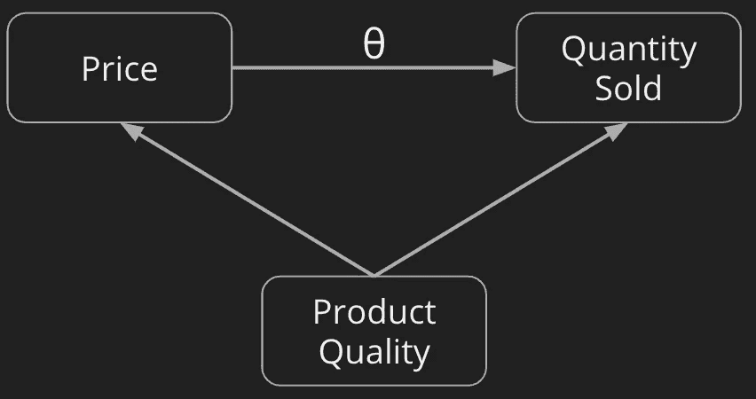

价格和数量之间的最小(即不完整)因果图，产品质量是唯一的混杂因素。

题外话:价格弹性是计量经济学中“联立方程模型”问题的一个实例[7]——核心观点是价格实际上是由供应方*和需求方*的同时决策决定的。在这个例子中，零售商相信他们有足够的关于他们自己定价决策的数据来分离出对价格变化的市场反应的一致估计。

知道正确控制所有可用混杂因素的重要性，零售商现在转向机器学习驱动的因果推理。

# **3 双机器学习，或称可观测量控制 2.0**

我在这里描述的解决方案主要解决了两个问题:首先，正则化从大量潜在的混杂因素中挑选出合适的控制。第二，由于我使用灵活的机器学习算法，控制变量的函数形式和相互作用(即它们的预处理)不如传统回归方法重要，在传统回归方法中，使用普通线性回归来控制混杂因素。自然，仍然需要进行大量的思考来寻找可能是混杂因素的变量——以及应该避免哪些变量，因为它们可能会引入“对撞机偏差”[8]，这种方法是*而不是*免疫的。

我的解决方案实现了双机器学习(DML) [9]。主要思想是相对直观的:给定一些观察到的潜在混杂因素，我使用非参数的、灵活的估计器(机器学习模型)来有效地控制各种函数形式和交互作用的影响。换句话说，我用 ML 模型近似了数据生成过程中的实际混淆机制。

为此，我训练*两个*独立的“辅助”模型，分别预测待遇(价格， *P* )和结果(需求量， *Q* )。这两个模型都是用一组潜在的混杂变量(如产品质量和季节)独立训练的，因此它们的预测接近期望值， *E[P|X]* 和 *E[Q|X]* 。

使用这些预测，我然后*剩余出*通过一组控制变量可预测的治疗和效果部分:

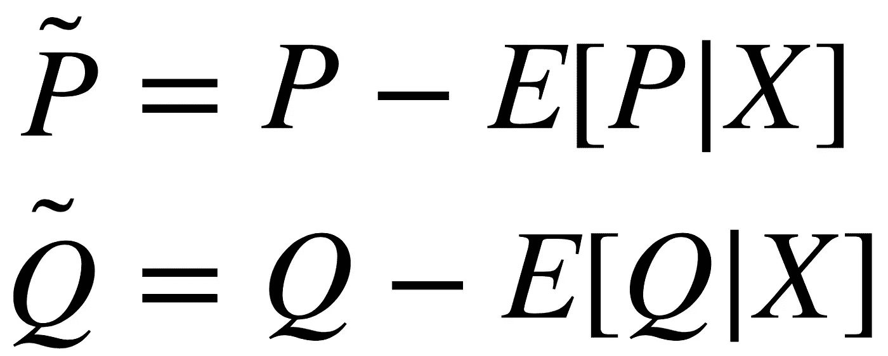

在我下面的实现中，我选择 RandomForests 来估计条件期望，选择它是因为它们的稳健性能。您可以将这两个辅助模型视为“控制模型”:如果 *X* 包含足够多的相关混杂因素的信息，并且如果至少有一个模型“非常适合”，那么通过构建，P̃和 Q̃现在是“未建立的”，只剩下真正的因果关系(关于这一点有丰富的文献，从[9]开始)。

所以在剩余化之后，我对

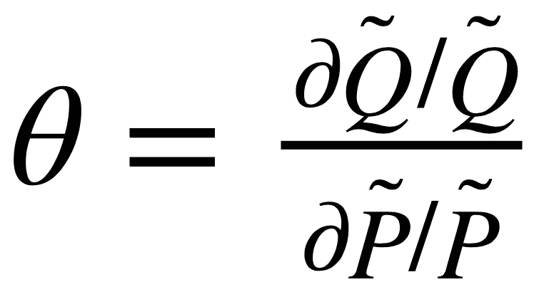

这个数量仍然很难估计，但幸运的是在计量经济学中有一个估计弹性的标准方法:对数回归。 *θ* 完全等价于以下回归模型中的参数:

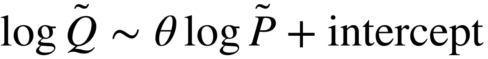

具体如何工作超出了本文的范围(如果您想了解，请参见[10])。重要的一点是，在实际实施中，我将根据剩余对数价格(线性)回归剩余对数数量，以获得 *θ。*

在下面的分格散点图中，我展示了在我的样本数据集中取对数数量和对数价格之间的相关性的“天真”结果:即使在控制诸如季节或产品质量之类的混杂因素之前，这种关系似乎也有些线性。弹性， *θ* ，是这条线的斜率(【10】)。正如您将看到的，控制混杂因素会显著改变(改进)估计值。

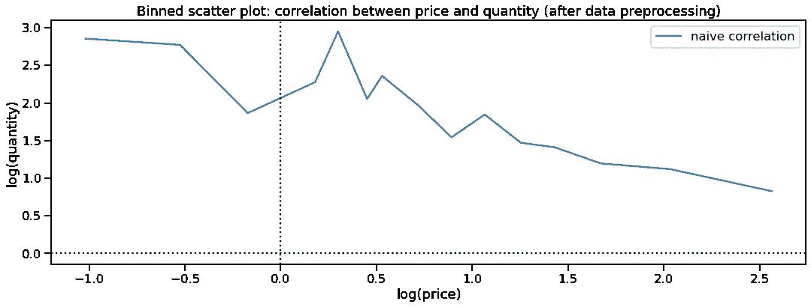

在数据清理后的简单相关性分析中，可以观察到对数数量和对数价格之间的(某种程度上)线性关系，此处显示为一个分格散点图。

现在，将方法放在一起:

1.  我要拿 *p* 和 *q* 的*圆木*。
2.  我将构建一组潜在的混杂因素， *X* 。
3.  我将训练一个辅助随机森林模型来从 *X* 预测 *log(p)* 。
4.  我将训练一个单独的辅助 RandomForest 模型来从 *X* 预测 *log(q)* 。

如果您密切关注这一过程，您会注意到所描述的残差化过程是“样本内预测”，即辅助模型根据它们预测的相同数据进行训练。这可能会引入过度拟合并导致偏差——为了抵消这一点，我将把我的数据分成两半。我将使用一半的数据来拟合辅助模型，然后使用模型来残差另一半的 *log(p)* 和 *log(q)* 。然后我可以在后面的数据集中测量因果弹性。冲洗并重复，切换两组并对两个估计值进行平均。所以:

1.  将数据集分成两半，取 *p* 和 *q* 的*日志*。
2.  构建一组潜在混杂因素 *X* (两半中的变量相同)。
3.  使用**的前一半**训练一个辅助随机森林模型，从 *X* 预测 *log(p)* 。
4.  使用**的前一半**训练一个单独的辅助随机森林模型，从 *X* 预测 *log(q)* 。
5.  使用两个辅助模型从第**第二**半个数据中的 *X* 预测 *log(p)* 和 *log(q)* ，残差后得到:

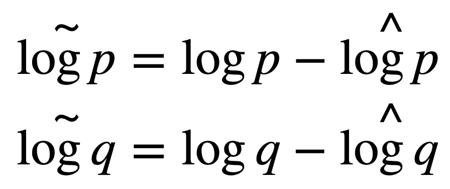

6.将弹性推断为线性回归的系数，

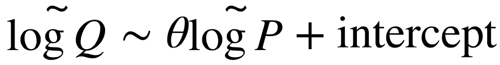

7.交换两半，重复步骤 3-6。使用两个 *θ* 估计值的平均值作为最终结果。

为了更好地说明这种机制在实践中是如何工作的，让我们看一些分步示例代码。对于您自己的实验，DML 和许多其他现代方法可以在 EconML 中方便地获得，EconML 是由微软研究院维护的一个新的 python 包[11]。截至 2021 年初，我发现 API 相当不稳定，但正在进行的开发非常有前景。类似地，DoubleML 为 python 和 R 提供了 DML 实现[12]。

# **4 个样本代码**

代码使用这个理想化的真实世界数据集:每天和每个产品都有一行，以及这个(第 X 天的产品)组合的一些附加特性，可以用作潜在的混杂因素， *X* 。最重要的是，在每一行中，数据记录了 *Q* 和 *P* 。

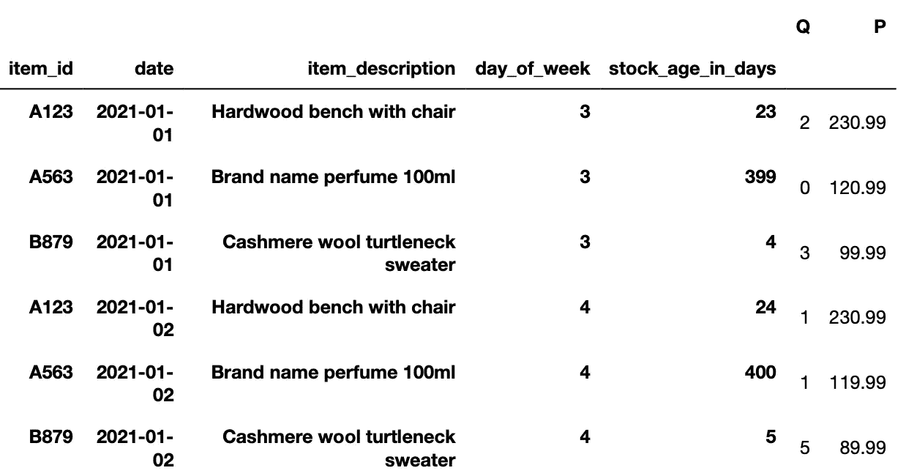

首先，我将定义两个标准 ML 模型，从所有可用的潜在混杂因素 *X* 中预测 *log(p)* 和 *log(q)* 。请注意，由于每天和每种产品都有单独的控制变量，因此模型可以捕捉产品质量和季节性。

为了提高模型的预测质量，进一步减少混淆，并展示 DML 的优势，我添加了一些进一步的特征工程: *n-grams* 产品描述，以恢复产品、季节性描述符和产品新颖性度量之间的相似性。然后，我将这个特征工程的结果，一组潜在的混杂因素，输入到一个标准的随机森林模型中。

当然，在这方面可以付出更多的努力；但这组潜在的混杂因素表明，随机森林可能会发现非平凡的函数形式和交互效应，超出了标准回归所能做到的。

接下来，对于实际的推断，我将使用线性回归模型。如上所述，这将估计对数-对数回归的斜率 *θ* 。

最初的 DML 论文为这个回归提出了与 OLS 略有不同的估计量，以获得更好的稳健性:代替采用标准的 OLS 解，

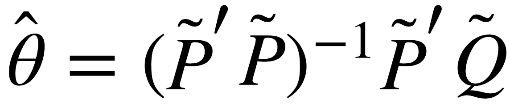

Q ~*θP+截距的标准 OLS 解*

他们使用以下去偏估计量。注意第一个 *P* 是剩余的，而第二个是*不是*，第三个是:

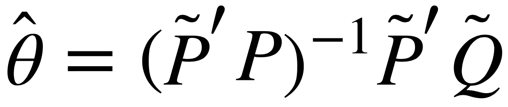

去偏回归估计量[9]

在下面的代码片段中，我实现了如上所述的步骤(1)到(6):将数据分成两半，在前半部分训练辅助模型，剩余后半部分，并推断弹性。在重复交换两半后，我取两个估计值的平均值，以获得一个稳健的因果估计值(假设我能够捕捉到相关的混杂因素)。

最终输出如下所示:

```
1st Fold:
DML elasticity:  -1.90
OLS elasticity for comparison: -1.83
2nd Fold:
DML elasticity:  -1.92
OLS elasticity for comparison: -1.85
DML efficient estimate of elasticity: -1.91 
```

因此，我们有它:我们的双重稳健，ML 控制的需求价格弹性估计。即价格对销售量的平均处理效果。在行业环境中，零售商现在可以尝试使用小实验(即随机价格变化)来验证这一估计。

这一最终结果可在以下分箱散点图中看到:

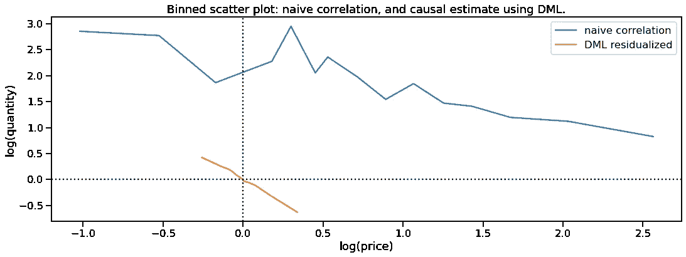

DML 结果的可视化表明，控制混杂因素减少了我们治疗变量中的“噪音”变化，并改变了效果大小。

在剧情中，可以看到蓝色的“幼稚”做法。这只是绘制对数-数量对对数-价格，没有控制混杂因素(即，混淆相关性和因果关系)。即使这种关系是“混乱的”，你已经可以看到一个负斜率:更高的价格导致更低的需求。这里的回归参数在*θ*≈—0.6 左右。

橙色线是 DML 结果的可视化，控制了潜在的混杂因素。请注意，斜率变得更陡，表明弹性需求更大(*θ*≈1.9)。您还可以观察到，这种关系变得明显不那么嘈杂，并且您可以看到价格的方差(x 轴上的线的范围)大幅减少，这是因为 DML 残差“解释”了这种变化的大部分。

# 5 讨论

与开头的例子类似，假设一个零售商目前以每件 5 美元的价格销售 100 件产品，成本为 2 美元。估计弹性为-1.9，零售商应该降低价格以获得更多利润。但是如果(有偏见的，天真的)估计是-0.6，他们就会提高价格。

在这个例子中，适当的因果推理推翻了推荐的决策，对零售商的利润有直接影响。混淆相关性和因果关系会让零售商损失很多钱。相比之下，使用精心设计的 DML 机制，零售商能够在价格变化发生之前自信地预测价格变化的影响。

本文旨在解释一个端到端的行业应用程序。你可以在[的可运行笔记本](https://github.com/larsroemheld/causalinf_ex_elasticity)中更详细地了解每一步。许多业务问题受益于类似的方法；我希望这是一个有用的例子。

为了进一步优化价格，零售商现在可能会转向异质治疗效果，即探索弹性差异。这也开启了一个问题，我实际估计的“平均治疗效果”是什么:我的训练数据中的产品组合是否代表未来的产品组合。我将在后续文章中探讨异质效应。

# 承认

感谢 Rima Rahal、Jonathan Haas 和 Paul Hünermund 对初稿进行了富有洞察力的讨论和评论。

# 参考文献/尾注

[1] Taddy，Matt:商业数据科学。麦格劳-希尔教育，2019。

[2]坎宁安，斯科特:因果推理:混音带。耶鲁大学出版社，2021 年。[https://mixtape.scunning.com/introduction.html](https://mixtape.scunning.com/introduction.html)

[3]韦杰，斯特凡:统计 361:因果推理。斯坦福大学，2020。https://web.stanford.edu/~swager/stats361.pdf

[4]瓦里安，哈尔 r .:经济学和市场营销中的因果推理。美国国家科学院学报，2016 年 7 月。

[5]https://en.wikipedia.org/wiki/Price_elasticity_of_demand

[6]阿尔弗雷德·马歇尔:《经济学原理》。麦克马斯特大学经济思想史档案馆，1890 年。[https://social sciences . McMaster . ca/econ/ugcm/3ll 3/Marshall/prin/prinbk 5 . htm](https://socialsciences.mcmaster.ca/econ/ugcm/3ll3/marshall/prin/prinbk5.htm)

[7]第十六章:联立方程模型。《计量经济学导论:现代方法》，第 7 版。2019.

[8] Lee H，Aronson JK，Nunan D:对撞机偏差。偏见目录，2019。[https://catalogofbias.org/biases/collider-bias/](https://catalogofbias.org/biases/collider-bias/)

[9] Chernozhukov，Victor，等:用于治疗和结构参数的双/去偏置机器学习。计量经济学杂志，2018 年第 21 卷。[https://academic.oup.com/ectj/article/21/1/C1/5056401](https://academic.oup.com/ectj/article/21/1/C1/5056401)

[10]要了解线性对数回归确实可以估计弹性，请考虑以下情况:对数回归假设

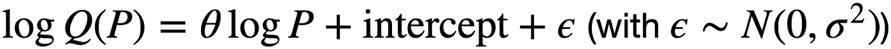

对这个回归方程取相对于 *P* 的偏导数，你得到

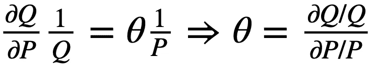

[11]微软研究院:EconML。用于基于 ML 的异质治疗效果评估的 Python 包。[https://github.com/microsoft/EconML](https://github.com/microsoft/EconML)

[12] Bach，p .，Chernozhukov，v .，库尔茨，M. S .，和 Spindler，m .:Double ml——Python 中双机器学习的面向对象实现，2021。arXiv: [2104.03220](https://arxiv.org/abs/2104.03220)