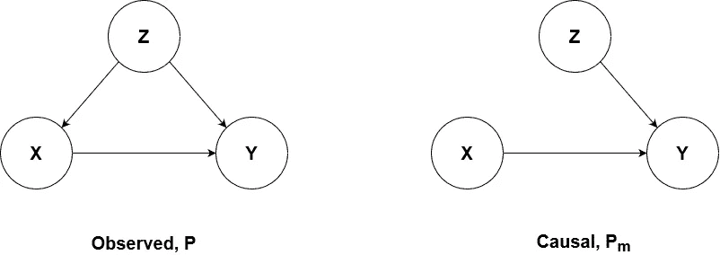
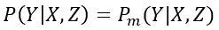
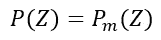
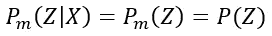
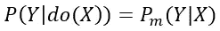
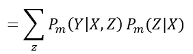
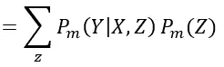
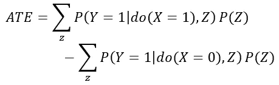

# 数据科学家的因果推理:第 1 部分

> 原文：<https://towardsdatascience.com/causal-inference-for-data-scientists-part-1-f97fa8614143?source=collection_archive---------14----------------------->

## 你不知道你需要的技术

> 这篇文章是两部分系列文章的第一部分，讨论了 Pearlian 因果推理的基本概念和数学。第 2 部分将关注一个使用 [DoWhy](https://github.com/microsoft/dowhy) 库的实际例子。如果您喜欢先从实现开始，当第 2 部分可用时，跳到第 2 部分，然后返回这里学习理论。

因果关系:由[拍摄的照片](https://unsplash.com/@nadir_syzygy?utm_source=unsplash&utm_medium=referral&utm_content=creditCopyText)在 [Unsplash](https://unsplash.com/s/photos/cause-and-effect?utm_source=unsplash&utm_medium=referral&utm_content=creditCopyText) 上

近年来，澳大利亚推理经历了巨大的发展。这种激增与更广泛的数据科学(DS)的兴起同时发生，但它们在实践中仍然截然不同。虽然因果推理背后的科学受益于 Judea Pearl、Donald Rubin、Susan Athey 和许多其他人的最新工作，但他们发现的见解还没有进入主流 DS，尽管这些技术的实现很容易获得。许多 DS 从业者根本不知道或不在他们的工作流程中使用因果推理，这可能有几个原因…

1.  进入因果推理的假设，如贝叶斯模型，可以从周日开始以六种方式进行切片、切块和辩论。(感谢我的 Linkedin 联系人吉诺·阿尔蒙多提供的这一见解)
2.  人们认为相关性是自动因果的，它们本身就足够了。在你的工作场所找找看，你会惊讶它出现的频率。
3.  因果推理被认为是困难的。我们不喜欢硬的。

这些观点都有不同程度的有效性，但最终都没有抓住要点。主要的一点是，虽然存在挑战，但我们手中有一套概念和技术，如果谨慎应用，将完全改变数据科学的实践和感知方式。我们可以利用领域知识进行可靠的推理。让我们先做一些准备来开始讨论。

# 什么是因果？

在本文中，我们将采用干涉主义的方法来定义因果关系。我们对什么是因果关系都有一个直观的概念，但是要用数学语言来表达，我们需要一些更正式的东西。

> 定义是，对于两个不同的事件 A 和 B，如果 A 的变化对应于 B 的变化，则 A 导致 B，其他都相等。

大多数因果推理都是为了确保“其他一切都是平等的”这一部分。还有其他类似的定义，围绕着哪一个是最正确的有激烈的争论，但我们将决定这一个，并继续进行。

# 我们如何建立因果关系？

在近代因果复兴发生之前，建立因果联系的黄金标准是随机实验。在很多方面他们仍然是。因此，让我们在随机实验的背景下讨论因果关系。

我们有一个我们想要测量的结果，名为 y。我们想看看操纵特定的治疗 X 是否会引起 y 的明显变化。在随机试验中，如药物试验，我们将从更广泛的人群中随机获得足够大的人的样本(使用功效分析)**。参与者将被随机分配药物或安慰剂。然后，我们将测量安慰剂组和药物组的差异，这被称为**治疗效果，**可以通过多种方式完成(参见 cohen 的 d 或 CATE)。任何效应大小将仅来自治疗，而不是由于可能存在的任何其他因素或**混杂因素**。**

## **随机分配确保“所有其他条件相同”在总体上是正确的。**

# **真实的世界**

**现在我们来看因果推理中面临的主要障碍。我们并不总是有时间和金钱去做随机实验来建立因果联系。即使我们这样做，也可能不符合道德。我们最终可能只有一组观察数据，以及我们从观察中建立起来的一些假设。我们能用非随机化的数据来检验它们吗？答案是肯定的，这就是我们的新工具包发挥作用的地方。我们将使用的技术将获取我们的**观察**数据集，并将其转换为所谓的**介入**数据集，从中我们可以得出因果推论。这里的关键是数据本身不足以建立因果关系(见[辛普森悖论](https://en.wikipedia.org/wiki/Simpson%27s_paradox))。我们需要更多有力的理由。**

**鉴于数据还不够，我们将绘制一幅世界的文字图，称为因果图，它编码了我们关于数据生成过程的*假设*。**数据生成过程**是我们试图了解其动态的系统。这将有助于我们构建我们的介入分布，并检验我们的模型是否有效。**

**我们在模仿科学过程。我们从一个假设开始，然后我们用因果图来模拟世界在这个假设下的行为。最后，我们用数据来检验我们的模型，这可能支持或不支持假设。此外，我们进一步测试模型，看看它对变化、未说明的混杂因素和其他问题有多敏感。重复直到你的理论符合事实。**

# **更深入**

**让我们定义几个术语…**

****干预:**主动做 X 导致 y 的变化。**

> **例子:如果我推我的朋克兄弟，他会生气吗？如果我给一个人用药，会让他们好起来吗？**

****反事实:**如果我没有做 X，Y 还会发生吗？**

> **例子:如果我没有推我的朋克兄弟，他会摔倒吗？如果没有给病人用药，他们会好转吗？**

**干预和反事实的推理反映了人类理解因果关系的正常方式。我们正在创造两个不同的世界，并比较两个世界的结果。如果我们有一个干预的案例，和它的反事实，我们可以建立因果关系。在一个随机实验中，我们在群体水平上已经有了这两个现成的例子。当分析的层次改变到个人时，我们就意识到我们试图解决的一个最基本的问题。我们发现我们有一个**缺失数据**的问题。我们手头没有反事实，因为个人的反事实并不存在。你不能同时接受治疗和未治疗。双胞胎研究接近了。幸运的是，我们有办法估计这种反事实，同时控制一切可能混淆我们分析的东西。请记住，我们试图保持所有其他平等，这就是为什么我们需要一个反事实。让我们深入数学来更好地理解发生了什么。**

# **派生**

**当我们获得观察数据时，无论数据是离散的还是连续的，我们得到的都是概率分布。两种主要类型是联合概率和条件概率。任何上过基础概率课程的人都会涉及到这些话题，但它们为我们构建因果公式提供了基础。下面是两个数据分布。**

****

**观察和干预图**

**在左边，我们看到了观察模型，它显示了原始数据中变量之间的相互关系。根据我们对因果关系的定义，我们需要独立于其他因素，估计改变 X 对 Y 的影响。对于我们观察到的数据，我们无法使 X 的变化不对应于 Z 的变化，因此 X 的变化不表示 y 的因果变化。我们需要一种方法来理清 Z 对 X 的混淆效应，例如 P(X|Z) = P(X)，或者换句话说，我们需要操纵观察到的数据以使两个变量独立。我们需要做图形手术。**

**右图显示了我们想要的状态，即手术后的状态。z 和 X 不相连，因此其中一个的变化不会影响另一个。这被称为**d-分离**。而且由于 X 仍然在 Y 的上游，所以 X 的任何变化都会导致 Y 的因果变化，不管 X 是自发变化还是直接调整。**

## **假设**

**现在我们继续推导，允许我们将我们的观察数据分布转换成我们的干预数据分布。我们从两者之间的三个联系开始推导。我们用 p 表示我们的观察数据分布，用 Pₘ表示被操纵的干预数据分布。**

****

**链接 1**

**因为 Y 的引入效应在两个图之间保持不变，所以概率分布也是相同的。这是我们的第一个不变性链接。**

****

**链接 2**

**确定 Z 的过程不会因为去掉 Z 和 x 之间的联系而改变，这是我们的第二个不变性环节。**

****

**链接 3**

**在被操纵的模型中，Z 和 X 是 d 分隔的，因此是独立的(在后一个模型中，关于 Z 的信息并不能告诉我们关于 X 的任何信息)。根据链接 3，我们可以更进一步得到 P(Z)。**

**考虑到这些联系，我们从右边的因果图开始，定义我们的 **do 操作符**。我们想知道，给定我干预 X，用 do(X)表示，Y 的概率是多少。由此可见…**

****

**(根据定义)**

**接下来，我们扩展等式的右边来考虑 Z**

****

**根据全概率的[定律，我们在 z 上取 P(Y|X)的加权平均值。这是我们控制 z 的影响的方法。这与控制混杂因素的逆概率加权和倾向评分加权技术相同。亚当·凯莱赫有一篇很棒的文章展示了等价性](https://en.wikipedia.org/wiki/Law_of_total_probability)[在这里](https://medium.com/@akelleh/introducing-the-do-sampler-for-causal-inference-a3296ea9e78d)，所以如果你有兴趣深入了解，一定要去看看。**

**接下来，我们使用 Z 和 X 的 d 分离原理来获得**

****

**最后，我们调用操纵分布和观测分布之间的不变性链接来得到**

****

**调整公式**

**使用最后一个表达式，称为**调整公式**，我们现在已经定义了如何从干预前的观察数据中生成我们的干预分布 P(Y|do(X))。这是对介入分布的广义定义，适用于连续和离散病例。**

**对于我们的药物试验示例，它是一个离散的二元结果，使用我们导出的因果表达式来估计治疗效果，我们可以将平均治疗效果(ATE)定义为**

****

**随机试验**

**因此，我们使用随机试验获得了与控制所有相关混杂因素(上面用 Z 表示)相同的结果。**

**顶部的第一项是观察到的治疗效果概率，第二项是反事实概率。假设 Z 代表 Y 和 X 的所有混杂因素，它们的差异确定了治疗 X 对结果 Y 的因果影响。请注意，Z 本身可以是连续的或离散的，这并不重要。配方中有一个漂亮的灵活性。**

# **最终事项**

**这些是珀尔因果推理的基础。关于因果关系的其他讨论，请阅读[鲁宾的潜在结果框架](https://en.wikipedia.org/wiki/Rubin_causal_model)。如果你喜欢天才科学家之间的辩论，[这个](https://statmodeling.stat.columbia.edu/2009/07/05/disputes_about/)资源会让你开心。关于使用随机森林对高维数据集进行因果推理的应用，请参见[苏珊·艾希的](https://www.gsb.stanford.edu/faculty-research/faculty/susan-athey)最新作品[这里](https://arxiv.org/pdf/1510.04342.pdf)。Amit Sharma 和 Emre Kiciman 的一本很棒的介绍书**可以在这里找到[。最后，仔细阅读后门标准，这是因果推理的下一个重要步骤，可以在这里阅读](https://causalinference.gitlab.io/book/)。****

**我们只是触及了将科学融入数据科学的强大概念的表面。我希望这有助于在实施之前建立理论。我也希望它引发了你的好奇心，让你想了解更多，并开始在工作中应用这些原则。本系列的第 2 部分将使用 DoWhy 软件包实际应用 Pearlian do 微积分解决医疗保健领域的一个因果问题。**

**敬请期待！感谢你的时间，上帝保佑你。**