# 乐趣和利润的因果推理

> 原文：<https://towardsdatascience.com/causal-inference-for-fun-and-profit-cb5f38601a5d?source=collection_archive---------21----------------------->

图片由来自 [Pixabay](https://pixabay.com/?utm_source=link-attribution&utm_medium=referral&utm_campaign=image&utm_content=256213) 的 [Michal Jarmoluk](https://pixabay.com/users/jarmoluk-143740/?utm_source=link-attribution&utm_medium=referral&utm_campaign=image&utm_content=256213) 拍摄

## [办公时间](https://towardsdatascience.com/tagged/office-hours)

## 科学在快速发展的初创企业中的挣扎

[甚至](https://www.even.com/)在推出几个月后就雇佣了它的数据团队。我们的任务很简单:弄清楚我们是否在做正确的事情。公司的每个人都想知道产品是否为影响而优化，为了优化，我们需要数字:风险最小化，目标最大化。

“这是我们第一次做这样的事情。”我记得乔恩在我最后的现场公开表示不确定。该公司仍然不知道整个“数据科学”的事情。对伊文和我来说，这都是一种冒险。他对事情的发展很诚实。

“你觉得你能行吗？”

我毫不怀疑。“绝对是。”

一年半后，数据团队在组织结构图的变动板块之间崩溃了。

我错了。好几次。衡量影响——我们 T12 带来的好处——并不容易，我已经积累了这么多失败的赌注，我在拉斯维加斯比在硅谷更自在。但是，嘿，即使在核灾难的中心，你也会发现原子石玻璃，我学到的东西就像水晶一样。

今天，我们有工具和方法可以测量我们的影响，而真正的科学发现只有很少的负面影响和所有的正面影响。我会说的。

但是跳到最后一点也不好玩。一切都是为了旅程，记得吗？

# 一整个该死的井架

图片来自[像素](https://www.pexels.com/photo/gray-industrial-machine-during-golden-hour-162568/)

过去，每个人都相信数据科学的炒作。从自我更新机器的大脑中汲取的定量见解，从海量数据流中进行的在线预测，对你甚至从未想过要问的高维度问题的答案——太空中漂浮着如此之多的承诺和宣传，以至于让你头晕目眩。

毫不奇怪，数据团队似乎是必备的。

但是团队需要工具来运作。我在 Even 的第一周，我越来越恐惧地意识到我们是在直接查询我们生产数据库的一个副本。像这样的数据存储针对单个表上的单行读取进行了优化，但是我们要对数亿行进行统计，并从模式的每个角落连接列。

我通常不得不在晚上启动一个查询，回家后相信它会完成，然后像拼花地板一样沉入磁盘，并在第二天分析它的结果。如果我早上错过了一列或一个关键的行子集，我会 **1。)**讨厌自己和 **2。)**在接下来的八个小时里被束缚手脚。

我们试图用一把铁锹来开采石油，但我们需要的是一整个该死的井架。

我的时间经常会转移到用快速编写的分析或立即有效的商业智能来追逐枝节问题，而度量的任务会被推后几周、几个月、几个季度。

然后奇迹发生了。一个才华横溢的全栈工程师变成了机器学习工程师变成了数据工程师，他的名字叫[约瑟夫·阿特金斯-土耳其人](https://www.linkedin.com/in/joseph-atkins-turkish-47559275/)把最后一个齿轮放进一台漂亮的机器里，这台机器每天储存*我们所有的*数据。突然之间，过去需要几个小时的查询将在几分钟内返回。我们改变了我们的工作流程、时间表，甚至我们对自己能力的看法。

我已经转了几个月的轮子，烧了几个月的钱，但是只需要一个数据工程师，我就可以开始工作了。

这将成为一个持续的主题:没有数据工程优先，数据科学将一事无成。

# 2:混杂变量和医院对撞机

每天都有几百万笔银行交易流经我们的系统。它们被解析、打包和丰富，使得它们比一个写着`INSUFFICIENT FUNDS FEE FOR A $5.00 ITEM`的字符串更有用。这种丰富与最终用户体验没有任何关系:我们保留它用于关键性能指标。

我们关注的两大标签？发薪日贷款和透支费。

假设是 Even 的按需付费功能 Instapay 远远优于收费高得离谱的流动性产品。因此，我们预计对这些产品的需求会下降。发薪日贷款和透支量是值得关注的明显数量。

我们跟踪了会员如何使用该应用程序，他们使用 Instapays 的频率，并使用这些结合了机器学习、正则表达式和决策规则的庞大交易丰富管道，我们最终发现—

没什么。

我们的问题从来都不是技术性的。这是认识论上的。

我的意思是。我们试图找出 Even——特别是 insta pays——对某些绩效指标的影响，对吗？先重点说一个:透支费。假设我们在任何时候看到高于平均水平的 Instapay 透支率，我们都会看到低于平均水平的透支率，下图说明了这种相关性:

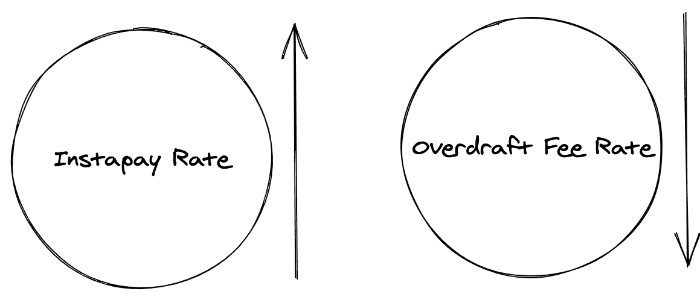

玩具例子:当透支费率低于平均水平时，Instapays 高于平均水平。所有图表由作者提供。

这种相关性是否足以说明 Instapays 正在降低透支率？

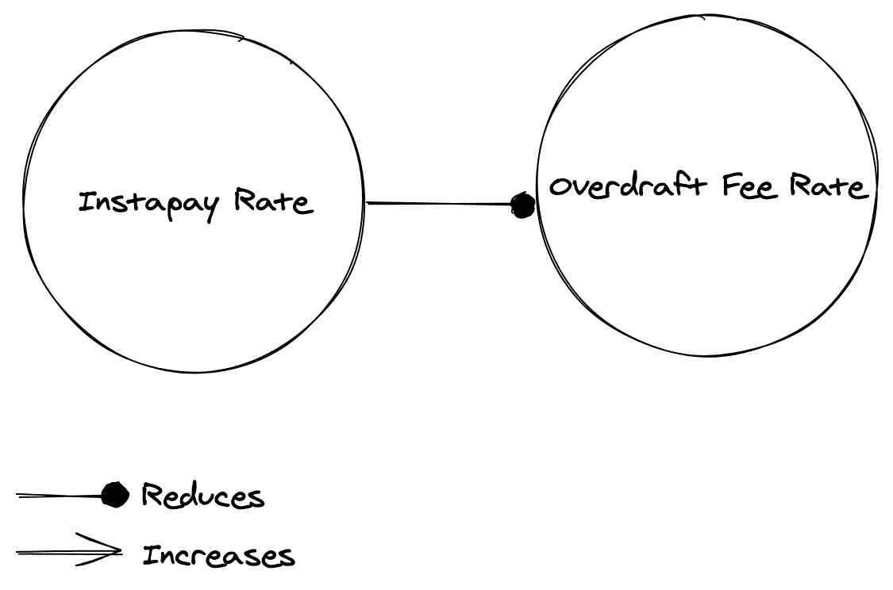

不会。同样的相关性可能会发生，因为某些第三因素碰巧改变了这两者。例如，如果人们足够聪明地使用 Instapays，也足够聪明地关闭银行应用程序的默认透支保护设置，会怎么样？

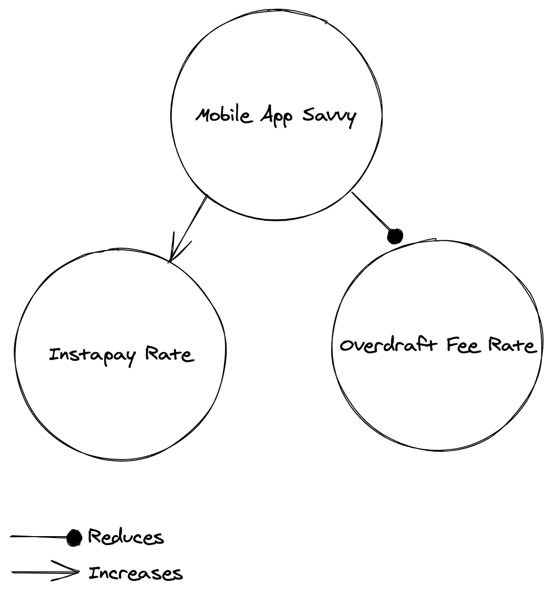

有[个混杂变量](https://en.wikipedia.org/wiki/Confounding)在进行中。

那不一定是世界末日。如果你对你的系统有一个详细的了解，你可以识别每个混杂因素和控制。在实践中，这只是意味着在混杂因素(“移动应用程序悟性”)保持相等的情况下，查看你的解释变量(Instapay 利率)和响应变量(透支费率)之间的关系。

如果你仍然看到所有的混杂因素都得到适当控制的关系，那就是因果关系的更好证据。我们没有衡量“手机应用能力”的变量，但我们可能有一个较弱的代理:年龄。

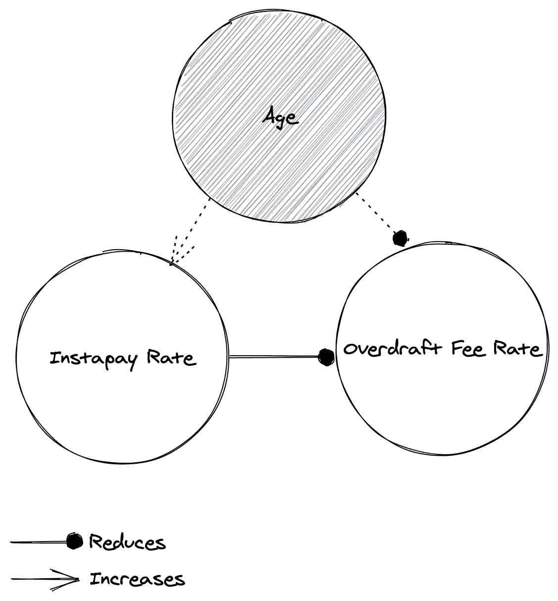

玩具示例:控制年龄。

所以。假设我们在控制了年龄因素后仍然看到了相关性。我们的工作完成了吗？我们证明了我们的产品有积极的影响吗？

同样，不。控制混杂因素是可行的，但就像我说的，你需要对世界上正在发生的事情有一个详尽的了解，以确保你已经考虑到了一切。队里没人认为我们有这种能力。在我们的头脑中，不管我们控制什么，模型看起来更像这样:

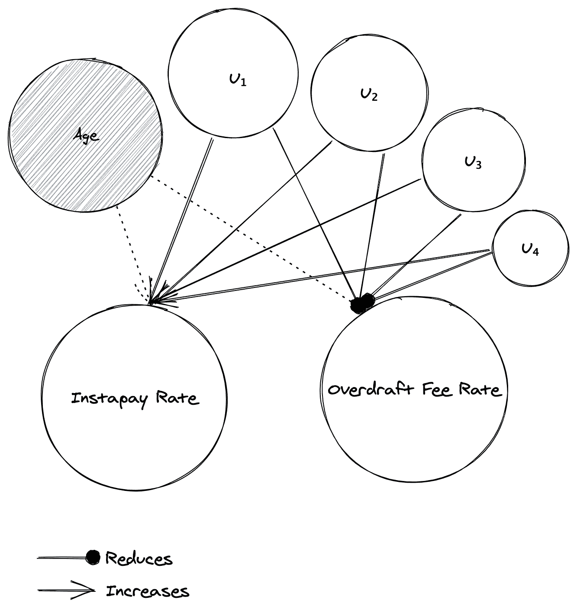

玩具例子:无限多可能的未知。

可能有未知的未知， **U** ₁， **U** ₂ **，** … **联合国**，潜伏在每一个地方。我们无法控制所有这些，因为我们不知道它们是什么。

事实上，试图控制世界上的一切会在其他方面绊倒我们。混杂变量的反向结构被称为碰撞器，其中一些变量同时受到你感兴趣的解释变量*和响应变量*的影响。当你像这样控制一个变量时，你会*产生实际上没有意义的虚假关联。*

这就是[对撞机偏差](https://en.wikipedia.org/wiki/Collider_(statistics))，或者伯克森悖论。

1938 年，约瑟夫·伯克森博士因[痛斥医院数据的统计分析](https://pdfs.semanticscholar.org/5515/62d9e7fa5b0151816f2b876fe6b50b2cc7d5.pdf)而有幸以他的名字命名了整个现象。当时，临床医生已经全力以赴进行数据收集和分析，他们发现了疾病之间各种各样的简单关联。这是大数据 1.0，但问题是，就像现在一样:这些相关性有意义吗？

如果这些医生怀疑胆囊炎与糖尿病密切相关，他们中的一些人可能已经开始拔除胆囊，所以采取冷静、合理的方法是值得的。

让我们想象一个只有胆囊炎和糖尿病两种疾病的世界。任何一种都可能导致你去医院。

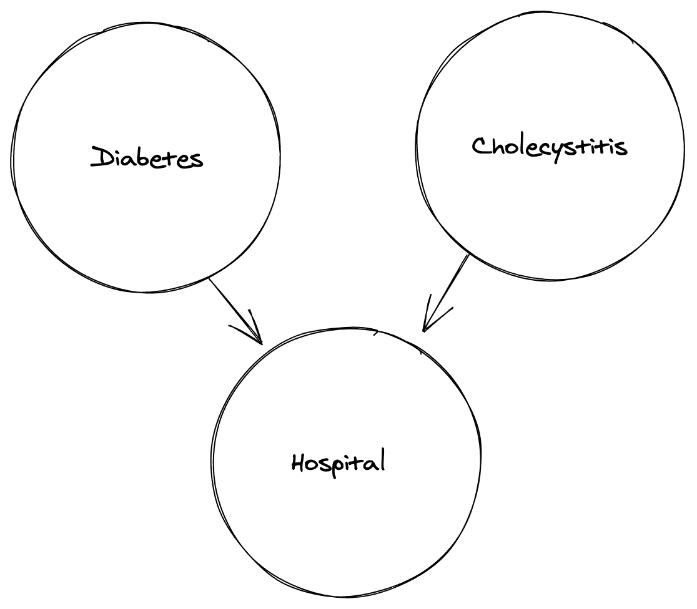

医院对撞机。

在这里，人们可以有几种行为方式。

1.  他们只有糖尿病，症状变得很严重，需要去医院。
2.  他们只有胆囊炎，症状变得很严重，需要去医院。
3.  他们患有两种疾病，其中一种或两种都让他们感到不舒服，不得不去医院。
4.  他们两种疾病都没有，或者症状不严重——所以他们只是呆在家里。

问题是:当你看医院的数据时，你完全忽略了最后一群人。而当你只关注前三组的时候，各种各样的恶作剧就发生了。

我们来思考一下，当两种疾病在一般人群中发生的可能性相等时，会发生什么？在下图中，这是从较大的组中切割出来的两个相同大小的圆。我们允许两者之间有一点重叠，以表示患有这两种疾病的人。

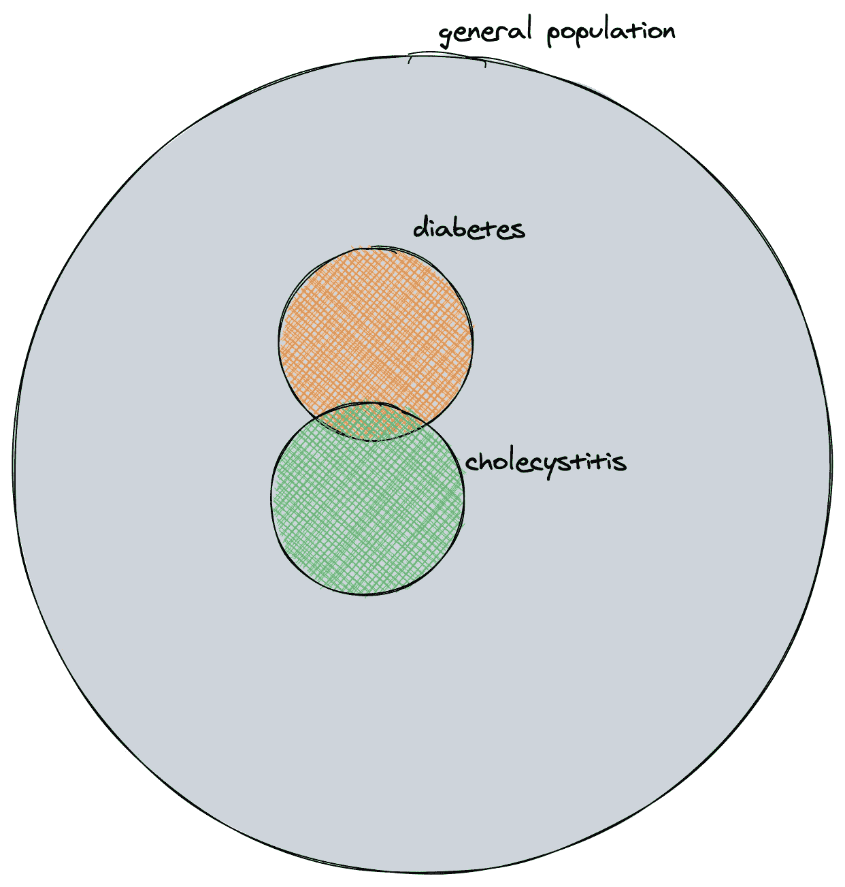

假设胆囊炎和糖尿病在普通人群中的发生率相等，有一点重叠。

现在让我们想想这些人是怎么死在医院的。

如果糖尿病和胆囊炎同样有可能送你去看医生，会发生什么？为了说明，我们将在每个疾病人群和“医院”人群之间画出相等的重叠部分。

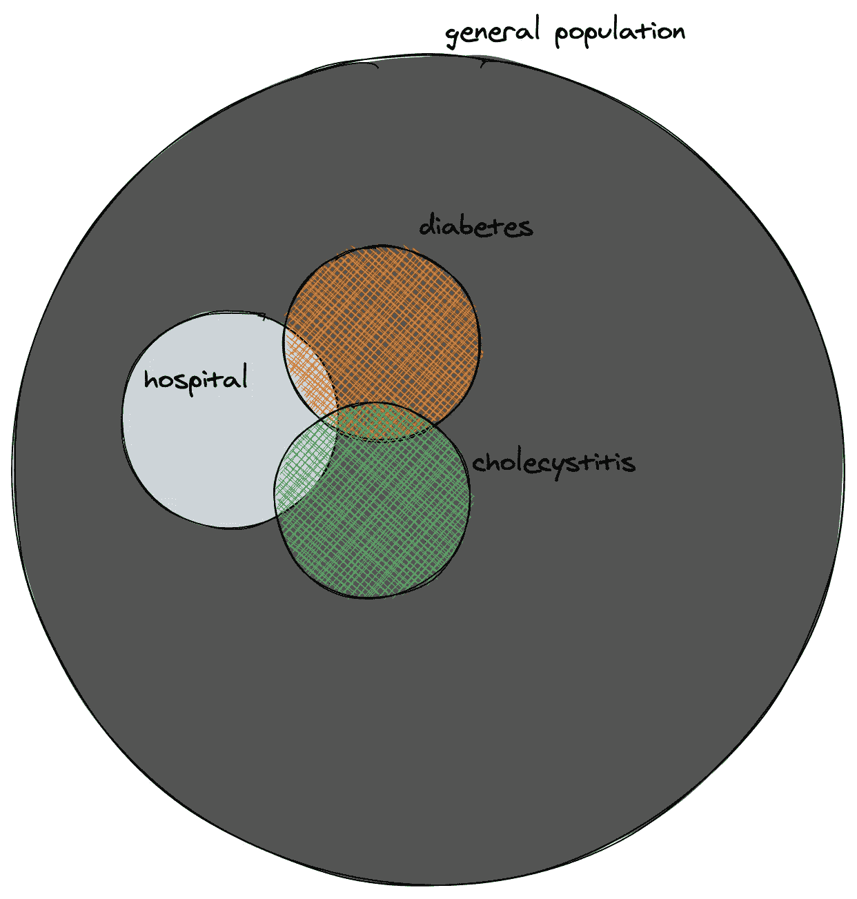

在这种情况下，医院内的疾病重叠比我们在普通人群中看到的要少。

如果我们只关注医院人群，糖尿病患者患胆囊炎的可能性比普通人群低！反之亦然。仅仅一种疾病就足以让你通过这道门，所以它“解释”了其他疾病是一个因素。相对于潜在人群，这两者之间会有一个*负相关*。

另一个例子呢，胆囊炎非常痛苦，但糖尿病的症状稍微微妙一些。好吧，现在所有这些胆囊炎患者都会争先恐后地去医院，但糖尿病患者更有可能呆在家里。

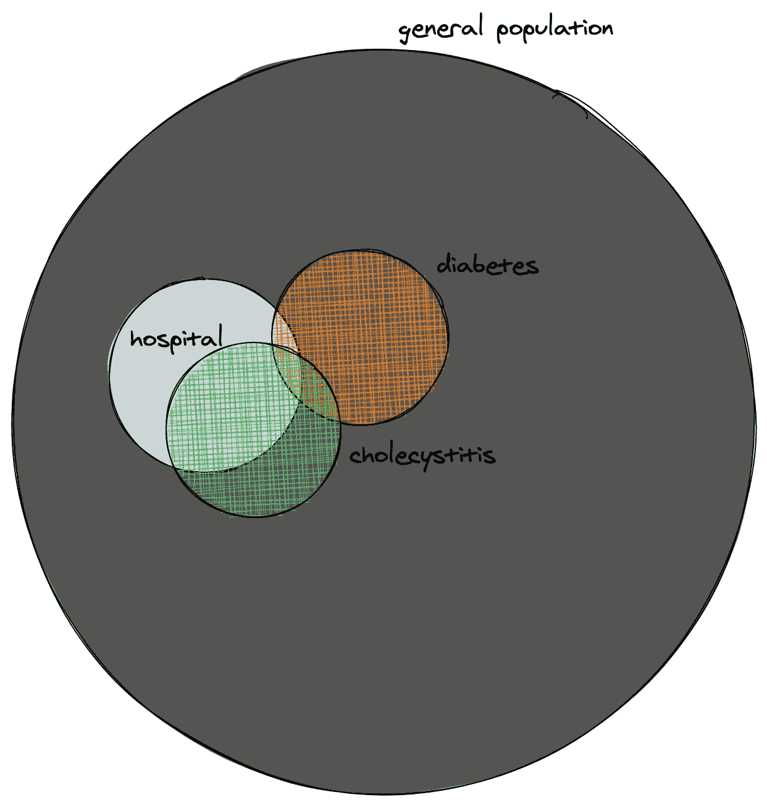

现在，这两种疾病在医院的重叠比我们在普通人群中看到的要多。

现在，医院里的大多数糖尿病患者*也*有胆囊炎。我们看到了一种无中生有的正相关性。

伯克森意识到，即使这两种疾病在潜在人群中的发病率完全不相关，这些相关性也会显现出来。临床医生正在控制一台对撞机:在医院里。

所以。我们不能控制所有的事情，即使我们尝试了，我们也有诱发错误关联的风险。

这无疑给我们留下了*某种*样的小溪，我们需要找到一个桨。立刻。

# 3:电学课程

照片由 [Pexels](https://www.pexels.com/photo/blue-metal-tool-2635595/?utm_content=attributionCopyText&utm_medium=referral&utm_source=pexels) 的 [Killian Eon](https://www.pexels.com/@killian-eon-1185568?utm_content=attributionCopyText&utm_medium=referral&utm_source=pexels) 拍摄

团队在我们的思考中变得更加因果，现在专注于在成员加入我们的服务之前研究来自*的指标。事实证明，当会员通过我们使用的银行数据 API Plaid 连接到我们的应用程序时，他们实际注册前两年的交易将从他们的银行账户中扣除。这给了我们一个前事件数据的宝库，我们可以用来与后事件数据进行比较。*

因此，我们构建了银行交易的标准化时间表，平衡于一个平均的激活日期:180 天之前到 180 天之后。

这导致了我经历过的最严重的职业崩溃——但也是最有力的证明了 Even 的价值观不仅仅是纸上谈兵。

对交易时间表的中期分析揭示了一个令人难以置信的结果:在会员注册 Even 后，发薪日贷款频率会下降。当然，有一点奇怪的是:我们会看到他们上升，直到注册日期。

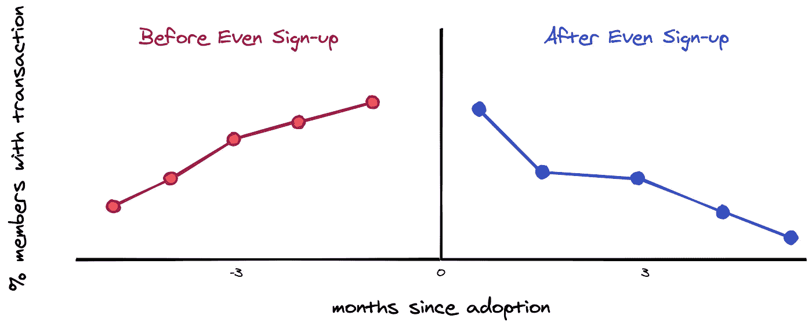

我们的误导图的玩具复制品:我们看到在注册 Even 之前，有发薪日贷款交易的会员有增加的趋势，但之后有减少的趋势。

也许是逆向选择？如果会员陷入困境，陷入发薪日贷款陷阱，但后来求助于 Even 来帮助他们摆脱困境，这或许可以解释这种现象。

但那只是一个普通的故事，完全没有事实根据。

然而，不知何故，这些数据流传开来。那还是早期，甚至还没有权威信息的单一来源。懒散的经理们的嗡嗡声、私人渠道中的即兴引用、电子邮件、午餐时间的谈话以及厨房柜台周围的聊天，将这个故事融入了公司意识，就像黑咖啡中的阿斯巴甜一样。

当然，那时我们已经说服自己这是错误的。发薪日贷款交易并不是唯一显示这种驼峰模式的交易:涉及亚马逊和麦当劳的交易也显示了同样的情况。

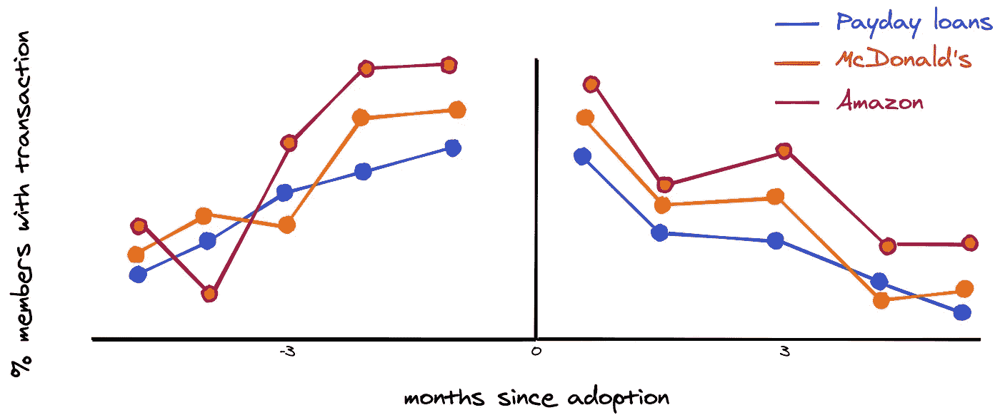

示例图:麦当劳和亚马逊的交易呈现出与我们看到的发薪日贷款类似的模式。

结果是*一个神器*。但是当我们确定这是错误的时候，它已经在我们网站的首页上了。一个公司的价值观——“寻找和提升真相的渴望”——现在与我们的底线以及更好的媒体和更多销售的承诺相抵触。

回溯数据会打击我们的信誉，降低我们的竞争力…

但这也是正确的做法。

数据团队和我们交谈过的每个人都提出了抗议，最后我们当时的数据负责人——胡安·曼努埃尔·孔特雷拉斯——写了一份清晰、冷静的备忘录，讲述了哪里出了问题，我们不知道什么，以及为什么我们对我们网站上的数据如此不安。这就够了。

乔恩在一次全体会议上刷新了记录，这个误导性的数据在几天内就被删除了。但并不全是阳光和彩虹。数据团队必须认真审视自己，确保不会再发生类似的事情。

我认为，我们的根本问题之一是相信数据是“原始数据”。我们看到一个名为“transaction”的数据库实体，并相信它的创建日期是创建它的*想法*的时间，而不仅仅是我们的记录。我们看到了记录的消失，并相信*这个东西本身*已经消失了，而不是简单地通过小故障、停用或 API 不作为而变得模糊不清。

作为一个团队，我们仍然没有真正理解数据从来不是被动观察的:它总是被[获取](https://www.thenewatlantis.com/publications/why-data-is-never-raw)。如果不理解捕获行为背后的机制，我们就没有权利提取底层细节并发布高层结果。

我有史以来最喜欢的一段话来自 1906 年的《物理理论的目标和结构》，当它提到即使感觉像是自然的原始数据的概念，如“力”或“电压”，也根本不是原始的时，它击中了要害。

> 走进实验室；走近这张堆满了各种仪器的桌子:一节电池、用丝绸包裹的铜线、装满水银的容器、线圈、一根带镜子的小铁棒。一个观察者将装有橡胶的金属杆插入小孔中；铁振荡，通过绑在它上面的镜子，发送一束光到赛璐珞标尺上，观察者跟随光束在其上的运动。
> 
> *在那里，毫无疑问，你有一个实验；通过光点的振动，这位物理学家仔细观察铁片的振动。现在问他在做什么。他是否会回答:“我正在研究承载这面镜子的铁片的振动”？*
> 
> *不，他会告诉你他在测量一个线圈的电阻。*
> 
> 如果你感到惊讶，问他这些词有什么意思，它们与他感知到的和你同时感知到的现象有什么关系，他会回答说你的问题需要一些很长的解释，他会建议你学习电学课程。

一旦你学会了定义电阻和电动势是什么以及它们是如何产生的详细理论，你就只能参考这些密集的概念。

在我们的例子中，只有当我们通过蜿蜒的服务器逻辑，跨越 GRPC 障碍，从定义到群体到变异，直到最后它穿过数据访问层并进入永久内存，跟踪 protobuf 模型时，我们才能真正理解记录的含义。

我们必须学习电学课程。

# 4:被混沌猴碾压

图片来自 [Pixabay](https://pixabay.com/?utm_source=link-attribution&utm_medium=referral&utm_campaign=image&utm_content=472134) 的 [Vicki Lynn](https://pixabay.com/users/vlynn-459519/?utm_source=link-attribution&utm_medium=referral&utm_campaign=image&utm_content=472134)

在发薪日贷款传奇和 Even 的真相危机之后，我们得到消息，一个潜在客户将在几个月内推出——并且有一个特殊的转折。他们愿意让我们在他们的员工中进行该产品的随机对照试验。

我们谈论的不仅仅是一个功能变体，或者一个特定蓝色的 A/B 测试。我们将向 50%的潜在会员展示这款应用。我们会允许他们正常下载，询问他们是否想参加一项受控实验，然后在最后一刻将他们随机分为治疗组和对照组，将选择偏差的威胁挤压成一个纯粹的建议。

对照组会得到一个除了说*谢谢*之外什么也不做的应用程序，并倒计时直到研究期结束，而治疗组将获得全部功能。两组的参与者都会得到时间补偿，到最后，我们最终会知道该产品对他们的财务健康有什么样的影响。

在我多次尝试观察研究和奇特的计量经济学失败后，这次进行直接干预的机会就像看到一艘在太平洋上漂流了几个月后的船。一个孤独而遥远的希望，但这是一个我必须投入全部精力的希望。

它最终会失败。

但这将是我职业生涯中最有价值的几个月。我们的工程总监[阿希姆](https://www.linkedin.com/in/aseemk/)和[奥利维亚](https://www.linkedin.com/in/olivia-bishop-a4b9a428/)在我身上冒了一次险。如果我努力构建实验和这种新的“控制应用”体验，他们会确保我有合适的导师来照看我，并确保我不只是在代码库中乱闯，不受控制。

他们不用找很远。迈克尔[和钱宁](https://www.linkedin.com/in/mchlstwrt/)[立即主动贡献了他们的时间和精力，向我展示了如何编写可理解的、有据可查的、高性能的代码。](https://www.linkedin.com/in/cchanningallen/) [Emily](https://www.linkedin.com/in/emily-bram-69385b6b/) 给我上了一堂 React Native 的速成课，教我 Even 内部组件和流程逻辑的细微之处。

我们的设计负责人马克走上前来，在可能不到一天的时间里，为整个体验画出了蓝图。我们的首席合规官[斯瓦蒂](https://www.linkedin.com/in/swati-karandikar-722b1213/)与 UX 研究公司合作，成为我们自己的内部审查委员会，确保我们对实验参与者[尊重、仁慈、公正](https://www.hhs.gov/ohrp/regulations-and-policy/belmont-report/read-the-belmont-report/index.html)。

我觉得我需要在这里澄清一些事情，因为它仍然不是很明显。

*这不是公司层面的指令。*

没有 OKR 我们试图击中，没有人的经理告诉他们该怎么做。我提到的每一个人都知道我需要帮助，最终这种努力会让我们了解到更多关于 Even 能力的真相。这就是全部的代价。

我真的不知道该如何表达我的感激之情。但我想我不应该感到惊讶，确切地说。我们在[雇佣合适的人](https://www.even.com/blog/5-responsibilities-of-an-interviewer)上下了很大功夫。我经常想当然地认为我周围都是对真相好奇的慷慨的人们，但是现在这个事实是不可避免的。

[卡特](https://www.linkedin.com/in/carter-aronson-99931a28/)，我们当时的会员顾问主管，主动询问他的团队如何参与其中。贝基已经在公司的各个方面承担了大量的工作，她主动要求管理系统，以确保研究参与者按时得到报酬。

这一切都在一起。当我意识到获得一个好的样本量可能要花费我们 10 万美元的参与者报酬时，有一个短暂的大汗淋漓的时刻，但在与[埃文](https://www.linkedin.com/in/evangoldschmidt/)和[昆腾](https://www.linkedin.com/in/quintendf/)的五分钟会议中，我得到了一个简单的“是的，似乎值得”，笔记本电脑啪的一声关上，以及一句祝你好运的简短话语。

尽管在客户整合方面出现了一些小问题，但事情感觉像是在蹒跚前行。

然后新冠肺炎封锁了全国，发射计划告吹。

我们执行得很好，但致命的缺陷是孤注一掷。虽然我经常思考，但我仍然不确定这里的正确策略应该是什么。一方面，这个机会如此之大，以至于我觉得应该尽快加大赌注。另一方面，我们应该更好地调查我们与该客户成功整合的可能性，因为这是整个努力的关键。

像这样的研究，有这么多移动的部分，总是有不成功的风险。但是向前看，采取没有单点失败的策略是明智的。

就像一个好的软件一样，科学必须是容错的。

# 5:随机化 Z 的禅

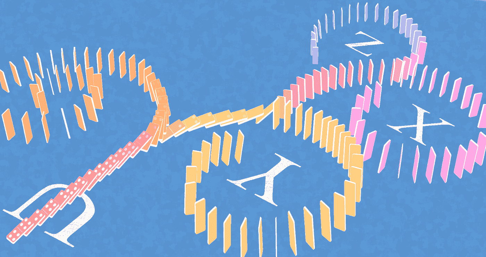

图片作者。

执行产品实验要容易得多，因为它不涉及向全体员工展示功能。当我们巩固了我们作为员工福利的地位时，即使有一个很好的系统来确保知情同意和补偿，干预的伦理也变得有点紧张。

我们可以更快地做那些对制造伟大产品至关重要的实验。

像威利这样的设计师运行着他们自己庞大的研究项目，并且总是在思考如何让事物更容易理解和使用。产品经理指定量化的结果来证明一个发布是否成功，或者是否需要重组。这使得尝试不同金额来优化付费推荐和会员增长变得更加简单。或略有不同的追加销售和推送通知，以推动产品的使用。或者一个额外的入职审查[将储蓄采用率提高了 31%](https://www.even.com/blog/financialhealthnetwork-even-savings-research) 。

这些是我们有设备和胃口的东西，我认为我们不能做类似的事情来测试企业的核心价值主张或我们的经济学基本理论是可悲的。

但是等等，等一下——*我们不能吗？*

让我们重温一下我们之前看到的因果效应的混淆图。这个更普通一点。我们有一些未知的 **U** 混淆变量，它以某种不确定的方式影响 Instapay 率和透支率(可能是减少或增加)。

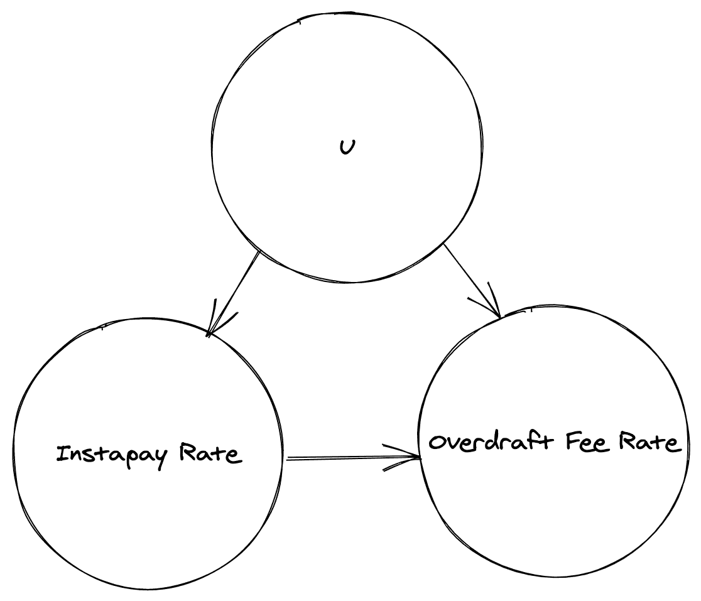

我们仍然想知道 Instapay 对透支率的影响有多大——是零、负还是正。

我们也有我前面描述的混淆问题，但是如果我们添加一个特殊的节点会怎么样呢？

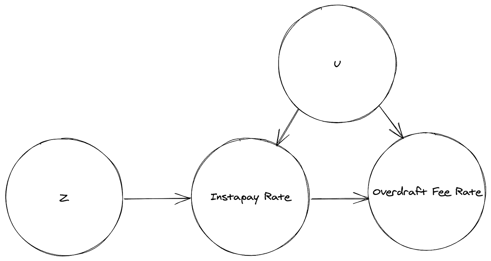

**Z** 这是我们*知道的*可以改变 Instapay 费率的任何策略(而且仅仅是 Instapay 费率)。例如，提醒会员更明智地使用 Instapays 的推送通知可能会减少使用量。

如果我们随机将 **Z** 应用于我们的人口，我们将知道 **Z** 与 Instapay 之外的一切都不相关，只通过对 insta pay 的影响与透支率*相关。*

这对我们有什么帮助？

好吧，让我们做标准的计量经济学的事情，并执行一些回归。我们可以得到 **Z** 对透支率的线性关系，得到线**Z→透支**。同理可以得到 **Z→Instapay** 。

这些关系只是线条(让我们假设我们的 **Z** 有很多好的层次，让我们画出一个整洁的层次)。

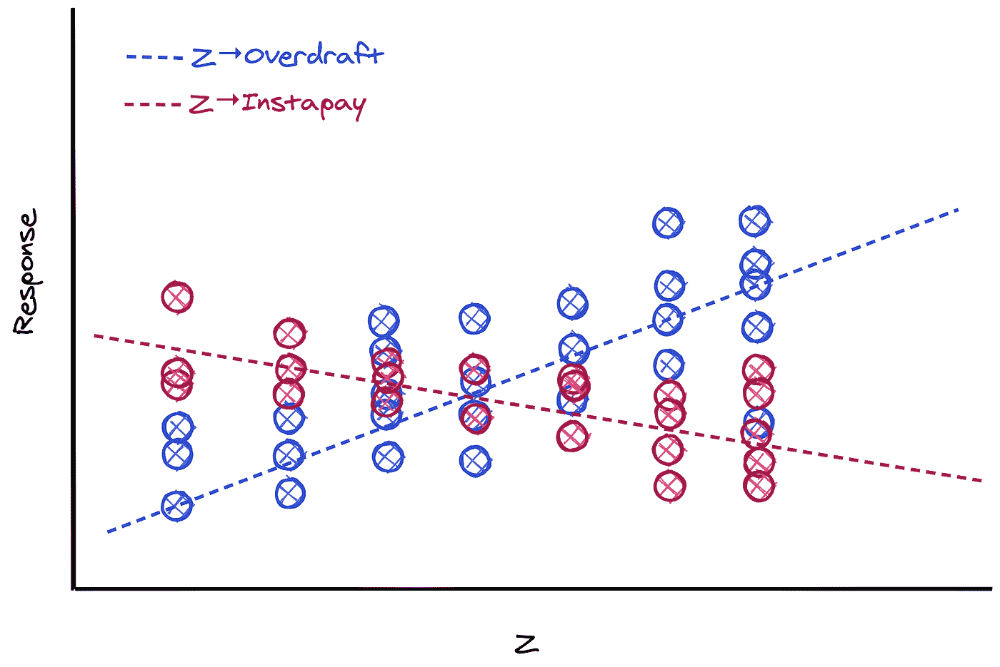

示例数据:Z 与即时支付和透支的相关性

从这个示例数据中，我们知道，随着 Z T21 的上升，Instapays 下降。与此同时，透支利率随着规模的扩大而上升。如果我们关于 **Z** 的假设是正确的，并且 **Z** 只通过它对 Instapays 的作用影响透支率，这一定意味着 Instapays 对透支有某种抑制作用。这是一个*因果影响*，尽管存在混杂变量，我们还是发现了这个影响。

让我们用更精确的数学术语来进行推理。我们可能会说:行**Z→透支**应该和**Z→Instapay→透支**一样。这意味着**Z→透支**可以表示为复合线性回归。我们观察到的数据给了我们足够的信息来[解决](https://en.wikipedia.org/wiki/Instrumental_variables_estimation#Interpretation_as_two-stage_least_squares)因果**insta pay→透支**关系，通过对该表示做一些线性代数。

就是这样。做个 A/B 测试，解几个线性方程，就有了。

因果推理的秘密一直在我们面前。

我们已经习惯于以高速度做的每件事都可以转向核心研究，并告诉我们我们的产品实际上让我们沿着我们的使命走了多远。随机推送通知、模态追加销售、通过聊天的热情欢迎、入职页面——它们都是因果王国的关键。

因为我们可以同时运行如此多的项目，所以即使一些项目失败了也没关系:它们可以在另一个时间、另一个地方，与另一个客户一起通过微小的调整重新启动。流行病、经济衰退或交易失败都无法阻止我们。

我们只需要执行。

我们也是。

如果你认为工程项目是学习世界上一些新的和基本的东西的机会，甚至可能是你的地方。我们在 [*招聘*](https://www.even.com/about/careers) *。*

*对于使用二元变量和随机化的* ***Z*** *的无假设分析，因果推断的途径比“复合线性回归”方法稍欠直观，但* [*仍然绝对可行*](/does-your-product-actually-work-5fe8134c5144) *并且非常非常酷。*