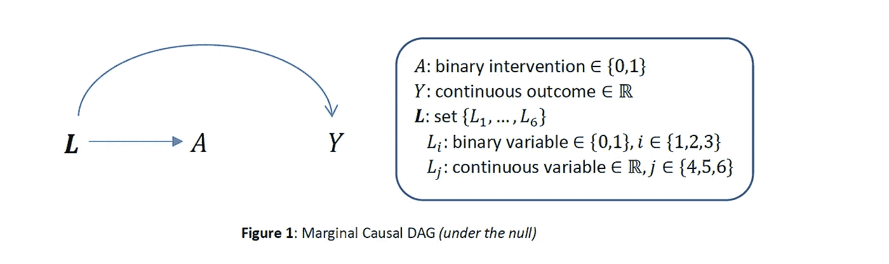
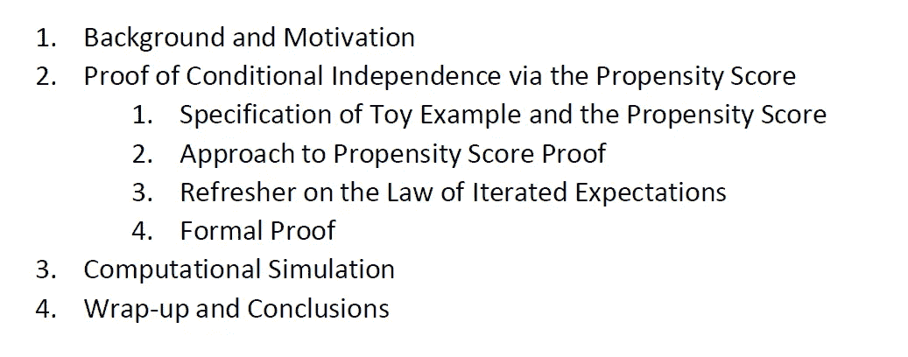
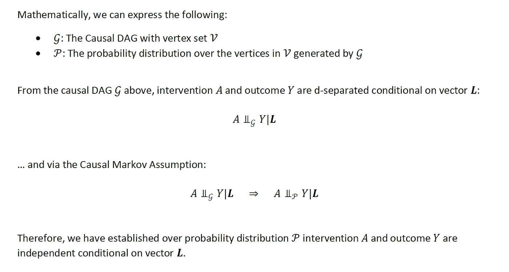
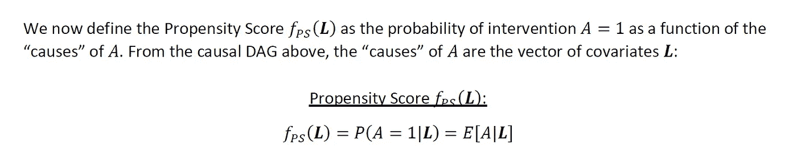
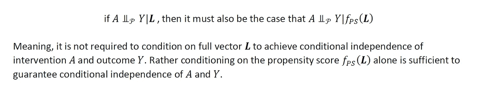
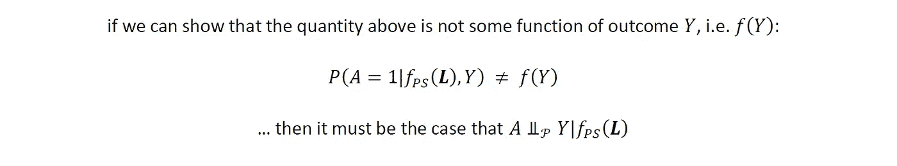
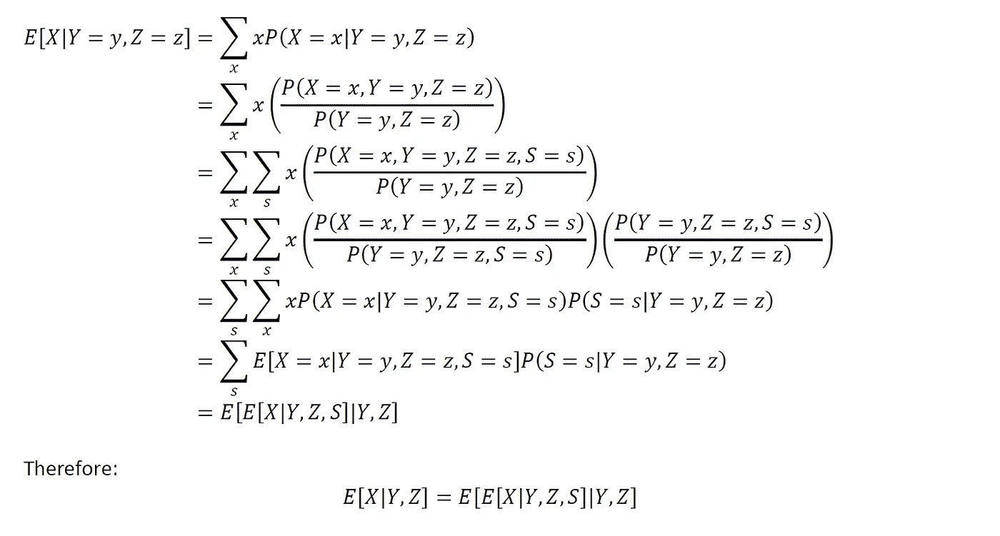
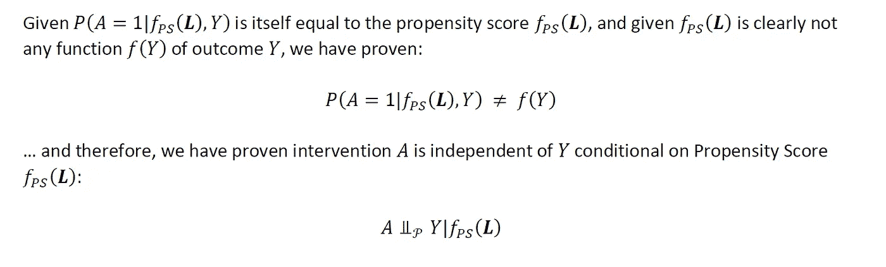

# 数据科学中的因果推理:通过倾向评分调整的条件独立性

> 原文：<https://towardsdatascience.com/causal-inference-in-data-science-conditional-independence-via-propensity-score-adjustment-bbe6d70e2a5?source=collection_archive---------19----------------------->

## 倾向分数的说明和证明，并附有计算模拟

穆罕默德·拉赫马尼在 [Unsplash](https://unsplash.com?utm_source=medium&utm_medium=referral) 上的照片

# 1:背景和动机

因果推理是一个涉及几个领域的领域，并引起了广大从业者的兴趣。这些人包括统计学家、数据科学家、机器学习科学家和其他计算研究人员。

到目前为止，我已经写了几篇关于因果推理空间的方法/主题的文章。其中包括:

*   [数据科学中的因果推理:高效的抽样框架&设计](/efficient-sampling-frameworks-in-causal-inference-data-science-52ad44e15f48)
*   [数据科学中的因果推断:G 方法的双重稳健估计](/doubly-robust-estimators-for-causal-inference-in-statistical-estimation-3c00847e9db)
*   [数据科学中的因果推理:结构嵌套模型的 G 估计](/causal-inference-in-data-science-g-estimation-of-structural-nested-models-d11b1e3c9360)
*   [数据科学中的因果推理:A/B 测试和边际结构建模的需要](/causal-inference-in-data-science-a-b-testing-and-the-need-for-marginal-structural-modeling-b9ab299681bb)
*   [数据科学中的因果推理:具有混杂调整的 M 偏差的结构](/causal-inference-in-data-science-structure-of-m-bias-with-confounding-adjustment-70e4a263ad08)
*   [数据科学中的因果推理:多重比较的有效推理覆盖](/causal-inference-in-data-science-valid-inferential-coverage-with-multiple-comparisons-750e9e3f0259)
*   [数据科学中的因果推断:A/B 检验&带协变量调整的随机试验](/causal-inference-in-data-science-a-b-testing-randomized-trials-with-covariate-adjustment-f5a24bd023b3)

这篇文章特别关注关于倾向得分的公式和证明。

作为一个玩具示例，让我们假设我们有一个二元干预 *A* ，连续结果 *Y* ，以及协变量矢量**L**，它们具有以下因果结构(在 *A* 对 *Y* 没有因果影响的零假设下):

作者图片

让我们假设我们对恢复对结果 *Y* 的干预 *A* 的平均因果差异的无偏估计感兴趣:

作者图片

从上面的因果 DAG 可以清楚地看出，干预 *A* 和结果 *Y* 是以向量 ***L*** 为条件的 d 分隔。因此，通过因果马尔可夫假设，干预 *A* 和结果 *Y* 独立于向量 ***L*** 。

这种情况下的倾向得分是以“原因” ***L*** 为条件的干预概率 *A=1* :

作者图片

在观察环境中，通过仅调节倾向得分来恢复干预 *A* 对结果 *Y* 的因果效应的无偏估计的能力在分析和数字上都明显有利。在有些情况下，给定研究中的干预 *A* 和结果 *Y* ，可以用比直接在结果模型中包括所有所需协变量 *L* 更高的数值稳定性来估计倾向得分。通过标量倾向得分的条件独立性也提供了在倾向得分的分级层内匹配干预臂的机会，以实现条件独立性并恢复感兴趣的因果效应。在协变量 *L* 的大向量的情况下，在由于稀疏性和小样本量而不可能在向量 *L* 的单个层内匹配的情况下，在倾向得分的层内匹配干预臂可能是可行的。

在这篇文章中，我们将表明，在给出的玩具问题的因果结构下，干预 *A* 和结果 *Y* 不仅是条件独立的给定向量 ***L*** ，而且是条件独立的，仅给定倾向得分本身。

这篇文章的目录如下:

作者图片

说到这里，让我们开始吧。

# 2:通过倾向得分证明条件独立性

## 2.1:玩具示例的说明和倾向得分

让我们再次具体说明我们的玩具例子:

假设我们有二元干预 *A* ，连续结果 *Y* ，协变量的向量 ***L*** 具有如下因果结构(在 *A* 对 *Y* 没有因果影响的零假设下):

作者图片

同样，假设我们对恢复干预 *A* 对结果 *Y* 的平均因果差异的无偏估计感兴趣:

作者图片

作者图片

作者图片

我们的目标是证明:

作者图片

## 2.2:倾向分数证明方法

让我们来看看下面的可能性:

作者图片

上面我们有概率 *A=1* 取决于倾向得分和结果 *Y* 。如果事实上情况是 *A* 和 *Y* 独立于倾向得分，那么上面的概率因此决不是结果 *Y* 的函数。

因此，如果我们可以证明上述概率绝不是结果 *Y* 的函数(即除了某个 f( *Y* )之外的任何函数)，那么我们已经有效地证明了干预 *A* 和结果 *Y* 在给定倾向分数的情况下必须是条件独立的:

作者图片

## 2.3:复习迭代期望定律

在我们给定倾向分数的条件独立性证明中，我们将在条件期望上利用期望的迭代法则。

作为复习，我们将证明以下等式:

作者图片

注意，在下面的证明中，我们假设 *X* 、 *Y* 、 *Z* 和 *S* 都是离散随机变量。在连续随机变量的情况下，证明将类似地遵循在所讨论的随机变量的支持上的积分，而不是和。

作者图片

## 2.4:正式证明

现在让我们进行我们的正式证明，即干预 *A* 和结果 *Y* 确实是以倾向得分为独立条件的:

作者图片

利用期望的迭代法则，我们将在向量 ***L*** 上指定附加条件的内部嵌套期望。

作者图片

让我们来审视一下内心的期待。我们有以倾向分数为条件的预期干预值 *A* ，结果 *Y* ，向量**L**。注意，倾向得分完全是向量*的函数，并且在这个意义上是 ***L*** 的“更粗糙”版本。假设 ***L*** 已经存在于条件语句中，倾向得分没有添加额外的信息，因此可以从预期中删除:*

**

*作者图片*

*我们现在有:*

**

*作者图片*

*让我们再次审视内心的期待。我们有干预的期望值 *A* 以结果 *Y* 和向量 *L* 为条件。回想一下空值下的因果 DAG，根据定义，干预 *A* 独立于结果 *Y* 以向量**L为条件:***

**

*作者图片*

*因此，根据定义，outcome *Y* 不会向内部条件期望添加额外的信息，并且可以被删除:*

**

*作者图片*

*因此，我们有:*

**

*作者图片*

*我们再次审视内心的期待。我们有期望的干预值*一个*条件向量 ***L*** 。请注意，根据定义，这种预期是我们的倾向得分:*

**

*作者图片*

*因此，我们有:*

**

*作者图片*

*在证明的这一点上，我们有了以倾向得分和结果 *Y* 为条件的倾向得分的期望值。以自身为条件的倾向得分的期望值实际上等同于恢复常数的期望值(根据定义，常数本身就是常数)。假设我们以一个常数为条件，在这种情况下，我们也以结果 *Y* 为条件的事实是不相关的:*

**

*作者图片*

*因此，我们有:*

**

*作者图片*

**

*作者图片*

# *3:计算模拟*

*我们现在将在 Python 中进行计算模拟，通过调节倾向得分来研究二元干预 A 对连续结果 Y 的因果效应差异的无偏估计的恢复*

1.  *创建一个具有真实因果 DAG 的模拟数据集，如下图*图 1* 所示，真实因果效应差 *A* 对 *Y* 为 2.3*
2.  *通过对结果模型中的全向量 ***L*** 进行调节，恢复因果效应差异的无偏估计*
3.  *估计倾向得分，并通过仅调节结果模型中的倾向得分来恢复因果效应差异的无偏估计*

*让我们从加载我们的库开始:*

*，一个模拟数据集的函数:*

*…以及单变量、多变量和倾向评分方法的函数:*

*指定了我们的函数后，我们就可以进行计算模拟了。*

*让我们从恢复模拟数据集开始:*

*让我们以干预*和*作为唯一输入，对结果模型进行单变量回归:*

*如上述结果所示，A 对 Y 的因果效应差异估计为-3.1027。这显然是一个有偏差的估计，因为我们知道真正的因果效应差是 2.3。鉴于我们玩具问题的因果结构，这一发现也并不令人惊讶(如图*图 1* 所示)。我们知道 A 和 Y 不是边际独立的。*

*现在让我们执行结果模型的多变量回归，以 *A* 和矢量**LT5 为条件:***

*如以上结果所示，现在估计 *A* 对 *Y* 的因果效应差为 2.3022。这似乎是真实因果效应差异的无偏估计。给定 *A* 和 *Y* 在向量 ***L*** 上是 d 分离的条件，这一发现同样不令人惊讶。*

*现在让我们看看我们是否可以复制相同的结果，但是通过仅将结果模型限制在倾向得分上，而不是全向量 ***L*** :*

*如上述结果所示，A*对 Y* 的因果效应差估计为 2.3059。这也是真实因果效应差异的无偏估计。*

*以上计算模拟的完整代码/笔记本，请看下面的 [**github 链接**](https://github.com/atrothman/Propensity-Score-Simulation-) 。*

# *4.总结和结论*

*这总结了我们的推导和利用倾向评分模型的计算模拟。我鼓励读者使用我的代码(通过上面的 github 链接)作为起点，并创建自己的模拟来进行实验。*

*如果你想了解更多关于因果推理的方法和注意事项，我会推荐哈佛大学 Miguel Hernan 和 Jamie Robins(我以前的两位教授)的教科书“*因果推理:如果*会怎样”，加州大学洛杉矶分校的 Judea Pearl 的教科书“*因果关系*，斯坦福大学的达芙妮·黑仔和耶路撒冷希伯来大学的 Nir Friedman 的教科书“*概率图形模型:原理和技术*，以及加州大学的 Mark van der Laan 的两本关于*目标最大似然估计*的教科书*

*[因果推断:如果](https://www.hsph.harvard.edu/miguel-hernan/causal-inference-book/)会怎样*

*[因果关系](http://bayes.cs.ucla.edu/BOOK-2K/)*

*[概率图形模型:原理和技术](https://mitpress.mit.edu/books/probabilistic-graphical-models)*

*[目标最大似然估计](https://vanderlaan-lab.org/papers/)*

*一如既往，以后还会继续写类似的小品。请 [**订阅并关注我在**](https://anr248.medium.com/) 和 [**LinkedIn**](http://www.linkedin.com/in/andrew-rothman-49739630) 上的更新！*