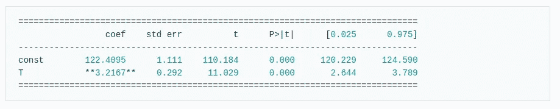

# 因果推理——控制还是不控制

> 原文：<https://towardsdatascience.com/causal-inference-to-control-or-not-to-control-417e2721e22e?source=collection_archive---------23----------------------->

## 在因果估计和统计估计之间建立联系

[https://github . com/crypt exis/causal _ inference/blob/main/collider _ fork/collider _ fork . ipynb](https://github.com/cryptexis/causal_inference/blob/main/collider_fork/collider_fork.ipynb)

我将避免重复其他教程和书籍中的大部分内容，例如什么是碰撞器或分叉。当讨论相关话题时，我会提供有用的链接。否则，我假设读者要么熟悉这个主题，要么有足够的动机去了解更多。万一你觉得缺乏知识或背景，这里有一套我推荐参考的资源:[ [因果推断入门课程](https://www.bradyneal.com/causal-inference-course)，[因果推断:统计学中的混合磁带](https://mixtape.scunning.com/) [因果推断:初级读本](https://www.amazon.de/-/en/Judea-Pearl/dp/1119186846)，[因果关系](https://www.amazon.de/-/en/Judea-Pearl/dp/052189560X)

作为我写作的第一个实验，我选择写关于因果推理的文章，并在这篇[论文](https://academic.oup.com/ije/article/48/2/640/5248195)的基础上做一个小练习。这篇论文将在[因果推理入门课程](https://www.bradyneal.com/causal-inference-course)的第四周讨论。
这里的不同之处在于我保留了:

1.  变量之间的关系完全相同，而在视频中它们被修改了
2.  治疗变量是连续的，而在视频中，它被修改为二元变量，以显示一种估计平均治疗效果的特殊技术。

此外，我愿意联系一些点，说明为什么某些技术正在估计平均因果效应，并强调如果天真地估计因果效应会发生什么。

## “我妈妈总是说生活就像一盒巧克力。你永远不知道你会得到什么”——阿甘正传

**因果推断……哪里需要？**

简称:不可能进行随机对照试验(RCT)时。无法进行 RCT 的原因有很多，其中一些在参考博文的[“为什么在行业中进行 CI”](https://emilyriederer.netlify.app/post/causal-design-patterns/)小节中有描述。

为了激励我们的练习，让我们想象以下情景:
当你正在工作中放松、摆弄数据或与 Tensorboard 进行凝视比赛时，你的老板打电话给你，让你调查变量 ***X*** 对业务 KPI ***Y*** 的影响。

你可能的答案是什么？

**A.** 为了准确理解效果，我们需要设置一个 RCT，对一定比例的用户关闭产品功能***X***N 次。

好的，我会尽我所能。

如果你答**答**会导致很多复杂情况:

1.  也许特性 ***X*** 是成功的:关闭它会导致大量的机会成本
2.  RCT？说起来容易做起来难。建立 RCT 有其自身的挑战。即使有成熟的 A/B 测试框架的公司有时也很难把它做好。
3.  如果你想随机化的东西不可能随机化呢？

结果:如果你的意图是让你的老板滚蛋，那么，任务完成了！

如果你的答案是 B，那么我希望下面的练习能对一些实践和理论问题有所启发。更具体地说:

*   如何/为什么线性回归系数可以用来估计一个变量对另一个变量的平均因果影响？
*   如果在估计平均因果效应的过程中控制了错误的变量，会发生什么？

# 关于数据生成过程

当我们谈论数据生成过程时，我们不得不谈论它的因果结构。为了表示世界的因果结构，当前的文献建议使用两种工具:

1.  结构因果模型
2.  图形模型

给定随机变量 ***X*** ， ***Y*** 和 ***Z，*** 单片机可能会得到 ***Z=f(X，Y)*** 。这意味着变量 ***X*** 和 ***Y*** 导致变量*。还有，单片机的部分是描述 ***f*** 的确切形式。将变量之间的关系建模为线性函数往往是一种方便的选择(原因是可解释性)。*

*示例:*

**

*与上面的 SCM 相对应的图形模型如下所示:*

**

*为了遵循[论文](https://academic.oup.com/ije/article/48/2/640/5248195)中提供的数据生成过程，我做了两件事。把用 R 编写的巫术(无意冒犯 R 专家，我只是讨厌那种语言)翻译成 Python，并引入了一点结构:*

*在本文提出的所有研究中，变量 ***T*** 到 ***Y*** 的影响始终是研究的主题。因此，当谈论像*分叉*或*碰撞器*这样的特定结构时，它意味着强调第三个变量如何与*和 ***Y*** 相关。**

****生成分叉结构****

****

**具有相应的 SCM 和图形模型:**

********

**在本[笔记本](https://github.com/cryptexis/causal_inference/blob/main/collider_fork/collider_fork.ipynb)中还可以找到另外两个例子。其中研究了*对*的平均因果效应。在其他文献中 ***ACE*** 被命名为 ***吃了*** (治疗效果一般)。就我个人而言，我喜欢平均因果效应，因为平均治疗效应表明变量 t 的二值化，例如，受试者是否接受治疗。这些只是语义。可能只是我吧:)****

**为了理解估算 ***ACE*** 的程序，让我们退一步来做。**

# **一点形式主义:关于回归系数的一个小故事**

**让我们想象一下:**

****

**我们用线性回归来满足**

****

**其中 ***X*** 是其他协变量的向量。让我们根据期望值改写等式:**

****

**并且对于*的每一个*值:****

****

**现在让我们看看当我们用*改变*值*时，期望值的差异会发生什么。***△***代表一个单位改变 int $ T $的值。不失一般性，我们可以假设 ***delta = 1*** 。***

****

**这不应该让我们感到惊讶:这就是我们总是如何解释线性回归的系数——当相应的协变量改变一个单位时，结果变量的预期变化。然而，这个估计真的带有因果性质吗？让我们再做一步来理解其中的区别。**

# **多一点形式主义**

**如果 ***T*** 为二进制，我们将 ***ACE*** 定义为:**

****

****左右的重要区别 *=？*** 标志是 ***的存在，做***-操作符。 ***做***-操作符代表干预。更具体地说，***E[Y | do(T = 1)】***测量当群体中的每个人都采取处理*时 ***Y*** 的期望值，而 ***E[Y|T=1]*** 以采取处理**的子群体为条件的 ***Y*** 的期望值*****

**现在当 ***T*** 是我们感兴趣的连续值时:**

****

**和线性回归的情况一样，我们可以假设 ***delta=1*** 。上述等式的左边转化为:**

***“治疗变量* ***T*** *对结果变量* ***Y*** *的平均因果效应是什么，当我们将变量* ***T*** *改变一个单位时”***

**这里一个重要的问题是*“我们怎样才能表达出=？就右侧而言？”***

****定义**(后门准则):给定 DAG ***G*** 中的一对有序变量 ***(T，Y)*** ，如果***Z*中没有节点，则一组变量*相对于 ***(T，Y)*** 满足后门准则*******

(以上定义摘自朱迪亚·珀尔)

这基本上意味着为了进行上述分解，一个**需要控制所有不是 ***T*** 的后代的变量**，并且**不应该控制任何一个后代。**

好吧，让我们看看这与回归系数的关系，以防我们必须控制一个变量***【Z】***:

现在，对于变量之间的线性关系:

类似于线性回归的推导，我们可以从刚刚获得的结果中推导出:

这基本上表明，在我们对右变量进行**控制的情况下，我们可以通过对数据拟合线性回归(当然，只有当 SCM 由线性关系组成时才成立)并查看治疗变量的系数来估计*。***

# *进行实验*

*[论文](https://academic.oup.com/ije/article/48/2/640/5248195)模拟了 24 小时膳食钠摄入量(*)与收缩压( ***Y*** )关系的现实研究数据。随着年龄的增长, ***W*** 我们的肾脏会发生变化，从而影响我们体内钠的平衡和收缩压。由此可见， ***W*** 是既有 ***T*** 又有 ***Y*** 的共同原因。另一方面，24 小时膳食钠摄入量和高收缩压都会导致尿蛋白排泄 ***Z*** 。由此可见，*是由*和 ***Y*** 共同造成的。****

**数据生成过程和生成的图表如下所示:**

****生成 Fork + Collider 数据****

****

**具有相应的 SCM 和图形模型:**

********

**这里我们可以看到 ***T*** 对 ***Y*** 的因果作用是 ***1.05*** 。**

****假设** 我们假设已经为我们提供了图形模型，并且我们知道变量之间的关系是线性的。**

**“我们如何在真实世界场景中获得这样的图形模型？”- 好问题！**

**以下是方法:**

1.  **[研究的一个分支](https://arxiv.org/abs/1803.01422)致力于从数据中学习因果 DAG。**
2.  **领域知识:给定领域中的数据和足够的专业知识，人们可以提出一个相当不错的图形模型。**

****估算**
如上图所示，我们需要的是对一组变量进行线性回归拟合，看变量的系数 ***T*** 。**

**现在让我们看看用不同的方法估算 ***ACE*** …**

****方法一:**白调整**

********

**这里我们只是由*高估了 ***T*** 的效果。想象一下，如果你向你的老板传达这样一个评估，会对业务产生什么影响。结论:仅仅收集数据和比较组平均值而不做进一步检查是不允许的！。***

****方法 2:** 残酷的数据科学家模式——将所有变量倒入:调整 ***W*** 和 ***Z*****

********

**何？ ***-0.9117*** ？完全不同的符号。这意味着不仅幅度是错误的，而且结论也有 180 度的不同。**

**在一个简化的世界中，对于第一种方法，你可以告诉你的老板*“如果你花 1 美元，你将产生 3.22”*在第二种情况下，消息将是*“如果你花 1 美元，你将损失额外的 90 美分”。***

****方法 3:** 我们停止抄近路，看看 DAG。DAG 说， ***W*** 是分叉， ***Z*** 是碰撞器。或者放入后门准则(BC)的话， ***Z*** 不满足 BC 准则， ***W*** 满足。因此我们只需要控制 ***W*** 。**

********

**似乎我们击中了目标。这里令人不安的是置信区间的宽度。它们看起来像是格朗德穿过的。**

**但这是另一个时代的故事了…**

**如果你正在读这一行，这意味着你已经通过:)感谢阅读！我将在未来回到因果推理主题，以涵盖更现实和有趣的用例。**

# **参考**

**[1]米格尔·安杰尔·卢克-费尔南德斯，迈克尔·斯科梅克，丹尼尔·雷东多-桑切斯，玛利亚·何塞·桑切斯·佩雷斯，阿南德·瓦伊迪亚，米蕾尤·E·修尼泽，[教育笔记:非传染性疾病流行病学数据分析中的矛盾对撞机效应:可再现的图解和网络应用](https://academic.oup.com/ije/article/48/2/640/5248195) (2019)，《国际流行病学杂志》**

***最初发布于*[*https://cryptexis . github . io*](https://cryptexis.github.io/projects/colliders-and-forks)*。***