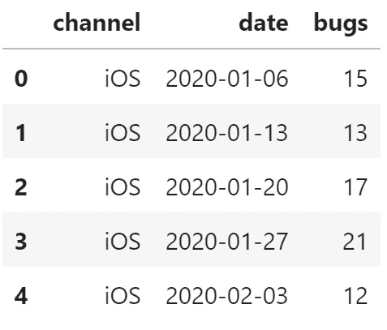
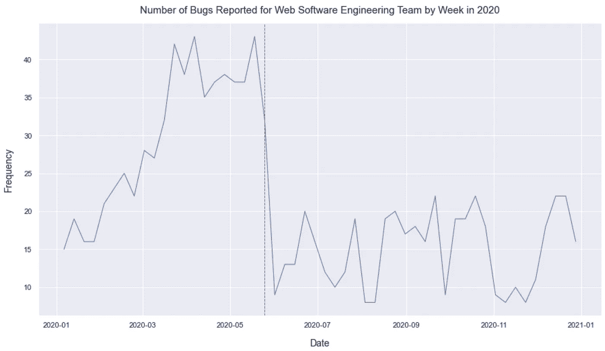
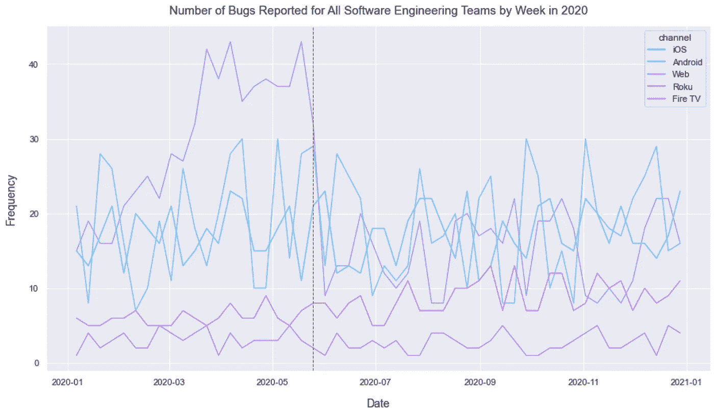
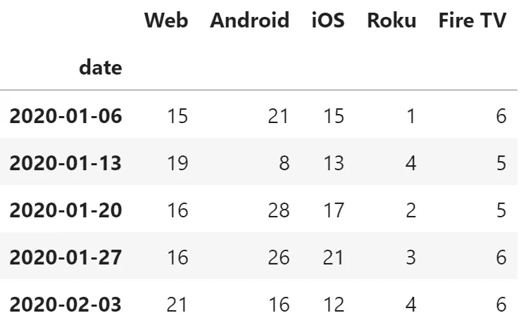
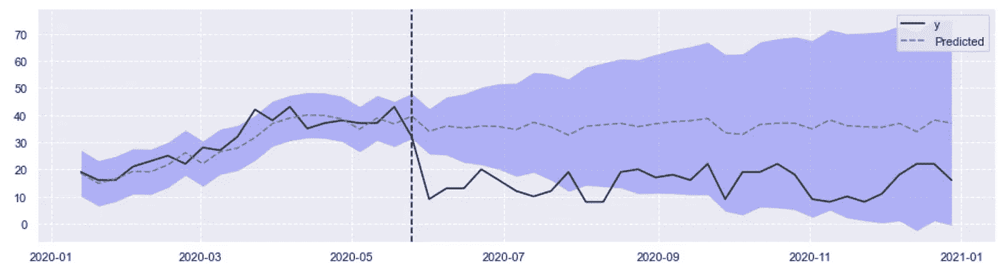
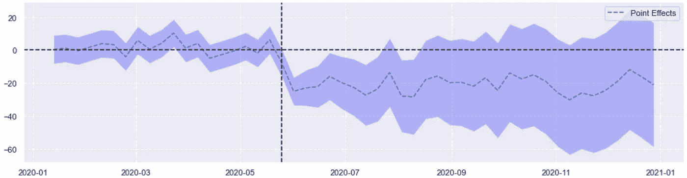
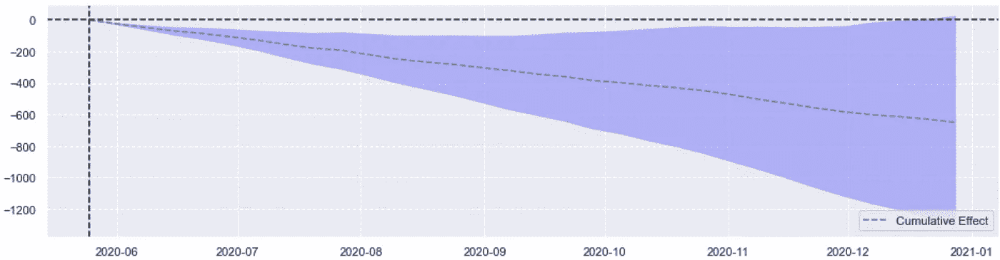
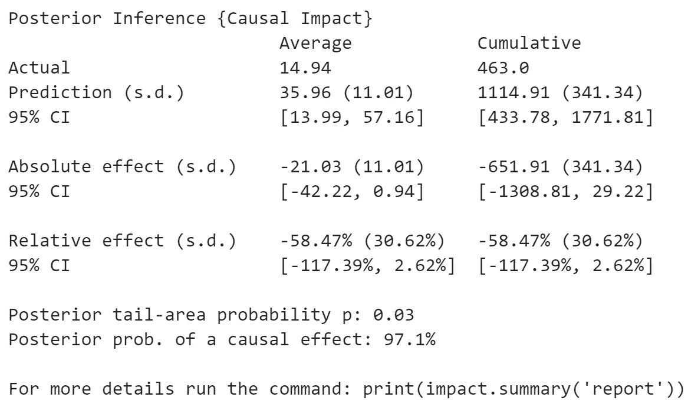
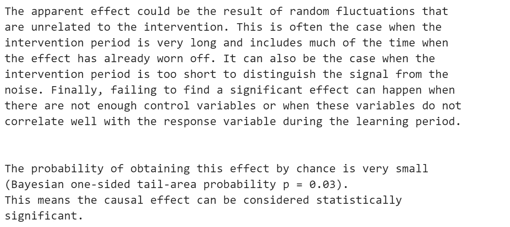

# 基于贝叶斯结构时间序列模型的因果推理

> 原文：<https://towardsdatascience.com/causal-inference-using-bayesian-structural-time-series-models-ab1a3da45cd0?source=collection_archive---------10----------------------->

## 调查培训活动对软件工程团队报告的错误数量的影响

埃里克·卡瑞茨在 [Unsplash](https://unsplash.com?utm_source=medium&utm_medium=referral) 上的照片

在本文中，我将向您简要介绍因果推理，以及作为数据科学家我们为什么需要它，然后我将展示一个如何使用 Python 库[因果影响](https://github.com/dafiti/causalimpact)应用这一概念的实际例子。

# 因果推理导论

《大英百科全书》用一个我们都能理解的有用例子来定义因果推理:

> 在因果推理中，一个人推理出某事物是或可能是另一事物的原因的结论。例如，从一个人听到钢琴音乐的事实，可以推断出某人正在(或曾经)弹钢琴。但是尽管这个结论是可能的，但它是不确定的，因为声音可能是由电子合成器产生的。

因果推断是关于确定一个事件或干预对预期结果指标的影响。也可以认为是确定结果指标的变化是否是由事件或干预引起的。

例如，1)营销活动(干预)对我们产品的销售有什么影响(结果)，2)我们产品的销售增长是因为营销活动还是因为其他原因？我们可以用因果推理来回答这些问题。

当做出可能影响数百万人或涉及数百万美元的决策时，通常会使用因果推理，例如在医疗保健、公共政策、科学和商业领域。在这种情况下，重要的是我们的分析要基于可靠的统计数据，而不仅仅是随意浏览数据和图表。

分析干预的影响的挑战是，我们不容易检查没有干预的情况下序列的趋势。在我们的营销示例中，我们有一个在活动干预后的销售记录，但是我们不知道如果没有干预会有什么样的销售。

这就是使用贝叶斯结构时间序列模型的因果推理可以帮助我们的地方。我们可以使用这样的模型来预测如果没有干预会发生什么，这被称为*反事实*。然后我们可以将反事实与我们实际观察到的进行比较。

# 因果影响库

2014 年，Google 发布了一个 [R 包](http://google.github.io/CausalImpact/)，用于时间序列中的因果推断。我们在下面的例子中使用的 Python [因果影响](https://github.com/dafiti/causalimpact)库是 Google 模型的完整实现，所有功能都完全移植。

该库的实现最好由它的作者来解释:

> 该算法的主要目标是通过分析预期和观察到的时间序列数据之间的差异，推断给定干预(或任何行动)对某些响应变量的预期影响。
> 
> 数据分为两部分:第一部分是所谓的“干预前”时期，使用[贝叶斯结构时间序列](https://en.wikipedia.org/wiki/Bayesian_structural_time_series)的概念来拟合一个模型，该模型可以最好地解释观察到的现象。拟合的模型用于数据的第二部分(“干预后”时期)，以预测如果不进行干预，反应会是什么样子。推断基于观察到的响应与预测响应之间的差异，预测响应产生干预对数据造成的绝对和相对预期影响。

# 通过例子进行因果推理

以下是我们将使用的场景:

*   流媒体服务 WebFlix 通过几个渠道提供内容:iOS 应用程序、Android 应用程序、Roku 应用程序、Fire TV 应用程序和网络浏览器。
*   每个渠道由不同的软件工程团队管理。
*   工程团队跟踪每周报告的错误数量，并监控模式。
*   网络团队的管理层发现 2020 年初报告的错误数量呈令人担忧的上升趋势，并在 2020 年 5 月仅向该团队提供了培训以解决问题。

培训之后，Web 团队报告的错误数量减少了，并在 2020 年的剩余时间里保持稳定。**报告的错误减少是提供培训的结果还是另有原因？**

我们的数据集包含每个软件工程团队的每周错误报告。所有代码和数据都可以在这个 [GitHub repo](https://github.com/nickdcox/ml-causal-inference-swe) 中获得。

你可以在下图中看到，2020 年上半年，网络团队报告的错误数量有所增加。红色虚线表示提供培训的那一周。

下一个线图显示了所有软件工程团队报告的错误趋势。除了 Web 之外，所有团队的错误报告全年都相当稳定，在一个一致的范围内波动。

根据上面的线图，我们可以得出一个初步的结论，即所提供的培训可能是 Web 团队报告的错误减少的原因。然而，为了增加我们结论的可信度，我们将利用因果影响库进行统计分析。

在我们能够使用因果影响之前，我们需要将我们的数据框架转换成宽格式，以便每个软件工程团队都有一个列，列出每周报告的错误数量。我们可以使用熊猫数据透视表功能来做到这一点。我们还需要确保我们的日期变量被设置为索引，并且 Web 变量被移动到 DataFrame 的第一列。

该模型将使用所有软件工程团队的错误报告数据来帮助我们确定指定的干预是否是 Web 团队报告的错误减少的真正原因。

下面是代码和生成的数据帧:

使用和解释因果影响库的结果非常容易。我们首先定义干预前的时间段(在 2020 年 5 月的最后一周提供培训)和干预后的时间段。

然后，我们通过提供宽数据框架和我们刚刚定义的两个时间段来运行模型。处理完成后，我们可以使用三种可用的绘图类型绘制结果:原始、逐点和累积:

下面的第一个图显示了 Web 软件工程团队报告的实际错误(y)与同一团队的预测(预测)，考虑了 Web 团队在 2020 年 1 月至 5 月报告的错误以及其他软件工程团队全年报告的错误。

从图中可以明显看出，网络团队对 2020 年 6 月至 12 月的预测高于实际报告。这表明在 2020 年 5 月发生了一次干预，从 6 月开始，对 Web 团队报告的错误数量产生了积极的影响。这进一步支持了一个结论，即 2020 年 5 月向 Web 团队提供的培训是从 6 月起报告的 bug 减少的原因。

下一个图显示了实际序列和预测序列之间的差异，称为点效应。

最后的图显示了累积效应，它基本上是一段时间内累积的点效应的总和。

*的因果影响*库还可以为我们提供数值和统计输出以供进一步分析:

最后，我们还可以生成一份书面报告，用一行代码解释我们的分析结果:

本报告证实了我们早期的初步结论，即从 2020 年 6 月起，网络软件工程团队报告的错误减少的原因是 2020 年 5 月向团队提供的培训。偶然获得这种效应的概率非常小，因此可以认为因果效应在统计上是显著的。

**干预，也就是提供的培训，对报告的错误有-21.03 的影响，间隔为 95%。提供培训是一个好的决定，因为它达到了预期的效果。**

# 结束语

因果推断是一个很难解决的问题，但数据科学家越来越多地被要求解决这个问题。因果影响等库的引入给了我们一个很好的工具，能够在这方面取得进展。

正如您在错误报告示例中看到的，这个库非常容易使用，并且结果可以被快速解释和理解。我们可以迅速获得对任何结论的信心，并将我们的结果传达给利益相关者。

也请查看我的系列文章**通过示例学习 Python 数据分析**:

*   [通过示例学习 Python 数据分析:纽约市违章停车](/learn-python-data-analytics-by-example-ny-parking-violations-e1ce1847fa2)
*   [通过示例学习 Python 数据分析:航班到达延误](/learn-python-data-analytics-by-example-airline-arrival-delays-e26356e8ae6b)。
*   [通过例子学习 Python 数据分析:芝加哥交通事故](/learn-python-data-analytics-by-example-chicago-traffic-crashes-4840f6f15ed)

我最近发表的其他文章:

*   [提升您的数据科学能力:学会随机应变](/elevate-your-data-science-abilities-learn-resourcefulness-5ae879a6b3b7)
*   [你是不是得了冠状病毒却连自己都不知道？我知道是谁干的！](https://medium.datadriveninvestor.com/did-you-have-coronavirus-and-not-even-know-it-i-know-who-did-77200e76149e)

 [## dafiti/causalimpact

### Python 因果影响(或因果推理)谷歌模型的实现，所有功能完全移植和…

github.com](https://github.com/dafiti/causalimpact)  [## nickdcox/ml-因果推理-swe

### 此时您不能执行该操作。您已使用另一个标签页或窗口登录。您已在另一个选项卡中注销，或者…

github.com](https://github.com/nickdcox/ml-causal-inference-swe)