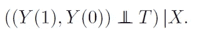
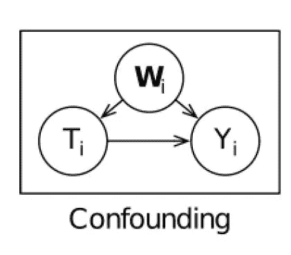
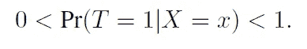
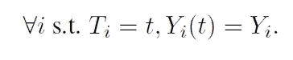
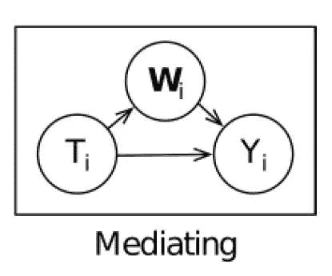
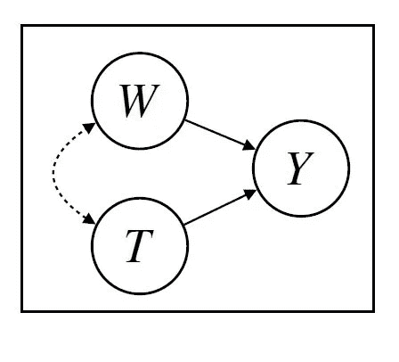

# 使用自然语言处理的因果推理

> 原文：<https://towardsdatascience.com/causal-inference-using-natural-language-processing-da0e222b84b?source=collection_archive---------7----------------------->

## [思想和理论](https://towardsdatascience.com/tagged/thoughts-and-theory)

## 应用 NLP 方法估计文本变量的因果效应及其在社会科学研究中的应用。

猫折纸最终导致了数据科学。图片作者。

最近，我很荣幸地接受了 TDS 编辑本·胡伯尔曼的【T2 作家聚焦】采访。我借此机会强调了我学习数据科学的连接主义方法。特别是，我讨论了我不断连接想法的愿望——这种倾向是这篇文章的原因，它结合了我的两个兴趣:自然语言处理(NLP)和因果推理。我受到了本月初发表的[计算语言学调查论文](https://arxiv.org/abs/2109.00725)的启发，该论文全面回顾了自然语言处理在因果推理中的应用，以及相反地，因果关系在改进自然语言处理模型中的应用。将因果关系应用于 NLP 研究的反向关系，对提高人工智能模型的可靠性和公平性具有启示意义；我将在以后的文章中探讨这种联系。在这里，我将重点放在第一种关系上，其主要目标是将最新的研究成果转化为社会科学研究的应用。

NLP 具有帮助估计因果效应的潜力，这一事实可以用于经济分析、公共健康研究以及销售和营销活动。在以前侧重于计量经济学的文章中，我详述了推断因果估计的统计挑战。例如，在[因果森林的介绍性教程](/causal-machine-learning-for-econometrics-causal-forests-5ab3aec825a7)中，我讨论了[潜在结果框架](https://en.wikipedia.org/wiki/Rubin_causal_model#Potential_outcomes)，并在[中讨论了](/causal-ml-for-data-science-deep-learning-with-instrumental-variables-96e5b7cc0482)[混杂性](https://en.wikipedia.org/wiki/Confounding)，这是一个关于使用工具变量进行深度学习的教程。在本文中，我将回到这两个观点，首先简要总结潜在的结果和混杂变量在估计因果关系中的作用。这直接导致了对文本数据复杂性的讨论，以及对文本变量可用作治疗、结果、中介或解决混淆的假设的挑战。接下来，我使用因果[有向无环图](https://en.wikipedia.org/wiki/Directed_acyclic_graph) (DAGs)来描述取自前面提到的调查论文( [Feder 等人，2021](https://arxiv.org/abs/2109.00725) )的一个实际例子，该例子突出了使用 NLP 进行因果推理的潜力。最后，我讨论了几个应用研究，展示了使用文本变量进行因果推理的多功能性。

# **潜在结果和混杂因素**

为了从观测数据中估计因果效应，我们必须设想反事实的情况。因此，因果推理的关键要素是基于感兴趣的[干预](https://en.wikipedia.org/wiki/Causal_model#Intervention)来定义反事实。更具体地说，因果效应被定义为治疗中单位水平的干预变化对结果变量(Y)的影响程度(T∈{ 0；1});换句话说，真实世界 Y(1)和反事实世界 Y(0)的结果之间的差异。当感兴趣的因果效应是平均治疗效应(ATE)时，事实观察和反事实观察之间的关系可以描述为下图所示。

平均治疗效果(ATE)是真实世界和反事实世界之间预期结果的差异。图片作者。

此外，为了表明治疗*导致*一个结果(Y)，治疗(T)的变化应该导致结果(Y) 的变化，而所有其他协变量(X)保持不变；这种类型的治疗变化被称为干预。

然而，因果推理的基本问题是，不可能直接观察到反事实的结果。因此，需要一个潜在的结果框架来描述具有反事实条件的因果统计模型——这些条件是在不同情况下为真的陈述。潜在结果框架还规定了因果推断需要满足的几个假设。如果我们暂时忽略关于协变量(X)的假设，有三个相关的假设:可忽略性，积极性和一致性。

可忽略性要求治疗分配独立于已实现的反事实结果。这通常是通过随机分配实现的；然而，当使用观测数据时，这可能是不可行的。在这种情况下，有必要依赖条件可忽略性，其中协变量 X 是一组变量( *x* )，使得治疗分配(T)和潜在结果(Y (1)和 Y(0))在 X 的水平内是不成立的。该假设如下图所示。

条件可忽略性假设，也可以称为条件独立性或条件不可数性。来源:[费德等人，2021](https://arxiv.org/abs/2109.00725) 。

然而，条件可忽略性需要一个强有力的假设，即不存在不可观察的混杂因素。当一个变量(混杂因素)对治疗(T)和结果(Y)都有影响时，就会产生混杂因素，导致虚假的相关性。下图显示了这种关系，其中 W *ᵢ* 是混杂变量。

混杂因素 Wᵢ对治疗(t)和结果(y)都有影响。资料来源:[韦奇等人，2020 年](http://proceedings.mlr.press/v124/veitch20a.html)。

其次，阳性是假设接受治疗的概率介于 0 和 1 之间。在条件可忽略性下，正定性假设对于所有协变量(*X*)Pr(X =*X*)≠0，

条件可忽略性下的正性假设，也称为重叠假设。资料来源:[费德等人，2021](https://arxiv.org/abs/2109.00725) 。

阳性还意味着在给定协变量 x 的情况下，无法完美预测治疗状态。最后，一致性要求在给定单位( *i* )的给定治疗状态下观察到的结果与该单位被分配到治疗中观察到的结果相同。这种一致性假设也可以称为[稳定单位治疗值假设](https://en.wikipedia.org/wiki/Rubin_causal_model#Stable_unit_treatment_value_assumption_(SUTVA)) (SUTVA)，如下图所示。

反事实一致性假设。来源:[费德等人，2021 年](https://arxiv.org/abs/2109.00725)。

一致性假设对反事实结果和观察结果之间的关系做出了两个断言。第一，没有干扰，因此一个单元( *i* )的结果只受其治疗状态的影响，而不受其他单元的治疗状态的影响；第二，治疗只有一个版本。下一节描述了在各种文本变量设置中面临的假设挑战。

# **文本变量在因果推理中的作用**

传统上，NLP 模型使用统计相关性来进行预测，并且依赖于训练和测试数据同分布的通常假设。然而，因果推理是一种不同类型的挑战，特别是对于非结构化的文本数据。尽管如此，对于文本，有机会利用[数据生成过程](https://en.wikipedia.org/wiki/Data_generating_process) (DGP)的因果结构的领域知识，这可以暗示归纳偏差，从而导致更稳健的预测。此外，关于公平性，对预测器的随意观察可以解释其内部工作，这是相对于非因果黑盒的显著优势。

文本在编码治疗或感兴趣的结果方面具有灵活性，甚至在编码代表治疗(独立的)可以影响结果(依赖的)的中间方式的介质方面也具有灵活性。下图描述了中介设置，其中 W *ᵢ* 是受治疗影响的中介变量，而其本身对结果有影响。

文本作为中介设置，其中 W *ᵢ* 是中介变量。资料来源:[韦奇等人，2020 年](http://proceedings.mlr.press/v124/veitch20a.html)。

有了文本数据，也有可能解决混淆，使估计因果关系成为可能。混淆可能是由于主题、写作风格或语气；因此，包括这些混杂因素的文本控制，允许我们假设条件忽略。

重要的是，文本是高维的，有必要从文本中提取信息，以便估计因果关系。这意味着需要复杂的语言建模来度量语义上有意义的因素，如主题。自然语言处理的发展，如主题模型和上下文单词嵌入，使得利用文本回答因果问题成为可能。挑战在于开发新的假设，以确保 NLP 方法的使用将导致有效的因果推断。

例如，以文本作为结果，关键问题是如何将高维文本数据提取为感兴趣的低维特征。有必要根据数据开发一个测量模型；但是，这样做时，一个观察的治疗状态可能会通过测量选择影响另一个观察的结果。这导致了两个问题——首先，它违反了一致性，其次，如果我们要对同一数据探索多种不同的度量，还会有其他问题。这个问题的解决方案是开发一个测量模型，用独立的数据，而不是用来估计因果关系的数据。本节的其余部分按以下顺序讨论其余的文本变量场景:治疗、混杂和中介。

将文本作为治疗手段，我们对语言对下游决策、行为和其他结果的因果关系感兴趣( [Feder 等人，2021](https://arxiv.org/abs/2109.00725) )。考虑治疗发现，这种方法产生文本的可解释特征，这些特征可以与结果有因果关系。这种分析文本效果的方法可以通过潜在的影响维度来完成，如主题或词汇特征，如 n-grams ( [Pryzant et al .，2018](https://aclanthology.org/N18-1146/) )。还可以估计从文本中提取的特定属性的因果效应( [Wood-Doughty et al .，2018](https://arxiv.org/abs/1810.00956) )。

文本作为因果推理的治疗设置有三个挑战。第一个与人们阅读特定文本的选择有关——他们选择的原因往往与兴趣的结果有关；因此，违反了可忽略性假设。随机分配文本给读者可以克服这个挑战；然而，这并不总是可行的。在这种情况下，要估计文本属性的影响，需要假设文本包含所有的混杂因素。这意味着，如果有未观察到的原因影响一个人阅读的文本及其结果，那么可忽略性假设就不成立。一个人的政治倾向是一个未被观察到的原因的例子。

第二个独特的挑战与积极性假设有关。例如，假设文本包含所有混淆因素，如主题、语气和写作风格，如果我们试图估计礼貌语言对电子邮件回复时间的因果影响，就不可能想象礼貌电子邮件是以亵渎的风格写的( [Feder 等人，2021](https://arxiv.org/abs/2109.00725) )。第三个也是最后一个挑战是与前面提到的作为结果设置的文本相同的衡量问题。为了假设一致性和作出有效的推论，有必要用不同于用于估计因果效应的数据来开发治疗的测量。

当试图使用文本作为解决混淆的手段时，挑战在于如何使用 NLP 方法以阻止混淆的方式对文本进行调节。解决这个问题有两种方法:非监督学习和监督学习。首先，可以使用无监督的降维技术，将高维文本数据降低到较低维的变量集。这些方法包括潜在变量模型，如主题模型(如 [LDA](/topic-modeling-with-latent-dirichlet-allocation-e7ff75290f8) )、嵌入方法(如[句子-伯特嵌入](https://medium.com/swlh/transformer-based-sentence-embeddings-cd0935b3b1e0))和自动编码器(如[变分自动编码器](/understanding-variational-autoencoders-vaes-f70510919f73))。第二种方法是使用监督模型来调整文本中的混杂因素；这可以通过调整预先训练的语言模型(例如 [BERT](https://en.wikipedia.org/wiki/BERT_(language_model)) )或监督主题模型(例如 [sLDA](https://papers.nips.cc/paper/3328-supervised-topic-models.pdf) )来预测治疗和结果。例如， [Vietch 等人(2020)](http://proceedings.mlr.press/v124/veitch20a.html) 通过学习预测治疗和结果的低维变量，将文本嵌入用于因果推断；他们证明了文本数据中存在混杂属性。

值得注意的是，当使用 NLP 调整混杂因素时，这需要对可忽略性进行强有力的假设，特别是因为文本作为混杂因素应用于只有观察数据可用的设置。这意味着假设可忽略性，模型必须测量混杂的所有方面。由于文本是高维的，包含所有可能的混杂因素意味着有大量的变量要考虑，这有违反积极性的风险。一个额外的担忧是，通过对[碰撞变量](https://en.wikipedia.org/wiki/Collider_(statistics))(一个受到多个变量因果影响的变量)进行条件化，存在打开一条后门路径的风险，否则这条路径将被关闭。关于借壳准则([明珠，1993](https://www.jstor.org/stable/2245965) )的简单介绍，我建议这个[中帖](https://medium.data4sci.com/causal-inference-part-xi-backdoor-criterion-e29627a1da0e)。在讨论了作为中介设置的文本之后，下面的部分介绍了因果 Dag，在这里我将进一步讨论后门标准。

调解人充当外部有效性的混杂因素，也就是说，在文本设置中未能考虑调解意味着因果估计缺乏普遍性。在调解环境中，治疗(T)不能直接影响结果(Y)，除非通过“中间人”调解人(W)。因此，如果文本作为一个中介，有必要在因果估计中考虑它。通常，感兴趣的因果效应是[自然直接效应](https://en.wikipedia.org/wiki/Mediation_(statistics)#Direct_versus_indirect_effects) (NDE)，在下图中显示为直接连接治疗(T)和结果(Y)的箭头。

文本作为中介设置，其中自然直接效果(NDE)由从 T *ᵢ* 到 Y *ᵢ* 的箭头表示。资料来源:[韦奇等人，2020 年](http://proceedings.mlr.press/v124/veitch20a.html)。

在上图中，介体由 w 表示，为了估计直接因果效应，Z = f(W)应表示 w 中调解 t 和 y 的部分。这样，治疗的直接效应(𝛽)是通过给予每个单元( *i* )治疗而导致的结果的平均差异，如果 z 的分布就好像每个单元都接受了治疗( [Veitch 等人，2020](http://proceedings.mlr.press/v124/veitch20a.html) )。在下图中，使用潜在结果框架描述了这种计算。

直接因果关系可以用 Z 来表示 W 中作为 T 和 y 中介的部分来计算。资料来源:[韦奇等人，2020 年](http://proceedings.mlr.press/v124/veitch20a.html)。

下一节介绍因果 Dag，并使用一个实际的例子来展示所有的文本变量设置，包括作为中介的文本。

# **因果有向无环图**

在图的术语中，一个 DAG 有顶点和边，每条边从一个顶点指向另一个顶点而没有形成一个封闭的环，它必然是非循环的。没有反馈回路。考虑下图，其中从混杂因素(W)和处理(T)到结果(Y)的有向边用实线箭头表示，W 和 T 之间的双向虚线箭头表示它们是相关的。

变量之间的边意味着改变一个变量的值将改变另一个变量的分布。资料来源:[费德等人，2021](https://arxiv.org/abs/2109.00725) 。

在上图中，改变治疗值(T)可能会改变结果(Y)的分布，W 和 T 是相关的。在该示例 DAG 中，W 将文本表示为混杂因素，因此文本与治疗(T)相关，同时对结果(Y)也有影响。

[性别是一种社会建构](https://en.wikipedia.org/wiki/Social_construction_of_gender)，然而，性别偏见在线下都是一个问题。使用来自[费德等人(2021](https://arxiv.org/abs/2109.00725) )的一个例子，假设在社交媒体平台上，用户被允许用一个图标来表明他们喜欢的性别。在这种情况下，人们注意到那些认为自己是“女人”偶像的人在他们的帖子上得到的“喜欢”往往更少。因果问题是:被认为是女性会导致一个帖子的受欢迎程度下降吗？换句话说，被认为是女性(待遇)对一个帖子获得的赞数(结果)有什么因果关系。回答这个因果问题将有助于了解允许用户资料中的性别识别信息的政策是否有负面的因果影响。

然而，需要假设来识别反事实查询，以将查询表达为观察结果的函数。为这个场景创建一个因果 DAG 有助于我们理解我们编码的模型是否会满足做出因果推断所需的假设。这个反事实问题可以表达为:如果有可能在一个特定的帖子上操纵性别识别图标(T)，那么这个帖子会获得多少赞(Y)？在这个例子中，相关性的产生有两个原因，首先是真正的因果效应，其次是由混杂因素(W)引起的虚假相关性。这由下面显示的因果 DAG 来描述。

在这个因果 DAG 中，T 代表性别识别图标，Y 代表帖子收到的赞数，W 代表帖子的文本。来源:[费德等人，2021 年](https://arxiv.org/abs/2109.00725)。

因此，帖子(W)的内容可用于解决与治疗(T)和结果(Y)相关的混淆问题。此外，除了解决混杂问题，还可以使用文本作为结果，其中处理是感知的性别(T ),而结果是帖子收到的文本回复的情感(Y)。也可以使用文本作为治疗，其中治疗是写作风格，我们感兴趣的是写作风格(T)对帖子收到的赞数(Y)的因果影响。

回到文本中的混杂因素设置，通过创建如上所示的因果 DAG，可以使用 Judea Pearl 的 d-separation 算法，根据后门标准读出所有必要的混杂因素(W)。发明 d-分离算法是为了计算 DAG 所包含的所有条件独立关系。后门标准可以解释为:给定 DAG 中一对有序的治疗和结果变量(T，Y ),如果满足以下两个标准，则一组变量(W)将满足相对于(T，Y)的后门标准。首先，W 中的节点/变量不能是 T 的后代，其次，W 必须阻塞 T 和 Y 之间包含指向 T 的边/箭头的每条路径。如前所述，如果混杂变量包含碰撞变量，则存在打开后门路径的风险，违反了可忽略性。幸运的是，只要没有不可观察的混杂因素(一个强有力的假设)，将 post (W)的文本视为混杂因素将满足条件可忽略性。

最后，我们可以将文本视为一个中介设置，如下图所示，中介 W 是 T 影响 y 的中间方式。

一个帖子的正文(Wᵢ)调解了从 Tᵢ到 Yᵢ的影响，此外还有从 Tᵢ到 Yᵢ.的 NDE 资料来源:[韦奇等人，2020 年](http://proceedings.mlr.press/v124/veitch20a.html)。

在性别识别图标的例子中，自然的直接影响(NDE)将是被标记为由男性写的帖子与被标记为由女性写的帖子之间的点赞数(Y)的预期差异，其中预期是由男性写的帖子的分布决定的(Z= f(W))。在这里，Z 代表 W 中调解 T 和 Y 的部分。使用帖子的文本来解决 W 的调解允许我们估计从性别识别图标(T)到帖子收到的赞数(Y)的直接因果影响。

# **自然语言处理中因果推理的应用**

有几个领域可以使用文本变量来估计因果关系，在一些领域内，新的研究领域已经出现。例如， [Algaba 等人(2020)](https://onlinelibrary.wiley.com/doi/10.1111/joes.12370) 使用计量经济学方法将定性情感数据转换为定量情感变量，然后在计量经济学分析中使用这些 NLP 导出的文本变量。他们将这一新兴领域称为 sentometrics，它是情绪和计量经济学的结合体。研究人员还充分利用了 Twitter 等社交媒体平台提供的大量开源文本数据。[谭等人(2014)](https://arxiv.org/abs/1405.1438) 研究了措辞对信息传播的影响，他们通过查看包含相同网址、由同一用户撰写、但使用不同措辞的推文来控制混淆。

在社会科学中，语言学在使用 NLP 进行因果推理的技术发展中起着重要作用。 [Pryzant 等人(2018)](https://aclanthology.org/N18-1146/) 开发了一种去发现词汇归纳的方法，以允许可解释的社会科学研究。他们利用两种深度学习算法，其中第一种算法分离文本和混杂因素的解释能力，第二种算法强制混杂因素不变的文本编码。这两种算法创建了一个包含与叙事说服相关的单词的词典，与标准特征加权方法相比，该词典更具预测性，并且更少与混淆相关。Pryzant 等人在几个实际环境中测试他们的方法，首先，他们控制产品并评估对消费者投诉的反应，其次，他们控制受试者并根据课程描述评估注册情况，最后，他们控制销售者并根据产品描述评估销售情况。[王&库洛塔(2019)](https://ojs.aaai.org//index.php/AAAI/article/view/4708) 看词汇选择对受众感知的影响；例如，用户如何在他们的社交媒体档案中描述自己会对他们的社会经济地位产生影响。

我在本文前面多次引用的一篇论文( [Veitch 等人，2020](http://proceedings.mlr.press/v124/veitch20a.html) )通过预测倾向得分和潜在结果以及掩蔽语言建模(MLM)目标，将 BERT 嵌入用于因果推断。除了因果 BERT，Veitch 等人还开发了一个因果摊销主题模型来产生因果嵌入，该模型改编自最初的 LDA 模型( [Blei 等人，2003](https://jmlr.csail.mit.edu/papers/v3/blei03a.html) )。这些调整后的文本嵌入在作为中介的文本和作为混杂设置的文本中使用。

有三个值得注意的应用文本作为因果推理的结果设置。[斯里达尔&格图尔(2019)](https://arxiv.org/abs/1906.04177?utm_source=feedburner&utm_medium=feed&utm_campaign=Feed%253A+arxiv%252FQSXk+%2528ExcitingAds%2521+cs+updates+on+arXiv.org%2529) 看看语气对在线辩论的因果效应；他们使用社交媒体话语表明，辩论中的回复语气对随后回应中的语言和情绪变化有因果影响。[吉尔&霍尔(2015)](https://papers.ssrn.com/sol3/papers.cfm?abstract_id=2620781) 看看司法性别或种族身份(待遇)对法律裁决语言(结果)的因果效应。 [Koroleva 等人(2019)](https://pubmed.ncbi.nlm.nih.gov/34384580/) 测量临床试验结果的语义相似性，这项研究涉及在文本结果上测试 BERT、BioBERT 和 SciBERT。

## **最终想法**

NLP 方法使得使用文本进行因果推理成为可能，并且在社会科学研究中已经有一些有趣的应用。要考虑的一个问题是，不可能建立基准来测试这种因果模型的准确性。由于根据定义，潜在的结果是不可观察的，假设反事实知识的基准数据集对 DGP 做出了强有力的假设，这必然是不可验证的( [Feder 等人，2021](https://arxiv.org/abs/2109.00725) )。

此外，上面讨论的所有设置和应用都与局部平均治疗效果(晚期)有关；然而，由于异质治疗效果的可能性，估计条件平均治疗效果(CATE)可能是必要的。详细来说，不同的人对文本的阅读和解释是不同的，所以当文本是治疗手段时，同一文本可能由于解释的差异而对不同的人产生不同的(异质的)效果。根据 Feder 等人(2021 年)的说法，这是一个非常有趣的领域，需要进一步研究，需要新的反事实问题、假设和方法。

我欢迎反馈和任何问题，请随时通过 [Linkedin](https://www.linkedin.com/in/haaya-naushan-a4b5b61a5/) 与我联系。