# 用综合控制方法理解因果推理并在 Python 中实现

> 原文：<https://towardsdatascience.com/causal-inference-with-synthetic-control-in-python-4a79ee636325?source=collection_archive---------1----------------------->

## 用一个例子理解综合控制

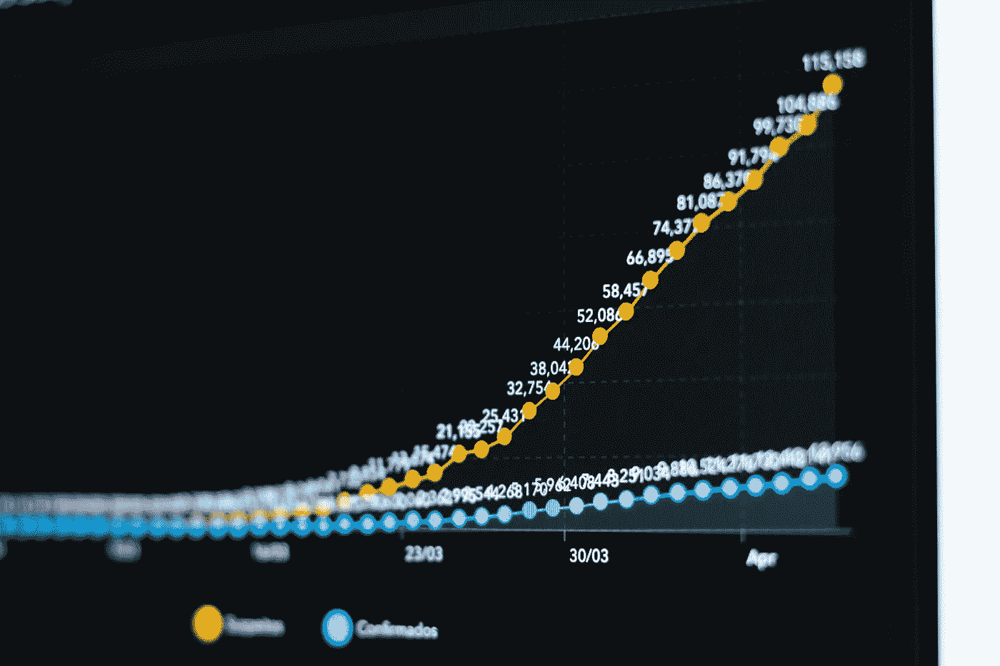

来源: [Unsplash](https://unsplash.com/photos/hTtK6tvTRY0)

# **什么是合成控制？**

综合控制被描述为“过去十年项目评估中最重要的发展”(Atheyand Imbens，2016)。综合控制法是一种统计方法，用于在比较案例研究中评估一种干预措施的效果。它包括构建用作对照的组的加权组合，并与[治疗组](https://en.wikipedia.org/wiki/Treatment_group)进行比较。这种比较用于估计如果治疗组没有接受治疗会发生什么。它基于一个简单而强大的想法。我们不需要在未治疗组中找到任何单个单位，类似于治疗组。相反，我们可以将我们自己的系统作为多个未处理单元的组合，创建一个有效的合成控制系统。

与[差异中的差异](https://en.wikipedia.org/wiki/Difference_in_differences)方法不同，该方法可以通过在干预前对对照组进行加权以更好地匹配治疗组，来说明[混杂因素](https://en.wikipedia.org/wiki/Confounder)随时间变化的影响。综合控制方法的另一个优点是，它允许研究人员系统地选择对照组。它已被应用于政治学、卫生政策、犯罪学和经济学领域。

在本文中，我们将通过一个例子来重点了解合成控制的细节及其在 Python 中的实现。在我开始之前，我想承认这篇文章是基于[为勇敢和真实](https://matheusfacure.github.io/python-causality-handbook/landing-page.html)的因果推断的内容。这本开源的书极大地帮助了我，让我对各种因果推理方法有了更深的理解。

我们的例子将考虑估计香烟税对其消费的影响的问题。给一点背景，这是一个在经济学界争论了很久的问题。争论的一方认为税收会增加雪茄的成本，从而降低需求。另一方认为，既然香烟会导致上瘾，那么香烟价格的变化不会改变他们的需求。从经济学的角度来说，我们可以说香烟的需求在价格上是没有弹性的，而增加税收只是以吸烟者为代价来增加政府收入的一种方式。为了解决问题，我们将查看一些关于此事的美国数据。

# **使用的数据**

1988 年，加州通过了一项著名的烟草税和健康保护法案，即众所周知的[99 号提案](https://en.wikipedia.org/wiki/1988_California_Proposition_99)。它的主要作用是对加州境内的烟草销售征收每包 25%的州消费税，对其他商业烟草产品，如雪茄和嚼烟的零售征收大致相同的消费税。对烟草销售的额外限制包括禁止在青少年可以进入的公共场所出售香烟自动售货机，以及禁止单独出售一支香烟。该法案产生的收入被指定用于各种环境和医疗保健项目，以及反烟草广告。

为了评估其效果，我们可以从多个州收集多年的香烟销售数据。在我们的案例中，我们从 39 个州获得了 1970 年到 2000 年的数据。其他州也有类似的烟草控制项目，但没有被纳入分析。这是我们数据的样子。

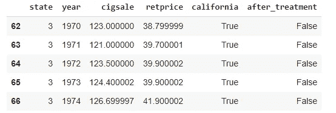

数据集的快照

我们用`state`作为州索引，其中加州是第三位。我们的协变量是卷烟零售价格和人均卷烟销量。我们感兴趣的结果变量是`cigsale`。最后，我们有布尔辅助变量来表示加利福尼亚州和干预后时期。如果我们绘制一段时间内加州的香烟销售额和其他州的平均香烟销售额，这就是我们会得到的结果

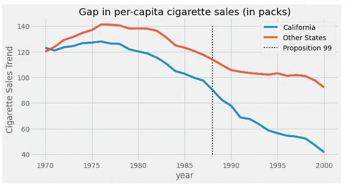

在我们有数据的这段时间里，加州人购买的香烟明显少于全国平均水平。此外，80 年代以后，香烟消费似乎出现了下降趋势。与其他州相比，似乎在 99 号提案之后，加州的下降趋势加快了，但我们不能肯定这一点。这只是我们通过审查情节而得出的猜测。

为了回答 99 号提案是否对香烟消费有影响的问题，我们将使用干预前时期建立一个综合控制。我们将结合其他州来建立一个假的州，非常类似于加利福尼亚的趋势。然后，我们将看到这个合成控制在干预后的表现。

# **数学符号**

假设我们有 *J* +1 个单位。不失一般性，假设单元 1 是受到干预影响的单元。在我们的案例中，加州是受干预或 99 号提案影响的案例。Units *j* =2、…， *J* +1 是未处理的单位或状态的集合，我们称之为“供体池”。还假设我们的数据跨越 T 个时间段，在干预之前有 *T* 0 个时间段。对于每个单位 j 和每个时间 t，我们观察结果 Y *jt* 。对于每个单位 j 和周期 t，定义 *YNjt* 为无干预的潜在结果，Y *Ijt* 为有干预的潜在结果。

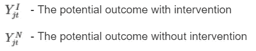

那么，在时间 T，对于被处理单位 *j* =1，对于 *t* > *T* 0 的影响被定义为

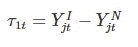

由于单元 *j* =1 是被处理的单元， *YIjt* 是真实的，而 *YNjt* 不是真实的。挑战就变成了我们如何估计。注意每个时期的治疗效果是如何定义的，这意味着它可以随时间变化。不需要瞬间完成。它可以积累或消散。放个图，估计处理效果的问题归结为**估计单元 *j* =1 如果没有处理**结果会怎么样的问题。

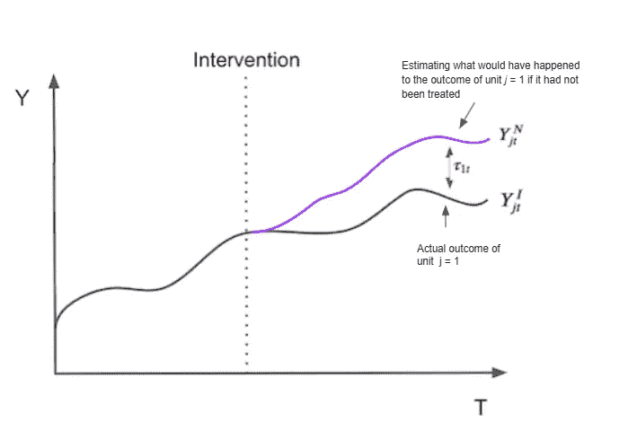

为了估计 *YNjt* ，我们记住供体池中单位的组合可能比任何单独的未处理单位更接近处理单位的特征。因此，综合控制被定义为控制池中单元的加权平均值。给定权重 *W* =( *w* 2，…，*wJ*+1)*YNjt*的综合控制估计为

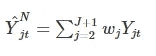

# **视觉解释**

正如我们所知，线性回归也是将预测作为变量的加权平均值的一种方式。在这种情况下，回归可以表示为以下矩阵乘法

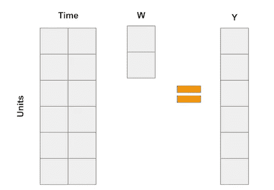

在综合控制案例中，我们没有很多单位，但我们有很多时间段。所以我们要做的是翻转输入矩阵。然后，单位成为“变量”，我们将结果表示为单位的加权平均值，就像下面的矩阵乘法一样。

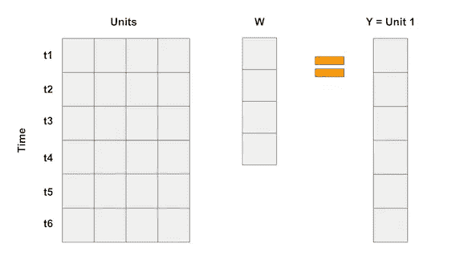

如果我们每个时间段有多个特征，我们可以像这样堆积这些特征。重要的是使回归试图通过使用其他单元来“预测”被处理的单元 1。这样，我们可以以某种最佳方式选择权重，以达到我们想要的接近度。我们甚至可以对特征进行不同的缩放，赋予它们不同的重要性。

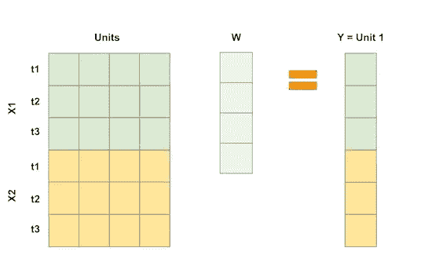

# **实施**

为了评估综合控制的治疗效果，我们将尝试建立一个“假单位”,类似于干预期之前的治疗单位。然后，我们将看到这个“假单位”在干预后的表现。合成对照和它模拟的单元之间的区别是治疗效果。

为了进行线性回归，我们将使用 OLS 计算重量。我们将最小化供体库中单位的加权平均值和干预前期间的治疗单位之间的平方距离。

为此，我们首先需要将单位(在我们的例子中是州)转换成列，将时间转换成行。因为我们有两个特征，`cigsale`和`retprice`，我们将它们堆叠在一起，就像上图中那样。我们将建立一个合成对照，看起来很像干预前时期的加州，并观察它在干预后时期的表现。出于这个原因，我们只选择干预前的时期是很重要的。在这里，这些特征看起来是相似的，所以我们没有对它们进行标准化。如果要素的比例不同，一个是千位，另一个是小数，那么在最小化差异时，较大的要素将是最重要的。为了避免这种情况，首先对它们进行缩放非常重要。

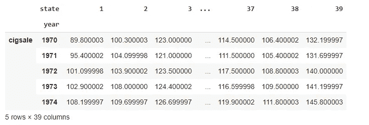

现在，我们可以将 Y 变量定义为加利福尼亚州，将 X 变量定义为其他州。

然后，我们运行一个套索回归。我们使用 Lasso 或 L1 回归，因为我们不希望我们的状态数据过度拟合。岭回归也可用于此。回归将返回使处理过的单位和供体库中的单位之间的平方差最小化的一组权重。

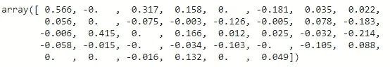

这些重量向我们展示了如何建立合成控制。我们将状态 1 的结果乘以 0.566，状态 3 的结果乘以 0.317，状态 4 的结果乘以 0.158，依此类推。我们可以通过池中状态矩阵和权重之间的点积来实现这一点。

现在我们有了合成控制，我们可以用加利福尼亚州的结果变量来绘制它。

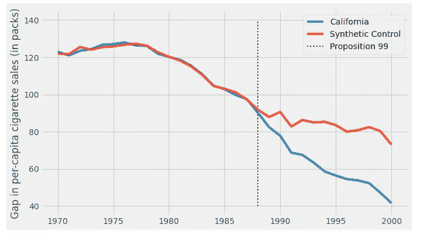

有了合成对照，我们可以用治疗结果和合成对照结果之间的差距来估计治疗效果。

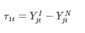

到 2000 年，看起来 99 号提案已经减少了 25 包香烟的销售。现在我们将弄清楚这是否有统计学意义。

**推论**

这里，我们将使用费雪精确检验的思想。它的直觉很简单。我们彻底地改变了治疗和控制。因为我们只有一个处理过的单元，这意味着，对于每个单元，我们假设它是处理过的，而其他的是对照。

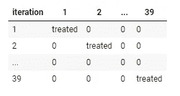

最后，我们将对每个状态有一个综合的控制和效果估计。因此，它所做的是假装治疗实际上发生在另一个州，而不是加州，看看这种治疗没有发生的估计效果是什么。然后，我们看看加利福尼亚的治疗与其他假治疗相比是否足够大。这个想法是，对于那些实际上没有被治疗的状态，一旦我们假装它们被治疗了，我们将无法发现任何显著的治疗效果。

该函数返回一个数据框，其中一列表示状态，一列表示年份，一列表示结果`cigsale`和该状态的综合结果。

这是我们把它应用到第一个状态的结果。

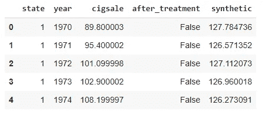

通过对所有状态的综合控制，我们可以估计所有状态的综合状态和真实状态之间的差距。对于加州来说，这就是治疗效果。对于其他的状态，这就像安慰剂效应，我们在治疗实际上没有发生的情况下估计合成对照治疗的效果。如果我们把所有的安慰剂效应和加州治疗效应一起画出来，我们会得到下图

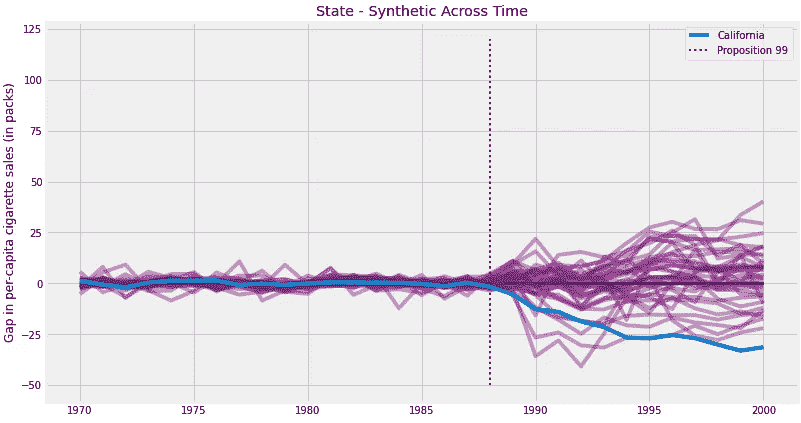

这个图的两个方面跃然眼前。首先，我们可以看到干预后的方差高于干预前的方差。这是预期的，因为合成控制被设计成最小化干预前时期的差异。另一个有趣的方面是，即使在干预前时期，我们也不能很好地适应某些单位。这也是意料之中的。

因为这些单元非常不适合，所以从分析中移除它们是个好主意。客观地做到这一点的一个方法是为干预前错误设定一个阈值

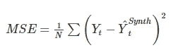

并移除那些具有高误差的单元。如果我们继续这样做，并绘制相同的图形，这就是我们得到的结果。

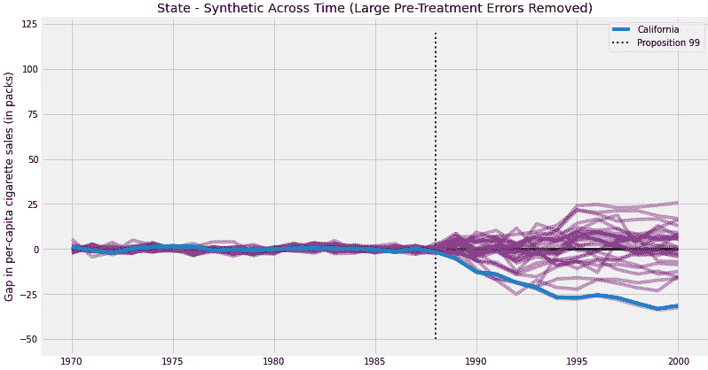

去除噪声，我们可以看到在加利福尼亚州的影响有多极端。这张图片告诉我们，如果我们假设这种疗法发生在其他任何一个州，我们几乎永远也不会得到像加州这样极端的效果。

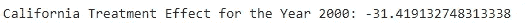

2000 年加州的治疗效果是-31.419，这意味着干预措施减少了近 31 包香烟的消费。

# **结论**

使用来自其他州的前期数据，我们建立了一个 lasso 回归模型，该模型为每个控制州分配固定的权重，并得出一个加权平均值，该平均值非常类似于 99 号提案推出前加州的吸烟活动。

在这之后，我们使用由此产生的套索回归模型来合成加利福尼亚在后期的样子(没有治疗)。实际香烟销售和综合结果之间的差异就是我们的治疗效果。

我们也看到了如何使用费希尔的精确测试来对合成控制进行推断。我们假设未处理的单元实际上已被处理并计算了它们的效果。这些是安慰剂效应:即使不治疗，我们也会观察到的效应。我们用这些效果来观察和检查治疗对加州香烟销售的影响。

# **参考文献**

[马修·法库《勇敢而真实的因果推理》](https://matheusfacure.github.io/python-causality-handbook/landing-page.html)