# 计量经济学的因果机器学习:因果森林

> 原文：<https://towardsdatascience.com/causal-machine-learning-for-econometrics-causal-forests-5ab3aec825a7?source=collection_archive---------1----------------------->

## [思想和理论](https://towardsdatascience.com/tagged/thoughts-and-theory)

## 计量经济学的因果机器学习介绍，包括使用 EconML 估计带有**因果森林**的**美食**的 Python 教程

Lukasz Szmigiel 在 [Unsplash](https://unsplash.com?utm_source=medium&utm_medium=referral) 上拍摄的照片

公平与平等不是同一个原则。在社会背景下，它们都与公平有关；平等意味着不管需求如何，对每个人都一视同仁，而公平意味着根据人们的需求区别对待。考虑疫苗接种，如果我们把公共卫生政策建立在平等的基础上，也许会有一个抽签系统来决定谁先接种疫苗，给每个人一个平等的机会。然而，在实践中，疫苗接种是基于公平的优先考虑，那些风险最大的人、前线医护人员和老年人理所当然地排在第一位。

假设我们理解了治疗和结果之间的因果关系，那么问题是，我们如何识别经历最大平均因果效应的亚组，无论是积极的还是消极的。受我在世界银行的数据科学咨询工作的启发，我最近分享了一个 [Python 教程](/practical-python-causality-econometrics-for-data-science-ffc074e11a1d)，其中我讨论了因果关系作为计量经济学在数据科学中的应用。通过计算异质性治疗效果和确定受政策影响最大的亚组，因果关系可以帮助公平的政策分配。然而，计算治疗效果的异质性可能很复杂，也称为**条件平均治疗效果(CATE)** 。方便的是，计量经济学提供了几种估计 CATE 的方法。

估算 CAT-E！图片作者。

然而，不幸的是，传统的计量经济学方法不适合当前的大数据现实，其中协变量和交互项的数量可能超过观察值。这一现实导致了经济学因果机器学习的发展；这是一个相对较新的领域，早在 2014 年就有贡献，最激动人心的发展出现在 2018 年前后。我将在一系列关于因果机器学习的以计量经济学为重点的文章中介绍其中的一些发展，所有这些文章都将包括这些技术的 Python 实现。

在本文中，我将重点介绍一种特定的技术， [**因果森林**](https://arxiv.org/abs/1902.07409) ，这是一种由经济学家苏珊·艾希(Susan Athey)和斯特凡·韦杰(Stefan Wager)开发的因果机器学习方法。首先，我简要描述一下本教程中使用的经济学数据集，该数据集取自在摩洛哥进行的一项关于小额信贷影响的随机实验( [Crépon et al .，2015](https://www.aeaweb.org/articles?id=10.1257/app.20130535) )。接下来，我讨论因果推理和[潜在结果框架](https://en.wikipedia.org/wiki/Rubin_causal_model#Potential_outcomes)，这为讨论条件平均治疗效果(CATE)奠定了基础。随后是因果森林的介绍，概述了理论，实际上侧重于建立高层次的直觉。最后，我使用微软研究院的 [EconML](https://github.com/microsoft/EconML) Python 库在摩洛哥案例研究数据上实现了一个因果森林来评估 CATE。完整的 Python 演练包括使用 [SHAP 值](/explain-your-model-with-the-shap-values-bc36aac4de3d)进行可解释性测试的代码，并演示了如何绘制置信区间。

## **案例研究:摩洛哥的小额信贷**

小额信贷和小额融资的研究可以追溯到诺贝尔和平奖得主穆罕默德·尤努斯，他在 20 世纪 70 年代发现给贫穷企业家的小额贷款可以极大地改善穷人的生活。尤努斯认为，信用是一项基本人权；小额信贷增加商业投资，导致商业活动和家庭收入增加，从而导致家庭储蓄可投资于教育等减贫努力。

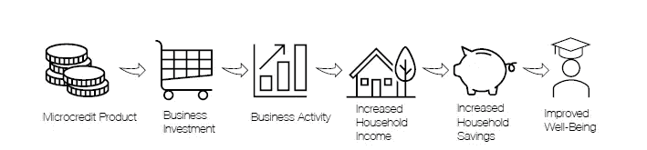

小额信贷理论。图片来自[雅各布(2021](https://papers.ssrn.com/sol3/papers.cfm?abstract_id=3816558) )。

本教程使用了 2006 年在摩洛哥农村进行的随机实验的小额信贷计划数据集( [Crépon 等人，2015](https://www.aeaweb.org/articles?id=10.1257/app.20130535) )。为了了解获得小额信贷的影响，某些村庄(治疗组)获得了小额信贷，并相对于对照组测量了家庭一级的贷款额，作为小额信贷需求的指标。每个家庭都有可观察到的特征，有可能以这些协变量为条件来发现小额信贷因果效应的异质性。

在本月早些时候通过社会科学研究网络(SSRN)发布的[预印本](https://papers.ssrn.com/sol3/papers.cfm?abstract_id=3816558)中，Daniel Jacob 调查了可用于估计 CATE 的机器学习方法，其中使用了摩洛哥小额信贷数据集作为例子。Jacob 解释说，目标是找到基于协变量的亚组，在那里治疗效果会不同；然而，我们不知道应该关注哪些子群，并且有许多协变量，因此需要机器学习来估计 CATE。下一节涵盖了因果推断和潜在结果框架，以解释 CATE 是如何计算的。

# **因果推断和潜在结果**

因果效应被定义为治疗中单位水平的干预变化导致结果变量(Y)改变的幅度，换句话说，就是真实世界和[反事实](https://en.wikipedia.org/wiki/Counterfactual_conditional)世界的结果之间的差异。从优秀的 [EconML 文档](https://econml.azurewebsites.net/)中截取的下图直观地展示了这种关系。

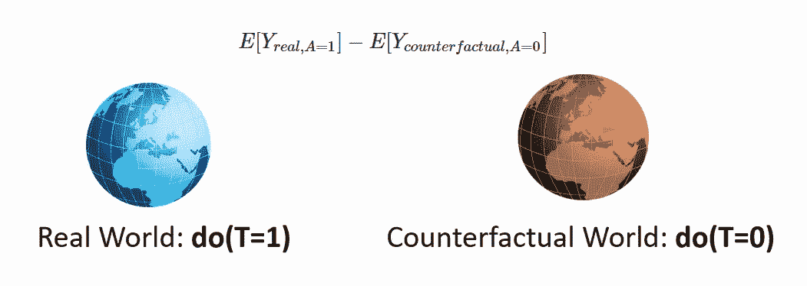

因果效应被衡量为现实世界和反现实世界之间的结果差异。[来源。](https://microsoft.github.io/dowhy/example_notebooks/tutorial-causalinference-machinelearning-using-dowhy-econml.html)

为了表明治疗引起结果，治疗的改变应该引起结果(Y)的改变，而所有其他协变量保持不变；这种类型的治疗变化被称为[干预](https://en.wikipedia.org/wiki/Causal_model#Intervention)。以下随机对照试验(RCT)的因果图显示了如何计算平均治疗效果(ATE)作为治疗对结果的影响，以及 CATE 是治疗对结果的影响，以协变量为条件。

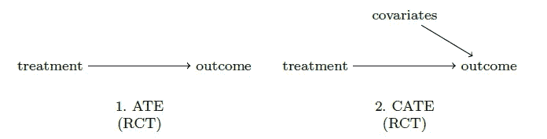

随机对照试验(RCT)中平均治疗效果(ATE)和条件平均治疗效果(CATE)的因果图。图片来自[雅各布(2021](https://papers.ssrn.com/sol3/papers.cfm?abstract_id=3816558) )。

如果治疗效果是异质的，有可能以协变量为条件来计算 CATE。这有助于识别治疗为阳性的个体，以及哪些个体将从治疗中受益最大；本质上是对最优政策分配的估计( [Athey & Imbens，2019](https://www.annualreviews.org/doi/abs/10.1146/annurev-economics-080217-053433) )。然而，我们遇到了“*因果推理的基本问题*”([Holland，1986](https://www.jstor.org/stable/2289064?seq=1) )，其中 CATE 不能直接观察到一个单元，使得不可能观察到单元水平的因果效应。也就是说，我们永远无法直接观察到一个观察单位的反事实状态。

然而，对于每个观察，我们可以从两个条件均值函数预测两个结果，一个对应于治疗，另一个对应于对照组，潜在结果之间的差异等于 CATE。没有必要知道条件均值函数的基本结构形式，因为我们只关心得到条件均值的良好预测。这些条件均值函数的参数并不直接相关，因此这些函数可被称为[干扰函数](https://en.wikipedia.org/wiki/Nuisance_parameter)。

在[之前的一个教程](https://medium.com/me/stats/post/ffc074e11a1d)中，我简要讨论了与微软研究院的[道伊](https://microsoft.github.io/dowhy/) Python 库相关的潜在成果框架([伊本斯&鲁宾，2015](https://www.cambridge.org/core/books/causal-inference-for-statistics-social-and-biomedical-sciences/71126BE90C58F1A431FE9B2DD07938AB) )。下图摘自 [Jacob (2021)](https://papers.ssrn.com/sol3/papers.cfm?abstract_id=3816558) ，详细描述了 Rubin ( [1980](https://www.jstor.org/stable/2287653?seq=1) )概述的这一框架(也称为 [Rubin 因果模型](https://en.wikipedia.org/wiki/Rubin_causal_model))的四个基本假设，这使我们能够推导出 CATE。

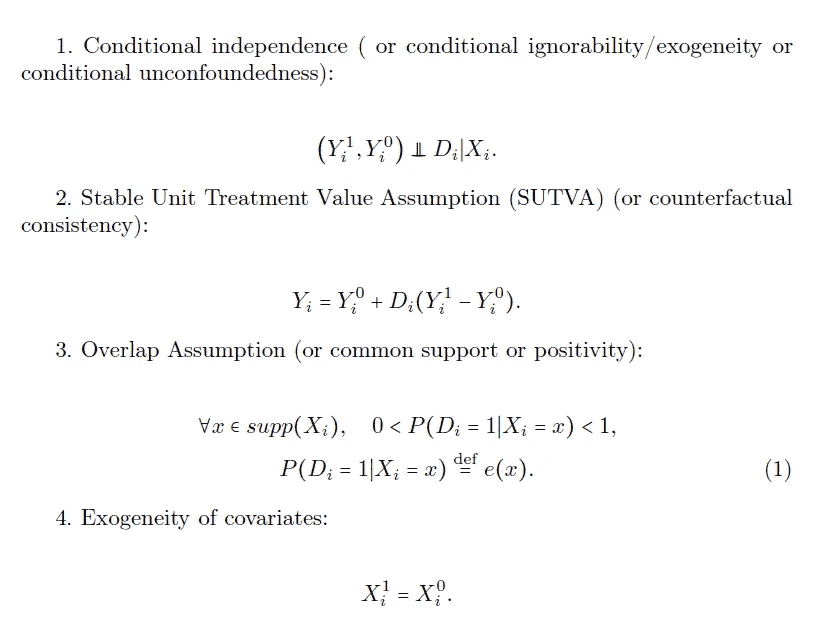

潜在结果框架的四个假设。图片来自[雅各布(2021)](https://papers.ssrn.com/sol3/papers.cfm?abstract_id=3816558) 。

对于每个观察，有两个潜在的结果，Y₀和 Y₁，并且仅观察到一个结果。二进制治疗指标为 D > { 0；1}观察到的协变量是 X > ℝ *ᵖ* ，其中 *p* 是协变量的个数，与协变量空间的维数有关。第一个和第四个假设，协变量的条件独立性和外生性，简单地陈述了治疗分配独立于两个潜在的结果，并且协变量不受治疗的影响。第二个假设，[稳定单位治疗值假设(SUTVA)](https://en.wikipedia.org/wiki/Rubin_causal_model#Stable_unit_treatment_value_assumption_(SUTVA)) ，说明在治疗观察和对照观察之间没有干扰或隐藏的变化。第三个假设，重叠假设，是没有亚组完全位于治疗组或对照组内。因此，治疗概率必须远离零和一，从而产生[倾向得分](https://en.wikipedia.org/wiki/Propensity_score_matching)(上图中的等式(1))。

按照上述符号，治疗组或对照组的结果的条件预期，𝜇𝒹( *x* ，定义为:

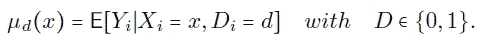

对结果的有条件的期望。图片来自[雅各布(2021)](https://papers.ssrn.com/sol3/papers.cfm?abstract_id=3816558) 。

美食或𝜏( *x* 正式定义为:

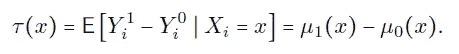

CATE 或𝜏( *x* 是条件均值的差值:𝜇₁(*x*—𝜇₀(*x*。图片来自[雅各布(2021)](https://papers.ssrn.com/sol3/papers.cfm?abstract_id=3816558) 。

𝜏( *x* 是潜在结果的差异，它等于条件期望 x 的差异:𝜇₁( *x* ) — 𝜇₀( *x* 。更明确地说，来自 [Jacob (2021)](https://papers.ssrn.com/sol3/papers.cfm?abstract_id=3816558) 的以下等式显示了两个条件均值函数如何能够表示两个潜在的结果，因此，取结果的差导致 CATE。

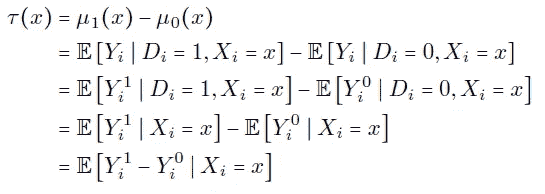

凯特或𝜏(是潜在结果的差异。图片来自[雅各布(2021)](https://papers.ssrn.com/sol3/papers.cfm?abstract_id=3816558) 。

# **因果森林**

因果森林是一种来自广义随机森林的方法( [Athey et al .，2019](https://arxiv.org/abs/1610.01271) )。类似于随机森林( [Breiman，2001](https://link.springer.com/article/10.1023/A:1010933404324) )，因果森林试图在协变量空间中寻找邻域，也称为递归划分。虽然随机森林是从[决策树](https://en.wikipedia.org/wiki/Decision_tree)构建的，但是因果森林是从因果树构建的，其中因果树学习治疗效果异质性的低维表示。重要的是，分割标准优化了寻找与治疗效果异质性相关的分割。假设 CATE (𝜏( *x* )在邻域 *N(x)* 上是恒定的，那么使用残差对残差的方法使得有可能求解 *N(x)* 上的部分线性模型来估计平均治疗效果( [Jacob，2021](https://papers.ssrn.com/sol3/papers.cfm?abstract_id=3816558) )。目标是找到处理效果恒定但不同于其他叶子的叶子。交叉验证用于修剪因果树，但性能评估的标准是基于治疗效果的异质性。

因果森林只是大量因果树的平均值，其中树因子采样而不同( [Athey & Imbens，2019](https://www.annualreviews.org/doi/abs/10.1146/annurev-economics-080217-053433) )。为了从因果树创建因果森林，有必要估计加权函数，并使用得到的权重来求解局部[广义矩量法(GMM)](https://en.wikipedia.org/wiki/Generalized_method_of_moments) 模型，以估计 CATE。为了处理过度拟合，因果森林使用诚实条件，由此树是诚实的，如果对于每个训练样本( *i* )它仅使用响应(Y *ᵢ* )来估计叶内处理效果或决定在哪里放置分裂，而不是两者都使用( [Jacob，2021](https://papers.ssrn.com/sol3/papers.cfm?abstract_id=3816558) )。样本分割用于创建真实树，其中一半数据用于估计树结构，即分割子样本，另一半数据用于估计每片叶子的处理效果，即估计子样本。处理效果的预测是末端叶中估计子样本的处理和对照观察之间的平均结果的差异。

使用诚实树允许用于估计估计量方差的估计器中的[渐近正态性](https://en.wikipedia.org/wiki/Asymptotic_distribution)，从而允许估计参数的可靠[置信区间](https://en.wikipedia.org/wiki/Confidence_interval)([赌&阿塞 2017](https://arxiv.org/abs/1702.02896) )。这一点很重要，因为为了获得准确的估计，偏差应该渐近地消失，从而使置信区间最小化。一个必要的步骤，由于不可能实际观察治疗效果，因此，传统的[均方误差](https://en.wikipedia.org/wiki/Mean_squared_error)不能用于评估性能和确定置信区间。由于偏差渐近消失，因果森林估计是一致的，并且渐近[高斯](https://en.wikipedia.org/wiki/Gaussian_function)，这意味着与渐近方差的估计器(诚实树)一起，确保了有效的置信区间。在本教程中，我利用微软研究院的 [EconML](https://github.com/microsoft/EconML) Python 库来实现因果森林，[文档概述了因果森林的](https://econml.azurewebsites.net/spec/estimation/forest.html#causalforest-aka-forest-double-machine-learning)[双机学习](https://arxiv.org/abs/1608.00060)实现背后的正式方法。

## **建立因果森林**

首先，本教程的摩洛哥小额信贷数据集以 Stata 文件(.dta)在 Jacob 共享的 [R Quantlet 中。首先，我使用](https://github.com/QuantLet/Meta_learner-for-Causal-ML/tree/main/Microcredit-Example) [DoWhy](https://microsoft.github.io/dowhy/) 创建因果图并明确假设，随后，使用 [EconML](https://github.com/microsoft/EconML) 进行其余的因果分析。

为了可视化变量之间的关系，下面的代码片段显示了如何使用 DoWhy 快速构建因果模型。摩洛哥小额信贷数据集被载入数据框架，并定义了治疗变量(“治疗”)、结果变量(“loansamt_total”)和协变量的标签。

在上面的代码片段中，用 DoWhy 构建了一个因果模型，它创建了一个因果图，如下图所示。

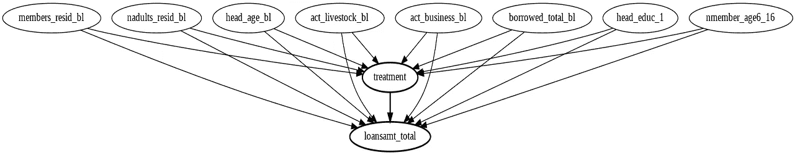

摩洛哥小额信贷实验的因果图，显示了结果和治疗变量以及选择的协变量。图片作者。

接下来，我们删除所选变量中缺少值的行，并将数据集分为训练集和测试集。使用训练分割，设置结果( *Y* )、处理( *T* )和协变量( *X* )，并将 *W* 设置为“无”。测试集中的协变量被分配给 *X_test* 。

从 EconML 的[双机学习](https://arxiv.org/abs/1608.00060)模块(dml)导入 *CausalForestDML* ，从 [Scikit-Learn](https://scikit-learn.org/stable/) 导入一个[交叉验证](https://en.wikipedia.org/wiki/Cross-validation_(statistics))多任务[套索](https://en.wikipedia.org/wiki/Lasso_(statistics))、 [*多任务套索*](https://scikit-learn.org/stable/modules/generated/sklearn.linear_model.MultiTaskLassoCV.html) *。* LASSO 代表“最小绝对收缩和选择算子”，它是一种回归方法，包括[正则化](https://en.wikipedia.org/wiki/Regularization_(mathematics))和变量选择，增加了所得模型的预测精度和可解释性。

下一步是在拟合模型之前设置因果森林的参数。在下面的代码片段中，对于异质处理效果，分裂准则设置为“het”，树的数量设置为“10，000”，对于 10 个 [K 倍交叉验证](https://en.wikipedia.org/wiki/Cross-validation_(statistics)#k-fold_cross-validation)，交叉验证(cv)设置为“10”。此外，model_y 对应于用于将结果(反应)拟合到协变量(特征)的估计量，model_t 对应于用于将治疗拟合到协变量(特征)的估计量。*在两种情况下，multitaskslassocv*都被用作估计器，然而，也可以使用其他估计器。

在上面代码片段的最后两行，我们用小额信贷数据拟合因果森林模型，并用测试集估计 CATE。在 Jacob 的 CATE 调查中，运行了 20 组，平均 CATE 报告为 1300 左右。这里建立的因果森林将返回 1200 到 1400 之间的 CATE 值，这个范围与 Jacob 的平均 CATE 结果一致。

## **可解释性和评估**

像因果森林这样的基于树和森林的估计器的一个优势是可解释性测试的可用性，例如[沙普利(SHAP)值](https://en.wikipedia.org/wiki/Shapley_value)。经济学家劳埃德·沙普利(Lloyd Shapley)因提出了“沙普利加法解释值”的概念而获得了诺贝尔经济学奖，这一概念源于合作博弈论。对于这种可解释性测量的介绍，我建议这篇[中期文章](/explain-your-model-with-the-shap-values-bc36aac4de3d)。

下面的代码片段显示了如何重置因果森林的参数，并随后再次拟合因果森林模型，以计算 SHAP 值。在改装模型之前，有必要将参数重置为默认值，因为使用上述用于估计 CATE 的参数，运行时间将接近两个小时。

下图显示了 SHAP 汇总图的结果。在 y 轴上绘制了要素重要性，其中值用蓝色到红色的颜色条表示，蓝色表示低要素重要性，红色表示高要素重要性。沿着 x 轴，SHAP 值以负到正的刻度显示。

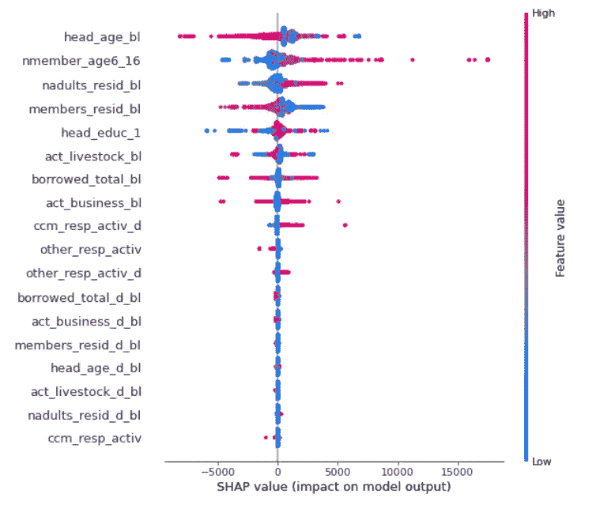

摩洛哥小额信贷数据集的 SHAP 值汇总图。图片作者。

最重要的特征(协变量)是户主的年龄，其次是家庭中 6 至 16 岁儿童的数量。当平均因果效应为负时，家庭年龄似乎很重要。这有助于识别亚组，例如，特征重要性表明应该分别评估年长和年轻的家庭来估计 CATE。这与 Jacob 的美食调查结果相符，如下图所示。

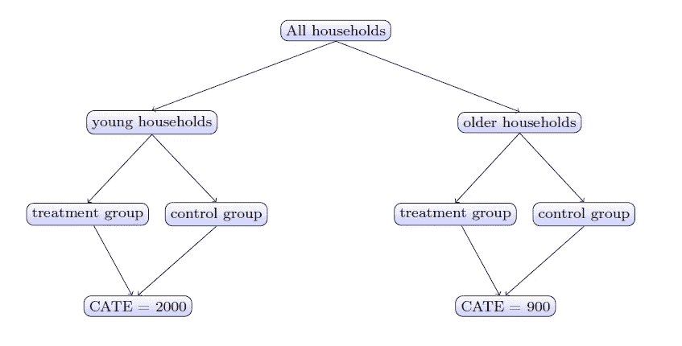

摩洛哥小额信贷数据中年轻和年长家庭的食物差异。图片来自[雅各布(2021)](https://papers.ssrn.com/sol3/papers.cfm?abstract_id=3816558) 。

因果森林的主要卖点是置信区间的可靠性，原因之前在因果森林的理论解释中讨论过。本质上，估计量的渐近正态性应该导致小的置信区间。使用数据集，下面的代码片段根据因果森林模型为治疗效果和置信区间的下限和上限生成数组。

如上所述，下一步是将数组转换为数据帧，合并这些数据帧，并根据治疗效果进行排序。有必要计算滚动平均值，因为平滑有助于创建一个更清晰、更有帮助的图。下面的代码片段显示了如何用 [matplotlib](https://matplotlib.org/) 绘制治疗效果和置信区间。

下图显示了由因果森林模型确定的摩洛哥小额信贷测试集的处理效果和置信区间图。

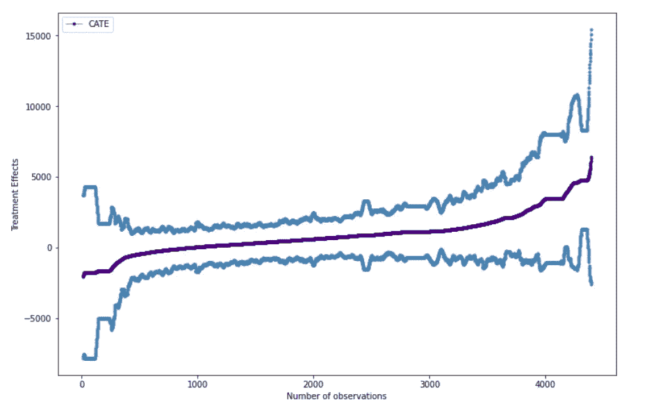

因果森林模型的 CATE 和置信区间图，符合摩洛哥小额信贷测试数据集。图片作者。

## **最后的想法**

因果机器学习有可能对计量经济学的应用产生重大影响，无论是在传统还是新的环境中。在经济学中，因果问题的范围受到数据可用性的极大限制，无论是来自昂贵的随机对照试验还是观察性研究。技术的持续快速发展打破了之前对数据可能性的理解。在过去十年中，“大数据”的可用性不断增加，影响了机器学习和数据科学的方向，并因此在自然科学和社会科学等其他学科中产生了连锁反应。

与这一趋势保持一致，理论计量经济学迅速推进了机器学习的因果关系。一个突出的例子是因果森林，这是艾希和伊本在 2016 年探索的一个想法，然后由艾希和韦杰在 2019 年发表在*统计年鉴*上的论文“[广义随机森林](https://www.gsb.stanford.edu/faculty-research/publications/generalized-random-forests)中正式定义。最近，Athey 和 Wager 一直在用观察数据调查[政策学习](https://onlinelibrary.wiley.com/doi/abs/10.3982/ECTA15732?af=R)，今年早些时候在*计量经济学*上发表了一篇论文。虽然这些理论进步利用了大数据和机器学习，但不幸的是，应用经济学和计量经济学尚未采用这些最先进的方法。目前，传统的计量经济学被用来问传统的经济问题，而因果机器学习的潜力被忽视了。

就我个人而言，我对因果机器学习能够实现的可能性感到兴奋；经济学家现在有方法研究的新问题。我的希望是，这一差距可以弥合；我乐观地认为，理论计量经济学中的因果机器学习进步可以应用于社会研究。在我的下一篇文章中，我将讨论对工具变量使用深度学习，并探索因果关系的哲学史。

我欢迎反馈和问题，所以请随时在 [Linkedin](https://www.linkedin.com/in/haaya-naushan-a4b5b61a5/) 上与我联系。