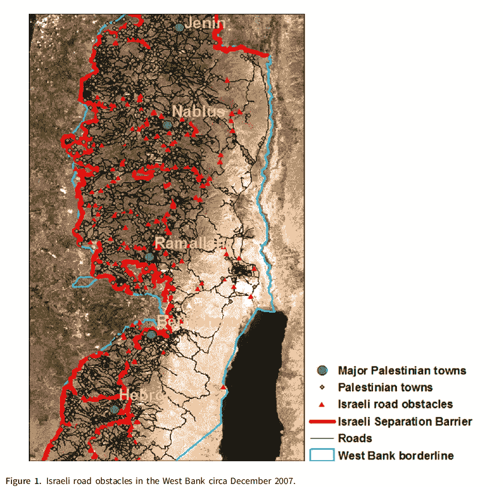
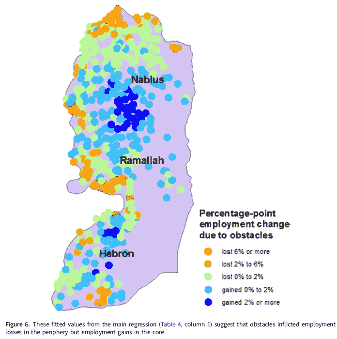
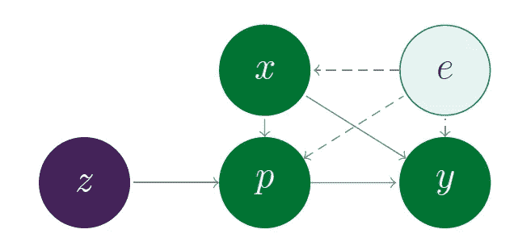
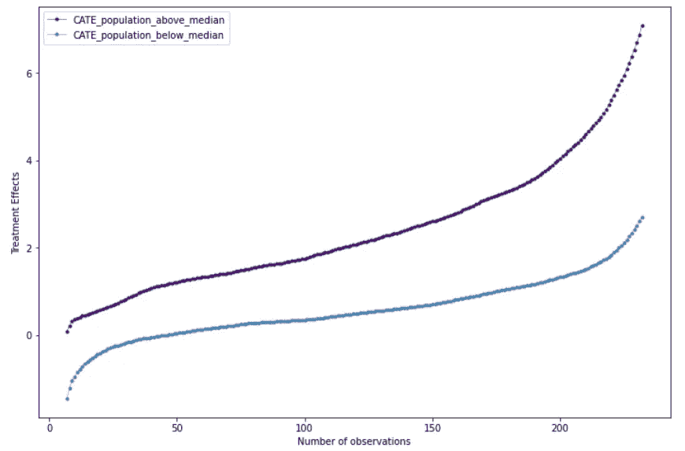
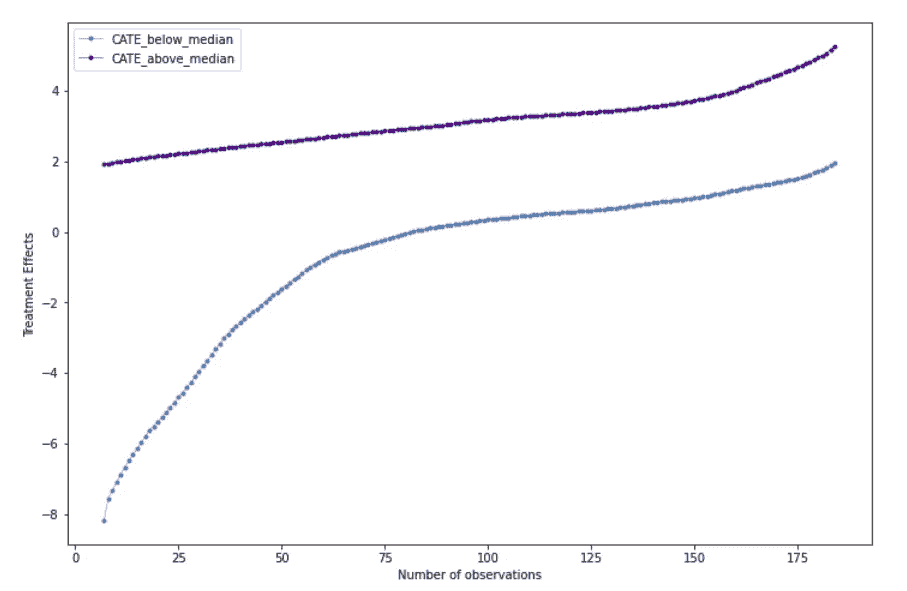
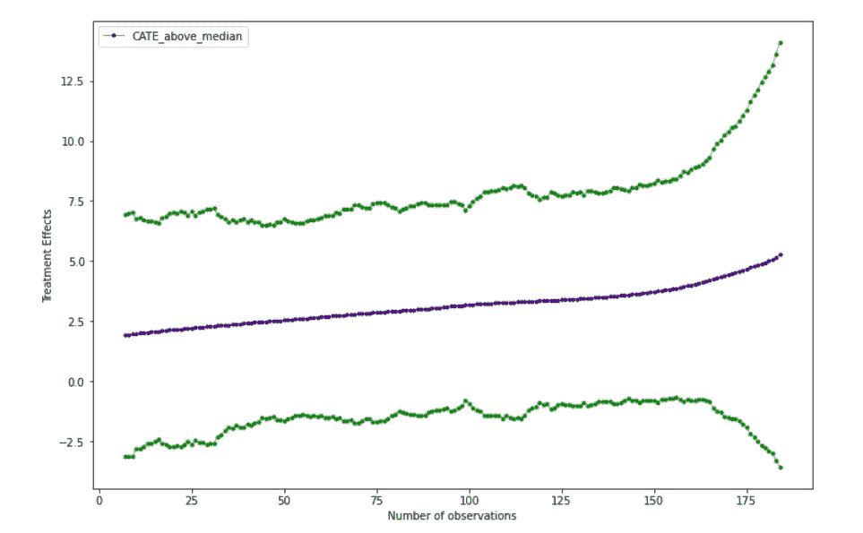

# 数据科学的因果 ML:使用工具变量的深度学习

> 原文：<https://towardsdatascience.com/causal-ml-for-data-science-deep-learning-with-instrumental-variables-96e5b7cc0482?source=collection_archive---------10----------------------->

## [实践教程](https://towardsdatascience.com/tagged/hands-on-tutorials)

## 结合数据科学和计量经济学，介绍 DeepIV 框架，包括完整的 Python 代码教程。


**巴勒斯坦西岸地图，用红色显示外围的小街区，用蓝色显示更大的中心街区。图片作者。**

历史上，经济学家和哲学家都专注于从经验证据中提取对因果关系的理解。经济学家和哲学家大卫·休谟以探索因果关系而闻名，这既是一个认识论难题，也是应用经济学中的一个实际问题。在一篇题为“经济学和计量经济学中的因果关系”的文章中，经济学教授凯文·d·胡佛指出，“经济学家继承了休谟的观点，即实用经济学本质上是一门因果科学。”([胡佛出版社，2006 年](https://papers.ssrn.com/sol3/papers.cfm?abstract_id=930739))。作为一个主要的经验主义者，休谟对经济学中因果关系的发展产生了重大影响；他的怀疑论在“因果关系的认识论地位和它们在实际政策中的作用”之间制造了一种紧张。(胡佛，2006 年)。1739 年，当休谟在“[人性论](https://en.wikipedia.org/wiki/A_Treatise_of_Human_Nature) *”中给因果关系下了著名的定义时，我怀疑他是否能够预见到技术进化的指数级进步所带来的根本变化。他也无法想象我们今天的现实，深度学习被用来确定因果关系。*

今天，“因果科学”正在被机器学习所驱动；然而，它仍然是一个新兴领域，发展主要集中在理论上。在我上一篇关于因果 ML 的文章中，我提到了我的乐观态度，即理论计量经济学的进步可以应用于社会研究。在此之前，在一篇[更早的因果关系文章](/practical-python-causality-econometrics-for-data-science-ffc074e11a1d)中，我展示了一个计量经济学如何用于数据科学的案例研究，依赖于阿列克谢·亚伯拉罕斯题为“艰难的旅行”([亚伯拉罕斯，2021](https://www.cambridge.org/core/journals/political-science-research-and-methods/article/abs/hard-traveling-unemployment-and-road-infrastructure-in-the-shadow-of-political-conflict/135F8A50F613DA3C9C4CB9335F0BFCF7) )的论文。在这篇文章中，我回到了亚伯拉罕斯关于以色列检查站对巴勒斯坦劳动力结果的因果影响的研究，但我利用深度学习来解决[工具变量](https://en.wikipedia.org/wiki/Instrumental_variables_estimation)。幸运的是，亚伯拉罕的研究提供了一个机会，将计量经济学中最新的 ML 进展应用于以社会为中心的研究。

为了支持实用性，我围绕一个完整的 Python 代码教程来构建这篇文章，该教程实现了由微软研究院的 [EconML](https://www.microsoft.com/en-us/research/project/econml/) 库支持的 DeepIV 框架( [Hartford 等人，2017](http://proceedings.mlr.press/v70/hartford17a.html) )。首先，我简要回顾了“艰难的旅行”,重点强调了数据科学研究的要点，并讨论了最初方法的局限性。接下来，我建议采用另一种方法来扩展亚伯拉罕的数据集，以测试不同的治疗效果。我通过对混杂因素、工具变量的讨论，以及对确定条件平均治疗效果(CATE)的重要性的解释来支持这一选择。下面是对深度学习的简短介绍，其中我将 ML 的这个子集放在计量经济学中，以解释对深度学习结果进行基准测试的必要性。接下来，我提供了一个完整的 DeepIV 框架的演练，它直接导致了该技术在 Abrahams 数据集上的 Python 实现。最后，我用来自浅层因果 ML 技术的 CATE 估计来验证深度学习结果，即。用仪表化的[因果森林](/causal-machine-learning-for-econometrics-causal-forests-5ab3aec825a7)对 DeepIV 估计进行基准测试。

## **艰难行进**

我在之前的一篇文章[中详细介绍了“艰苦的旅行”。这一影响评估的主要目的是调查以色列军队在西岸内部道路网沿线设置的检查站和路障对巴勒斯坦失业率的因果影响。](/practical-python-causality-econometrics-for-data-science-ffc074e11a1d)



**大约 2007 年 12 月巴勒斯坦西岸的卫星图像，摘自《艰难的旅行:政治冲突阴影下的失业和道路基础设施》(** [**亚伯拉罕斯，2021**](https://www.cambridge.org/core/journals/political-science-research-and-methods/article/abs/hard-traveling-unemployment-and-road-infrastructure-in-the-shadow-of-political-conflict/135F8A50F613DA3C9C4CB9335F0BFCF7) **)。**

上图中的障碍物是出于安全原因而设置的，但实际上干扰了巴勒斯坦人的通勤出行。通过阻止通勤者到达商业中心和边境口岸，就业损失增加了；然而，这些损失被通勤者中位于更中心位置的巴勒斯坦竞争者的就业增长大大抵消了。也就是说，边际经济干预，如改善道路基础设施，有助于改变失业的空间分布，但没有降低总体失业水平。

在“艰难的旅行”中，亚伯拉罕斯使用了一种工具化的 2SLS(两阶段最小二乘)一阶差分策略，其中工具是以色列定居点与巴勒斯坦通勤路线的纵向接近度。这种方法是有效的，因为这些仪器隔离了部署在定居点附近的障碍子集，而不是直接回归检查站整体存在的就业百分比变化。这项研究的结果如下图所示，外围街区的失业人数与中心街区的就业人数形成对比。



**显示“艰难行进”主要结果的空间直方图。外围农村地区的阻碍效应更大，商业中心的保护效应更大。** [**来源:亚伯拉罕，2021**](https://www.cambridge.org/core/journals/political-science-research-and-methods/article/abs/hard-traveling-unemployment-and-road-infrastructure-in-the-shadow-of-political-conflict/135F8A50F613DA3C9C4CB9335F0BFCF7)

## **混杂性和工具变量**

在我最喜欢的计量经济学书籍《大部分无害的计量经济学》中，作者指出，“IV 方法最重要的当代用途是解决缺失或未知控制变量的问题”(Angrist & Pischke，2009)。当使用观察数据时，存在潜在的不可观察变量将产生混淆效应的风险，使得不可能理清变量之间的关系，从而可以确定因果关系。这要求我们对数据生成过程的因果结构做出明确的假设(DGP)。通常，这相当于假设治疗是有条件地独立于任何潜在变量给定的观察协变量。即便如此，这样的假设也不总是可能的；因此，需要仅影响治疗分配而不影响结果变量的工具变量。本质上，当我们不能在[无基础](https://en.wikipedia.org/wiki/Ignorability)假设下运作时，工具变量是必要的，这一关键点是亚伯拉罕评估设计的核心。

亚伯拉罕斯在 2012 年至 2014 年期间进行了“艰难旅行”的研究，在此期间，仪器化的 2SLS 回归是确定因果关系的最佳选择。然而，其局限性在于，这建立了一个假设同质治疗效果的线性模型。因此，亚伯拉罕的研究中计算的因果效应可被称为局部平均治疗效应(晚期)，由于同质性假设，其统计功效较小。重要的是，假设一个恒定的因果关系排除了平均治疗效果取决于协变量的可能性。此外，线性模型可能不是 DGP 结构形式的最佳代表，因此需要非参数 IV 方法。为了处理线性和同质性这两个限制假设，应该使用非参数方法来估计条件平均治疗效果(CATE)。

## **为什么要评估美食？**

在我上一篇[因果 ML 文章](/causal-machine-learning-for-econometrics-causal-forests-5ab3aec825a7)中，我提供了一个条件平均待遇效应(CATE)的演练，并提出 CATE 的重要性与公平的政策分配有关。这是绝对正确的，然而，还有其他原因来看待治疗效果的异质性。此外，我上一篇文章中的案例研究数据来自一项随机对照试验(RCT)，该试验类似于 A/B 检验，允许不受混杂因素干扰的因果推断。然而，在《艰难旅行》中，亚伯拉罕斯使用了观察数据，如下图所示，估计 CATE 因协变量的潜在混杂效应而变得复杂。


**观察性研究设置中条件平均治疗效果(CATE)的因果图。图片来自** [**雅各布(2021**](https://papers.ssrn.com/sol3/papers.cfm?abstract_id=3816558) **)。**

除了公平性，对于利用观察数据的研究，CATE 对于评估研究设计的有效性也很重要。根据 Angrist & Pischke (2009)的观点，治疗效果的异质性很重要，因为研究设计的两种有效性之间存在差异。他们解释说，内部有效性是一个设计是否揭示了因果关系，一个好的 IV 研究，像“艰苦的旅行”有很强的内部有效性。另一方面，外部效度是一项研究结果在不同背景下的预测价值，在 ML 术语中，这指的是模型的概括能力。Angrist & Pischke 指出，“一个具有异质治疗效果的计量经济学框架帮助我们评估 IV 估计的内部和外部有效性。”(安格里斯特和皮施克，2009 年)。

关于外部有效性，在“艰难旅行”的框架中，亚伯拉罕斯认为，如果没有政治改革，经济干预将不能有效地改善劳动成果。从上下文来看，对于一个经济学家来说，这是一个大胆而非传统的主张，但却得到了大量政治经济学文献的支持。因此，估计 CATE 将有助于评估亚伯拉罕影响评估的外部有效性。换句话说，理解治疗效果的异质性将有助于确定研究结果是否可以扩展到支持政治改革必要性的更广泛主张。虽然 CATE 的估计将使我们能够确定遭受最大负面因果影响的具体巴勒斯坦社区，但可以说，公平的政策分配不如评估评价的外部有效性重要。

除了外部有效性，CATE 还可用于识别平均治疗效果不同的亚组。根据亚伯拉罕的结果，我怀疑较小的外围社区和较大的中心社区之间的 CATE 会有所不同。为了验证这一假设，我使用开源桌面 GIS 软件 [QGIS](https://qgis.org/en/site/) 和亚伯拉罕共享的 [geojson 数据](https://dataverse.harvard.edu/dataset.xhtml?persistentId=doi:10.7910/DVN/XACHFI)来按照人口规模区分巴勒斯坦居民区。


**巴勒斯坦西岸地图，显示人口总数低于中位数的外围小居民区(红色)和人口总数高于中位数的较大居民区(蓝色)。图片作者。**

如上图所示，较小的外围居民区(红色)位于道路网络结构的终端节点，而较大的居民区(蓝色)位于道路基础设施的更中心位置。巴勒斯坦居民区按所有居民区人口总数的中位数划分，人口总数为 1885 人。这清楚地将亚伯拉罕的数据集一分为二，相等的样本大小允许在亚组的深度估计之间进行比较。

## **计量经济学深度学习**

确定了估计 CATE 的必要性后，下一步是选择一种非参数 IV 方法来模拟数据生成过程(DGP)。深度学习已经被证明是一种学习复杂特征空间的潜在表示的强大方法，这使得它非常适合非参数化建模。尽管如此，在经济学中使用深度学习是一个有争议的话题，主要是因为深度神经网络的“黑箱”性质。可以说，计量经济学要求更高程度的严格性，因此，在深度神经网络背后的抽象理解中相对缺乏数学形式是这种类型的 ML 的一个减损点。此外，经济学家苏珊·艾希(Susan Athey)和圭多·w·伊本斯(Guido W. Imbens)提到，对于监督学习问题，深度学习和神经网络相对于回归树和随机森林的优势并没有正式的证明([艾希&伊本斯，2019](https://www.annualreviews.org/doi/abs/10.1146/annurev-economics-080217-053433) )。

深度学习中的“深度”只是指神经网络的多层，而浅网络只有一层。对 ML 子集的“深入”讨论超出了本文的范围；但是，有几个很好的资源可以涵盖这个主题。作为介绍，我强烈推荐《用 Python 进行[深度学习》，作者是弗朗索瓦·乔莱(Franç ois Chollet)，他是流行的深度学习 API](https://www.manning.com/books/deep-learning-with-python)[Keras](https://keras.io/)的创造者。我也推荐杰森·布朗利在他的博客“机器学习掌握”上发表的这篇[有用的博文](https://machinelearningmastery.com/what-is-deep-learning/)。此外，还有大量关于 Medium 的文章介绍这个广泛主题的各种应用，包括自然语言处理、计算机视觉等。在接下来的代码教程中，我使用初学者友好的 Keras，并在必要的地方提供简单的解释。

关于经济学中对深度学习的健康怀疑，我认为尽管缺乏可解释性是一个问题，但它不应该低估这一技术的使用。细心的数据科学家知道，对于特定的任务，将深度学习模型与浅层、可解释的模型进行基准测试是很重要的；更易解释的模型很有可能表现得更好。幸运的是，[因果森林](/causal-machine-learning-for-econometrics-causal-forests-5ab3aec825a7)可以作为一种可比较的非参数 IV 方法，对深度学习 IV 估计的结果进行基准测试。因此，在建议的深度学习实现之后，我将遍历所需的代码，以根据更易解释的因果森林对结果进行基准测试。下一节介绍 [DeepIV 框架](http://proceedings.mlr.press/v70/hartford17a.html)，它使得使用带有工具变量的深度学习来估计 CATE 成为可能。

## **DeepIV 框架**

在“DeepIV:反事实预测的灵活方法”中，Hartford 等人( [2017](http://proceedings.mlr.press/v70/hartford17a.html) )增强了深度学习方法，以表征治疗和结果变量之间的因果关系。该框架使用工具变量，这些变量作为随机治疗的来源，有条件地独立于结果。理解这种因果关系是反事实预测的必要条件，DeepIV 框架通过两个可以用深度神经网络解决的预测任务来实现这一点。类似于 2SLS 的两个阶段，第一阶段是用于治疗预测的网络，第二阶段网络预测结果。

正如我在我的[之前的因果 ML 文章](/causal-machine-learning-for-econometrics-causal-forests-5ab3aec825a7)中解释的，反事实预测不能以直接的方式做出；然而，由于工具变量和随机化一样好，它们允许“对不可观察的选择”。Hartford 等人将这种设置称为“IV 规格下的 DGP 结构”，这种因果关系可以通过下面的因果图来描述。



**IV 规格下的 DGP 的因果图。** [**资料来源:哈特福德等人，2017**](http://proceedings.mlr.press/v70/hartford17a.html)

在上图中， *x* 代表协变量或可观察特征， *p* 代表治疗(政策)变量， *z* 代表工具， *y* 是结果， *e* 代表不可观察的潜在影响。在该设置中，误差项 *e* 以叠加的方式影响 *y* 。

使用 DeepIV 框架，IV 分析发生在两个监督阶段，具体而言，第一阶段对给定仪器 *z* 和协变量*x*的治疗变量 *p* 的条件分布进行建模。因此，在第二阶段，使用目标损失函数，该函数涉及对第一阶段条件治疗分布的积分，这是一种仅需要采用现成算法的解决方案。在这两个阶段中，通过[随机梯度下降](https://en.wikipedia.org/wiki/Stochastic_gradient_descent) (SGD)训练深度神经网络，Hartford 等人提出了样本外因果验证程序，以选择验证集上模型的超参数。

解决反事实预测的挑战需要理解上述变量之间的关系: *y，p，x，z* 和 *e* 。如下式所示， *y* 的结构形式由 *p，x* 和 *e.* 决定


**结果变量 *y* 的结构形式。** [**资料来源:哈特福德等人，2017**](http://proceedings.mlr.press/v70/hartford17a.html)

未知函数 *g* 是 *x* 和 *p* 的潜在非线性连续函数，潜在效应 *e* (即误差)影响 *y* 加上无条件平均𝔼 *e* 。这给了我们结构方程 *h* 作为反事实预测函数。如下图所示，潜在效应 *e* 增加为𝔼[ *e* ⎟ *x* ，这样它只受 *x* 的制约，并且在处理 *p* 变化时保持不变。


**反事实预测功能。** [**资料来源:哈特福德等人，2017**](http://proceedings.mlr.press/v70/hartford17a.html)

按照 2SLS 过程，为了求解上面的方程， *h* ( *p，x* )，我们需要估计一个无偏的 *h_hat* ( *p，x* )，这在仪器 *z* 存在的情况下是可能的。无偏估计是可能的，因为 *z* 满足三个条件，相关性、排除性和未发现性。相关性意味着条件分布 *F，*一个处理密度函数，随 *z* 变化。排除意味着结果 *y* 只取决于治疗 *p* 和协变量 *x* 。取函数 *g* 两边的条件期望，以[ *x* ⎟ *z* 为条件，给我们以下等式:


**以协变量*、*和工具*、*、**、[、**为条件的结果变量 *y、*结构形式的条件期望资料来源:Hartford 等人，2017** 、](http://proceedings.mlr.press/v70/hartford17a.html)

上式中， *dF* ( *p* ⎟ *x，z* )是第一阶段需要估计的条件治疗分布。通常，为了估计 *h_hat* ，治疗密度函数 *F，*必须替换为 *F_hat。*与 2sl 相比，DeepIV 框架的不同之处在于避免了对上述方程中的积分进行解析求解。相反，第一级估计治疗密度函数*f _ hat*(*p*⎟*x，z* )，建模为正态分布(高斯分布)的混合，其中混合密度模型的参数是第一级网络的输出。正如哈特福德等人解释的那样，有了足够多的混合成分，网络可以“逼近任意平滑密度”([哈特福德等人，2017](http://proceedings.mlr.press/v70/hartford17a.html) )。使用 2SLS，为 *F_hat* 和反事实预测函数 *h* 建立线性模型。然而，如前所述，这种方法需要线性和同质性两个强有力的假设。

给定第一级的输出，第二级优化如下所示的损失函数。


**损失函数用于优化结构方程 h_hat 的估计。** [**资料来源:哈特福德等人，2017**](http://proceedings.mlr.press/v70/hartford17a.html)

损失函数最小化𝓵2 损失以优化 *h_hat 的估计。*在这两个阶段中，选择超参数，以使用保留验证集最小化各自的损失函数。这意味着性能的改善将与真实结构损失的改善相关，而真实结构损失无法直接评估。对于 DeepIV 框架，因果验证是必要的，因为交叉验证(超参数选择的常用方法)在没有反事实结果样本时无法工作。本质上，使用保留的验证数据允许样本外的因果验证。Hartford 等人注意到，这种方法提供了“相对”性能指导，因为它提高了反事实预测问题的性能，而没有告诉我们 *h* 的估计值与 *h* ( *p，x* )的真实值相差多远。以下部分概述了实现 DeepIV 框架的两个阶段所需的代码。

## **DeepIV 框架的 Python 实现**

由于它会更快，我建议使用 Google Colab 来利用免费的 GPU 实例来训练深度神经网络。此外，Colab 使安装带有适当包依赖关系的完整版 [EconML](https://github.com/microsoft/EconML) 变得更加容易，而不会出现 Tensorflow 后端的问题。“艰难旅行”数据在这里作为 Stata[可用。dta”文件(](https://dataverse.harvard.edu/dataset.xhtml?persistentId=doi:10.7910/DVN/XACHFI)[亚伯拉罕，2021](https://www.cambridge.org/core/journals/political-science-research-and-methods/article/abs/hard-traveling-unemployment-and-road-infrastructure-in-the-shadow-of-political-conflict/135F8A50F613DA3C9C4CB9335F0BFCF7#article) )。第一步是在 Colab 中运行下面一行代码来安装 EconML 的完整版本。

```
!pip install econml[all]
```

下面两行允许我们将 Abrahams 的数据集加载到 Colab 笔记本中。

```
from google.colab import files
files.upload()
```

下一步是导入所需的包，加载数据，并做一些预处理。在下面的代码片段中，我们重命名必要的列，规范化变量，并用“0”替换 NAN 值。

在《艰难的旅行》中，亚伯拉罕在主回归中使用了 71 个协变量。接下来，我们加载 71 个控件作为虚拟变量。

由于我们正在测试子群经历不同 CATEs 的假设，在下面的代码片段中，我们使用人口总数的中值(中值= 1885)将数据集分成两半。接下来，为两个亚组定义单独的变量(结果、治疗、协变量、仪器)集，并转换为 numpy 数组以适应神经网络。

接下来，我们构建深度神经模型，用作第一阶段处理网络和第二阶段结果网络。两者结合起来，将用于为两个子组建立两个独立的估计模型。如下面的代码片段所示，Keras 用于通过顺序打包堆叠的神经层来构建神经网络。对于第一个[密集](https://www.tutorialspoint.com/keras/keras_dense_layer.htm)层，在治疗和结果模型中，输入形状都是 73。对于治疗网络，相当于 71 个协变量加上 2 个治疗变量，对于结果网络，相当于 71 个协变量加上 2 个工具变量。

在治疗和结果网络中，有三个密集层与三个[脱落](https://en.wikipedia.org/wiki/Dilution_(neural_networks))层交替出现。然而，结果网络的不同之处在于具有总共 7 层的第四密集层。每个密集层使用一个整流线性激活函数或 [ReLU](https://en.wikipedia.org/wiki/Rectifier_(neural_networks)) ，并随着网络深度的增加而减小 50% (128，64，32)。输出网络的最后第七层的输出大小为 1。每个丢弃层以 17%的速率丢弃单元，这是向网络添加[正则化](https://en.wikipedia.org/wiki/Regularization_(mathematics))的一种方式，以避免过拟合。

接下来，有必要设置两个估计模型的参数，一个用于较小的外围邻域，“ *deepIvEst_per* ”，另一个用于较大的中心邻域，“ *deepIvEst_not_per* ”。如下面的代码片段所示，首先我们定义两组 Keras 参数来拟合模型，一组有 50 个时期，另一组有 100 个时期。基于我的微调，我推断对于“ *deepIvEst_per* ”模型，第一级处理网络需要 50 个以上的历元来最小化损失。相反，第一阶段结果网络和“ *deepIvEst_not_per* ”模型的两个网络都需要少于 50 个历元。

两个参数集的验证分割都设置为 10%，这代表拒绝数据。对于回调，我们使用 Keras 的“EarlyStopping ”,将“patience”设置为 2，这样一旦模型开始过度拟合，训练就会结束，并恢复最佳权重。对于早期停止，“耐心”与没有改善的时期数有关，在此之后训练将停止。这意味着指定的历元数作为最大阈值，而不是强制目标。例如，“ *deepIvEst_not_per* ”模型的治疗网络设置为 50 个历元，但对于该网络，训练一般在 23 个历元后结束。

如上面的代码片段所示，两个子组的两个估计模型的参数几乎相同，唯一的区别是" *deepIvEst_per"* 模型的治疗网络，其最大值设置为 100 个时期。对于两个模型，“n_components”被设置为“15”，这意味着两者的混合密度函数由 15 个高斯分布组成。参数“m”和“h”是之前详述的治疗和结果网络；λ函数将治疗模型的变量(z，x)或结果模型的变量(t，x)映射到 Keras 模型。结果是“m”和“h”都是单个张量，是所有相应输入的串联。“n_samples”表示用于估计结果的样本数。

参数“使用上限损失”设置为“真”。如果设置为“假”，则从两个独立样本中估计梯度，这需要通过网络向前传递，因此，它是“计算密集型的”( [Hartford 等人，2017](http://proceedings.mlr.press/v70/hartford17a.html) )。相反，将该参数设置为“真”意味着可以使用单次绘制来计算梯度，因为这优化了损失函数的上限。缺点是上限损耗只是真实损耗的近似值。然而，Hartford 等人声称,“在实际计算限制下”,上限损失具有更好的性能。“n_gradient_samples”被设置为“0 ”,因为我们针对上限损失进行了优化。

我尝试了各种优化器，并选择了 [Adagrad](https://dl.acm.org/doi/10.5555/1953048.2021068) 优化器，因为它具有参数特定的学习率。这意味着学习率是相对于参数在训练期间更新的频率而调整的。本质上，参数收到的更新越多，渐变更新的大小就越小。“第一阶段选项”和“第二阶段选项”是我们传递先前设置的 Keras 参数的地方；这些控制模型的拟合程度。训练这两个估计模型需要分别运行下面两行代码。对于“*deepIvEst _ per”*模型和“*deepIvEst _ not _ per”*模型，每个子组模型分别符合前面描述的变量(y，t，x，z)和(y2，t2，x2，z2)。

```
deepIvEst_per.fit(Y=y,T=t,X=x,Z=z)deepIvEst_not_per.fit(Y=y2,T=t2,X=x2,Z=z2)
```

一旦模型被训练，就有可能预测每个邻域的治疗效果。每个子组都从各自的模型中得到 CATE 估计。结果存储在数据帧中，并计算每组治疗效果的滚动平均值。

最后，如下面的代码片段所示，为了进行比较，我们绘制了两个子组的 CATE。

我运行了 20 次训练，收集了结果并选择了一个随机样本进行绘制，结果得到了下图:



周边街区的美食(蓝色)和中心街区的美食(紫色)。图片作者。

小型外围居民区的中位数 CATE 在 0.4 到 0.8 之间，而大型中心居民区的中位数在 2.0 到 3.0 之间。此外，对于最低分位数的周边社区，平均 CATE 的范围从 0.3 到 0.3。然而，清楚的是，CATE 值从两个子组中分离出来，这在上图中清楚地显示出来。

## **因果森林基准**

为了对来自 DeepIV 框架的结果进行基准测试，我们为每个子群构建了一个仪器化的因果森林( [Athey 等人，2019](https://arxiv.org/abs/1610.01271) )。在下面的代码片段中，我们将 Abrahams 的数据集分成每个子组的训练集和测试集。然后我们设置结果变量、治疗变量、协变量和工具来拟合两个因果森林，每个亚组一个。

接下来，我们为两个因果森林设置参数并拟合模型。关于如何为因果森林选择参数的更多细节，我推荐我以前的[因果 ML 文章](/causal-machine-learning-for-econometrics-causal-forests-5ab3aec825a7)，它讨论了这些细节。

我们使用因果森林模型来预测每个亚组的治疗效果和置信区间的上下限。随后，将每个分组的结果存储在数据帧中，并计算滚动平均值。

最后，我们绘制了每个因果森林的不同处理效果和置信区间。

仅绘制两个子组的 CATE 会产生下图:



**外围街区的美食(蓝色)和中心街区的美食(紫色)。图片作者。**

为周边邻域子组绘制带有置信区间的 CATE 会产生下图:


**周边邻域的 CATE(蓝色)带有上下限置信区间(绿色)。图片作者。**

为中心邻域子组绘制带有置信区间的 CATE 会产生下图:



**具有上下限置信区间(绿色)的中心邻域(紫色)的 CATE。图片作者。**

类似地，对于 DeepIV 实验，我运行了 20 次因果森林并收集了结果。小型外围居民区的中位数 CATE 为 0.2 至 0.3，而较大的中心居民区的中位数为 2.9 至 3.1。有趣的是，周边地区最低分位数的平均 CATE 范围为-2.8 至-3.5，这一平均 CATE 范围远低于 DeepIV 估计值(-0.3 至 0.3)。此外，因果森林的中位数 CATE 范围比 DeepIV 估计值的范围小，表明后者的估计值有更大的差异。

## **最终想法**

当比较来自 DeepIV 框架和因果森林的估计时，我想起了亚伯拉罕在《艰难旅行》中的结果。净衰减效应接近于零，因为本质上，阻碍效应和保护效应相互抵消。另一方面，来自 DeepIV 框架和因果森林的 CATE 估计值与亚伯拉罕的当地平均治疗效果(晚期)不同。重要的是，在 DeepIV 模型和基准因果森林中，亚组的 CATE 值之间有明显的差异，表明假设的亚组是有效的分离。由于这两种方法的结果相互印证，我有理由宣称我未能拒绝零假设。

用更易解释的因果森林对深度学习结果进行基准测试，允许对两种非参数 IV 方法进行比较。因果森林的优势在于计算有效置信区间的能力。相比之下，深度学习的优势在于能够创建复杂特征空间的潜在表示。深度学习的力量在于它帮助我们超越维度的[诅咒](https://en.wikipedia.org/wiki/Curse_of_dimensionality)。考虑到亚伯拉罕的主要设置包括 71 个协变量，我认为这需要高维特征空间，因此需要深度学习。相反，拥有有效的置信区间对于制定政策是有用的，或者可以说是必要的。然而，估计方法的选择应该取决于实验的目的和数据的大小和复杂程度。对于政策分配，我更倾向于利用因果森林估计，因为我们有所述估计的不确定性的测量。然而，DeepIV 框架是大型复杂数据集的理想选择。

我欢迎反馈和问题，请随时在 [Linkedin](https://www.linkedin.com/in/haaya-naushan-a4b5b61a5/) 上与我联系。