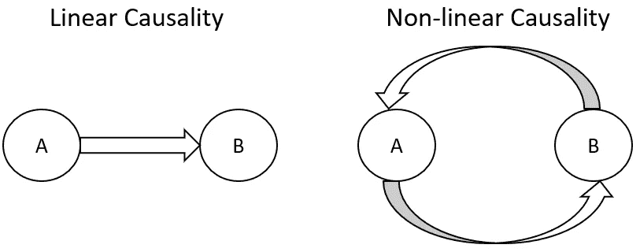

# 机器学习中的因果推理

> 原文：<https://towardsdatascience.com/causal-reasoning-in-machine-learning-4f2a6e32fde9?source=collection_archive---------11----------------------->

## 对人工智能驱动的系统面临的一些主要限制的调查

丹·梅耶斯在 [Unsplash](https://unsplash.com?utm_source=medium&utm_medium=referral) 上的照片

# 介绍

由于人工智能(AI)的最新进展，我们现在能够在学术和商业应用中利用机器学习和深度学习技术。尽管仅仅依靠不同特征之间的相关性可能会导致错误的结论，因为相关性不一定意味着因果关系。当今机器学习和深度学习模型的两个主要限制是:

*   **稳健性:**经过训练的模型可能无法推广到新数据，因此无法在现实世界中提供稳健可靠的性能。
*   **可解释性:**复杂的深度学习模型可能难以分析，以便清楚地展示它们的决策过程。

开发能够识别不同变量之间因果关系的模型可能最终提供解决这两个问题的方案。这一想法也得到了朱迪亚·珀尔(Judea Pearl)等研究人员的支持，他们主张，拥有能够在不确定性中推理的模型不足以让研究人员创造出能够真正表达智能行为的机器[1]。

# 因果关系

## 因果关系的概念

如今，机器学习模型能够通过识别大型数据集中的模式来学习数据。尽管如此，人类也许能够在检查几个例子后完成同样的任务。这是可能的，因为人类继承了理解因果关系和使用归纳推理的能力，以便吸收关于世界的新信息。因此，创造能够证明因果推理的模型将为我们打开一个全新的人工智能研究机会的世界。

在我们的日常生活中，每当我们问自己任何类型的干预性或回顾性问题(例如，如果我采取这个行动会怎样？如果我会有不同的表现呢？).

如图 1 所示，因果推理可以分为三个不同的层次(关联、干预、反事实)。在每一个层次，不同类型的问题都可以回答，为了回答最高层次的问题(如反事实)，有必要从较低层次获得基础知识[4]。事实上，为了能够回答回顾性问题，我们希望首先能够回答干预和联想类型的问题。

图 1:因果等级(作者图片)

目前，机器学习模型只能回答与关联级别相关的概率类型的问题。

由于对这一主题的兴趣不断增加，已经构建了一个能够表示因果关系的数学框架(结构因果模型(SCM) [4])。使用这种框架，因果表达式可以公式化，并与数据结合使用，以便进行预测。

## 线性和非线性因果关系

因果关系可以分为两种主要类型:线性和非线性(图 2) [5]:

*   在线性因果关系中，变量之间的联系可以是单向的，每个结果都可以由有限数量的原因引起。原因总是线性地先于结果(时间优先)。
*   在非线性因果关系中，变量之间的联系可以是双向的，影响可能是由无限数量的原因引起的。

线性因果系统的特点是因果变量之间的比例关系(如确定性系统)。相反，在非线性因果系统中，会发生不成比例的影响(例如，非确定性系统)。例如，输入条件的微小变化会导致不同的结果(如“蝴蝶效应”)。

图 2:线性与非线性因果关系(图片由作者提供)

## 案例研究:推荐系统

大多数机器学习模型的一个主要弱点是假设输入的数据是独立且同分布的(IID)。当这个假设成立时，收敛到最低的可能损失是可实现的，但是当这个约束被违反时，即使在尝试简单的任务(例如中毒攻击)时，模型也可能表现不佳[6]。

作为一个例子，让我们考虑一个电子商务推荐系统。如今的系统能够主要基于与我们计划购买的产品相关的产品来提供建议，尽管这并不总能带来准确的估计。例如，我们可能最近买了一部新手机，现在正在寻找一个手机壳。在浏览手机壳时，尽管我们的推荐系统可能会尝试向我们推荐其他项目，如手机(只是因为它们是相关的)，而不是像屏幕保护器这样更具因果关系的项目。

# 技术

用来试图发现因果关系的主要技术之一是图形方法，例如知识图和贝叶斯信任网络。这两种方法实际上构成了因果层次中关联层次的基础，使我们能够回答这样的问题:一个实体由哪些不同的属性组成，不同的组成部分是如何相互关联的？

为了开始将因果关系应用于机器学习，图形方法在过去几年中非常重要。虽然，为了让我们从因果等级中的关联层次转移到干预层次，替代方法可能是必要的。在可解释的人工智能和因果关系中，为了回答干预类型的问题(例如，如果?)而常用的一些附加技术。)是:

*   [特征选择技术](/feature-selection-techniques-1bfab5fe0784)(如递归特征消除、Shapley 值)。
*   全局和局部模型代理(例如，局部可解释的模型不可知的解释)。
*   [人工智能](/fair-and-explainable-machine-learning-25b802b00bec)中的偏差(如预处理、处理中、后处理算法)。
*   [建模隐变量](/stochastic-processes-analysis-f0a116999e4)(如隐马尔可夫模型、玻尔兹曼限制机)。

最后，除了机器学习，因果推理还可以应用于强化学习等人工智能的其他领域。事实上，为了让主体在环境中取得良好的表现，他们需要能够思考他们的行为会导致什么样的后果[7]，因此需要属于反事实层次的因果能力。此外，因果关系也可以在这个范围内使用，以创建因果部分模型来预测低维空间中的高维未来观察结果[8]。

## 比较

从统计学和研究的角度来看，识别隐藏变量和偏差的图形方法和建模技术现在是一个越来越感兴趣的领域，因为它们涉及的领域在过去十年中还没有像机器学习那样被探索(尽管仍然有可能与这些技术集成)。

另一方面，特征选择和全局/局部模型代理技术是目前在深度学习问题中常用的方法，以便使复杂的模型更容易分析，从而理解它们的决策过程(例如，在进行预测时找出哪些特征具有更大的权重，并使用代理模型在局部范围内为非线性问题创建线性模型)。

如果你对如何在机器学习中使用因果关系感兴趣，可以在我的文章中找到更多信息:[回答 AI 中的因果问题](/answering-causal-questions-in-ai-87c9b53e3a72)。

# 联系人

如果你想了解我最新的文章和项目[，请通过媒体](https://pierpaoloippolito28.medium.com/subscribe)关注我，并订阅我的[邮件列表](http://eepurl.com/gwO-Dr?source=post_page---------------------------)。以下是我的一些联系人详细信息:

*   [领英](https://uk.linkedin.com/in/pier-paolo-ippolito-202917146?source=post_page---------------------------)
*   [个人网站](https://pierpaolo28.github.io/?source=post_page---------------------------)
*   [中等轮廓](https://towardsdatascience.com/@pierpaoloippolito28?source=post_page---------------------------)
*   [GitHub](https://github.com/pierpaolo28?source=post_page---------------------------)
*   [卡格尔](https://www.kaggle.com/pierpaolo28?source=post_page---------------------------)

# 文献学

[1]要造出真正智能的机器，教他们因果量子杂志。访问:[https://www . quanta magazine . org/to-build truly-intelligent-machines-teach-them-cause-and-effect-2018 05 15](https://www.quantamagazine.org/to-buildtruly-intelligent-machines-teach-them-cause-and-effect-20180515)，2020 年 3 月。

[2]归纳推理 Jan-Willem Romeijn，载于《统计哲学》，2011 年。科学指导。访问:[https://www . science direct . com/topics/mathematics/归纳推理](https://www.sciencedirect.com/topics/mathematics/inductive-inference)，2020 年 3 月。

[3]通过概率程序归纳的人类水平概念学习 Brenden M. Lake，Ruslan Salakhutdinov，Joshua B. Tenenbaum。访问:[https://web . MIT . edu/coco sci/Papers/Science-2015-Lake-13328 . pdf](https://web.mit.edu/cocosci/Papers/Science-2015-Lake-13328.pdf)，2020 年 3 月。

[4]因果推理的七个工具与对机器学习的反思 JUDEA PEARL，UCLA 计算机科学系，美国。访问时间:[https://ftp.cs.ucla.edu/pub/statser/r481.pdf](https://ftp.cs.ucla.edu/pub/statser/r481.pdf)，2020 年 3 月。

[5]系统思维系统建模理解系统和创建系统模型的课程。可持续发展实验室。访问时间:[https://systemsinnovation.io/system-dynamics-book/](https://systemsinnovation.io/system-dynamics-book/)，2020 年 3 月。

[6]机器学习的因果关系 Bernhard schlkopf，马克斯·普朗克智能系统研究所。访问时间:[https://arxiv.org/pdf/1911.10500.pdf](https://arxiv.org/pdf/1911.10500.pdf)，2020 年 3 月。

[7]来自元强化学习的因果推理 Ishita das Gupta et al .艾尔。深刻的思想。访问时间:2020 年 3 月 https://arxiv.org/pdf/1901.08162v1.pdf[。](https://arxiv.org/pdf/1901.08162v1.pdf)

[8]强化学习的因果正确部分模型。艾尔。访问时间:2020 年 3 月，https://arxiv.org/pdf/2002.02836.pdf。