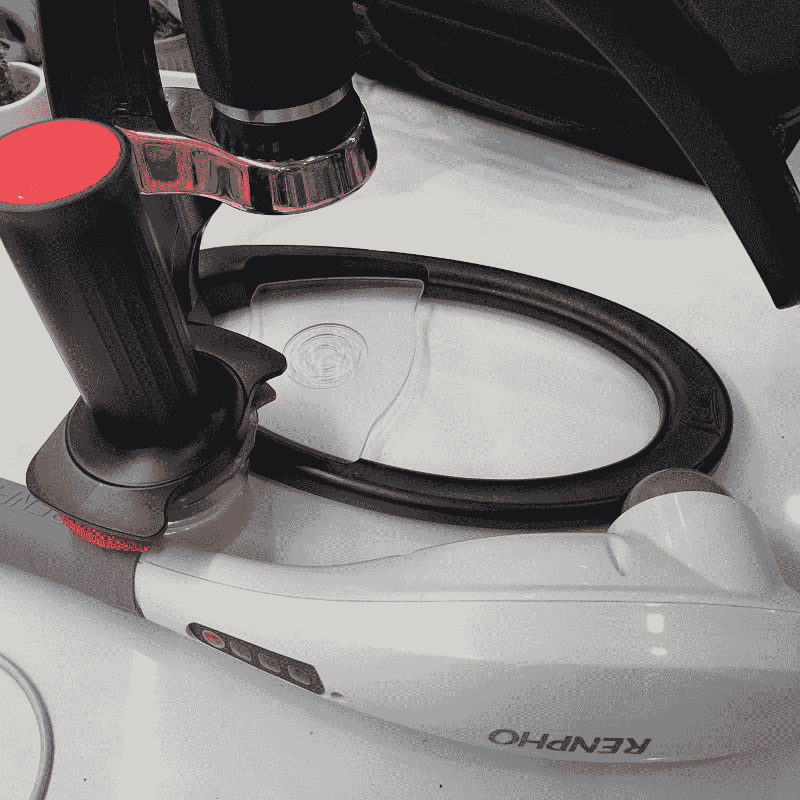
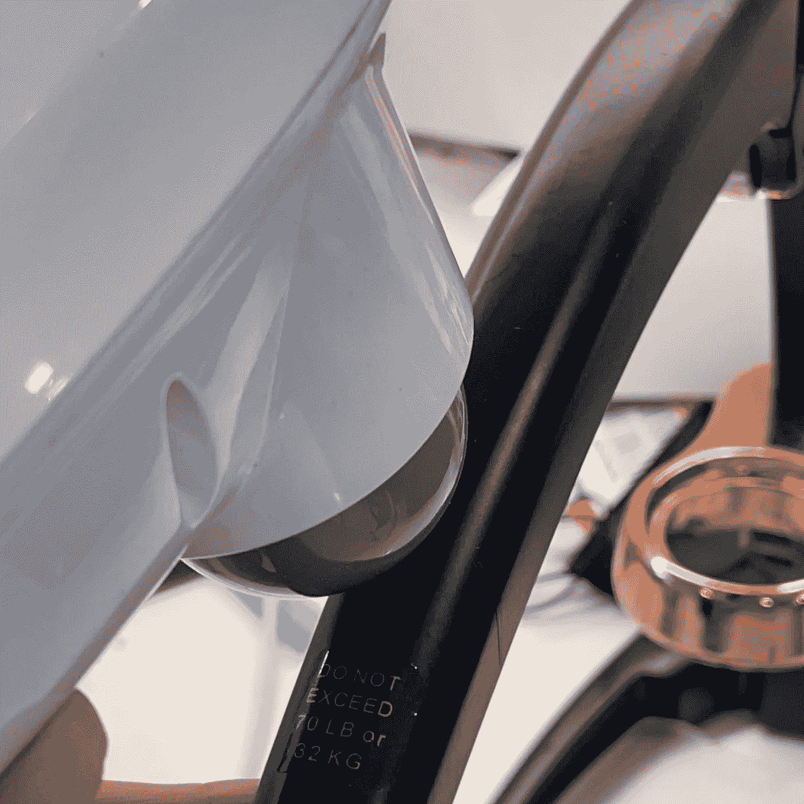
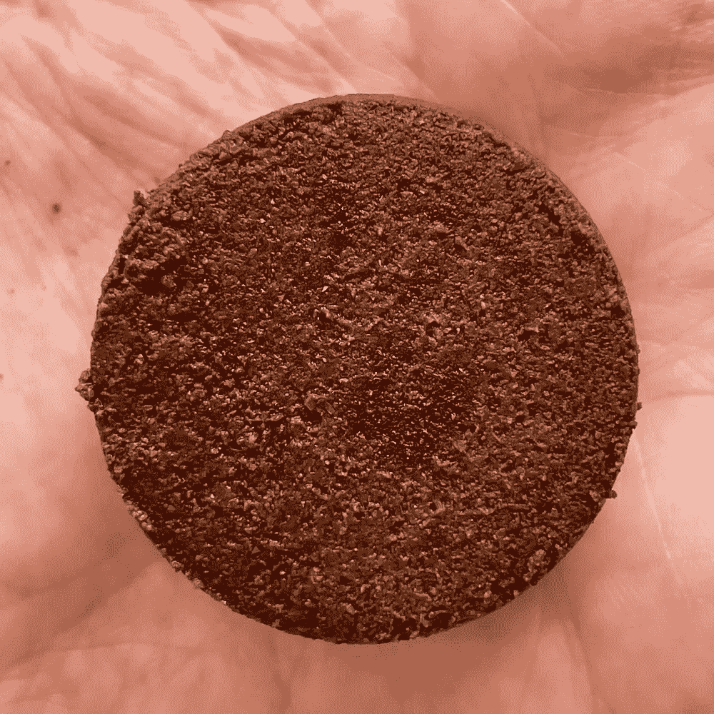
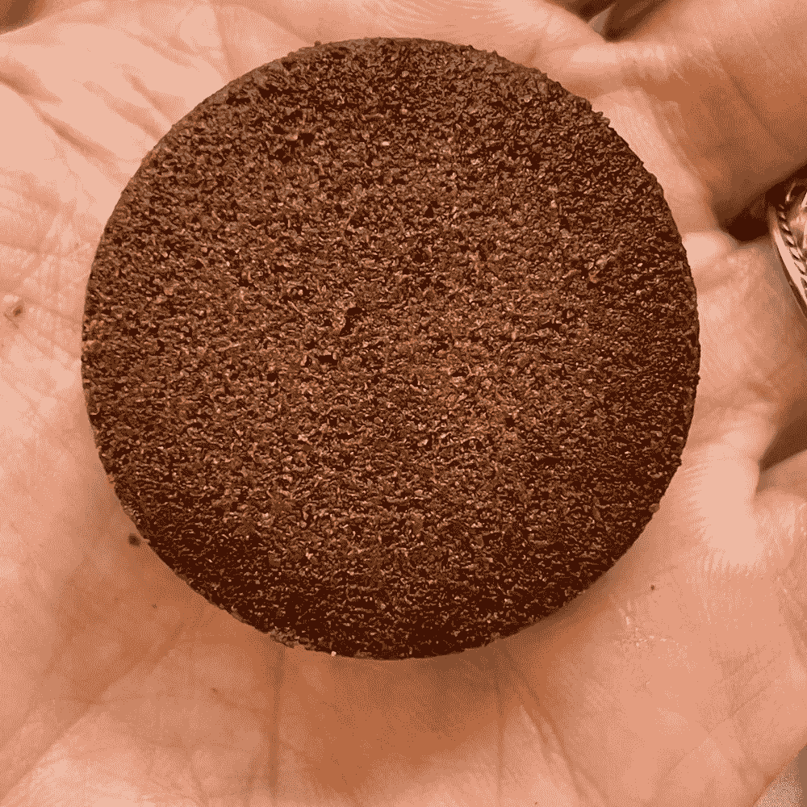
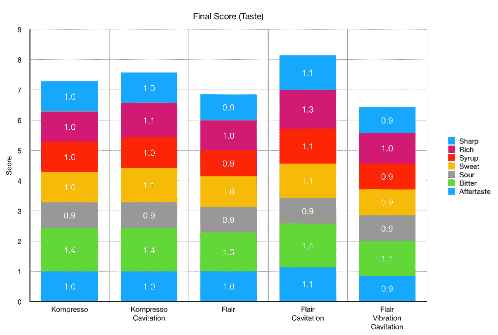
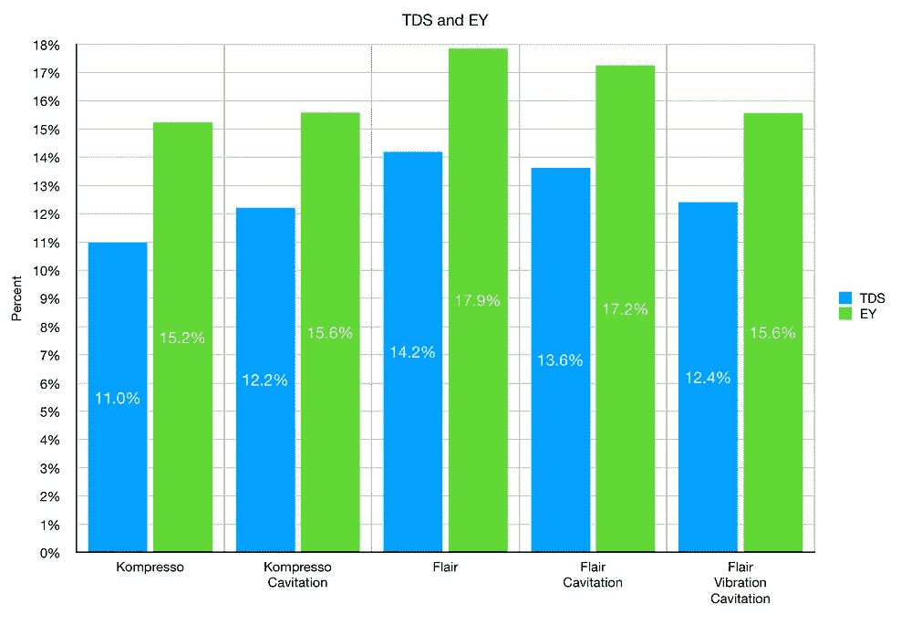
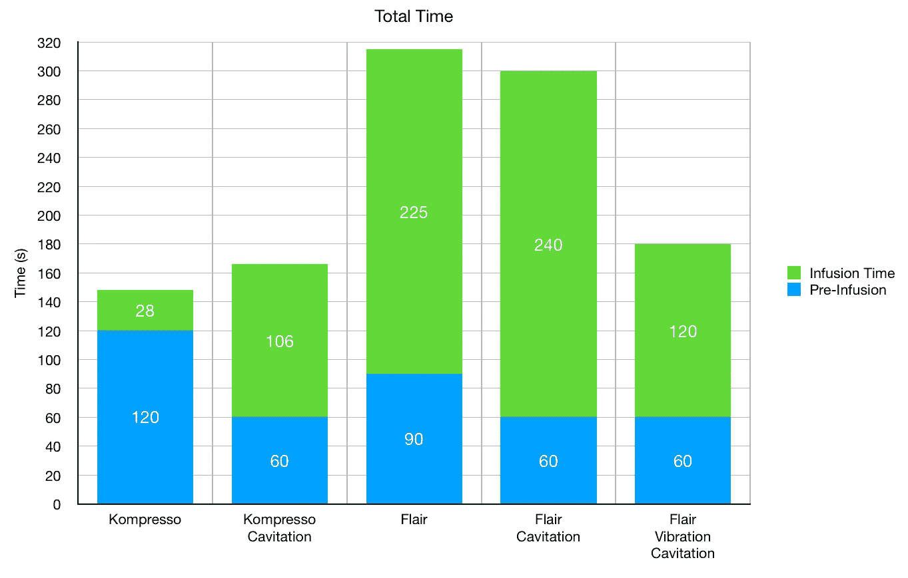

# 用于冷煮浓缩咖啡空化作用

> 原文：<https://towardsdatascience.com/cavitation-for-cold-brew-espresso-57ef791d4675?source=collection_archive---------32----------------------->

## 咖啡数据科学

## 使用 Flair 或 Kompresso

最近，在我的广告中不断出现一种叫做 [Osma](https://drinkosma.com/) 的机器，它承诺利用空化和再循环在 90 秒内提供冷煮咖啡。我认为这很有趣，但我并不真正喜欢冷饮，也没有兴趣再买一台机器。然而，我有杠杆机器。

> 我能通过让水在冰球内振动来模拟这种酿造吗？

气穴现象是由于水的运动太快，以至于压力下降，然后水蒸发。对于咖啡来说，理论是空化使提取更容易。[压力脉动](/pressure-pulsing-for-better-espresso-62f09362211d)确实增加了提取率，但我不知道压力脉动是否模拟了这种效果。

# 设置

对于冷煮浓缩咖啡，Kompresso 和 Flair 是最佳选择。在[旅行](https://medium.com/overthinking-life/portable-espresso-a-guide-5fb32185621?source=your_stories_page-------------------------------------)的时候，我一直用 Kompresso 做冷饮，所以我用了那个。

所有图片由作者提供

**Kompresso**

对于前两个测试，我使用 [Kompresso](https://m.cafflano.com) 进行长时间预灌注，然后进行空化和无空化。在这种情况下，我通过敲打设备顶部来模拟空化效应。如果我经常这样做，咖啡会出来，但比恒压慢。

麻烦的变量是，这个镜头更长，所以可能会类似于更长的预输注。我试图通过使用长时间的预输注来减轻这种变量，而不会产生气穴。

**天赋**

为了[天赋](https://flairespresso.com/)，我试了几个镜头。一次长时间预输注的基线拍摄，一次类似于 Kompresso 测试的拍摄，以及一次使用背部按摩器的拍摄。

在我得到结果之前，我想展示一些冰球。对于 Flair cold brew 来说，圆盘的底部非常有趣。对于气蚀，一个黑点出现在中心，这有点奇怪，而没有气蚀，黑点在外圈。对我来说，这是一个奇怪的模式，但我还没有深入了解。

左:带振动空化的 Flair 冷酿造，右:Flair 冷酿造

# 绩效指标

我使用两个指标来评估技术之间的差异:最终得分和咖啡萃取。

[**最终得分**](https://towardsdatascience.com/@rmckeon/coffee-data-sheet-d95fd241e7f6) 是评分卡上 7 个指标(辛辣、浓郁、糖浆、甜味、酸味、苦味和回味)的平均值。当然，这些分数是主观的，但它们符合我的口味，帮助我提高了我的拍摄水平。分数有一些变化。我的目标是保持每个指标的一致性，但有时粒度很难确定。

# 冷酿造

空化在味道上是显而易见的，但只是轻微的。就 TDS/EY 而言，气穴现象大致相同。Kompresso 的价格略高，Flair 的价格略低。

拍摄时间很难，这也造成了公平的比较差异，因为与水的总接触时间不同。

试图在冷酿造中获得空化是有趣的，但我认为不值得在杠杆上争论。我相信奥斯马机器可以做得更好。也很难衡量空化是否让事情变得更好，或者仅仅是接触时间更长。也很难知道我的所作所为是否真的通过敲击或振动杠杆导致了空化。

如果你愿意，可以在推特[和 YouTube](https://mobile.twitter.com/espressofun?source=post_page---------------------------)[上关注我，我会在那里发布不同机器上的浓缩咖啡照片和浓缩咖啡相关的视频。也可以在](https://m.youtube.com/channel/UClgcmAtBMTmVVGANjtntXTw?source=post_page---------------------------) [LinkedIn](https://www.linkedin.com/in/robert-mckeon-aloe-01581595?source=post_page---------------------------) 上找到我。你也可以关注我的[媒体](https://towardsdatascience.com/@rmckeon/follow)和[订阅](https://rmckeon.medium.com/subscribe)。

# [我的进一步阅读](https://rmckeon.medium.com/story-collection-splash-page-e15025710347):

[浓缩咖啡系列文章](https://rmckeon.medium.com/a-collection-of-espresso-articles-de8a3abf9917?postPublishedType=repub)

[工作和学校故事集](https://rmckeon.medium.com/a-collection-of-work-and-school-stories-6b7ca5a58318?source=your_stories_page-------------------------------------)

[个人故事和关注点](https://rmckeon.medium.com/personal-stories-and-concerns-51bd8b3e63e6?source=your_stories_page-------------------------------------)

[乐高故事首页](https://rmckeon.medium.com/lego-story-splash-page-b91ba4f56bc7?source=your_stories_page-------------------------------------)

[摄影启动页面](https://rmckeon.medium.com/photography-splash-page-fe93297abc06?source=your_stories_page-------------------------------------)

[使用图像处理测量咖啡研磨颗粒分布](https://link.medium.com/9Az9gAfWXdb)

[改善浓缩咖啡](https://rmckeon.medium.com/improving-espresso-splash-page-576c70e64d0d?source=your_stories_page-------------------------------------)

[断奏生活方式概述](https://rmckeon.medium.com/a-summary-of-the-staccato-lifestyle-dd1dc6d4b861?source=your_stories_page-------------------------------------)

[测量咖啡磨粒分布](https://rmckeon.medium.com/measuring-coffee-grind-distribution-d37a39ffc215?source=your_stories_page-------------------------------------)

[咖啡萃取](https://rmckeon.medium.com/coffee-extraction-splash-page-3e568df003ac?source=your_stories_page-------------------------------------)

[咖啡烘焙](https://rmckeon.medium.com/coffee-roasting-splash-page-780b0c3242ea?source=your_stories_page-------------------------------------)

[咖啡豆](https://rmckeon.medium.com/coffee-beans-splash-page-e52e1993274f?source=your_stories_page-------------------------------------)

[浓缩咖啡滤纸](https://rmckeon.medium.com/paper-filters-for-espresso-splash-page-f55fc553e98?source=your_stories_page-------------------------------------)

[浓缩咖啡篮及相关主题](https://rmckeon.medium.com/espresso-baskets-and-related-topics-splash-page-ff10f690a738?source=your_stories_page-------------------------------------)

[意式咖啡观点](https://rmckeon.medium.com/espresso-opinions-splash-page-5a89856d74da?source=your_stories_page-------------------------------------)

[透明 Portafilter 实验](https://rmckeon.medium.com/transparent-portafilter-experiments-splash-page-8fd3ae3a286d?source=your_stories_page-------------------------------------)

[杠杆机维修](https://rmckeon.medium.com/lever-machine-maintenance-splash-page-72c1e3102ff?source=your_stories_page-------------------------------------)

[咖啡评论和想法](https://rmckeon.medium.com/coffee-reviews-and-thoughts-splash-page-ca6840eb04f7?source=your_stories_page-------------------------------------)

[咖啡实验](https://rmckeon.medium.com/coffee-experiments-splash-page-671a77ba4d42?source=your_stories_page-------------------------------------)