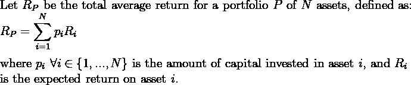
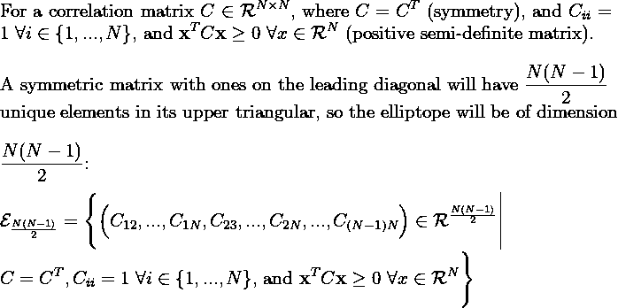
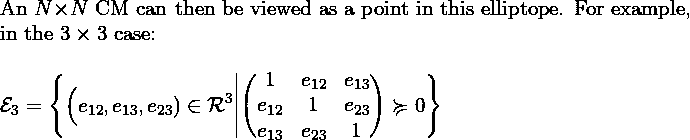
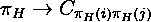
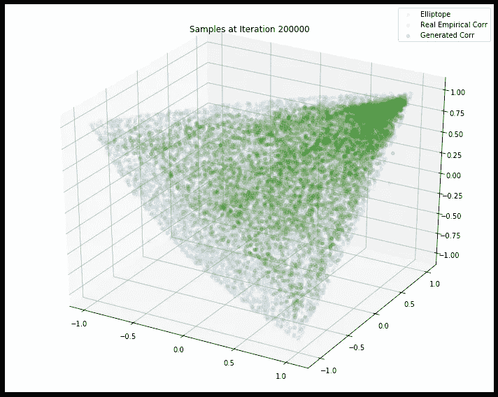

# cCorrGAN:学习椭圆曲线中经验条件分布的条件相关 GAN

> 原文：<https://towardsdatascience.com/ccorrgan-conditional-correlation-gan-for-learning-empirical-conditional-distributions-in-the-bfb3cff049b2?source=collection_archive---------21----------------------->

## 金融中的生成模型:动机与挑战

由于隐私、监管和业务要求，在金融服务机构中共享金融数据受到严格限制，包括内部(在机构的职能部门之间，或在授权访问前使用数据)和外部(与研究机构)[6]。因此，生成真实合成数据的方法至关重要，尤其是在缺乏历史数据以及数据匿名至关重要的情况下。例如，缺乏各种市场条件下的股票市场时间序列数据，本质上是因为只有一个“历史”。这使得很难对不同情景下的投资组合进行压力测试。

生成真实的数据集需要定义数据集之间的适当距离，并测量它们的接近程度。虽然金融数据可以大致分为零售银行数据(通常为表格形式)和市场微观结构数据(通常为时间序列形式),但这里我们将重点关注生成市场微观结构数据(近似为经验金融相关矩阵(CM))。生成多变量时间序列数据是一个更具挑战性的问题，因为它涉及到捕捉单变量时间序列之间的依赖结构，以及其他特征，如自相关和分布属性[1]。经验 CMs 在多元金融时间序列的研究中是开创性的，并且在资产配置的风险管理中是重要的。CMs 在金融领域有很多应用，比如测试交易策略的稳健性，对投资组合进行压力测试，或者客观地比较经验方法。合成 CMs 还应该展示真实数据的经验属性，称为风格化事实(SF)。到目前为止，科幻小说只是被定性地评价，还没有被浓缩成一个单一的指标。

# FCMs 的数学直觉

我们将通过转向 Markowitz 的最优投资组合理论来获得对金融相关矩阵的直觉。这一理论表明，通过优化每项资产的权重(即投资于该资产的资本量)，可以在给定总回报的情况下最小化风险，从而找到最佳投资组合。形式上[4]:

作者图片

使用总方差来描述投资组合的总风险[4]

作者图片

投资组合中资产的最佳平衡是使固定投资组合回报的方差最小化。风险最小的投资组合在具有最小特征值的协方差矩阵的特征向量上具有很大的权重。这可以被解释为在具有最小方差(相关特征值)的 N 个不相关投资组合(协方差矩阵的特征向量)上投资最多的资本[4]。随机矩阵理论(RMT)是应用于随机变量矩阵的概率分析的一个分支，当应用于金融 CMs 时，它的许多结果是有用的。在[4]中，作者使用 RMT 通过部分去除噪声来清理经验 CMs。如果 T 与 N 的比率很小，即如果有限时间序列长度与投资组合中的资产数量相比很小，则相关性不太可能包含有用的信息，或者更可能是有噪声的。这种获得相关矩阵的方法需要计算它们，然后执行“清理”过程。不干净的 CMs 低估了真实风险，尽管干净的 CMs 在优化投资组合中更准确地解释了风险，但真实风险总是大于估计风险。相反，采样相关矩阵可能是生成实际 CMs 的更有效的方式。生成对抗网络(GANs)已经被成功和广泛地应用于计算机视觉任务(图像和视频生成)以及语言和音频处理(文本、语音和音乐生成)。然而，直到最近，在金融领域，对生成性深度学习的探索还很少。CorrGAN [2]是解决这一差距的最新尝试，它是一种 GAN，经过训练可以学习相关矩阵的分布，从而可以对现实的金融 CMs 进行采样。

然而，RMT 和其他关于金融相关矩阵的类似工作确实提供了传递金融 CMs 属性的 SFs，使我们能够更好地理解它们。这些是[2，3]:

1.成对相关的分布显著地向正的方向倾斜。

2.特征值遵循 Marchenko-Pastur 分布，除了非常大的第一特征值(对应于“市场”)和大约 5%的其他大特征值(对应于市场内的自然集群，如行业)。

3.Perron-Frobenius 性质:第一特征向量有正项。

4.相关性遵循层级结构，正如 Mantegna [5]所示，金融相关性也是如此。

5.CM 对应的最小生成树的无标度性质。

这些程式化的事实允许对合成 CMs 和经验 CMs 之间的相似性进行定性评估。这个列表并不详尽，例如，检查 GAN 学习的潜在空间可以揭示更多以前未知的金融相关性特征。

# 科尔根

CorrGAN 是第一个展示使用 GANs 对金融 CMs 进行采样的结果并验证其真实性的模型。使用条件甘纳可以生成单变量时间序列，但这些忽略了多种资产之间的相关性，因此不适用于需要考虑多变量相关性的投资组合管理。在[2]中，描述了椭圆曲线(相关矩阵集)的数学设置:

作者图片

作者图片

N 乘 N 的情况在统计和计算上都要困难得多，并且需要高性能计算(HPC)基础设施来成为量化金融工具箱中的主要部分。定性评估生成矩阵的质量更难，并且由于数据效率低下，训练也更难。数据低效是由于 N 个资产的相关矩阵有 N 个！描述相同相关结构的可能矩阵，因为股票的顺序是不相关的。GAN 需要用于训练它的数据的多样性，以确保数据分布的完全覆盖。通过避免由矩阵等价引起的冗余，实施置换不变性使得每次训练更新更加多样化。在 CorrGAN 的论文中，这是通过使用分层聚类算法来设计的，以在 CM 上引起排列:

作者图片

该架构遵循深度卷积 GAN (DCGAN ),选择该架构是因为根据 SFs，CNN 显示的属性也适用于金融 CMs。这些是局部移位不变性、局部性和层次合成性(学习相关性的层次结构的能力)。

图 1:GAN 的 3x3 相关采样。图来自[2]。

在图 1 中，蓝色代表使用洋葱方法从三维椭圆图上均匀采样的 10，000 个点。橙色点是真实的经验矩阵，使用一年中 252 个工作日的日收益率计算，随机抽样三只股票，不替换标准普尔 500 的股票。绿点是通过从经过训练的 CorrGAN 采样生成的合成点。已经有可能看到合成分布与经验分布紧密匹配，直观地验证了一个典型的事实，即金融 CMs 集中在高正值范围附近。通过绘制第一特征向量的条目、相关性的分布、随机选择的 cm 的视觉表示、MST 中节点度分布的对数-对数图以及特征值的分布，来自[2]的结果显示了 CorrGAN 如何根据 SFs 生成真实的样本。然而，它们不是严格的相关矩阵，因为主对角线元素不完全等于 1。矩阵也不完全是正半定的，导致小的负特征值。需要后处理投影方法来找到相对于 Frobenius 范数最近的真实相关矩阵。

CorrGAN 的局限性在于，经验分布和合成分布并不完全匹配，更重要的是，每个训练好的模型之间存在不稳定性。这是 GANs 的一个众所周知的缺陷，即它们不善于捕捉不同的分布模式。这意味着，由于训练期间的模式崩溃，合成矩阵可能不会跨越现实金融 CMs 的整个子空间，而只是一个受限的子空间。

# 条件 CorrGAN: cCorrGAN

今年早些时候,[2]的作者发表了 cCorrGAN 和对 CorrGAN 的改进，CorrGAN 实现了三种广泛的市场稳定机制:压力、稳定和反弹。使用这个新标记的训练集，可以通过与 SFs 以及 PCA 投影的交叉检查来定性地评估性能，以确保经验和合成分布的良好定义的聚类和视觉匹配。在数量上，人们可以使用 Wasserstein 度量来比较经验分布和综合分布。最后,[3]的作者展示了如何应用 cCorrGAN 来测试投资策略和投资组合分配方法的稳健性，并得出这些方法中哪一种更能受益于某些市场条件(即市场制度)的见解。

对于未来的研究，以完全端到端的方式生成相关矩阵是深度学习的理想目标和常见实践，这将避免执行训练后预测的需要。同样，虽然 cCorrGAN 生成了金融 CMs，但对于研究人员来说，能够生成现实的多元金融时间序列仍然是一个挑战。

# 笔记

1.  所有内联数学都是作者写的，改编自参考文章。

# 参考资料:

[1]马科维茨的最优投资组合理论

E.J. Elton 和 M.J. Gruber，现代投资组合理论和投资分析(1995)，J.Wiley 父子公司，纽约，1995 年；H.Markowitz，投资组合选择:投资的有效多样化(1959)，J.Wiley 父子公司，纽约，1959 年。

[2]科尔根

G.Marti，CorrGAN:使用生成式对抗网络对现实财务相关性矩阵进行采样(2020)，ICASSP 2020–2020 IEEE 声学、语音和信号处理国际会议(ICA ssp)，第 8459–8463 页。

[3]科尔根

动词 （verb 的缩写）Goubet G. Marti 和 F. Nielsen，cCorrGan:用于学习椭圆中的经验条件分布的条件相关性 Gan(2021)，几何信息科学，第 613-620 页，斯普林格国际出版公司。

[4]随机矩阵理论和金融相关性

长度 Laloux，P. Cizeau，M. Potters 和 J-P. Bouchaud,《随机矩阵理论和金融相关性》( 2000 年),《国际理论和应用金融杂志》,第 3 卷，第 03 期，第 391-397 页。

[5]财务相关性的层次结构

R.N. Mantegna,《金融市场的层次结构》( 1999 年),《欧洲物理杂志 B——凝聚态物质和复杂系统》,第 11 卷，第 1 期，第 193-197 页。

[6]生成金融领域的综合数据

南 Assefa,《生成金融综合数据:机遇、挑战和陷阱》。挑战和陷阱(2020 年)，信息科学:数据保护(专题)，2020 年。