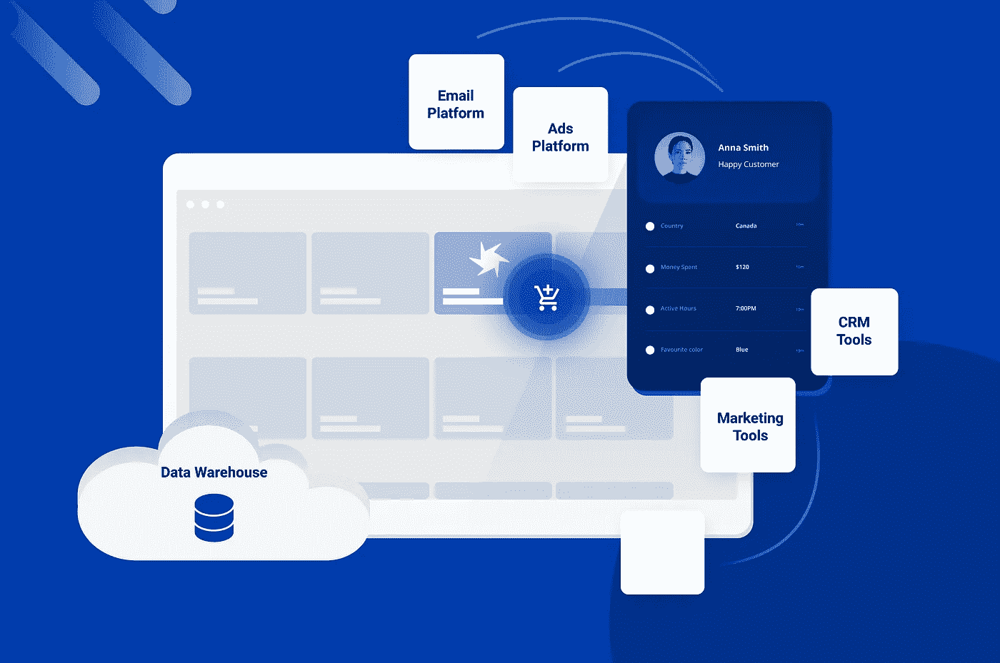
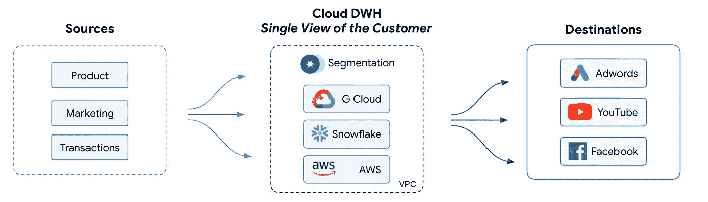
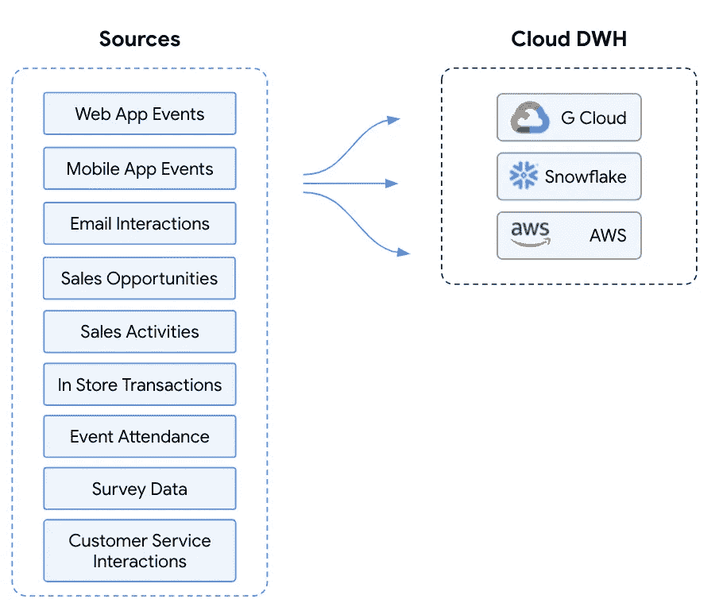
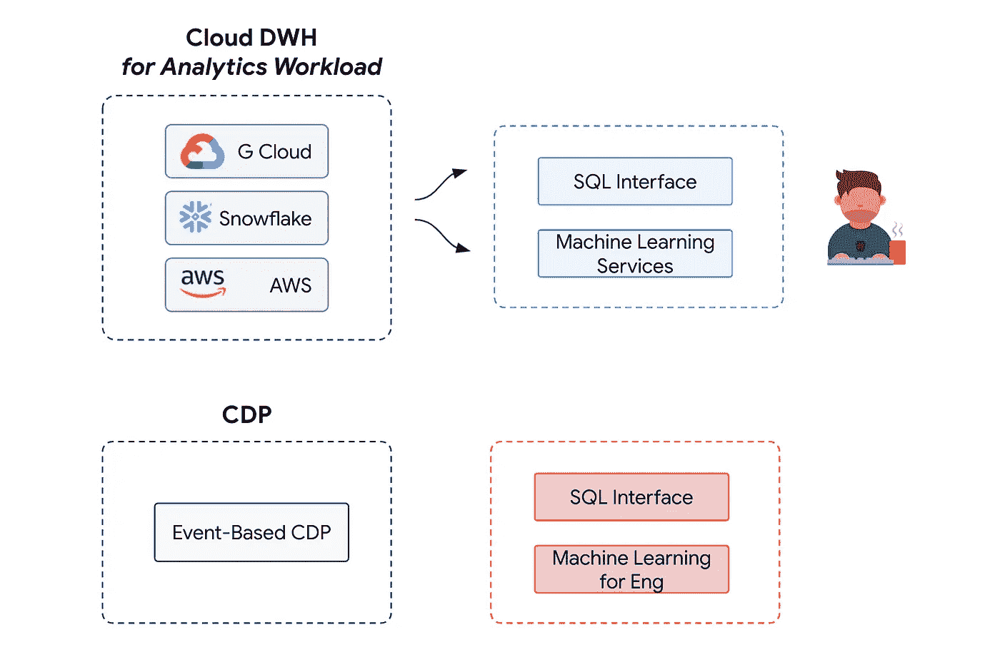
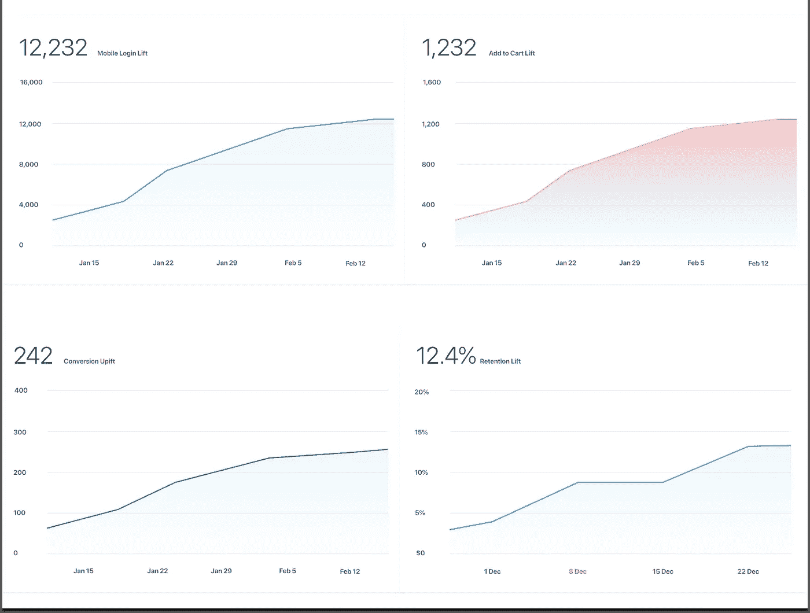
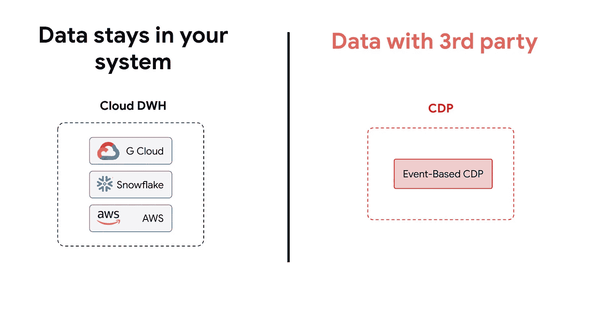
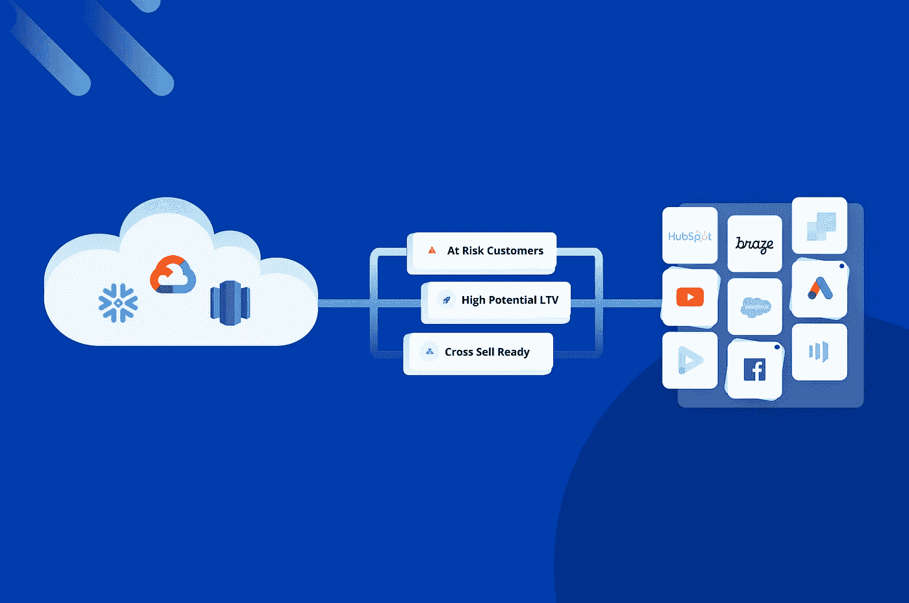

# CDP 不是未来

> 原文：<https://towardsdatascience.com/cdps-are-not-the-future-f8a3f56114b6?source=collection_archive---------9----------------------->

## 是的，有一个更好的方法…

利用第一方数据增加收入—图片由作者提供。

如果你是一家数据驱动的公司，那么你很可能熟悉 CDP。这是因为，近年来，第三方客户数据平台(或“CDP”)已经成为集中和激活客户数据的一种流行方式。除此之外，我们还看到精通技术的公司广泛采用了雪花、BigQuery 或 Redshift 等数据仓库。我在这里谈论一些有点争议的事情，并声称 CDP 不是未来。对于那些花费时间和精力将所有数据纳入数据仓库的公司，我建议采用一种不同的方法，这种方法将简化您激活客户数据的能力，并更快地推动收入增长——第一方数据平台。

> **您的数据仓库应该是您唯一的真实来源，是您集中、细分和激活客户数据的地方，并且第三方数据平台直接在您的数据仓库之外工作**

第一方数据平台直接从数据仓库驱动—图片由作者提供

# 那么什么是 CDP 呢？

不要误会，客户数据平台通过集中客户数据并将其激活到团队每天使用的正确业务工具，为组织提供了巨大的价值。这有助于公司加速收入和增长，并提升客户体验。通常，CDP 通过将客户数据导入到一个位置，创建客户的单一视图，并将客户数据激活到营销、销售和客户服务工具来实现这一点。就像任何工具或平台一样，CDP 也有自己的局限性，这些年来我们逐渐意识到了这一点。我想浏览其中一些来支持这些大胆的主张。

# 1.时间就是金钱

在这个效率决定一切的新世界，你能想象用 6 个多月的时间来设置和集成一个工具来激活客户数据吗？这就是使用客户数据平台的现实。首先，您需要让您的工程团队参与进来，集成 SDKs 片段，并发布您的产品。在中型组织中，这个过程需要几个月的时间。如果您所在的公司有一个强大的数据工程团队，他们已经完成了为您的所有数据设计一个漂亮的数据仓库的艰巨任务，那么您现在为什么要将这些数据的子集同步到 CDP 呢？

除了数据集成之外，您现在还必须在 CDP 平台中创建和维护您的客户数据模型。您必须设置重复数据删除逻辑，重新创建您的关键客户属性，并创建您想要筛选的自定义属性(总支出、购买次数等)。大多数 CDP 都有自己的细微差别，因此您需要从您的团队中分配一些资源，这些资源现在将成为“CDP 管理员”,类似于 Salesforce 管理员。从某种意义上说，CDP 迫使您全力以赴地采纳他们的观点和工具，并让您的团队致力于学习它们。

痴迷于数据驱动的增长需要更大的灵活性，并需要允许快速试验——试验 ML 模型、构建分析报告或对活动进行高级统计评估的能力。这就是为什么我们看到如此多的公司最终将集成的数据从 CDP 带回他们自己的仓库。

# 2.**顾客的两种观点**

实施第三方 CDP 的主要原因之一是找到一种简化的方式来创建您客户的**【单一视图】**。不幸的是，当您扩展您的公司并因此进入更复杂的用例时，这实际上可能会适得其反，您将不可避免地以不止一个，而是**两个客户视图** -一个在您的数据仓库中，一个在 CDP 中。

复制客户模型成本高昂——图片由作者提供

您的分析和数据工程团队致力于将来自不同来源的所有数据吸收到数据仓库中，并将其建模为统一的客户视图。这使他们能够生成可靠的分析报告，建立 ML 模型，并对您的营销活动进行更智能的评估。这些团队也最熟悉您的关键业务逻辑和关键指标，因此没有人比他们更了解您的数据。在仓库中，你的团队可以利用他们选择的 SQL 和数据建模工具(Matillion、DBT、Informatica 等)。)来建模数据。

通过引入 CDP，您可以维护一个完全独立的冗余数据模型，其中只有一部分数据位于您的数据仓库中。随着时间的推移，只有更强大的数据模型会存活下来，并且几乎总是最终成为数据仓库。分析团队更喜欢在数据仓库中使用他们已经喜欢的工具，这与 CDP 相反，在 CDP 中，他们将限于使用专有的查询语言或用户界面。缓慢但肯定的是，您为构建和维护您的 CDP 所做的所有工作将不再有回报。

# 3.CDP 对客户的看法“有限”

这是一个不幸的现实，但是随着公司的扩大，您的大多数客户数据将永远不会到达 CDP。尽管 CDP 可以从各种来源获取大量数据，但通常更容易将简单的产品指标集成到 CDP 中，如应用程序事件或网站事件。当你得到更复杂的第一方数据时，情况就不同了。

CDPs:仅限于简单的数据来源——图片由作者提供

但是现实从来没有这么简单，您将有更多的数据源—调查数据、电子邮件点击量、活动出席率、销售活动等。所有这些都需要额外的集成来同步到 CDP，而他们的客户模型并没有考虑到如此广泛的数据源。另一方面，您的数据工程和分析团队将能够使用他们已经喜欢使用的工具在您的数据仓库中轻松地接收和建模这些数据。因此，通过依赖数据仓库并将其激活为“第一方数据平台”，您将能够激活更丰富的客户资料。

第一方平台:将所有来源同步到数据仓库—图片由作者提供

# 4.不要破坏你团队的创新能力

分析和数据科学团队在以数据仓库提供商为中心的基于 SQL/Python 的工具生态系统中工作。通过获取数据并将其放入第三方 CDP，您束缚了您的分析团队，阻碍了他们的创新。分析和数据团队将提出预测客户流失、生命周期价值和推动真实客户价值的最佳模型。然而，CDP 使他们更难获得创建这些模型所需的数据，并且他们最终会将数据导出回仓库，以便能够使用他们工具箱中更强大的工具。许多 CDP 也不一定能轻松地将这些数据导出到他们的系统之外，因为这符合他们的最佳利益。

为您的数据团队提供他们喜爱的工具—按作者分类的图片

如果您投资您的数据仓库，并在那里构建您的核心客户数据模型，那么您的分析团队已经拥有了他们随时进行分析所需的所有数据。简单地说，与第三方 CDP 相比，分析团队更喜欢使用 SQL 和 Python。

# 5.数据仓库提供了更多的评估潜力

随着整个行业在活动归因跟踪方面的所有变化，拥有基于第一方数据的更智能的受众/活动评估机制比以往任何时候都更重要。您的数据仓库为报告受众和活动成功指标提供了一个更强大的框架，而不是试图处理归因或查看 CDP 提供的有限评估功能。您的数据仓库不仅拥有丰富的客户资料，而且通常还拥有您想要驱动的所有目标指标或事件，如总支出、点击的购买按钮等。因此，在分析您的团队为营销和销售活动创建的受众/细分市场时，查看您的数据仓库是显而易见的，您可以在其中将这些活动与所有活动联系起来。

推动数据仓库中的任何指标—按作者分类的图像

通过利用数据仓库作为第一方数据平台，您可以通过查看对您的业务重要的任何指标的提升来分析受众，这些指标包括留存、收入、登录、立即支付点击、搜索，以及您的仓库中几乎所有可用的指标。您可以通过在仓库中生成的受众中进行智能推广小组来跟踪诸如购物车增加、移动登录提升、收入提升等指标。你可以用曼-惠特尼 U 检验对你的结果进行统计显著性检验。除此之外，您的商业智能团队可以在您选择的数据可视化工具中可视化这些结果:Tableau、PowerBI、Looker 等。通过将受众测量保存在您的数据仓库中，团队可以更快地获得灵活性和更多洞察力。

# **6。不要将关键客户数据委托给第三方**

安全性是任何基础架构设计或组织的重要组成部分，将您的所有数据同步到第三方 CDP 肯定会让您犹豫，这是理所当然的。激活您的数据仓库的一些最显著的优点是这种架构设计带来的安全性好处。

安全掌握在自己手中—作者图片

*   **您的数据永远不会离开** —您的数据会留在您的仓库中
*   **访问&授权** —您控制谁可以访问哪个数据子集
*   **轻松合规** —您可以在仓库中直接控制合规
*   **GDPR 请求** —轻松实现合规自动化，响应 GDPR 的数据清理请求

随着隐私和安全成为客户越来越关心的问题，您绝不能拿他们对第三方的信任冒险。

# 更好的方法

数据团队已经在构建数据仓库和数据基础设施方面投入了大量资金。这意味着有一种更好、更快、更便宜的方式直接从仓库激活您的第一方数据。第一方数据平台使您的分析团队能够利用他们已经完成的所有艰苦工作，并简单地激活您数据仓库中的客户数据模型。

您仓库中的客户细分平台—作者图片

完全免责声明，我非常相信这个新方向，以至于我们在[飞轮软件](https://www.flywheelsoftware.com/)建立了一个专注于激活数据仓库的完整产品——一个直接在任何数据仓库上运行的客户细分平台。我们是朝着更好的增长、实验和营销方法这一大转变的一部分——为各种规模的团队释放巨大的潜力。我们很高兴能继续发现这一新方向的潜力，并与业内许多其他人一起拓展这一领域。