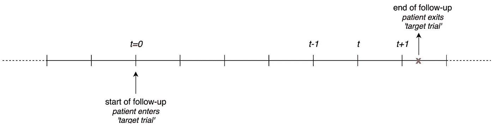
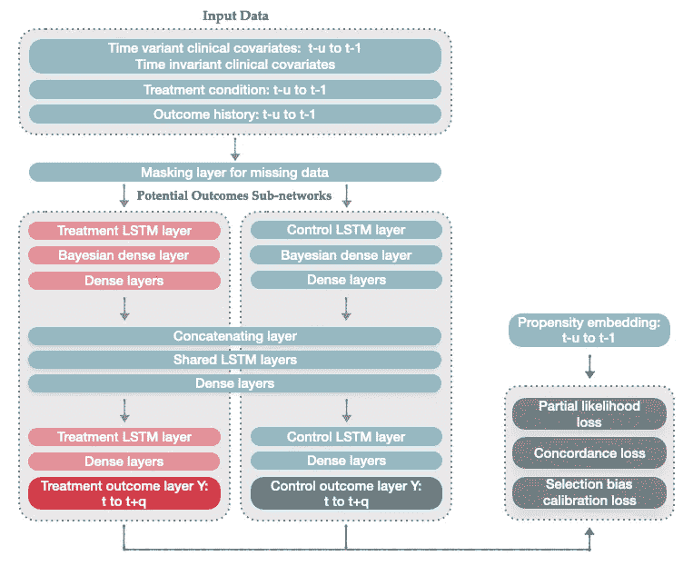
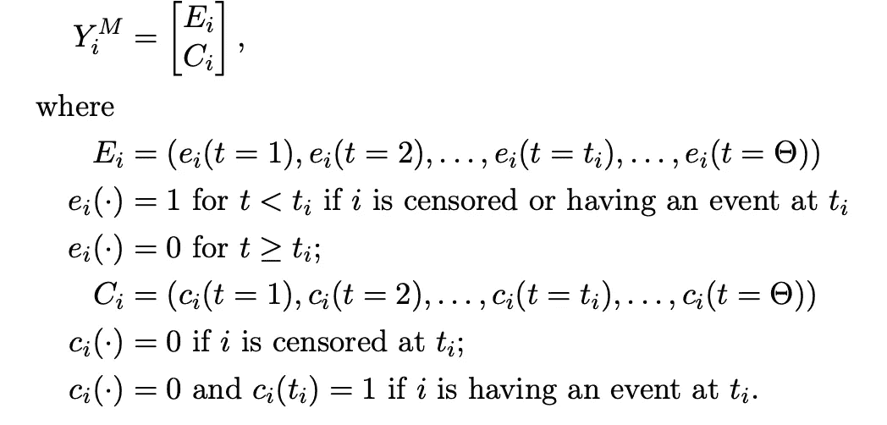

# 使用深度生存模型的观察性纵向研究的因果推断

> 原文：<https://towardsdatascience.com/cdsm-casual-inference-using-deep-bayesian-dynamic-survival-models-7d9f9ec7c989?source=collection_archive---------26----------------------->

## [思想理论](https://towardsdatascience.com/tagged/thoughts-and-theory)

纵向观察健康数据中的因果推断通常需要在存在时变协变量的情况下，准确估计治疗对事件间结果的影响。为了解决这个纵向治疗效果估计问题，我们开发了一个时变因果生存(TCS)模型，该模型使用潜在结果框架和一组重复的子网络来估计生存概率的差异及其随时间的置信区间，作为时间相关协变量和治疗的函数。

最新出版物见 YJBIN_104119

# 问题

在这里，我们简要描述一下研究设置:

假设在一个离散的时间(t=1)空间中。我们面临一个生存数据集，其中第一个失败事件由结果标签(y_t={0，1})表示，用于给予二元治疗(z_t={0，1})的患者。

研究设计。作者形象

我们观察到:

*   **协变量** : ***xt*** 患者在时间 t 的状态
*   **事件**:如果发生在【t，t+1】和事件日期<审查员的日期之间，则**yt = 1**
*   ***检查指标** : **如果患者在任何事件之前退出研究，则 T21【c】= 1**T24*
*   ***治疗**:***ZT = 1****若患者在间隔【t，t+1)* 接受治疗*

*在每个时间间隔，我们感兴趣的是根据存活曲线来估计治疗效果。*

# *理性*

*生存分析领域已经探索了深度学习技术，其中可以使用 *DeepHit* 和 *DeepSurv* 等方法基于基线协变量预测个体生存曲线。然而，在统计分析中，治疗的因果效应通常更引起临床医生的兴趣。因此，我们的目标是使用纵向健康记录数据，以存活概率的形式预测目标结果的风险，并估计个人或患者群体的相应存活治疗效果。标准方法取决于从基线协变量快照和静态二进制治疗分配中学习的结果模型。当需要时，从开始跟进开始的暂时性被“手动”结合，例如通过定义随时间的最大值、累积值或平均值。*

# *模型*

*为了估计绝对治疗效果，使用对事件发生时间(存活)结果的新型深度学习动态估计，对对照组和治疗组中的潜在存活概率进行建模。给定观察到的既往病史和治疗分配，进行治疗和对照条件下个体潜在存活曲线的差异。我们把这个模型称为时变因果生存(TCS)模型。*

*TCS 的关键特征是:1)它从纵向数据中观察到的和缺失的协变量的模式中学习；2)它通过对治疗和控制条件采用潜在结果子网络来捕捉治疗特定风险；3)用贝叶斯密集层量化模型估计的不确定性。*

**

*图一。模型结构。作者图片*

*TCS(见图 1)取代了用于估计观察到的故障/检查时间的联合分布的单一结果模型(如 DeepHit ),首先分别从治疗观察和控制观察中获取信息，然后用共享子网对信息进行编码。编码信息被输入到反事实子网络中，以预测给定治疗或控制条件下的预期生存结果。专用的子网络明确地对源自患者基线协变量及其在治疗条件之间的相互作用的风险进行建模。最后，我们调整了观察性研究中非随机治疗分配产生的反事实结果的偏差。反事实结果之间的差异将为我们提供治疗效果的校准估计。*

*个人 I 的结果标签 Y^M 被定义为每个时间段的矩阵:*

**

*培训标签*

# *结果*

*TCS 是针对其他四种机器学习算法进行基准测试的:*

*   *未调整的 TCS (TCS(na)):与 TCS 相同，但没有选择偏差校正。*
*   *具有生存结果的简单递归神经网络(RNN):删除图 1 中的潜在结果神经网络。*
*   *具有二进制结果的简单递归神经网络(二进制):使用均方误差作为损失函数，对事件/删失的纵向二进制标签进行直接预测。*

*我们生成了生存数据序列来比较这四种算法。选择模拟来模拟德国乳腺癌随机试验[1]中观察到的协变量轨迹。细节可以在[论文](https://arxiv.org/abs/2101.10643)中找到。*

*我们发现二进制和 RNN 算法在估计下一步生存率方面有更好的表现(见 AUROC 和 C-Index)，而 TCS 及其未经调整的版本 TCS(na)在估计个体和平均治疗效果方面表现更好，这是通过生存概率(SC (Raw))和风险比(HR (Raw))的差异来衡量的。与二进制和 RNN 模型相比，TCS 的准确性随着时间的推移相对稳定。*

*正如预期的那样，当 ATE 以生存概率的差异来衡量时，TMLE 对 TCS 的改善可以忽略不计(偏倚从 30.8%降低到 29.9%)，因为治疗效果已经被调整。二元结果模型(130.1%至 40.5%)和 RNN (46.9%至 31.5%)的校正更为明显，因为原始估计值具有较高的偏差水平。另一方面，使用 IPW 的调整使得除了二元模型之外的所有原始估计变得更糟。相似的观察结果也在通过危害比测量的 ATE 估计值中发现。*

*TCS 从其生存结果和潜在结果子网络的设计中获益最多。在图 2 的图(a)中，我们评估了与基准相比，TCS 的每个组成部分对 ATE 偏差减少的增量贡献，通过根据存活概率的差异定义的原始 ATE 估计，RNN 优于二元模型 83.2%。TCS (na)中包含的子网络和一致性损失函数进一步减少了 11.4%的偏差。最后，对选择偏差的调整使估计又提高了 4.7%。*

*与基准算法不同，TCS 提供了非常接近真实值的 ITE 估计。这在图 2 的面板(b)中示出，其显示了在默认设置下随机选择的实验的真实和估计的 ITE 分布。*

*在我们的工作论文中，我们进一步提供了两个基于模拟数据和房颤临床研究数据的案例研究。感兴趣的读者可以查看我们的网站。*

# *讨论*

*TCS 使用深度学习技术进行生存分析，填补了因果推理的空白。它考虑了时变和高维混杂因素与时不变的治疗方案。其估计的绝对治疗效果可以很容易地与传统文献进行比较，传统文献使用相对治疗效果的措施，如风险比。我们预计 TCS 将特别有助于在日益复杂的观察性卫生保健环境下识别和量化治疗效果随时间的异质性。*

*这项研究中一个值得注意的发现是我们所说的样本维度对治疗效果偏倚的强烈影响。然而，应该注意的是，在我们的模拟中，所有的协变量都代表了信息混杂。我们预计，在真实世界的高维数据集中，大多数协变量可能代表噪音或与治疗和结果的微弱联系。*

*当比较来自 TCS 的 ate 估计和来自传统混杂调整方法的 ATE 估计时，我们发现我们的选择偏差校准损失函数可以实现与 TMLE 相似的性能，但是比 IPW 更精确。IPW 的主要缺点是，即使协变量和结果是随时间变化的，它也对整个生存曲线应用相同的加权因子。*

*纵向因果推理的最大挑战在于它对治疗效果的定义。在本研究中，给定时间 t 的治疗效果被定义为在整个随访期(t-u，t)给予治疗与对照组的存活概率的差异。然而，当我们有 n 个处理时，我们将面临在 n(n-1)/2 对之间进行对比的选择。然而，当我们考虑治疗中转换的影响时，解决方案变得更加复杂，也就是说，我们需要考虑转换的时机以及效果对比的选择。同样，分析连续治疗也很费力。非参数方法已被提出来离散化治疗方案或创建样条来估计单日的治疗效果。很少有人讨论时变变量或处理。*

*所提出的模型以及现有的数据自适应模型在捕捉由隐藏变量或测量误差引起的任意不确定性的能力方面受到限制，并且不能通过在相同的实验条件下收集更多的数据来减少。这反映在我们的情景分析中，如果数据高度混杂，增加样本大小不能提高估计的准确性。对于观察数据，由于识别和收集潜在混杂因素的能力有限，混杂因素的影响常常被忽略。最近的一项研究[2]发现，在 87 篇关于酒精对缺血性心脏病风险影响的文章中，有 74 篇(85.1%)在结论中被错误地忽略或最终排除了混杂因素。虽然这项研究承认解释案例研究结果时的警告，但量化数据自适应模型的随机不确定性对未来的研究很重要。*

***参考***

*[1]W . Sauerbrei，G . Bastert，H . Bojar，C . beyer le，RLA·诺依曼，C . sch moor，M . Schu-macher 等.评估淋巴结阳性乳腺癌患者激素治疗和化疗持续时间的随机 2× 2 试验:基于 10 年随访的更新.临床肿瘤学杂志，18(1):94–94，2000。*

*[2]约书亚·瓦拉赫、斯蒂利亚诺斯·塞尔希奥、朱灵芝、亚历山大·埃吉尔曼、瓦西里斯·瓦西利乌、约瑟夫·罗斯和约翰·帕·约安尼迪斯。评估饮酒对缺血性心脏病风险的流行病学研究中混杂因素的评估。BMC 医学研究方法论，20(1):1–10，2020。*