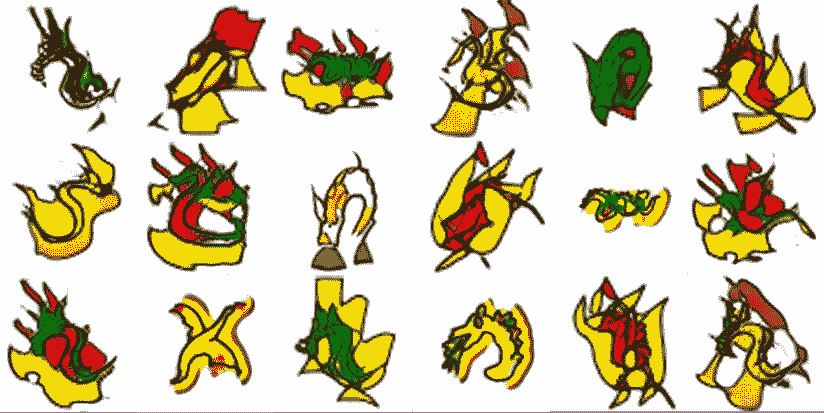
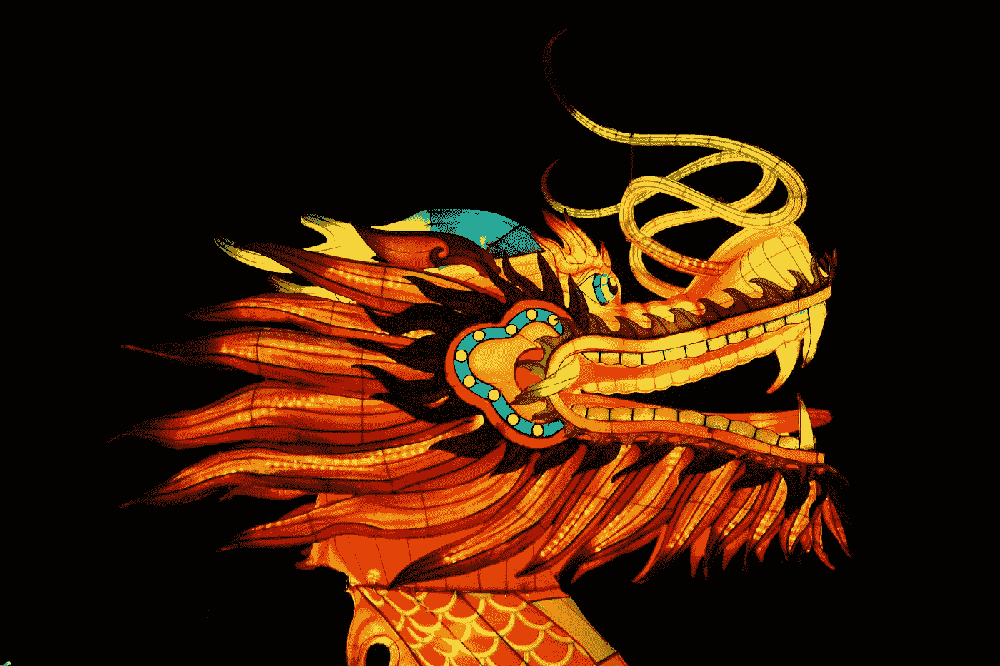
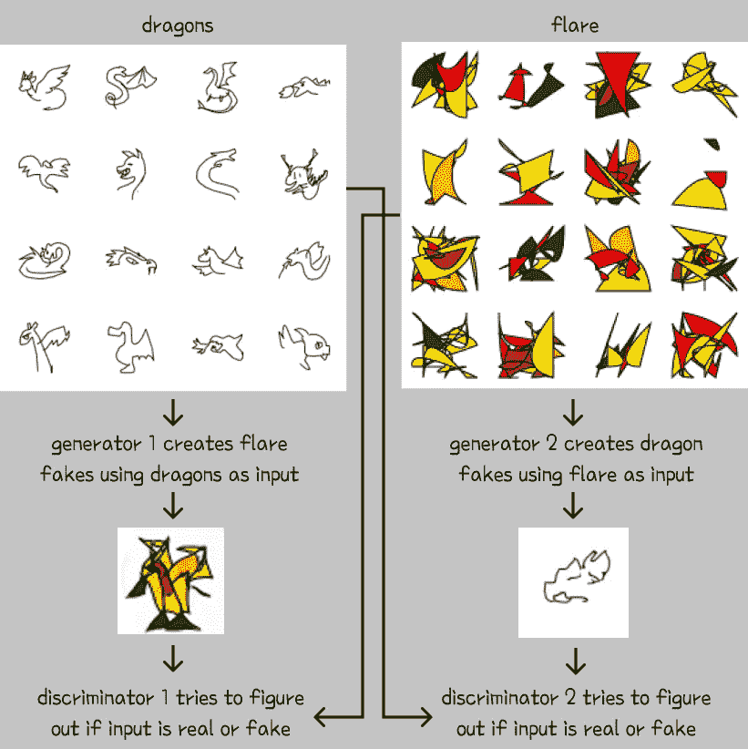
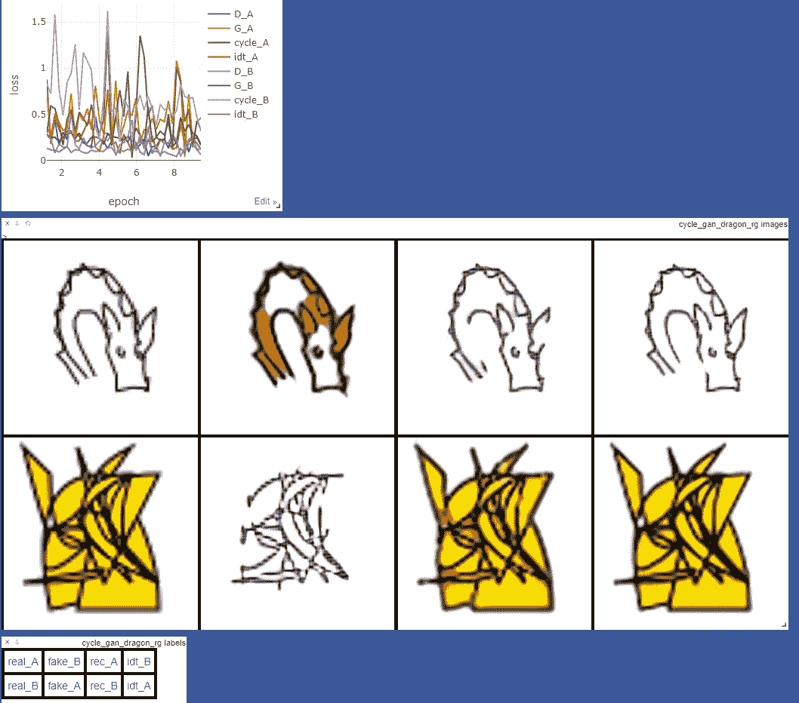
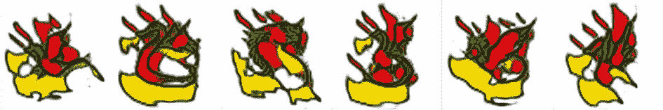
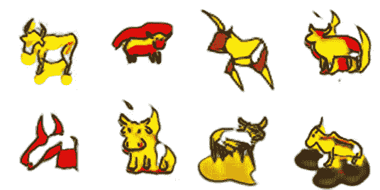
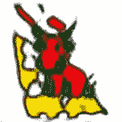

# 与 CycleGAN 一起庆祝农历新年

> 原文：<https://towardsdatascience.com/celebrating-chinese-new-year-with-cyclegan-d200ab235808?source=collection_archive---------51----------------------->

## 使用 CycleGAN 和 Google 的 QuickDraw 数据集创建喜庆的龙和牛



CycleGAN 龙输出(图片由作者提供)

2 月 12 日星期五标志着 2021 年农历新年的开始。在新年节日里，你会经常看到五彩缤纷的舞龙，祝庆祝者好运。为了庆祝 ML 风格，我使用 CycleGAN 生成了带有有趣的装饰闪光的龙(如上所示),我将在本文中描述实现步骤。也许这些 GAN 生成的龙也会带来好运！在粤语中，我们说“恭喜发财”，希望你在新的农历新年幸福和繁荣。我从不放过任何一个使用俗气双关语的机会，所以<https://machinelearningmastery.com/what-are-generative-adversarial-networks-gans/>****粮草肥菜！*🙈***

*CycleGAN [论文](https://arxiv.org/pdf/1703.10593.pdf)是由伯克利人工智能研究所的研究人员撰写的，他们也友好地发布了他们的[代码](https://github.com/junyanz/pytorch-CycleGAN-and-pix2pix)，使得这个模型的实现变得非常容易。他们的模型使用循环一致的对抗网络实现了不成对的图像到图像的翻译。在这项工作之前，图像到图像的转换需要在应用期望的图像转换之前和之后的成对图像的大数据集。例如，要创建夏季到冬季的照片翻译，您可能需要一个冬季和夏季完全相同的图像的大型数据集。使用 CycleGAN，您只需要一个夏季景观数据集 A 和一个冬季景观数据集 B，模型就会学习图像转换——非常令人印象深刻！详情请参考论文。*

## *实施循环*

**

*[Til Man](https://unsplash.com/@tlmn?utm_source=medium&utm_medium=referral) 在 [Unsplash](https://unsplash.com?utm_source=medium&utm_medium=referral) 上拍照*

*为了测试 CycleGAN，你只需要一个图像数据集 A 和数据集 B 以及一些高计算能力。我这个项目的目标是创造出红色、金色和绿色的喜庆龙，就像这里展示的这条龙。因此，我需要一个关于龙的数据集 A 和一个关于色彩鲜艳、响亮的数据集 B——或者在这种情况下，是炽热的*火焰*。*

*根据作者的说法，200 到 1000 张图像的数据集应该足以让 CycleGAN 进行训练，尽管如果你不介意长时间的训练，越多越好。对于龙来说，我使用了谷歌的 QuickDraw 数据集，其中包括来自他们主持的绘画游戏的众包草图。给定一个单词，玩家必须在 20 秒内画出它。他们已经将所有结果图作为开放数据集发布。我是 QuickDraw 的超级粉丝，因为它允许我们窥视世界上不同概念的集体视觉表现。时间限制迫使我们只专注于包含视觉上描述给定单词的最重要的细节，只给概念的本质留出时间。浏览许多龙的图画，我总是看到翅膀、爬行动物的尾巴和喷火——我想这是龙的本质。我对一些在 20 秒内完成的龙图印象深刻。对于我的数据，我为数据集 a 收集了大约 450 个龙的草图。然后，对于数据集 B，我创建了一个由 450 个随机形状和填充组成的数据集——如果你愿意，也可以称为随机耀斑。在下图中，我展示了 CycleGAN 如何使用我的数据集来学习图像翻译。*

**

*说明了 CycleGAN 内的 2 个 GAN。使用周期一致性损失来更新这两个 gan。(图片由作者提供)*

*一旦你克隆了作者的 Github，你需要在 datasets 下创建一个文件夹。在该文件夹中，创建“trainA”、“trainB”、“testA”和“testB”文件夹来存放您的数据。数据准备就绪后，您可以运行以下代码行，根据需要修改数据集位置和模型名称，以开始训练模型。*

```
*python train.py --dataroot ./datasets/sketch2festivedragon --name cycle_gan_dragon_rg --model cycle_gan*
```

*在 NVIDIA GeForce RTX 3090 上，使用批量大小 1(这是默认设置)，该模型使用大约 10GB 的 GPU 内存，训练(200 个 epochs)在 4 个多小时内完成。如果您使用作者的代码，我强烈建议您遵循他们的培训提示，并运行以下命令在本地图形 web 服务器上启动实时培训可视化。*

```
*python -m visdom.server*
```

**

*Visdom 培训可视化截图(图片由作者提供)*

*众所周知，训练 gan 非常困难，因为损失图很难解释，而且不一定与预期结果一致。相反，为了跟踪您想要的图像翻译的进度，可视化结果非常重要。如果您经常进行测试，您甚至可以在几个不同的时期看到许多不错的结果。默认情况下，实现代码每 5 个时期保存一次模型的权重。训练之后，您可以使用这些检查点权重中的任何一个来测试模型的输出。您所要做的就是运行下面的代码行，并修改数据集位置、模型名称和纪元编号。测试图像将保存在结果文件夹中。*

```
*python test.py --dataroot ./datasets/sketch2festivedragon --name cycle_gan_dragon_rg --model cycle_gan --epoch 35*
```

*看着每个时期的测试输出，我发现所有训练中都有可爱的装饰龙。当我在寻找艺术耀斑时，龙与耀斑数据集的完美相似并不太重要。接近训练结束时，龙开始看起来过于扭曲，这是有道理的，因为模型试图扭曲输入数据以匹配耀斑数据集。我收集了一些我最喜欢的照片，显示在本文开头的图片中，拍摄于几个不同的时代。我特别喜欢大约在第 35 纪元创作的龙，在那里模型的变形给龙的草图添加了炽热和微弱的色彩。以下是来自第 35 纪元的一些样本。*

**

*CycleGAN 从第 35 纪元产生了龙(图片由作者提供)*

*我还对网络如何很好地学会扭曲随机的彩色形状作为输入图像来形成龙一样的图画印象深刻。下面是网络在训练结束时画出的几个龙头样品。*

**

*网络创作的龙素描。左边是耀斑数据输入，右边是从 epoch 200 生成的龙草图(图片由作者提供)*

*由于 2021 年是牛年，没有几只喜庆的牛，我无法结束这篇文章。我收集了大约 170 幅类似牛的快速绘制牛图，并重复了我上面描述的步骤，以在这个新的迷你数据集上训练 CycleGAN。训练在大约 1 小时 40 分钟内完成。下面是我最喜欢的一些输出示例。*

**

*CycleGAN 输出节日公牛样本(图片由作者提供)*

*只是为了好玩，我很好奇在 dragon 数据集上训练的模型将如何在 ox 绘图输入上执行。下面是一个使用 epoch 35 龙砝码的样品——一个喷火砝码🐲+🐂*

**

*龙牛(图片由作者提供)*

*感谢您的阅读，再次感谢*甘喜肥菜*🐉*