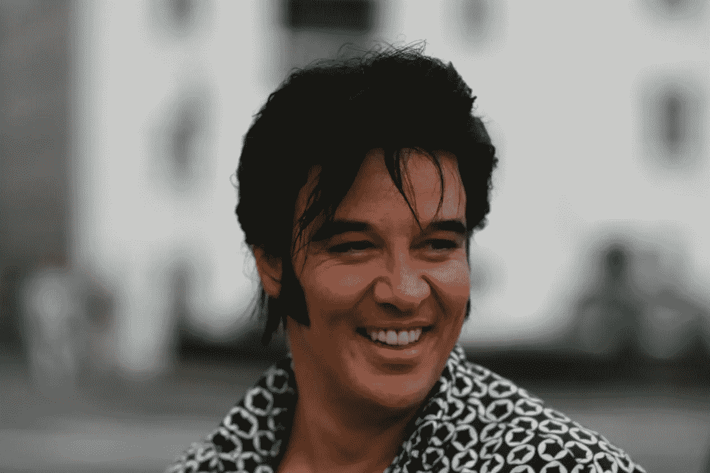
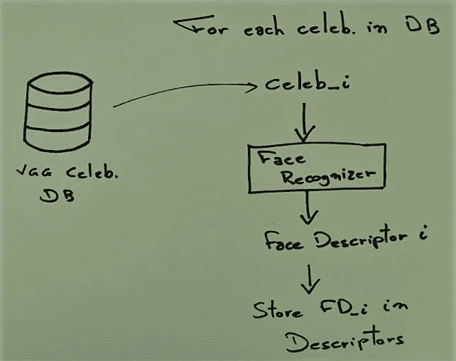
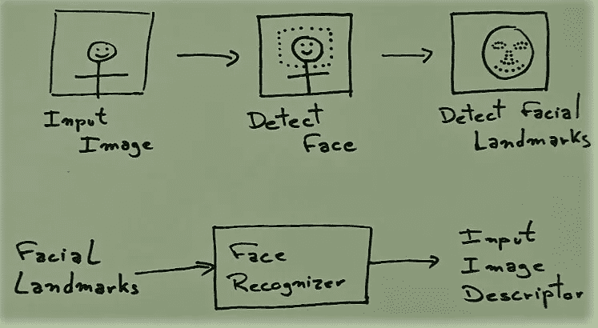
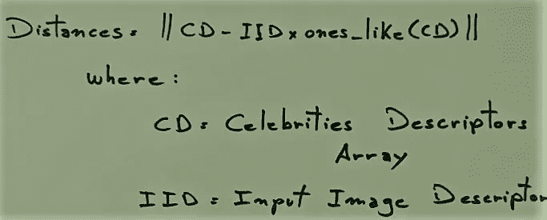
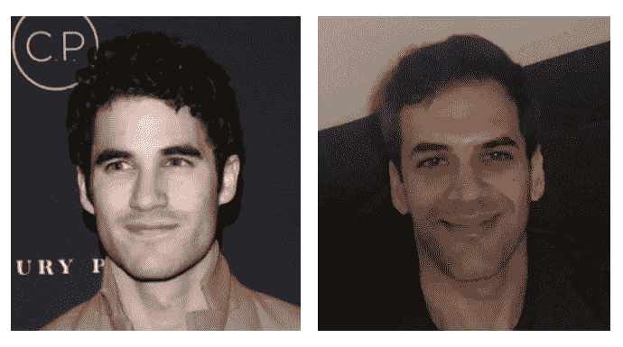
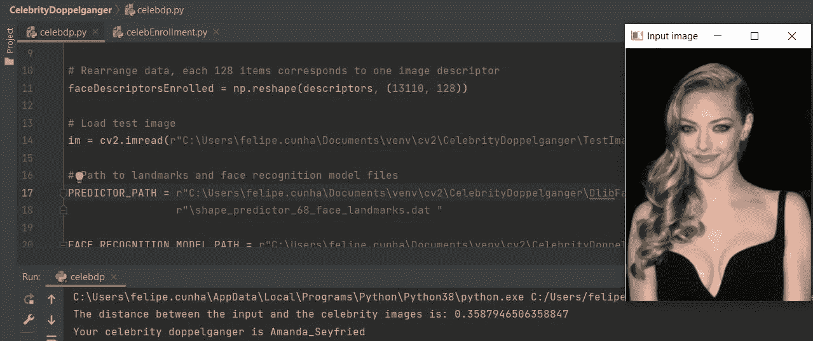
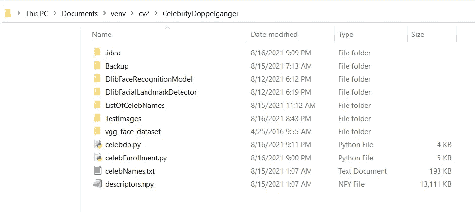

# 使用 VGG 人脸数据集、Dlib 和 OpenCV 的名人重身幽灵查找器

> 原文：<https://towardsdatascience.com/celebrity-doppelganger-finder-using-vgg-face-dataset-dlib-and-opencv-30ea1806200?source=collection_archive---------28----------------------->



杰尔·埃尔维斯在斯塔万格，欧洲最好的埃尔维斯模仿者— [*这张照片*](https://upload.wikimedia.org/wikipedia/commons/f/fa/Kjell_Elvis.jpg) *是由* [*贾勒滕*](https://commons.wikimedia.org/wiki/User:Jarvin) *拍摄的。*

在本文中，我们将探索如何创建一个程序，返回看起来最像输入图像的名人的名字。

这个应用程序很酷，因为你可以用类似的方法做很多事情，比如情绪检测或手势识别。

我们将使用的数据是 VGG 人脸数据集；你可以从这个链接下载它[https://www.robots.ox.ac.uk/~vgg/data/vgg_face/](https://www.robots.ox.ac.uk/~vgg/data/vgg_face/)【1】

该数据库包含 2622 个身份。每个身份都有一个文本文件，其中有几个指向其图像的链接。为了加快这个过程，我们将只使用每个身份的 5 张图片。

基本策略包括 2 个步骤:登记和推理。

## 注册

在注册步骤中，我们将面部标志检测应用于每个名人的 5 幅图像中的每一幅。面部标志点通过 Dlib 面部识别器。Dlib 模型将输出一个对每张脸都是唯一的响应，这个度量存储在一个 Numpy 数组描述符中。

VGG 数据集的一个优点是已经执行了人脸检测，每个 URL 都有一个左上角和一个右下角与之相关联的点。这是一个很大的帮助，因为人脸检测是耗时的。



招生基本图

我有坏消息和好消息要告诉你。坏消息是，2，622 个身份的 5 个图像是 13，110 个图像，所以做好准备——这将需要一段时间。我在周末运行了它，大约花了 6 个小时来处理数据集。

它如此缓慢的原因之一是因为你必须从一个网址打开图像。这大大减慢了这一过程，但使公众更容易获得数据集，因为作者不需要处理每张图像的版权规则。

好消息是你只需要做一次；运行注册程序后，描述符数组将保存为。npy 文件。

一旦我们有了名人描述符，我们就可以做推论了。

## 推理

在推断步骤中，检测输入图像的面部及其界标。然后，地标通过 Dlib 人脸识别器，该识别器将输出描述符。



推理基本图

我们剩下要做的就是计算输入图像描述符和数据集描述符之间的距离。



计算两幅图像之间的距离

就是这样，你的著名二重身是一个名人，他的描述符最小化了到输入图像描述符的距离。

下图是我的结果。



我和我的“二重身”达伦·克里斯编辑致谢:凯西·哈钦斯/Shutterstock.com

我对结果很满意，但我想确定它是否有效。所以，我用阿曼达·塞弗里德的照片测试了我的程序，的确，她看起来像她自己！



我的 cmd 剪影——阿曼达·塞弗里德看起来确实像她自己。特写闪光灯图片社/Shutterstock.com

请参见下面的实现:



我的项目目录

注册计划

推理程序

我希望你们发现这篇文章信息丰富。如果你有任何改进的建议或者有任何问题，请在评论中告诉我！

```
[1] O. M. Parkhi, A. Vedaldi, A. Zisserman
Deep Face Recognition
British Machine Vision Conference, 2015.
```