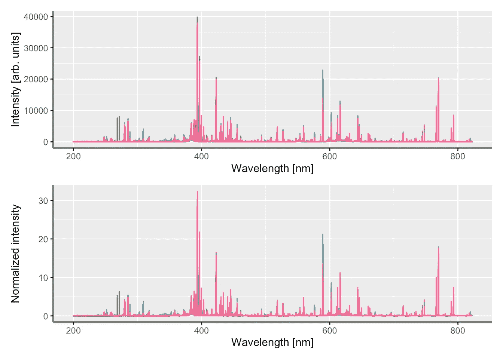
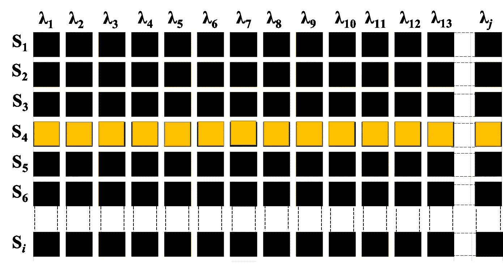
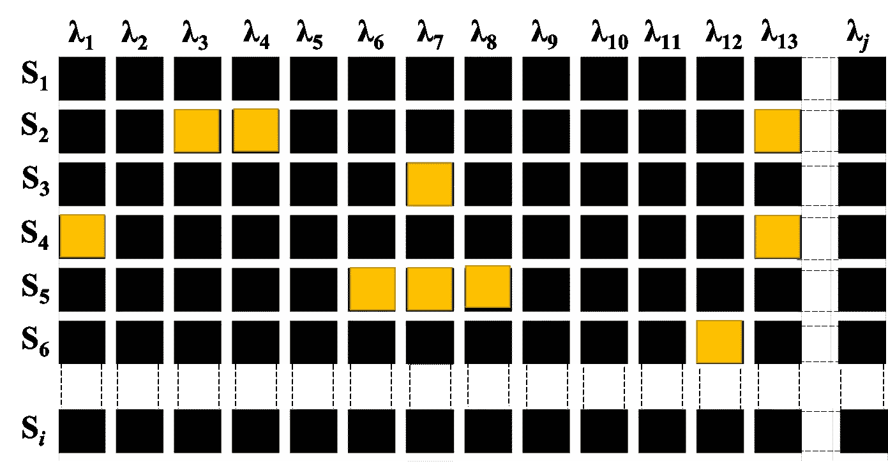
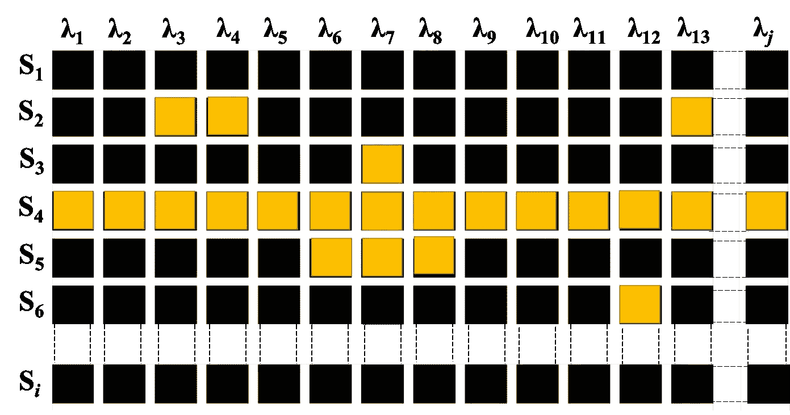
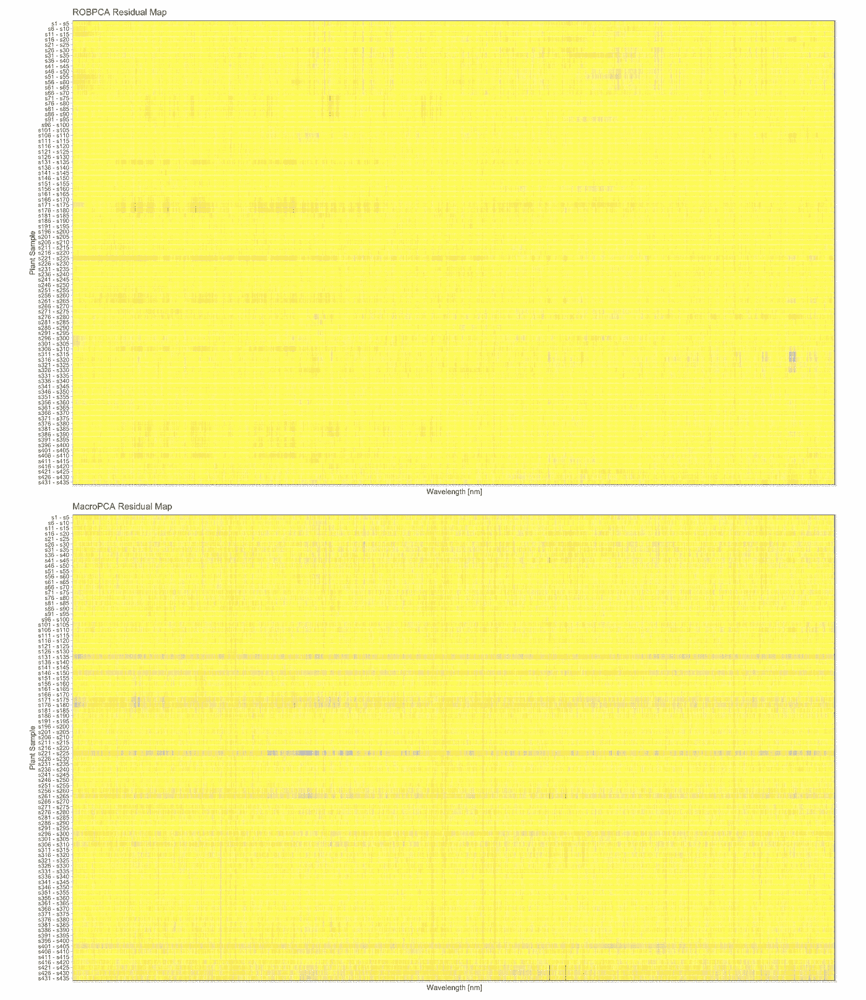

# 光发射光谱中的细胞孤立点检测:MacroPCA 综述

> 原文：<https://towardsdatascience.com/cellwise-outliers-detection-in-optical-emission-spectroscopy-an-overview-of-macropca-1535b392822e?source=collection_archive---------24----------------------->

## 行方向异常值检测是大多数光谱学家/化学计量学家处理不一致读数时采取的最常见措施。然而，MacroPCA 是在光谱分析中考虑细胞间异常值的替代方法。

图片由詹姆斯·惠勒拍摄。

在化学计量学中，多变量校准使用通常由矩形表格表示的数据，其中 *i* 行是通过光谱方法分析的样品(观察值)，而 *j* 列是由检测系统在一个波长范围内逐步增量记录的信号强度(预测变量)。多元校准旨在应用广泛的统计、机器学习和日益深入的学习方法，从记录的光谱数据中预测各种目标变量。然而，光谱学家和化学计量学家已经研究了一段时间的最紧迫的问题之一是开发用于光谱数据中异常值检测的稳健方法。这些数据通常是高维的(具有， *j≫* *i* )，这使得难以使用基于协方差矩阵的逆矩阵的异常值检测方法。基于投影寻踪和最小协方差行列式的鲁棒主成分分析(ROBPCA)就是为此而设计的。(在我之前的文章[中有更多关于这方面的内容，这里是](/multivariate-outlier-detection-in-high-dimensional-spectral-data-45878fd0ccb8)。)

像大多数异常值检测方法一样，ROBPCA 被开发来执行行异常值检测，即显著偏离大多数观察值的观察值。然而，近年来，随着离群点传播研究的进展( [Alqallaf 等人，2009](https://projecteuclid.org/journals/annals-of-statistics/volume-37/issue-1/Propagation-of-outliers-in-multivariate-data/10.1214/07-AOS588.full) )【开放获取】，细胞离群点检测在统计学和化学计量学中产生了越来越多的兴趣，因为它是行离群点检测的补充。事实上，可疑单元可以出现在数据矩阵中的任何地方，这提供了手头数据质量的更清晰的图像。在本文中，我们简要比较了两种稳健的基于 PCA 的方法，即 ROBPCA 和 MacroPCA，用于检测植物组织样品的激光诱导击穿光谱(LIBS)光谱中的异常值。

在 LIBS 分析之前，植物样品被清洗、干燥、均质化和研磨。记录的 LIBS 光谱已经标准化，以减少脉冲到脉冲的波动(图 1)。

**图 1:** 植物组织的原始 LIBS 光谱(上图)和归一化 LIBS 光谱(下图)。图片作者。

## 行离群点检测

如图 2 所示，当一个观察被标记为异常值(黄色)时，我们经常发现自己需要选择删除整行。但是，在多元校正中，除了将数据拟合到校正模型而不是将模型拟合到数据的意外结果之外，从数据集中移除多行的成本也很高。此外，移除几行会显著改变目标变量的分布，从而改变校准域。大多数行异常值检测的另一个问题是假设至少一半的行是无异常值的，这意味着标记为异常值的观察值的数量不应超过 *i* /2。

**图 2:** 一个观察被标记为异常值(黄色)。常规观察(黑色)。图片作者。

我们首先执行 ROBPCA 来检测数据集中的行异常值，这涉及到分数散点图以及相应的异常值图的可视化。在图 3 中，我们可以看到，我们的数据集仅包含有限数量的被视为不良杠杆作用点(即，高正交和分数距离)的 LIBS 光谱。

图 3:rob PCA 建模的结果。图片作者。

## 单元格异常值检测

在下面的图 4 中，通过采用不同的概念方法，单元式异常值检测特别令人感兴趣，因为它允许更仔细地观察外围单元(或列)，特别是在确定我们的高维光谱数据中的哪些波长变量对观察到的外围行为更负责时。

**图 4:** 标记为异常值的细胞(黄色)。常规细胞(黑色)。图片作者。

事实上，一种新的 PCA 方法结合了两种现有的稳健方法，即 DetectDeviatingCells([rousse uw 和 Van Den Bossche，2018](https://www.tandfonline.com/doi/pdf/10.1080/00401706.2017.1340909?needAccess=true) )[Open Access]和 ROBPCA ( [Hubert 等人，2005](https://www.tandfonline.com/doi/abs/10.1198/004017004000000563) )已被引入，以抵抗单元和行方向的异常值。该方法被命名为 MacroPCA。，2019)【Open Access】，代表 PCA 允许遗漏和 Cellwise & Rowwise 离群值(图 5)。

**图 5:** 考虑到缺失和单元方式&行方式异常值的 PCA(macro PCA)。图片作者。

## ROBPCA 和 MacroPCA 的比较

比较这两种方法的最佳方法是绘制它们各自的细胞图(图 6)。细胞图是对不寻常细胞的有力展示。更具体地说，非常大的像元值用红色表示，而非常小的像元值用蓝色表示。此外，单行上的大量异常细胞会污染整行，使观察结果被标记为异常值。这同样适用于列。(关于代码的更多细节，请点击[)。从图 6 中可以看出，除了强度与典型值相比不寻常的波长(列)之外，MacroPCA 还允许识别许多有问题的观察值(行)。](https://github.com/ChristianGoueguel/Cellwise-Outliers-Detection-in-Optical-Emission-Spectroscopy)

**图 6:** ROBPCA(上图)和 MacroPCA(下图)细胞图。图片作者。

# 摘要

正如本文开头所提到的，删除是大多数光谱学家用来处理行方向异常值的最常见操作之一。然而，正如我们所见，MacroPCA 等替代方法允许在光谱分析中同时考虑行方向和单元方向的异常值。除此之外，在大多数校准工作中，校准样本的数量通常是有限的，因此有另一种方法来处理异常值可以降低消除异常值的过度热情。