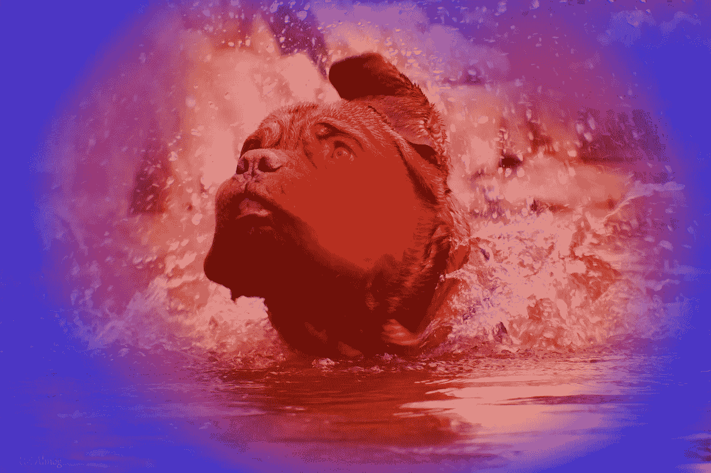
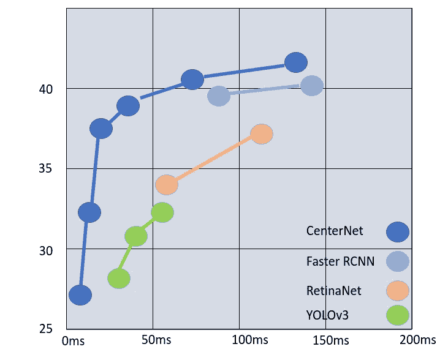
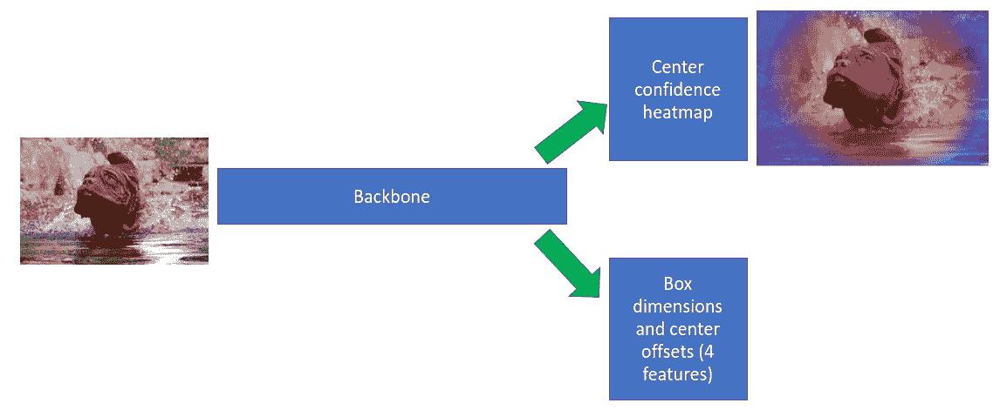
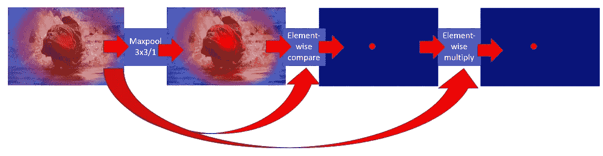

# 中心网，解释

> 原文：<https://towardsdatascience.com/centernet-explained-a7386f368962?source=collection_archive---------3----------------------->

## 是什么让 CenterNet 有别于其他对象检测体系结构

湿狗热图。来源:[尤里阿尔莫格摄影](https://www.facebook.com/uri.almog.photography/)

CenterNet 是一种无锚点对象检测架构。这种结构具有重要的优点，因为它在后处理中用更优雅的算法代替了经典的 NMS(非最大抑制)，这对于 CNN 流来说是自然的。这种机制能够实现更快的推理。参见图 1。

图一。COCO mAP 与不同模型的推理时间，由 CenterNet 作者测量。由 Uri Almog 创建的图像。

正如我在关于[物体检测](https://medium.com/swlh/object-detection-with-deep-learning-rcnn-anchors-non-maximum-suppression-ce5a83c7c62b?source=friends_link&sk=f364d88880502c32e2f5147a6d6ed982)的帖子中所描述的，大多数检测器使用多个(通常是 3 或 5 个)基本框或锚来编码它们的预测。输出要素地图中的每个空间像元预测几个盒子。每个框预测被编码为相对于单元格中心的 x 和 y 偏移，以及相对于相应锚点的宽度和高度偏移。完整的解释可以在我的 [YOLOv3](/yolo-v3-explained-ff5b850390f) 帖子中找到。

基于锚点的检测的问题是它会产生许多垃圾预测:例如，YOLOv3 为每幅图像预测了超过 7K 个盒子。然后，后处理块需要对重叠的预测进行成对检查，如果重叠很高(对于 COCO 测试集，通常 IoU > 0.7)，则预测被认为是指同一对象，并且具有较低置信度的预测被丢弃。这种方法有两个主要缺陷:

1.  其复杂性与预测数量的平方成正比——对于基于锚的高精度模型(使用高分辨率输入)来说尤其糟糕。
2.  它迫使网络在 NMS 之前解码所有预测，对大多数不相关的预测执行更多的时间和功率消耗操作。

论文[由周等人于 2019 年发表，以物为点](https://arxiv.org/pdf/1904.07850.pdf)探索了无锚点预测。在训练集准备阶段，他们在地面实况(GT)框中心绘制一个带有 delta 函数的地图。然后，他们使用高斯滤波器涂抹这些中心，生成一个平滑的分布，在对象中心达到峰值。然后，该模型使用两个预测头:一个训练来预测置信度热图，另一个训练，如在其他检测器中一样，来预测盒子尺寸和偏移的回归值，这是指由第一个训练头预测的盒子中心。参见图 2。

图二。中心网络热图预测。蓝色表示低置信度，红色表示高置信度，表示单元格包含一个方框中心。CenterNet 为每个类预测了一个单独的热图。由 Uri Almog 创建。图片来源:[乌里阿尔莫摄影](https://www.facebook.com/uri.almog.photography)

现在是最酷的部分:我们可以直接使用置信度热图来删除不相关的预测，而无需解码盒子，也不会破坏深层的 CNN 流程。参见图 3:

1.  在热图上运行 maxpool 3x3/1。这将提高每个细胞一点点，除了在非常高峰。在非常接近峰值的地方产生一个小的平坦区域。
2.  在 maxpool 输入和输出之间运行布尔元素比较。以 FP 值的形式返回值(0。或者 1。).这将创建一个新的热点图，其中除了值为 1 的局部最大值之外，所有位置都为 0(因为 maxpool 操作提升了每个值)。
3.  在阶段 2 的输出和最大池的输入之间运行元素级乘法。这将使每个局部最大值返回到其置信水平，将非最大值保留为 0。
4.  像在其他检测器中一样应用置信度阈值。
5.  仅解码对应于幸存最大值的框。

图 3。中心网 NMS 流量。图中显示了流程列表中的阶段 1-3。第二个热图在置信度峰值附近包含一个小而平坦的红色区域。所有其他值都略高于它们的原始值。这在元素式比较输出中产生一个奇点，然后通过元素式乘法将该奇点缩放回置信值。资料来源:Uri Almog。

作者使用 DLA34 和沙漏-101 主链测试了遵循上述机制的经典 NMS 的需要，并得出结论，影响很小(第一种情况下 0.7% mAP，第二种情况下 0%)。

这个检测框架已经被最初的作者和其他研究人员用于更多的检测任务，例如姿态估计和 3D 对象检测。带有 ResNet18 和 ResNet50 主干的训练过的检查点可以在 [GluonCV 模型动物园—检测](https://cv.gluon.ai/model_zoo/detection.html)下载。

# 结论

CenterNet 是一种深度检测架构，消除了对锚点和计算量大的 NMS 的需求。它基于这样的认识，即盒预测可以基于它们的中心位置而不是它们与对象的重叠来排序相关性。这种见解现在正被用于其他深度学习任务。

我的其他帖子:

[***什么是神经网络？***](https://medium.com/@urialmog/what-is-a-neural-network-dac400d5307d?source=friends_link&sk=764555affffd1bbb5f73e6f87d36ed58)

[***数学和人工智能***](https://medium.com/@urialmog/practical-problems-math-and-ai-c934a95bde28?source=friends_link&sk=bc78b0acc4786b7a251fd4986b01a16b)

<https://medium.com/@urialmog/practical-problems-math-and-ai-c934a95bde28?source=friends_link&sk=bc78b0acc4786b7a251fd4986b01a16b>

*[***训练神经网络简单解释***](https://medium.com/@urialmog/practical-problems-math-and-ai-c934a95bde28?source=friends_link&sk=bc78b0acc4786b7a251fd4986b01a16b)*

*[***深度学习的物体检测——RCNN、锚点、非最大抑制***](https://medium.com/swlh/object-detection-with-deep-learning-rcnn-anchors-non-maximum-suppression-ce5a83c7c62b?source=friends_link&sk=f364d88880502c32e2f5147a6d6ed982)*

*[***约洛夫 3 解释***](/yolo-v3-explained-ff5b850390f)*