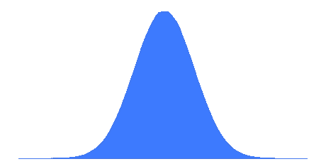
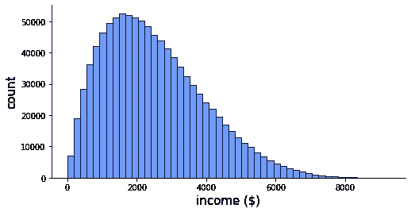
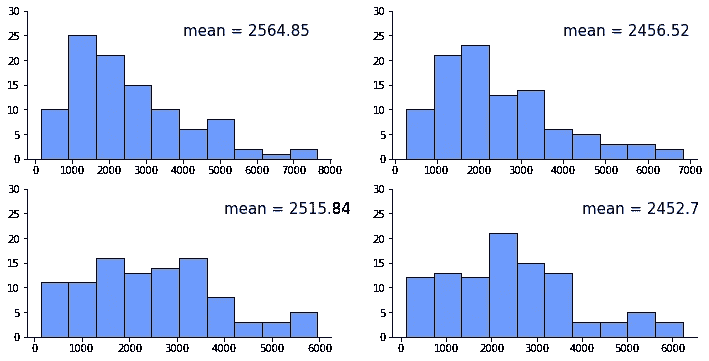
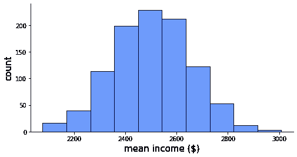
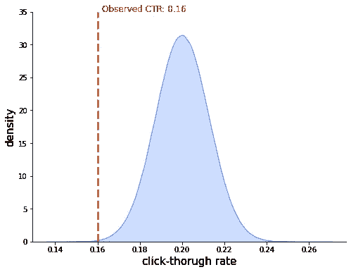

# 中心极限定理

> 原文：<https://towardsdatascience.com/central-limit-theorem-70b12a0a68d8?source=collection_archive---------21----------------------->

## 关于数据科学家统计推断基石的相关性。

正态分布。由作者生成。

每个 STATS101 课程都讲授中心极限定理，或称 CLT。介绍这一主题的典型方式是展示公式，讨论假设，并进行一些涉及正态密度函数的计算。缺少的是 CLT 与数据科学家日常工作的相关性。让我试着指出来。

## 人口、样本和抽样分布

要了解 CLT，必须熟悉总体、样本和抽样分布的概念。

总的来说，统计学就是得出对整个 T2 人口有效的结论。人口是我们感兴趣的一切。当我们进行选举投票时，人口可以是所有有权投票的人。当我们研究推动广告点击率的因素时，人群就是我们可能向其展示广告的所有人。

然而，通常我们没有全部人口的数据。想象一下在你的国家对*所有*公民进行民意调查，或者向目标群体中的*每个人*展示你的广告。通常，我们只有人口中某个子集的数据，称为**样本。这就是统计学的用武之地:它是一门仅基于样本得出关于人口的正确结论的科学。**

> 人口是我们感兴趣的一切。样本是我们有数据的总体的一个子集。

重要的是要认识到，如果我们可以有一个以上的样本，他们可能会略有不同。想想不同的民意测验专家。他们正在进行类似民意调查，但是每个人都询问了不同样本的个人的政治倾向。因此，每个民意测验专家预测的特定政党的投票率会略有不同。所有民意测验专家的结果形成了所谓的**抽样分布。**它反映了统计分析结果的不确定性，这种不确定性是由于我们只有一个来自总体的特定样本而产生的。如果我们有不同的样本，我们的结果可能会略有不同。

> 抽样分布反映了由于我们只有一个特定的数据样本而产生的结果的不确定性。

## 中心极限定理

进入 CLT。其内容如下:如果我们从总体中抽取许多样本，并计算每个样本的平均值，那么这些平均值在样本中的分布(即平均值的**采样分布)将是众所周知的正态分布，平均值与总体平均值相同，标准差等于总体标准差除以每个样本的观察次数。即使人口不是正态分布也是如此。**

> CLT:从多个样本计算出的平均值将形成一个具有已知平均值和标准偏差的正态分布。

让我们用一些数据来测试 CLT。考虑一下 100 万人的这种完全非正态的收入分布。这些人是我们关心的每一个人，我们的人口。

人口中的收入分配。由作者生成。

这个群体的平均收入是 2501 美元，标准差是 1444 美元。

现在，让我们从 1，000，000 人口中随机抽取 1000 个样本，每个样本 100 人，计算每个样本的平均收入。下面显示的是 1000 个样本中的前 4 个。

样本间的收入分布。由作者生成。

这 1000 人的平均收入分布是什么样的？几乎是正常的！

平均收入的抽样分布。由作者生成。

平均收入的抽样分布的平均值是 2502 美元，其标准偏差是 149 美元。顺便说一下，这些数字来自 CLT。根据定理，抽样分布的平均值应该与总体平均值相同(是 2501 美元——非常接近！)，而抽样分布的标准差，称为**标准差**，应该是总体标准差除以每个样本的观测值个数的平方根，这里:$1444 / √100 = 144(差不多！).如果我们采集更多的样本，得到的样本分布将更接近正态分布。

最后一句话:我们已经研究了平均值的抽样分布，但是总和的正态性也成立。这是因为平均值就是总和除以一个常数。

我们刚刚从经验上验证了 CLT 确实有效。但这有多大关系呢？

## CLT 与数据科学的相关性

你曾经拟合过线性回归模型吗？如果是这样，你依赖于 CLT。在回归模型中，目标取决于一个或多个特征加上附加误差项。我们假设这个误差项是正态分布的(相应地，在[贝叶斯方法](/the-gentlest-of-introductions-to-bayesian-data-analysis-74df448da25)中，我们将目标建模为正态分布的随机变量)。这种假设的正态性可以用 CLT 来证明:我们可以把误差看作是由忽略重要特征或随机性引起的许多独立误差的总和。这许多误差中的每一个都可以有任何分布，但是它们的总和在 CLT 看来是近似正态的。

> 回归模型中误差正态性的假设可以通过将误差视为许多独立误差之和的 CLT 来证明。

类似的逻辑可以用来解释为什么现实世界数据集中如此多的变量看起来是正态分布的。这并不是因为正态分布在自然界中以某种方式占优势，而是因为我们经常可以将单个测量值视为许多小效应的加权平均值。想想你的考试成绩，它是你的知识的函数，但也是你考试当天的感觉，你前一天晚上是否睡得好，以及考试中出现了材料的哪些部分。

> 真实世界的数据往往类似于正态分布，因为测量值通常可以被视为许多小效应的平均值。

最后但同样重要的是，CLT 是[假设检验](/the-hypothesis-testers-guide-75f7db2e4d0d)的基石。在经典的测试方法中，我们需要提出所谓的参考分布:一个在一些假设下已知的分布，称为零假设。这有时可能很难，但当我们可以利用 CLT 时就不会了！

考虑这个例子:一家专门从事广告重定向的公司吹嘘他们精确定位的广告平均获得 20%的点击率。你用它们进行 1000 次展示的试验，观察 160 次点击。是针对性不够好，还是运气不好，平均 20%还是合理的？

由于数据是二进制的(点击和未点击)，我们可以使用二项式分布对它们建模。如果关于 20% CTR 的说法是合理的，那么数据最好用平均值为 0.2 的二项式分布来描述。这个分布的标准差是 0.4(由于二项分布的标准差是√μ(1-μ)，这里μ是均值:这里√(0.2*0.8) = 0.4)。

> CLT 让我们很容易地推导出一些假设检验的参考分布。

因此，CLT 告诉我们，如果关于 20%点击率的说法是合理的，点击率的抽样分布将是正态分布，均值为 0.2，标准差为 0.4 / √1000 = 0.013。让我们将这一分布与我们在试点项目中观察到的 0.16 的 CTR 一起绘制出来。

CTR 与观测 CTR 的参考分布。由作者生成。

我们可以立即看到，如果关于 20% CTR 的说法是真的，我们观察到的 CTR 将是非常糟糕的运气。最有可能的是，该公司吹嘘得有点过头了！

查看我的[假设检验者指南](/the-hypothesis-testers-guide-75f7db2e4d0d)，看看如何量化这种厄运，形式化假设检验框架，并用它来避免做出愚蠢的决定。

感谢阅读！

如果你喜欢这篇文章，为什么不在我的新文章上 [**订阅电子邮件更新**](https://michaloleszak.medium.com/subscribe) ？而通过 [**成为媒介会员**](https://michaloleszak.medium.com/membership) ，就可以支持我的写作，获得其他作者和我自己的所有故事的无限访问权。

需要咨询？你可以问我任何事情，也可以在这里 为我预约 1:1 [**。**](http://hiretheauthor.com/michal)

也可以试试 [**我的其他文章**](https://michaloleszak.github.io/blog/) 中的一篇。不能选择？从这些中选择一个:

 [## 假设检验者指南

### 一篇简短的介绍为什么我们可以拒绝假说，但不能接受它们的入门书，有例子和图像。

towardsdatascience.com](/the-hypothesis-testers-guide-75f7db2e4d0d)  [## 数据测量级别

### 统计学家对变量类型、它们的意义以及对机器学习的影响的观点。

towardsdatascience.com](/data-measurement-levels-dfa9a4564176)  [## 蒙特卡洛辍学

### 用一个小技巧免费改善你的神经网络，获得模型不确定性估计作为奖励。

towardsdatascience.com](/monte-carlo-dropout-7fd52f8b6571)