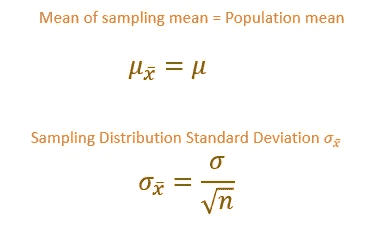

# 中心极限定理——解释清楚

> 原文：<https://towardsdatascience.com/central-limit-theorem-clearly-explained-4fe60def52d6?source=collection_archive---------23----------------------->

## 抽样分布，标准误差


来自[佩克斯](https://www.pexels.com/photo/person-standing-on-top-of-hill-705075/?utm_content=attributionCopyText&utm_medium=referral&utm_source=pexels)的阿奇·比纳米拉的照片

# 中心极限定理

中心极限定理是推断统计中的重要概念之一。推断统计学是指从样本中对总体进行推断。

当我们从总体中抽取一个随机样本并计算样本的平均值时，由于抽样波动，它可能与总体平均值不同。样本统计量和总体参数之间的变化称为**抽样误差**。

由于这种抽样误差，可能很难从样本统计中推断出总体参数。中心极限定理是推断统计学中的重要概念之一，它帮助我们从样本统计量中推断出总体参数。

让我们在本文中详细了解一下**中心极限定理**。

参考我的 [**推理统计**](https://medium.com/towards-artificial-intelligence/inferential-statistics-for-data-science-91cf4e0692b1) 的故事——了解概率和概率分布的基础知识

# 目录

1.  统计、参数
2.  抽样分布
3.  标准误差
4.  采样分布属性
5.  中心极限定理
6.  置信区间
7.  可视化采样分布

# 什么是统计和参数？

**统计** →代表样本特征的数值称为 ***统计*** 。

**参数** →代表人口特征的数值称为 ***参数*** 。(我们从人口统计中推断出的数值)

**统计量**→样本标准差 **S** ，样本均值 **X**

**参数**→总体标准差 **σ** ，总体均值 **μ**

我们从统计数据到参数进行推论。

# 抽样分布

**抽样** →指从总体中抽取有代表性的样本。

**抽样分布** →抽样分布是从总体中抽取的给定样本的样本统计的所有可能值的分布。

均值抽样分布是从总体中选取的给定样本量的样本均值分布。

## 抽样分布的步骤:

*   我们将从总体中随机抽取 **(s1，s2…sn)** 。
*   我们将计算样本的平均值 **(ms1，ms2，ms2…msn)。**
*   然后我们将计算抽样平均值。 **(ms)**

**ms=(ms1+ms2+…msn)/n**

***n→样本量。***

[现在我们已经计算了抽样平均值的平均值。接下来，我们必须计算抽样平均值的标准偏差]

# 标准误差

抽样分布中样本均值的可变性是标准误差。抽样分布的标准偏差称为平均值的标准误差。

**平均值的标准误差=总体的标准偏差/sqrt(n)**

***n-样本量***

[标准误差随着样本量的增加而减小。因此大样本有助于减少标准误差]

# **抽样分布属性。**

1.  抽样平均值等于总体平均值。

[当我们从人群中随机抽取许多样本时，这些差异就会相互抵消。因此，抽样平均值等于总体平均值]

2.抽样分布的标准差等于总体的标准差除以样本大小的平方根。



作者图片

# 中心极限定理

中心极限定理指出，即使总体分布不是正态分布，如果我们从总体中抽取足够大的样本，抽样分布也将是正态分布。[对于大多数分布，n>30 将给出一个接近正态的抽样分布]

抽样分布性质也适用于中心极限定理。

# 置信区间

我们可以说，通过使用置信区间，总体均值将位于某个范围之间。

置信区间是总体参数的取值范围。

**总体均值的置信区间=样本均值+(置信水平值)*均值的标准差**


Z →与置信度相关的 Z 分数。

**最常用的置信度**

99%置信水平→ Z 得分= **2.58**
95%置信水平→ Z 得分= **1.96** 90%置信水平→ Z 得分= **1.65**

# 使用 Python 和 Seaborn 的采样分布

**例如:**

1.  假设我们要计算一所学校所有学生的平均分数。

学生人数= 1000。

```
population1=np.random.randint(0,100,1000)
```

**2。检查人口分布**

```
sns.distplot(population1,hist=False)
```


人口分布

人口不是正态分布的。

**3。我们将从人口中随机抽取不到 30 人的样本。**

```
sample_means1=[]
for i in range(0,25):
 sample=np.random.choice(population1,size=20)
 sample_means1.append(np.mean(sample))sample_m1=np.array(sample_means1)
```

**4。采样分布**

```
sns.distplot(sample_means1,hist=False)
plt.title(“Sampling distribution of sample mean”)
plt.axvline(sample_m1.mean(),color=’green’,linestyle=’ — ‘)
plt.xlabel(“Sample Mean”)
```


抽样分布接近正态分布

**5。让我们检查一下抽样平均值和标准误差。**

```
print (“Sampling mean: “,round(sample_m1.mean(),2))
print (“Standard Error: “,round(sample_m1.std(),2))
#Output:
Sampling mean:  47.96
Standard Error:  6.39
```

标准误差= **6.39** 。让我们增加样本量，检查标准误差是否减小。

**6。取大于 30 的样本量，并计算取样平均值**

```
sample_means2=[]
for i in range(0,100):
 sample=np.random.choice(population1,size=50)
 sample_means2.append(np.mean(sample))sample_m2=np.array(sample_means2)
```

**7。采样分布**

```
sns.distplot(sample_means2,hist=False)
plt.title(“Sampling distribution of sample mean”)
plt.axvline(sample_m2.mean(),color=’green’,linestyle=’ — ‘)
plt.xlabel(“Sample Mean”)
```


抽样分布

现在抽样分布是正态的。

**8。计算抽样平均值和标准误差**

```
print (“Sampling mean: “,round(sample_m2.mean(),2))
print (“Standard Error: “,round(sample_m2.std(),2))# Output:
Sampling mean:  48.17
Standard Error:  3.89
```

增加样本量后，标准误差减小。现在标准误差是 3.89。

**9。让我们验证一下我们的人口平均数**

```
print (“Population Mean: “,round(population1.mean(),2))#Output:
Population Mean: 48.03
```

我们计算出抽样平均值为 **48.17** ，大约等于总体平均值 **48.03**

10。计算 99%置信水平的置信区间。

```
Lower_limit=sample_m2.mean()- (2.58 * (sample_m2.std()))
print (round(Lower_limit,2))
#Output: 38.14Upper_limit=sample_m2.mean()+ (2.58 * (sample_m2.std()))
print (round(Upper_limit),2)
#Output: 58.19
```

置信区间= **38.14 — 58.19**

# 结论

在本文中，我介绍了中心极限定理、抽样分布、标准误差和置信区间。希望你们都喜欢。

感谢阅读！

# 我的另一个关于统计学的博客。

<https://pub.towardsai.net/inferential-statistics-for-data-science-91cf4e0692b1>  <https://pub.towardsai.net/exploring-descriptive-statistics-using-pandas-and-seaborn-1b8501e1f27f>  <https://medium.com/analytics-vidhya/important-terms-in-statistics-machine-learning-4bfa5962e9be>  <https://pub.towardsai.net/hypothesis-testing-test-of-mean-variance-proportion-77ec2bfdd749>  

*请关注此空间，获取更多关于 Python 和数据科学的文章。如果你喜欢多看我的教程，就关注我的* [***中***](https://medium.com/@IndhumathyChelliah)[***LinkedIn***](https://www.linkedin.com/in/indhumathy-chelliah/)*[***推特***](https://twitter.com/IndhuChelliah) ***。****

**点击这里成为中等会员:*[*https://indhumathychelliah.medium.com/membership*](https://indhumathychelliah.medium.com/membership)*