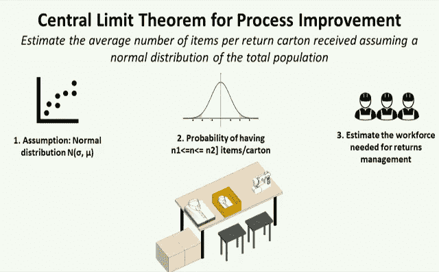
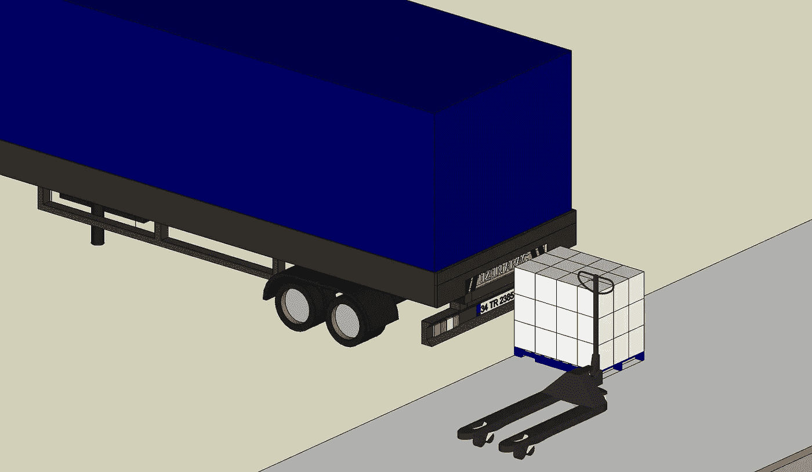
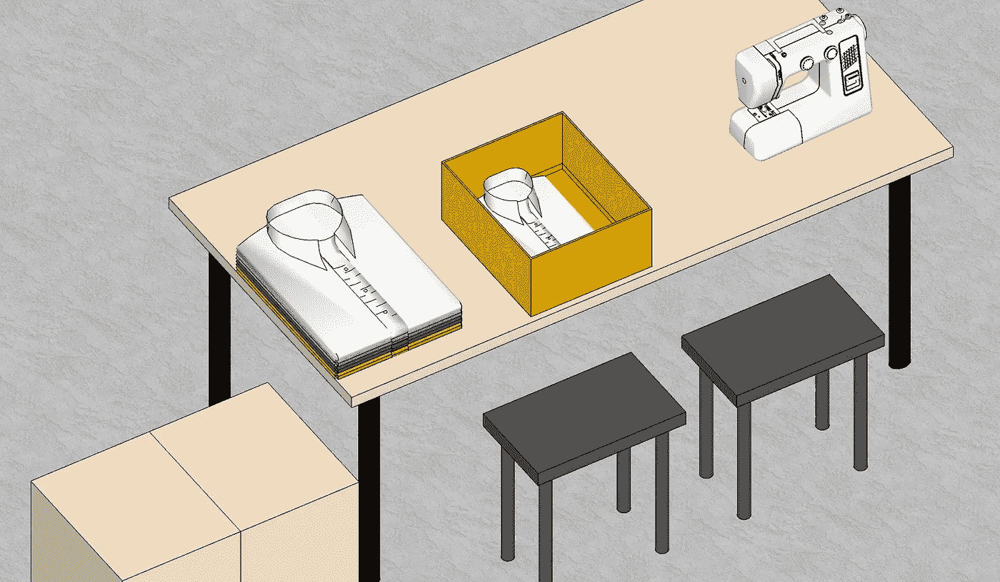
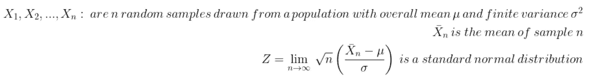
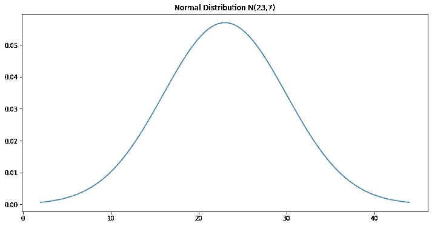
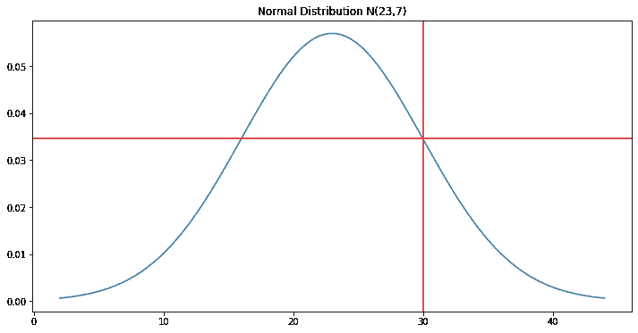
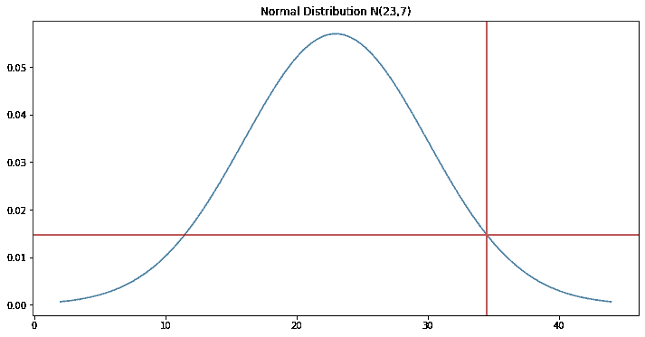

# 用 Python 实现过程改进的中心极限定理

> 原文：<https://towardsdatascience.com/central-limit-theorem-for-process-improvement-with-python-483126e33b07?source=collection_archive---------27----------------------->

## 估计退货管理的**工作量，假设**从商店收到的每箱**商品数量呈正态分布。**



中心极限定理框架—(图片由作者提供)

**退货管理**，通常被称为**逆向物流，**是从**你的配送中心**的零售点退回物品的管理。

在接收之后，产品被分类，组织，并检查质量。如果它们状况良好，这些产品可以在仓库中重新进货，并添加到库存计数中等待重新订购。

在本文中，我们将看到**中心极限定理**如何帮助我们基于历史记录的**平均值和标准偏差**使用**正态分布**来估计退货管理的**流程的**工作量**。**

💌新文章直接免费放入你的收件箱:[时事通讯](https://www.samirsaci.com/#/portal/signup)

```
**SUMMARY**
**I. Scenario
Problem Statement** As the Inbound Manager of a multinational clothing retail company you are in charge of workforce planning for returns management.
**Question** Can you estimate the probability to have less than 30 items per carton that you will receive every week?
**II. Central Limit Theorem** 1\. Definition2\. Application
3\. Probability to get <30 items per carton?4\. 95% probability to have less than k items per case? **III. Conclusion**
```

# 一.情景

## 问题陈述

你是一家跨国服装零售公司的入境经理，这家公司以男女老少的快速时尚服装而闻名。

你的一个主要问题是对退货流程的工作量缺乏了解。事实上，由于系统限制，您在收到商店退货之前不会收到提前发货通知(ASN)。

1.  **你用托盘接收从卡车上卸下的纸箱**



卸货区—(图片由作者提供)

**2。你打开箱子，检查退回的物品**



质检工作站—(图片由作者提供)

对于每件商品(衬衫、连衣裙……)，您的操作员需要执行:

*   质量检查，以确保产品可以重新进货
*   重新标记
*   重新包装

**您知道每个项目**的生产率，并且您希望根据您在一周内将收到的**个案例来估计**小时**的工作量。**

根据过去 24 个月的历史数据，您可以:

*   平均每箱 **23 件**
*   第 7 项**的标准差**

你的团队的规模通常是每个案例最多处理 **30 件物品**。如果超过这个阈值，你**需要雇用临时工来满足你的每日产能目标。**

## **问题**

> 你能估计出每周收到的每箱少于 30 件商品的概率吗？

[](http://samirsaci.com) [## 萨米尔·萨奇

### 数据科学博客，专注于仓储，运输，数据可视化和机器人流程自动化…

samirsaci.com](http://samirsaci.com) 

# 二。中心极限定理

> *你可以在这个 Github 库中找到完整的代码:* [*链接*](https://github.com/samirsaci/central-limit) *我的作品集与其他项目:* [*萨米尔萨奇*](https://samirsaci.com/)

中心极限定理被我的好朋友 Abdelkarim 定义为**‘数学中最美的定理’**，它建立了当我们添加独立的随机变量时，它们的归一化和趋向于正态分布，即使原始变量本身不是正态分布。

## 1.定义

为了简化理解，让我们介绍一些符号:


符号—(作者提供的图片)

在我们的例子中，总数量是从商店收到的纸箱的整个范围，平均每箱 **= 23 件**，标准差 **σ =每箱 7 件。**

如果你取 n 个纸箱样品 X *n* (例如一个样品可以是某一天收到的一批纸箱)，我们有:



方程式—(图片由作者提供)

换句话说，这意味着如果我们使用 n 个样本随机测量每箱商品的数量，并且我们假设观察值**独立且同分布(即同分布)**，样本平均值的概率分布将**接近正态分布**。

*注意:为了确保我们有独立且同分布的观察结果，我们假设样本是基于来自所有商店的退货批次构建的，范围覆盖 100%的有效 SKU。*

## 2.应用

然后，可以假设平均件数/箱遵循正态分布，平均每箱 **23 件**和 7 箱**标准偏差。**



人口正态分布—(图片由作者提供)

> 每箱少 30 件的概率是多少？

## 3.获得<30 items per carton?

```
Probability to have less than 30 items/carton is **84.13%**
```



Population Normal Distribution — (Image by Author)

**代码**的概率

## 4.每箱少于 k 件商品的概率为 95%?

您的 KPI 目标是至少 95%的退货在同一天得到处理。

为了处理 95%的预期工作负载，您需要假设多少项来评估您的团队？

```
We have 95% of probability that X <= **34.51 items/carton**
```



人口正态分布—(图片由作者提供)

如果你根据 35 件/箱来确定你的团队规模，你将平均达到目标的 95%。

# 三。结论

*关注我的 medium，了解更多与供应链数据科学相关的见解。*

这种方法让你有可能根据强大的统计工具支持的假设来确定你的团队规模。

这种分析可以每年进行几次，尤其是在业务不断发展的情况下(更高数量的收藏、电子商务或新店开业)。

# 关于我

让我们连接上 [Linkedin](https://www.linkedin.com/in/samir-saci/) 和 [Twitter](https://twitter.com/Samir_Saci_) ，我是一名供应链工程师，正在使用数据分析来改善物流运作和降低成本。

如果你对数据分析和供应链感兴趣，可以看看我的网站

[](https://samirsaci.com) [## Samir Saci |数据科学与生产力

### 专注于数据科学、个人生产力、自动化、运筹学和可持续发展的技术博客

samirsaci.com](https://samirsaci.com) 

# 参考

[1]使用 Python、Samir Saci、[链接](/optimize-workforce-planning-using-linear-programming-with-python-47a0b5f89a6f)的线性规划优化劳动力规划