# 宫颈癌的预测和概率分析(R)

> 原文：<https://towardsdatascience.com/cervical-cancer-prediction-and-boruta-analysis-r-7214282ea1f8?source=collection_archive---------31----------------------->

> 通过使用 Boruta 特征工程和分类预测模型了解导致宫颈癌的因素来庆祝妇女历史月

宫颈癌(图片由 Unsplash 上的[国家癌症研究所](https://unsplash.com/@nci)提供

## **简介**

由于“女性历史月”即将结束，我想借此机会庆祝一下这个至今仍威胁着许多女性的健康问题。在美国，每年发现 11，000 例新的浸润性宫颈癌病例。尽管新病例的数量在过去十年中呈下降趋势，但它仍然在美国杀死了大约 4000 名妇女，在全球杀死了 30 万名妇女。 [(Fontham et al .，2020)](https://doi.org/10.3322/caac.21628) 越早发现，生存的机会就越大。因此，为了有效地消除这类疾病，我们需要创建一种机器学习算法，能够尽快检测出癌症。因此，对于期末项目，我将分析数据集:来自 UCI 的宫颈癌(风险因素)。[(“UCI 机器学习知识库:宫颈癌(风险因素)数据集”，2017)](https://archive.ics.uci.edu/ml/datasets/Cervical+cancer+%28Risk+Factors%29) 该数据集是在委内瑞拉加拉加斯的“加拉加斯大学医院”收集的。我计划混合使用 EDA、Boruta 的特性重要性分析和分类预测模型

## **数据准备**

我们将通过加载必要的库和读取数据集来开始我们的项目。我们将使用 8 个库，1 个用于可视化，3 个用于数据操作，1 个用于特征重要性分析，3 个用于预测模型。

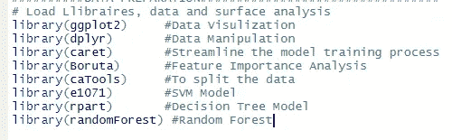

(图片由作者提供)

宫颈癌有 858 个输入，36 个变量，从人口统计信息、习惯到历史医疗记录。一些变量有缺失数据，因为患者出于隐私考虑拒绝回答。值得注意的是，许多变量被解释为由“？”引起的因素填充为缺失值的占位符

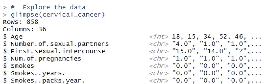

(图片由作者提供)

因此，在继续之前，我将检查数据的完整性，因为它可以隐藏我们正在寻找的实际汇总统计数据。有许多函数可以指示缺失值，如 NAs、零、负值或空白字符串，因此创建一个专门处理 NAs 的函数，然后绘制数据的完整性(无缺失)会更容易

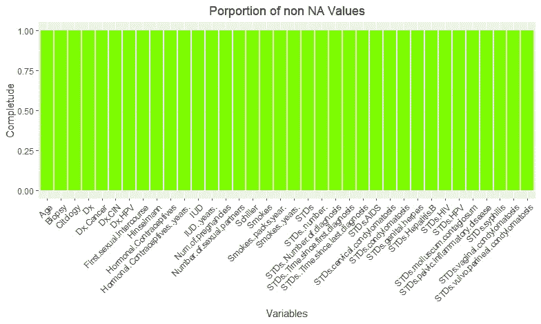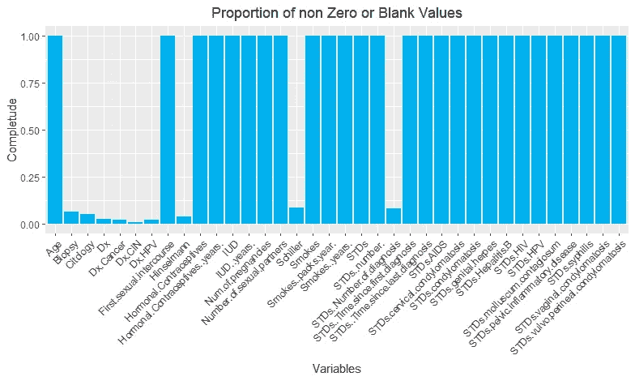

(图片由作者提供)

## **数据操作**

在我们对数据有了更好的了解之后，更好的做法是处理缺失的值，以便进行更深入的探索性数据分析。首先，我们创建一个函数来标识所有需要修复的列，然后创建一个函数来修复丢失的值。x="-1 "的原因是允许在“？”之后对它们执行数值运算导致它们都成为因素。“-1”也是一个很好的占位符，因为它清楚地表明该输入中存在某些内容。然后，我们将这两个函数应用到列上，稍后我们可以建立一个表示宫颈癌的属性。

此外，我们还创建了一个相关图来剔除不重要的变量。之后，我们需要切断小于 0.7 的任何组合的相关性。最终的结果将会是这样的，表明一般来说，这些创建了高度相关的变量组合。

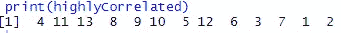

(图片由作者提供)

最后四栏(“Hinselmann”、“Schiller”、“细胞学”、“活组织检查”)表示子宫颈检查的结果。阳性结果并不意味着患者患有宫颈癌，但患者接受的阳性越多，这种可能性就越大。因此，我将根据以下公式创建一个名为“宫颈癌”的变量:

> **宫颈癌= Hinselman + Schiller + Citology +活检**

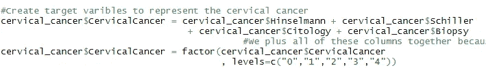

(图片由作者提供)

## 探索性数据分析

在创建“宫颈癌”列后，我们可以看到大约 90%的患者没有任何症状，只有 1%的患者通过显示所有 4 种症状实际上显示了严重的情况。

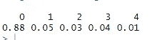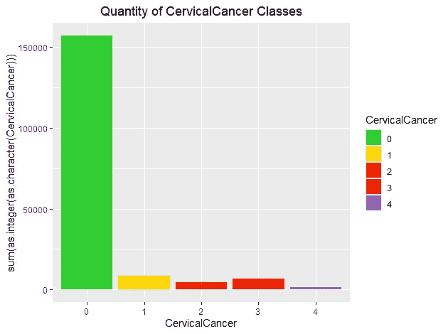

(图片由作者提供)

在创建“宫颈癌”列后，我们可以看到大约 90%的患者没有任何症状，只有 1%的患者通过显示所有 4 种症状实际上显示了严重的情况。

因此，我们可以说，预测每个人都不会患癌症的基线模型的准确度将有 88%的高准确度

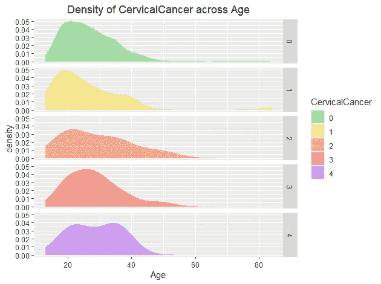

(图片由作者提供)

当我们观察密度图中患者的年龄时，每个密度图中的峰值都明显变得荒凉，表明“年龄”和“子宫颈癌”之间的相关性很强

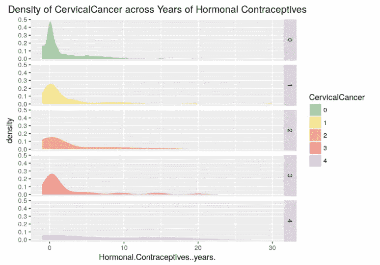

(图片由作者提供)

此外，当观察“激素避孕年”和“宫颈癌”时，也有峰高度降低，密度图的右偏度也表明有很强的相关性。虽然我们有可能对它们中的每一个都这样做，但更好的办法是采用一种更快的方法来找到对像 Boruta 这样的“宫颈癌”影响最大的特征

## **用 Boruta 进行特征重要性分析**

Boruta 方法通过对预测值进行混洗，并将它们与原始预测值连接起来，并在合并的数据集上构建随机森林，来评估特征的重要性。之后，我们将原始变量与随机化变量进行比较，以衡量它们的重要性，并选择重要性比随机化变量高的变量。*。* [(Deepanshu Bhalla，2017)](https://www.listendata.com/2017/05/feature-selection-boruta-package.html) 人们通常认为 Robuta 优于 R 中其他特征选择包，这要归功于它的各种优势:

> 适用于分类和回归分析，因为它考虑了多变量关系
> 
> 对随机森林变量重要性度量的增强，可以处理变量之间的相互作用以及改变随机森林重要性度量的性质

在本练习中，Boruto 流程从创建原始数据集的副本开始，但是删除了医疗结果列。然后我们设置种子，使用 Boruta()函数。情节如下

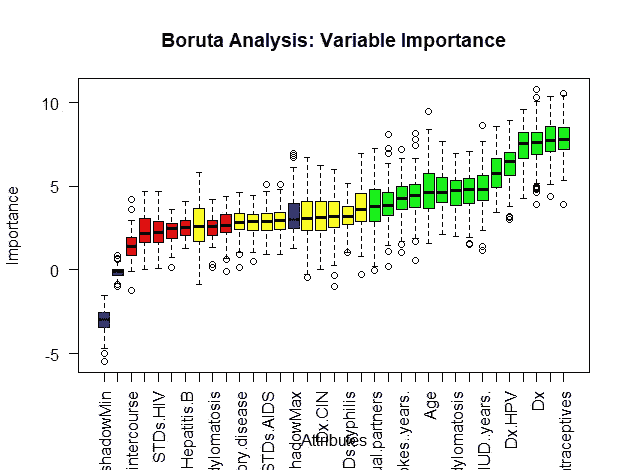

(图片由作者提供)

我们确认了 15 个，排除了 7 个，还有 10 个是暂定的。

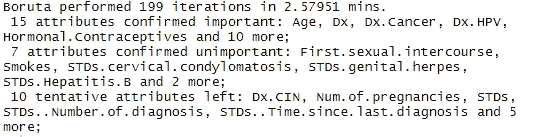

(图片由作者提供)

这是被证实对因变量有影响的变量

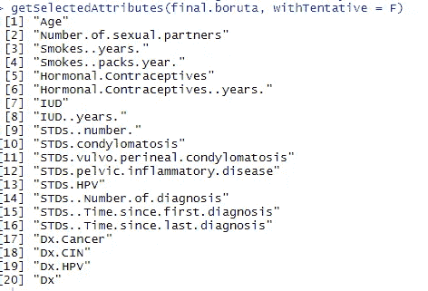

(图片由作者提供)

从 Boruta 导出的最终结果的数据帧可以在 R 文件中找到

## **预测模型**

我们将创建一个新变量“C _ 宫颈癌”,包含所有上述“已确认”变量和“宫颈癌”。对于癌症的可能性，我们将这些值指定为是或否。由于这是一种非常关键的癌症类型，并且是针对一小部分潜在癌症患者的，因此我们最好认真对待所有症状(1-4 ),而不是遗漏任何症状，并给它们分配 1，其余的为 0。然后，我们将目标特征编码为因子，并将数据集分成 0.75/0.25 比率的训练集和测试集进行预测。

***支持向量机***

支持向量机(SVM)的目标是在 N 维空间中找到一个超平面(N-明确分类数据点的特征的数量。有许多可能的超平面来对它们进行分类，但是我们想要找到一个具有最大余量(两个类的数据点之间的距离)的平面。一旦实现，未来的数据点可以更有把握地执行强化和分类，如下图所示。[(罗希特·甘地，2018)](/support-vector-machine-introduction-to-machine-learning-algorithms-934a444fca47) 。在这个项目中，我们选择类型为“C-分类”,内核为“线性”

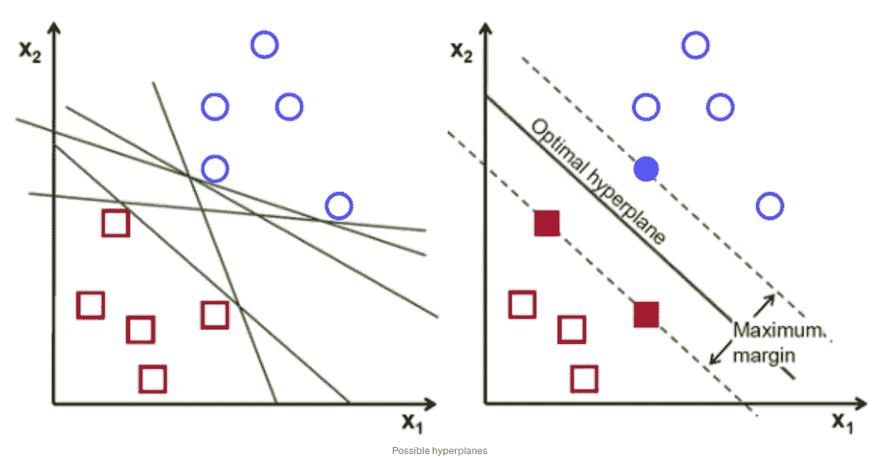

(来源:[https://towards data science . com/support-vector-machine-vs-logistic-regression-94cc 2975433 f](/support-vector-machine-vs-logistic-regression-94cc2975433f))

***决策树***

*决策树模型通过将输入分解成更小的决策来做出判断。决策树的优势在于它的过程具有可理解的规则，并执行分类任务，而不管计算能力如何。它对连续变量和分类变量都很有效，为研究者提供了一个清晰的指示，表明哪些自变量是必不可少的。无论如何，不建议过于频繁地使用连续属性，这可能会产生错误，有时甚至在少量的训练样本上也会耗费精力。决策树用于动物图片分类等任务。*

*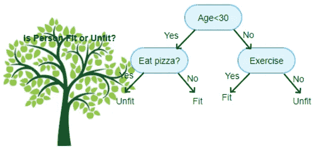*

*(来源:[https://www . aitime journal . com/@ AK shay . chavan/a-comprehensive-guide-to-decision-tree-learning](https://www.aitimejournal.com/@akshay.chavan/a-comprehensive-guide-to-decision-tree-learning))*

****随机森林****

*这是决策树的高级版本，除了提出的问题，包括一些随机性。该算法通过“装袋法”创建了一个“森林”，即迷你决策树的集合。然后将所有的树合并在一起，以获得更准确和稳定的预测。不幸的是，随机森林在处理有噪声的数据时经常会过拟合。[(基里尔·富克斯，2017)](https://medium.com/fuzz/machine-learning-classification-models-3040f71e2529) 。在这个项目中，我们选择的树木数量是 500 棵*

****车型对比与精度对比与召回权衡****

*运行完所有模型后，我们可以构建如下混淆矩阵表。*

*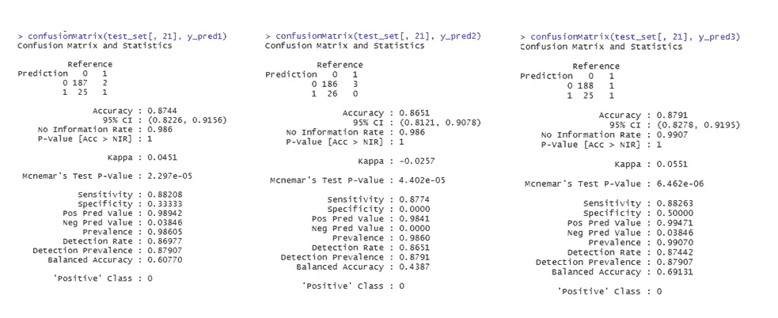*

*(图片由作者提供)*

*我们将使用精确度和召回率作为模型性能评估的指标。精度(特异性)是关于确保模型的准确性，指示在检索的例子中相关例子的分数。另一方面，回忆(敏感度)是关于模型获得正确实例的能力。精确度和召回率的范围从 0 到 1，越高越好。值得注意的是，这里有一个权衡，意味着当精度上升时，召回失败，反之亦然。研究人员经常使用像 F1 分数这样的抽象指标来做出决定，F1 分数是两者的结合。然而，在识别宫颈癌患者这样的危险情况下，回忆比精确更重要，因为错误治疗的成本可能很高，但没有错误错过潜在癌症患者的机会成本高。幸运的是，我会选择随机森林方法，因为与其他方法相比，它具有最高的召回率(0.8826)和精确率(0.5)。[(塞缪尔·希利斯&莎拉·霍曼，2016)](https://medium.com/opex-analytics/why-you-need-to-understand-the-trade-off-between-precision-and-recall-525a33919942) 。最后但同样重要的是，虽然我很想通过 GridSearch 和 K Folds 交叉验证来提高这个模型的准确性，但我不认为这是一个好主意，因为它是一个非常小的数据集，我们可能会过度拟合。*

## ***结论***

*总之，宫颈癌是最威胁生命的疾病之一，每年导致数千人死亡。但是实现上面这样的随机森林方法，相信以后可以拯救很多人。*

*— — —*

***Github:**[https://Github . com/lukastuong 123/R-Studio/tree/master/Project-% 20 宫颈% 20 癌% 20 检测](https://github.com/Lukastuong123/R-Studio/tree/master/Project-%20Cervical%20Cancer%20Detection)*

***参考资料和资源:***

***Deepanshu Bhalla。** (2017 年 8 月 5 日)。特征选择:用 Boruta 包选择重要变量。2021 年 2 月 22 日检索，来自[https://www . listen data . com/2017/05/feature-selection-boruta-package . html](https://www.listendata.com/2017/05/feature-selection-boruta-package.html)*

***丰瑟姆，E. T. H .，沃尔夫，A. M. D .，丘奇，T. R .，埃齐奥尼，r .，弗劳尔斯，C. R .，赫齐格，a .，…史密斯，R. A.** (2020)。平均风险个体宫颈癌筛查:美国癌症协会 2020 年指南更新。 *CA:临床医生的癌症杂志*， *70* (5)，321–346。[https://doi.org/10.3322/caac.21628](https://doi.org/10.3322/caac.21628)*

***基里尔·富克斯。** (2017)。机器学习:分类模型。2021 年 2 月 22 日检索，来自[https://medium . com/fuzz/machine-learning-classification-models-3040 f71e 2529](https://medium.com/fuzz/machine-learning-classification-models-3040f71e2529)*

***甘地。** (2018 年 6 月 7 日)。支持向量机-机器学习算法介绍。检索于 2021 年 2 月 22 日，来自[https://towardsdatascience . com/support-vector-machine-introduction-to-machine-learning-algorithms-934 a 444 FCA 47](/support-vector-machine-introduction-to-machine-learning-algorithms-934a444fca47)*

*塞缪尔·希利斯，莎拉·霍曼。 (2016 年 1 月 16 日)。理解权衡。检索于 2021 年 2 月 22 日，来自[https://medium . com/OPEX-analytics/why-you-need-to-understand-the trade-off-of-precision-and-recall-525 a 33919942](https://medium.com/opex-analytics/why-you-need-to-understand-the-trade-off-between-precision-and-recall-525a33919942)*

*— — —*

***数据集:UCI 机器学习知识库:宫颈癌(风险因素)数据集。** (2017)。检索于 2021 年 2 月 22 日，来自[https://archive . ics . UCI . edu/ml/datasets/子宫颈+癌症+% 28 风险+因素%29](https://archive.ics.uci.edu/ml/datasets/Cervical+cancer+%28Risk+Factors%29)*

***灵感来源:**[https://www . ka ggle . com/divyabongouni/key-宫颈癌-预测-与-boruta](https://www.kaggle.com/divyabongouni/key-cervical-cancer-predictions-with-boruta)*