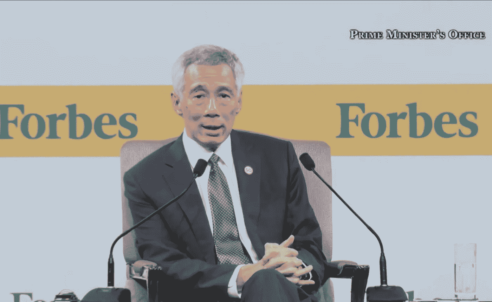

# Wav2Vec2 和变压器的“链式链接”NLP 任务

> 原文：<https://towardsdatascience.com/chain-linking-nlp-tasks-with-wav2vec2-transformers-7297181db3a7?source=collection_archive---------19----------------------->

## 从音频直接进入一系列基于文本的自然语言处理任务，如翻译、摘要和情感分析

图表:蔡钦汉

拥抱脸的变形金刚库中增加了 [Wav2Vec2](https://huggingface.co/transformers/model_doc/wav2vec2.html) 模型，这是近几个月来 NLP 中更令人兴奋的发展之一。在那之前，如果你只有一个很长的音频片段，执行机器翻译或情感分析等任务并不容易。

但现在你可以一气呵成地将 NLP 任务的有趣组合联系起来:用 Wav2Vec2 转录音频片段，然后使用各种 transformer 模型来总结或翻译转录本。你能联系起来的 NLP 任务的可能排列和组合是相当令人难以置信的。

当然，结果可能是不完整的。一些 NLP 任务，比如总结，本质上是很难解决的。

这篇文章是我之前的[关于 Wav2Vec2 试验](/transcribing-poetry-and-speeches-with-wav2vec2-2658c6510f06)的后续，将概述 2 个试验:

*   **#1:语音转文本转翻译&情感分析**
*   **#2:语音转文本转摘要**

# 回购、要求和参考

试用所需的笔记本和音频文件在我的 [repo](https://github.com/chuachinhon/wav2vec2_transformers) 里。此外，您还需要这些来运行笔记本电脑:

*   [变压器≥ 4.3](https://pypi.org/project/transformers/)
*   [Librosa](https://pypi.org/project/librosa/) (管理音频文件)

通过 Github 上[拥抱脸的机器学习工程师弗拉达利·吉克](https://github.com/huggingface/transformers/issues/10366)的帖子，大多数笔记本中的代码已经更新，以使用更好的方法来转录长音频文件。

在我早期的工作中，我使用 [Audacity](https://www.audacityteam.org/) 手动将长音频剪辑分割成更小、更易管理的片段(长度超过 90 秒的音频剪辑往往会导致本地机器和 Colab 崩溃)。弗拉达利的代码通过使用 Librosa 将长音频剪辑转换成较短的固定“块”来消除这一步骤。

在 Hugging Face 的 model hub 上有几个版本的 Wav2Vec2 模型。在这篇文章中，我将使用[wav2 vec 2-large-960h-lv60-self](https://huggingface.co/facebook/wav2vec2-large-960h-lv60-self)型号。

# 试验#1:转录+翻译+情感分析

通过[美国消费者新闻与商业频道电视台的 YouTube](https://www.youtube.com/watch?v=sZBquj94CGU) 频道在右边截屏

对于这次试验，我选择了美国总统乔·拜登在 2021 年 3 月 11/12 日(取决于你在哪个时区)的[第一次黄金时间演讲](https://www.youtube.com/watch?v=JYBatFW-BP4)。

他的演讲大约有 24 分钟长，我通过 25 秒的组块将它传输到 Wav2Vec2。你可以选择更长或更短的块。我发现 25 可以给出不错的结果。详细情况在我的回购中的 [notebook3.0](https://github.com/chuachinhon/wav2vec2_transformers/blob/main/notebooks/3.0_transcribe_translate_sentiment_analysis.ipynb) 里，这里不再赘述。

演讲很复杂，众所周知，拜登一直在与口吃作斗争。剧本(直接下载[这里](https://www.dropbox.com/s/aybqx2jex5cg202/biden_alt.txt?dl=0))的某些部分相当粗糙，尤其是接近结尾的部分:

点击此处下载原始 Wav2Vec2 抄本

公平地说，在我看来，拜登说得非常清楚，这是 Wav2Vec2 模式陷入困境的一个例子。但是，在我 2015 年末的 iMac 上，这个模型只花了 12 分钟左右就生成了副本，这比我手动完成要快得多。

接下来，我想把拜登的演讲文本输入机器翻译模型，看看中文翻译的质量如何。我用了[拥抱脸的 MarianMT 的实现](https://huggingface.co/transformers/model_doc/marian.html)来做这个，因为我已经在之前的几次演讲中试过了[。](https://github.com/chuachinhon/practical_nlp/blob/master/notebooks/4.0_english_to_chinese_translate.ipynb)

不幸的是，结果几乎无法使用。点击此处下载完整的中文翻译[:](https://www.dropbox.com/s/lricsuk8xw3ry8d/biden_translated_alt.txt?dl=0)

从技术角度来看，“链式链接”过程工作得很好，在 Wav2Vec2 过程之后，您只需要大约 10 行额外的代码。

但是，当原始抄本中有问题的部分在没有彻底清理丢失或错误的单词以及正确的标点符号的情况下被输入到 MarianMT 模型中时，翻译的质量明显受到影响。我添加了句号(“.”)出现在 Wav2Vec2 中每段 25 秒的文字记录的末尾，但这显然没有捕捉到原始演讲中每个句子的正确开头和结尾。

因此，虽然看起来“链式链接”NLP 任务可以节省大量时间，但一个领域中的问题可能会复合，导致更下游的任务的质量更低。

显然，清理原始的英文文本需要额外的时间。但我相信这样做会大大提高中文翻译的质量。至于准确的标点，目前在 Wav2Vec2 内还没有快捷的方法。但我怀疑这种模式的未来版本会解决这个问题，因为市场上的一些自动语音识别服务已经具备了“添加标点符号”的功能。

接下来，我想尝试将情感分析应用到拜登的演讲中。语音到文本与情感分析的结合在政治或商业环境中非常有用，在这些环境中，快速了解说话者的情感可以影响某些决策。

原始文字被转换成一个简单的数据框架，然后我使用拥抱脸的变形金刚管道和 Plotly 生成一个“情绪结构”图，如下图所示。我已经试验这些情绪图表有一段时间了。我早期的实验可以在这里找到。

这比尝试中文翻译要好得多，尽管我确信情感分析也将受益于彻底的清理和在原始英文抄本中包含适当的标点符号。

从技术上来说，没有理由为什么一个人会只完成三项任务。您可以很容易地再编写几行代码，并将汇总作为连续的第四个 NLP 任务。

但是，包括演讲在内的长文本文档的自动摘要仍然是一项极具挑战性的任务，即使对于 transformer 模型来说也是如此。在我看来，这一结果还不成熟。让我们在下一次试验中仔细观察一下。

# 试验#2:转录+总结

通过新加坡总理办公室的 [YouTube 频道截图](https://www.youtube.com/watch?v=4bUl9R2N90A)。

为此，我选择了一个较短的音频剪辑，一个 4 分钟的视频，内容是新加坡总理李显龙在 2019 年的一次商业会议上回答一个关于民粹主义的问题。该剪辑集中在一个单一的问题，但有足够的复杂性，它是任何自动总结模型的挑战。

详见我的回购中的[记事本 3.1](https://github.com/chuachinhon/wav2vec2_transformers/blob/main/notebooks/3.1_transcribe_summarise.ipynb) 。

Wav2Vec2 输出非常出色，如下图所示(或者在这里下载)。这里和那里有一些小失误，但没有什么是你不能很快清理干净的。

我运行了两个变压器模型的原始抄本，FB 的“ [bart-large-cnn](https://huggingface.co/facebook/bart-large-cnn) ”和谷歌的“ [pegasus-large](https://huggingface.co/google/pegasus-large) ”。

这是来自 Bart 的结果:

这是飞马座的总结:

两个模型都很好地捕捉到了演讲者对民粹主义的宽泛定义，随后加入了他对新加坡如何试图避免这一问题的阐述。

但 FB-Bart 模型没有捕捉到李先生评论第二部分的任何细节。与此同时，飞马模型从他评论的第一部分抓住了太多，而对后半部分抓得不够。在我看来，这两个版本都算不上一个好的总结，尽管公平地说，这两个模型都没有受过政治演讲的训练。

因此，我们再次看到，通过 Wav2Vec2 和 transformers 链接 NLP 任务在技术上是可行的，但结果并不总是令人满意。

# 结论

对于在 NLP 工作的人来说，这是令人兴奋的时刻，Wav2Vec2 看起来将开辟一个全新的可能性范围。随着拥抱脸[发起冲刺，将 Wav2Vec2 扩展到其他语言](https://twitter.com/huggingface/status/1372180102977568770)(英语之外)，NLP 任务的“链式链接”范围只会越来越大。

但是考虑到 Wav2Vec2 现有的限制和许多 NLP 任务(如总结)中固有的困难，在这个过程中添加一个“暂停”按钮可能更明智。

我的意思是，如果原始的 Wav2Vec2 转录物在被送到下游的其他 NLP 任务之前被清除，结果会更好。否则，成绩单上有问题的地方会变得复杂，导致其他地方的成绩低于标准。

和往常一样，如果你在这篇文章或我之前的文章中发现了错误，请联系我:

*   推特:[蔡锦鸿](https://medium.com/u/b3d8090c0aee?source=post_page-----aad7f2e1d0a0----------------------)
*   领英:【www.linkedin.com/in/chuachinhon 

这个帖子的回购，包含图表的数据和笔记本，可以在[这里](https://github.com/chuachinhon/wav2vec2_transformers)找到。