# 线性回归:pythons sklearn 与‘从头开始写’的比较

> 原文：<https://towardsdatascience.com/challenge-can-i-do-linear-regression-without-sklearn-3151d8fc8aa?source=collection_archive---------9----------------------->

## 曾经想知道 python 的 sklearn 中多元线性回归/梯度下降的幕后发生了什么吗？你会惊讶它是多么容易。让我们从头开始写，并对两者应用相同的评估方法，看看我们做得如何。


作者 Sani2C 线性回归能让我骑得更快吗？

# 介绍

所以，从理解的角度来看，理解线性回归中发生的事情是很好的。这里是一个没有使用 python 库的的**的深度探索。这里有一个[链接](https://github.com/shaunenslin/machinelearning/blob/master/python/linearregression/lifeexpectency.ipynb)指向 github 中这篇文章的源代码。如果你确实需要梯度下降的介绍，先看看我的 5 集 YouTube 系列。**

> 在第一步中，我们将从头开始编写梯度下降，而在第二步中，我们将使用 sklearn 的线性回归。

# 我们的数据集

让我们从 [kaggle](https://www.kaggle.com/kumarajarshi/life-expectancy-who) 下载我们的数据集。世界卫生组织(世卫组织)下属的全球卫生观察站(GHO)数据库记录所有国家的健康状况以及许多其他相关因素。这些数据集向公众开放，用于卫生数据分析。与 193 个国家的预期寿命、健康因素相关的数据集从同一个世卫组织数据库网站收集，其相应的经济数据从联合国网站收集。

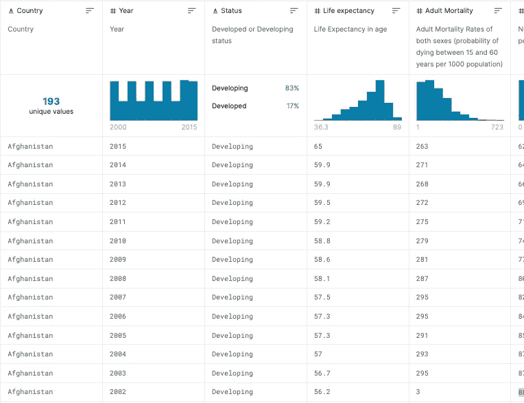

图 kaggle 的屏幕截图

# 步骤 1:线性回归/梯度下降从零开始

让我们从导入我们的库开始，看看前几行。

```
import pandas as pd
import matplotlib.pyplot as plt
import seaborn as sns
import numpy as np
from sklearn.preprocessing import LabelEncoder
from sklearn import metricsdf = pd.read_csv(‘Life Expectancy Data.csv’)
df.head()
```

您将看到一个很好的数据视图，可以看到我们有国家和状态文本字段，而“预期寿命”是我们想要预测的字段。

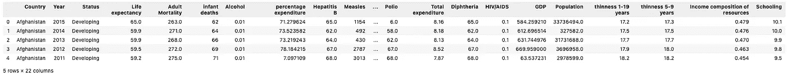

图 jupyter 的屏幕截图

为了获得更多的洞察力，让我们运行一个 info，我们将在图 3 中得到下面的 info。

*   我们有 2 个文本字段，即。国家和地位
*   酒精、乙肝等领域。有我们需要解决的空值
*   列名需要一些工作

```
df.info()
```

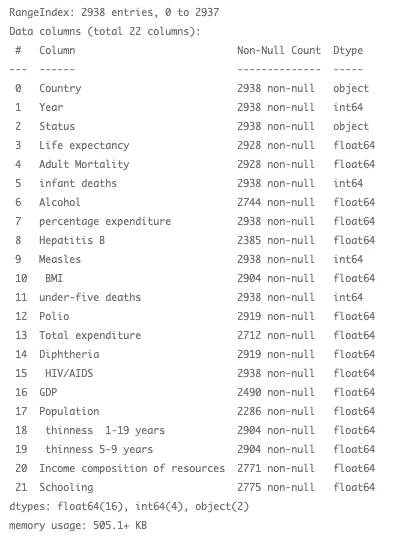

图 jupyter 的屏幕截图

# 准备数据

这些名称不适合使用，所以让我们重命名一些列。然后将对象字段转换为数字，因为我们不能处理文本。最后，让我们将 Y 移动到它自己的数组中，并将其从“df”中删除。这种陡峭的结果是,‘df’是我们的特征集并且只包含数字，而‘y’是我们的结果集。

```
df.rename(columns = {“ BMI “ :”BMI”,
  “Life expectancy “: “Life_expectancy”,
  “Adult Mortality”:”Adult_mortality”,
  “infant deaths”:”Infant_deaths”,
  “percentage expenditure”:”Percentage_expenditure”,
  “Hepatitis B”:”HepatitisB”,
  “Measles “:”Measles”,
  “under-five deaths “: “Under_five_deaths”,
  “Total expenditure”:”Total_expenditure”,
  “Diphtheria “: “Diphtheria”,
  “ thinness 1–19 years”:”Thinness_1–19_years”,
  “ thinness 5–9 years”:”Thinness_5–9_years”,
  “ HIV/AIDS”:”HIV/AIDS”,
  “Income composition of resources”:
  ”Income_composition_of_resources”}, inplace = True)# convert labels to numbers
columns = [“Status”,”Country”]
for feature in columns:
  le = LabelEncoder()
  df[feature] = le.fit_transform(df[feature])# extract Y and drop from data frame
Y = df[“Life_expectancy”]
df = df.drop([“Life_expectancy”], axis=1)
```

# 绘图相关矩阵

如果我们有一个包含许多列的数据集，快速检查列间相关性的一个好方法是将相关性矩阵可视化为热图。查看该矩阵，您可以看到 9 列具有高于 0.38 的最高相关性。我们只对“预期寿命”感兴趣，所以请看最下面一行的结果。

```
plt.figure(figsize = (24,16))
sns.heatmap(pd.concat([df,Y], axis=1).corr(), annot=True, cmap=”coolwarm”)
```

> 为了获得更好的结果，我们可以选择在相关矩阵中仅使用高于 0.3 的特征。

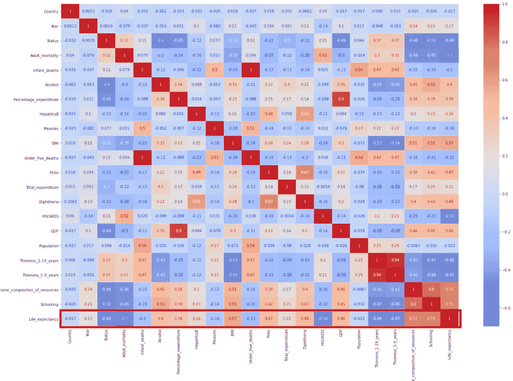

图 jupyter 的屏幕截图

# 为我们缺失的特征填入数值

回归的一个重要部分是理解哪些特征缺失了。我们可以选择忽略所有缺少值的行，或者用 mode、median 或 mode 填充它们。下面是一个手动函数，它基于以下三种方法之一来填充缺失值:

*   模式=最常见的值
*   中位数=中间值
*   平均值=平均

```
def fillmissing(df, feature, method):
  if method == “mode”:
    df[feature] = df[feature].fillna(df[feature].mode()[0])
  elif method == “median”:
    df[feature] = df[feature].fillna(df[feature].median())
  else:
    df[feature] = df[feature].fillna(df[feature].mean())
```

现在，查找缺少值的列，并使用我们方便的函数填充它们。让我们也填写 y 中任何缺失的值。

```
features_missing= df.columns[df.isna().any()]
for feature in features_missing:
  fillmissing(df, feature= feature, method= “mean”)Y.fillna(Y.median(), inplace=True)
```

# 获取 X/Y 数组

让我们将数据帧放入易于操作的数组中。

```
X = df.to_numpy() 
y = Y.to_numpy().transpose() 
m,n = X.shape
```

# 标准化 X

现在，让我们将 X 归一化，使其值介于-1 和 1 之间。我们这样做是为了让所有的特征都在一个相似的范围内。如果我们需要绘制数据，这很有帮助，但也能给出更好的线性回归结果。我们使用下面的等式，你应该看到你的特征现在归一化为类似于图 5 的值。

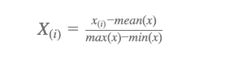

```
mu = X.mean(0) 
sigma = X.std(0) # standard deviation: max(x)-min(x)
xn = (X — mu) / sigma
```

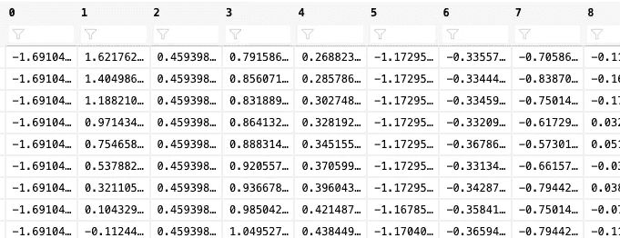

图 jupyter 的屏幕截图

# 添加一列 1

现在在 X 上增加一列 1，以便稍后对我们的假设和成本函数进行更简单的矩阵操作。您的数据现在应该如图 6 所示，带有一列 1。

```
xo = np.hstack((np.ones((m, 1)), xn))
```

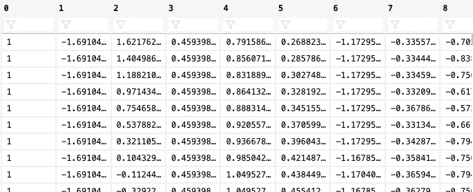

图 jupyter 的屏幕截图

# 梯度下降

创建梯度下降所需的变量。我们需要以下变量:

*   重复=重复梯度下降的次数
*   θ=对于 X 的每个特征，增加一列θ0
*   成本历史=保持梯度下降的每次迭代的成本

```
repeat = 1000
lrate = 0.01
theta = np.zeros((n+1))
```

让我们定义一个**成本函数**，梯度下降将使用它来确定每个θ的成本。成本函数将实现以下成本等式。

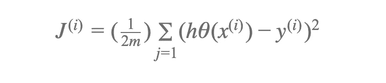

```
def computeCost(X, y, theta):
  m = len(y) # number of training examples
  diff = np.matmul(X, theta) — y
  J = 1 / (2 * m) * np.matmul(diff, diff) return J
```

我们现在进入梯度下降循环，在这里我们在每个循环上计算一个新的θ，并跟踪它的成本。参见下面的等式:

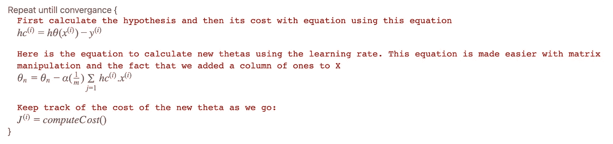

现在我们看到了这个方程，让我们把它放入一个方便的函数中

```
def gradientDescent(X, y, theta, alpha, num_iters):
  # Initialize some useful values
  m = len(y) # number of training examples
  J_history = [] # repeat until convergance
  for i in range(num_iters):
    hc = np.matmul(X, theta) — y
    theta -= alpha / m * np.matmul(X.transpose(), hc)
    # Save the cost J in every iteration
    J_history.append(computeCost(X, y, theta)) return theta, J_history
```

让我们运行梯度下降并打印结果

```
theta, J_history = gradientDescent(xo, y, theta, lrate, repeat)# Display gradient descent's result
print('Best theta computed from gradient descent: ')
print(f' {theta} ')
```

# **绘制梯度下降的成本**

绘制成本历史以确保成本随着迭代次数的增加而减少。在绘制之后，您应该看到成本随着每次迭代而降低，如图 7 所示。

```
# Plot the convergence graph
plt.plot(np.arange(repeat), J_history, ‘-b’, LineWidth=2)
plt.xlabel(‘Number of iterations’)
plt.ylabel(‘Cost J’)
plt.show()
```

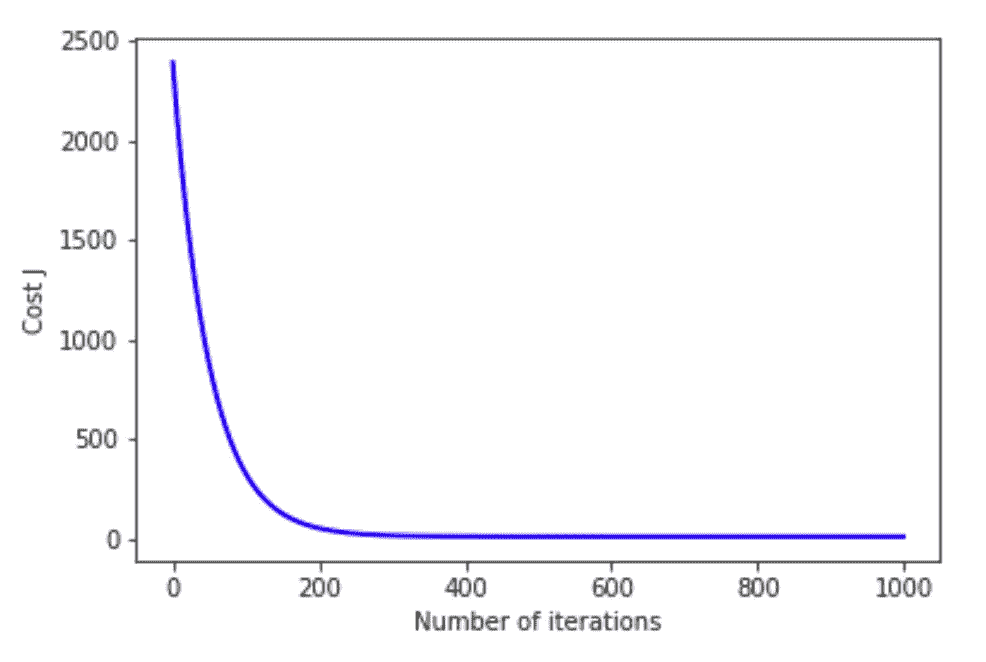

图 jupyter 的屏幕截图

# 预言；预测；预告

让我们用下面的等式来进行预测。

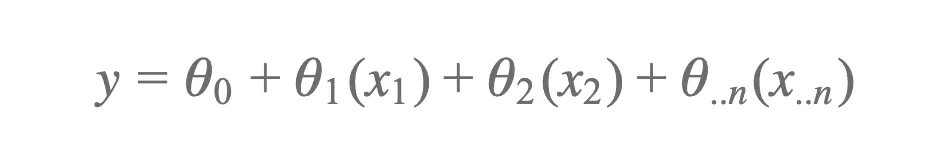

**注意**将一列 1 加到 X 上，然后使用矩阵乘法，一步就可以完成上面的等式。

```
y_pred = np.matmul(xo, theta)
```

# **评估预测**

让我们使用均方根误差(RMSE ),它是平方误差平均值的平方根。下面是应用的等式，其结果将在以后用于比较。

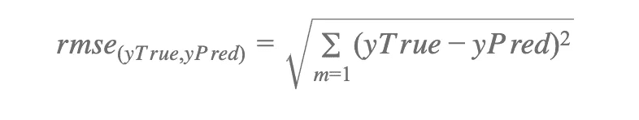

让我们也算出每个预测占真实结果的百分比。然后用它来找出实际年龄的 90%到 110%之间的预测年龄。我们认为这对于计算最终精度是可以接受的。

```
# get RMSE error rate
print('RMSE: ',np.sqrt(metrics.mean_squared_error(y, y_pred)))# calculate our own accuracy where prediction within 10% is o
diff = (y_pred / y * 100)print('Mean of results: ',diff.mean())
print('Deviation of results: ',diff.std())
print('Results within 10% support/resistance: ', len(np.where(np.logical_and(diff>=90, diff<=110))[0]) / m * 100)
```

您现在将看到如下结果。如果我们对每一行的预测都在实际年龄的 10%以内，那么我们决定称之为成功。因此，我们最终达到了 90%的准确率。

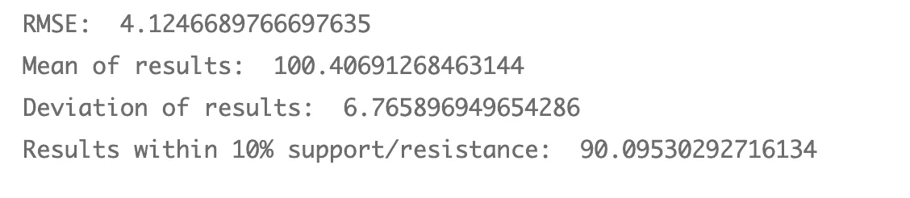

图 jupyter 的屏幕截图

最后，让我们想象一下每个预测的准确性。自然， **100%是完美的预测**。

```
plt.plot(np.arange(m), diff, '-b', LineWidth=1)
plt.xlabel('Number')
plt.ylabel('Accuracy %')
plt.show()
```

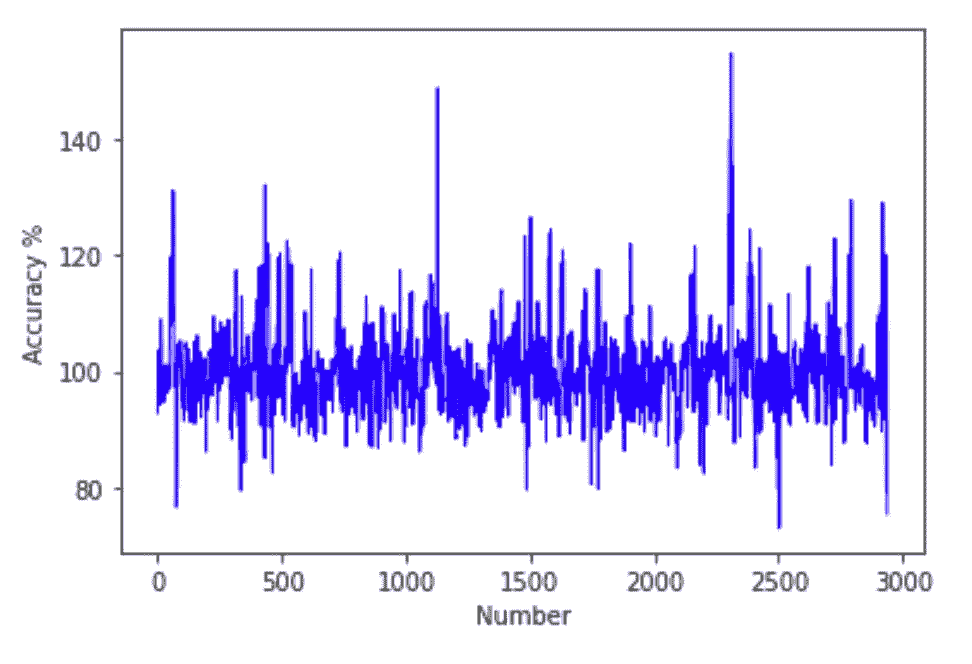

图 jupyter 的屏幕截图

所以，现在我们已经看到了使用矩阵操作的线性回归，让我们看看结果如何与使用 sklearn 进行比较。

# **第二步:使用 sklearn 的线性回归**

让我们使用 sklearn 来执行线性回归。这次你可以看到它的代码少了很多。一旦我们有了一个预测，我们将使用 RMSE 和我们的支持/阻力计算来看看我们的手动计算如何与一个经过验证的 sklearn 函数进行比较。

```
from sklearn import metrics
from sklearn.linear_model import LinearRegression
from sklearn.model_selection import train_test_split# Split data
X_train, X_test, y_train, y_test = train_test_split(X, y, random_state=1)# Instantiate model
lm2 = LinearRegression()# Fit Model
lm2.fit(X_train, y_train)# Predict
y_pred2 = lm2.predict(X_test)# RMSE
print('RMSE: ',np.sqrt(metrics.mean_squared_error(y_test, y_pred2)))# calculate our own accuracy where prediction within 10% is ok
diff2 = (y_pred2 / y_test * 100)print('Mean of results: ',diff2.mean())
print('Deviation of results: ',diff2.std())
print('Results within 10% support/resistance: ', len(np.where(np.logical_and(diff2>=90, diff2<=110))[0]) / len(y_pred2) * 100)
```

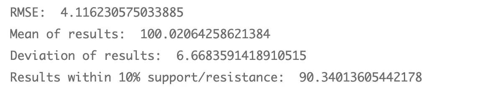

图 jupyter 的屏幕截图

# 结论

你可以看到我们的 RMSE 和支持/抵制百分比在两种方法中是相似的。很自然，你可能会使用 sklearn，因为它的代码少得多，但是希望这个例子向你展示了这些等式是如何工作的。