# 自然语言处理在情感分类中的挑战

> 原文：<https://towardsdatascience.com/challenges-in-sentiment-classification-with-nlp-a20314600c3d?source=collection_archive---------41----------------------->

## 高等级不平衡的影响

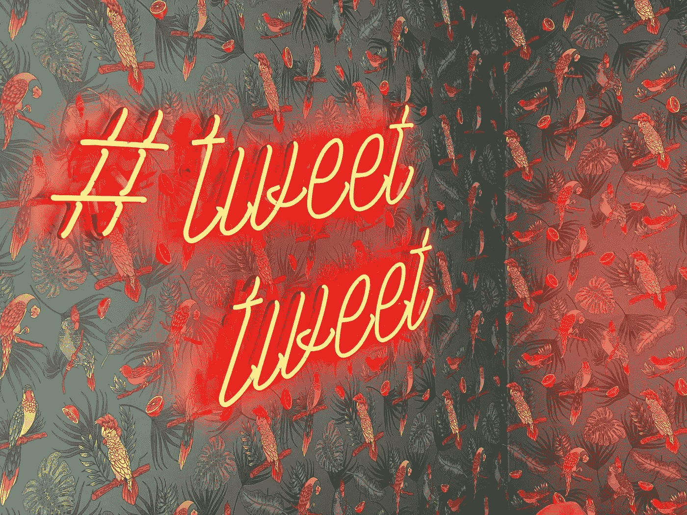

克里斯·j·戴维斯在 [Unsplash](https://unsplash.com/s/photos/twitter?utm_source=unsplash&utm_medium=referral&utm_content=creditCopyText) 上的照片

It 毫无疑问，对于任何数据科学和/或机器学习相关的任务来说，文本数据可能是我们可用的最大数据源。因此，许多复杂的和高性能的算法已经被发明来分析文本数据和预测它的情感。但是应用更先进的算法并不一定意味着我们的预测是高精度的。我们仍然需要回到基础，了解数据的本质，这对任何进一步的处理都是挑战。

我最近在自然语言处理领域进行了一项案例研究(这可能是我有史以来的第一个 NLP 项目)，以分析推文及其对两大品牌的情绪:苹果和谷歌。这个项目的主要目的是将推文分为正面和负面或中性。这些数据集是由 Crowdflower 通过“data.world”提供的。数据集由大约 9000 条推文组成，分为四类:“正面”、“负面”、“中性”和“无法辨别”，我将它们重新组织成三类，如下所示:

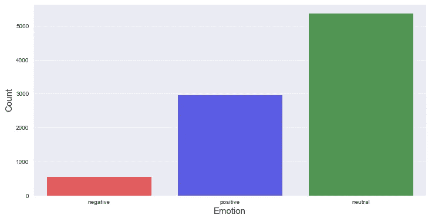

从这里，人们可以很容易地看到，这是高度不平衡的阶级状况。尽管如此，我还是决定继续为快速脏分类任务准备数据。当然，我们必须至少做一些分类器可以接受的基本文本预处理。我应用的一些基本预处理包括:

*   扩展缩略词，如“不是”:“不是”、“不会”、“不会”、“不会”等。
*   小写所有文本，删除非字母字符串，@，超链接，停用词，少于 3 个字母的单词等。

下面是文本预处理代码片段的一个示例:

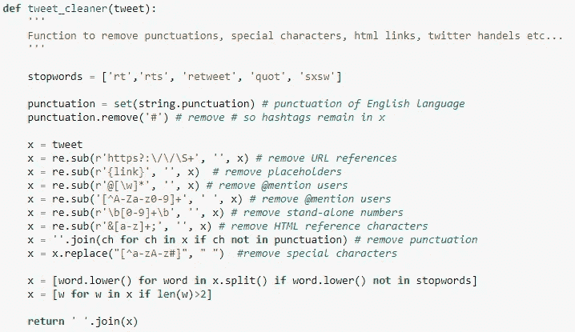

一些研究建议保留' # '，在这种情况下没有任何区别

干净的推文示例:

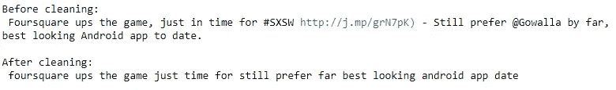

在对预处理感觉良好之后，我开始使用简单的分类器，比如传统的朴素贝叶斯和随机森林。出于矢量化的目的，我使用了 TFIDF 矢量器。下面是分类的快速结果:

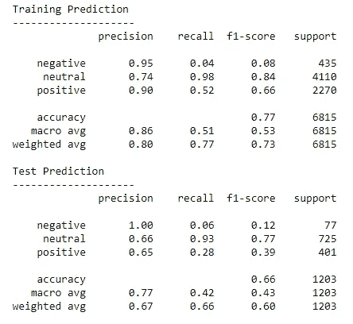

朴素贝叶斯分类报告

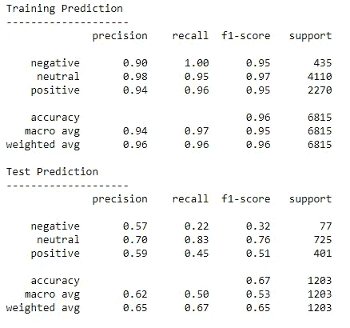

随机森林分类报告

很明显，如果我们研究“回忆”值，我们可以看到两个模型都存在不平衡数据。此外，随机森林高度过度适合训练数据。所以，在这一点上，我满怀希望地转向了神经网络。显然，首先想到的是 LSTM 和 GRU. *但是在实现这些模型之前，我改变了文本预处理策略，以避免删除一些上下文中的停用词。*像 LSTM 和 GRU 这样的网络需要令牌形式的文本 dat，可按如下示例创建:

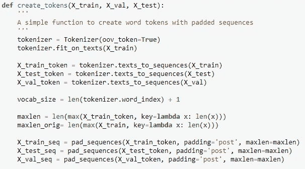

使用新的预处理文本，我执行了三种类型的 LSTM:简单的单向 LSTM、双向 LSTM 和带有手套嵌入的双向 LSTM。此外，我还在类似配置的 GRU 网络上进行了培训。在我几乎所有的测试中，LSTM 和 GRU 都产生了相同的结果。因此，为了简洁起见，我将只显示 LSTM 的结果。对于预训练的手套模型，在模型中引入了一个*‘手套. 6b . 100d’*嵌入。包含 GLOVE 的代码随处可见，不过我还是提供下面的代码片段:

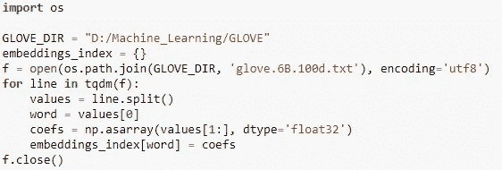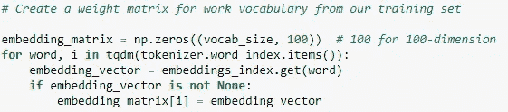

下图显示了上述三种 LSTMs 架构的培训结果。请注意，启用了提前停止，因此不同的模型在不同的时间停止。还要注意，我训练的最大历元是 20，这是因为在早期历元的验证数据中出现了大量训练过度。

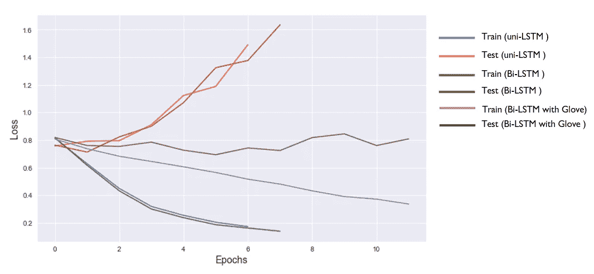

那么我们在这里得到了什么？从一开始，更先进的模型就不能推广这个模型。戴着预训练手套模型的 LSTM 似乎表现稍好，但仍然差得很远！

还要记住，一开始的班级失衡，是不是影响了我们的模型表现？模型拟合参数中还包括类别权重字典。这对于提高模型性能没有任何帮助。还尝试了其他方法，如 SMOTE、随机过采样器/欠采样器。然而，这些方法对这个数据集都没有帮助。最后，我决定通过增加物理数据来解决班级不平衡的问题。

## 数据扩充

在这种情况下，我找到了推文文本，但是推文与苹果相关产品相关。然而，文本的情感可以与任何特定品牌无关，只要它有与情感相关的关键词。怀着这个希望，我将 ***只添加了负面分类的*** 到我当前的数据集中，并重新运行上述算法。

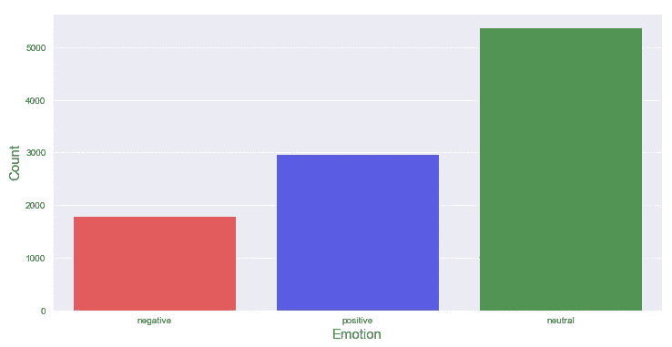

扩充后的类别分布

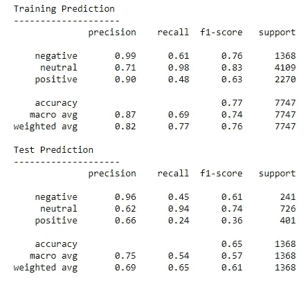

朴素贝叶斯分类报告

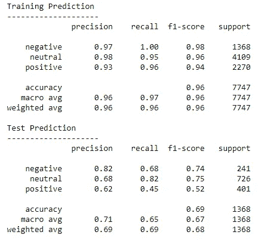

随机森林分类报告

虽然整体准确率只是略有提高，但我很高兴负面类的*【回忆】*有所增加。因为，在任何市场情绪分析中，尽可能准确地预测人们的负面观点是很重要的。那么，神经网络在新的扩充数据集中表现如何。

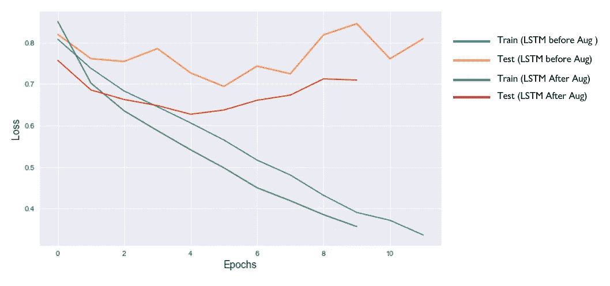

增强前后嵌入手套的双向 LSTMs

我们可以看到模型性能有一些轻微的改进。训练过度仍然是一个大问题。在这一点上，我应该把更多的注意力放在优化模型架构上。在测试不同模型架构组合时，先测试多个 LSTMs 层，然后测试密集层，最大的影响来自于 dropout 参数的调整。

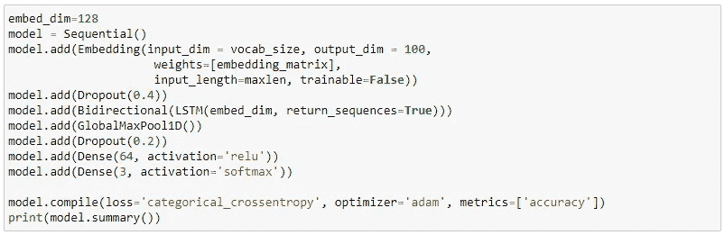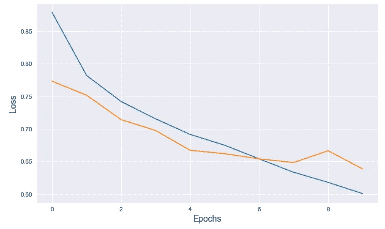

注意:最大纪元被设置为 20，但是模型停止得更早

我们可以看到，在 LSTM 层之前包含漏失参数似乎表现得更好。我通常对一次下降超过 20%持谨慎态度，但在这个特定的案例中，高达 30-40%的下降似乎没问题。我的最终模型(LSTM 和 GRU)只能以大约 70%的准确率预测一条给定的推文。对于 NLP 任务来说，这并不是一个很好的结果，然而，考虑到具有挑战性的数据集，预处理 a 模型优化显示了有希望的结果。

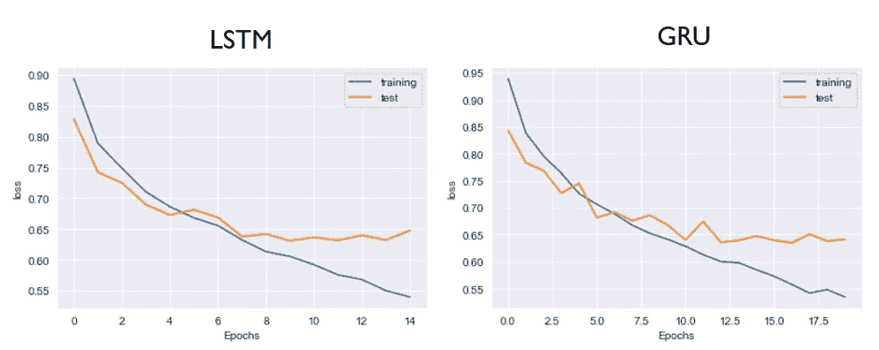

最终模型对比:LSTM vs GRU

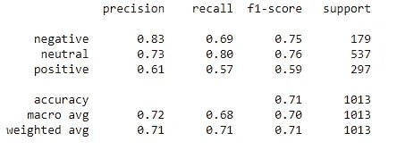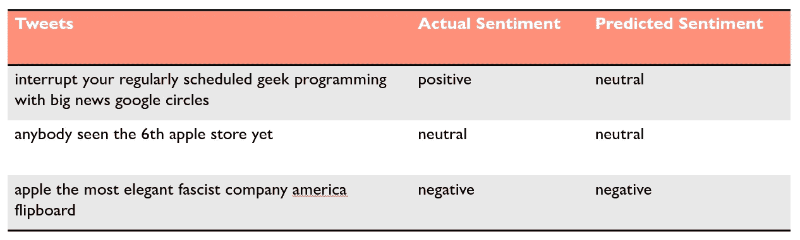

推文预测示例

# 最后的想法

该数据集需要做大量工作，尤其是数据扩充结果所支持的平衡类标签的收集。然而我的问题是:*一个大约 9000 条推文的文本数据集，对于像 LSTM 和 GRU 这样的建筑来说足够好吗？*

在下一步中，我将尝试对这个数据集使用 transformer 模型。

完整的笔记本和必要的文档可以在我的 github 网站上找到:[https://github . com/sgautam 666/Brand _ 情操 _ 分析 _with_NLP](https://github.com/sgautam666/Brand_Sentiment_Analysis_with_NLP)

## 参考

[https://data.world/crowdflower/brands-and-product-emotions](https://data.world/crowdflower/brands-and-product-emotions)

[https://data.world/crowdflower/apple-twitter-sentiment](https://data.world/crowdflower/apple-twitter-sentiment)